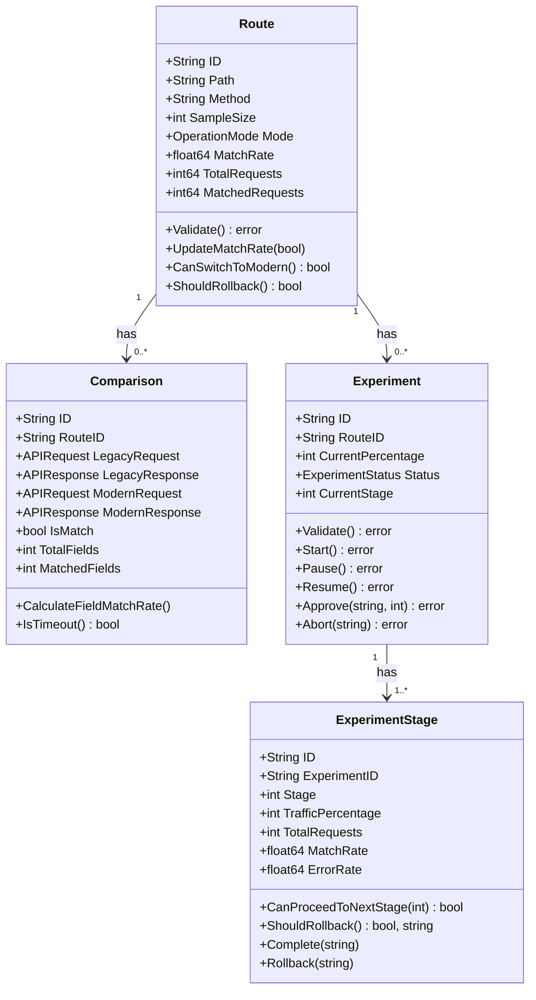

# 도메인 모델 설계

## 문서 목적

본 문서는 ABS의 핵심 비즈니스 개념을 표현하는 도메인 모델을 정의합니다.

**포함 내용**:
- Entity 정의 (Route, Comparison, Experiment, ExperimentStage)
- Value Object 정의 (APIRequest, APIResponse, MatchRate 등)
- 도메인 규칙 및 불변식(Invariant)

---

## 1. Entity

### 1.1 Route Entity

API 라우트 정보를 관리하는 핵심 엔티티입니다.

#### 필드 정의

| 필드명 | 타입 | 설명 | 필수 | 기본값 |
|--------|------|------|------|--------|
| `ID` | `string` | 라우트 고유 식별자 (UUID) | ✓ | - |
| `Path` | `string` | API 경로 (예: `/api/v1/users`) | ✓ | - |
| `Method` | `string` | HTTP 메서드 (GET, POST, PUT, DELETE 등) | ✓ | - |
| `SampleSize` | `int` | 일치율 계산 표본 수 | ✓ | 100 |
| `ExcludeFields` | `[]string` | 비교 제외 필드 목록 | | `[]` |
| `LegacyHost` | `string` | Legacy API 호스트 | ✓ | - |
| `LegacyPort` | `int` | Legacy API 포트 | ✓ | 8080 |
| `ModernHost` | `string` | Modern API 호스트 | ✓ | - |
| `ModernPort` | `int` | Modern API 포트 | ✓ | 9080 |
| `OperationMode` | `OperationMode` | 운영 모드 (validation/canary/switched) | ✓ | validation |
| `CanaryPercentage` | `int` | Canary 모드 시 트래픽 비율 (0-100) | | 0 |
| `MatchRate` | `float64` | 현재 일치율 (0.0-100.0) | | 0.0 |
| `TotalRequests` | `int64` | 총 요청 수 | | 0 |
| `MatchedRequests` | `int64` | 일치한 요청 수 | | 0 |
| `ErrorRate` | `float64` | Modern API 에러율 (0.0-100.0) | | 0.0 |
| `IsActive` | `bool` | 라우트 활성화 여부 | ✓ | true |
| `CreatedAt` | `time.Time` | 생성 시간 | ✓ | now() |
| `UpdatedAt` | `time.Time` | 수정 시간 | ✓ | now() |

#### 불변식 (Invariants)

1. **Path 검증**: Path는 반드시 '/'로 시작해야 함
2. **SampleSize 범위**: 10 이상 1,000 이하
3. **CanaryPercentage 범위**: 0 이상 100 이하
4. **운영 모드 일관성**: Canary 모드일 때만 CanaryPercentage > 0 허용

#### 도메인 메서드

**`Validate() error`**
- 불변식 검증
- Path, SampleSize, CanaryPercentage, OperationMode 일관성 확인

**`UpdateMatchRate(isMatch bool)`**
- 일치율 실시간 갱신
- TotalRequests, MatchedRequests 증가
- MatchRate 재계산: `(MatchedRequests / TotalRequests) * 100`

**`CanSwitchToModern() bool`**
- Modern API 전환 가능 여부 판단
- 조건: MatchRate = 100% AND TotalRequests ≥ SampleSize AND ErrorRate < 0.1%

**`ShouldRollback() bool`**
- 롤백 필요 여부 판단
- 조건: MatchRate < 99.9% OR ErrorRate > 1%

---

### 1.2 Comparison Entity

Legacy API와 Modern API의 응답 비교 결과를 저장하는 엔티티입니다.

#### 필드 정의

| 필드명 | 타입 | 설명 | 필수 |
|--------|------|------|------|
| `ID` | `string` | 비교 결과 고유 식별자 (UUID) | ✓ |
| `RouteID` | `string` | 라우트 ID (FK) | ✓ |
| `RequestID` | `string` | 요청 추적 ID | ✓ |
| `LegacyRequest` | `APIRequest` | Legacy API 요청 | ✓ |
| `LegacyResponse` | `APIResponse` | Legacy API 응답 | ✓ |
| `ModernRequest` | `APIRequest` | Modern API 요청 | ✓ |
| `ModernResponse` | `APIResponse` | Modern API 응답 | |
| `IsMatch` | `bool` | 응답 일치 여부 | ✓ |
| `TotalFields` | `int` | 총 필드 수 | | 0 |
| `MatchedFields` | `int` | 일치한 필드 수 | | 0 |
| `FieldMatchRate` | `float64` | 필드 일치율 (0.0-100.0) | | 0.0 |
| `MismatchDetails` | `[]MismatchDetail` | 불일치 상세 정보 | | `[]` |
| `ComparisonDuration` | `time.Duration` | 비교 소요 시간 (ms) | | 0 |
| `CreatedAt` | `time.Time` | 생성 시간 | ✓ |

#### MismatchDetail 구조체

| 필드명 | 타입 | 설명 |
|--------|------|------|
| `FieldPath` | `string` | 필드 경로 (예: "user.address.city") |
| `LegacyValue` | `interface{}` | Legacy 값 |
| `ModernValue` | `interface{}` | Modern 값 |
| `ExpectedType` | `string` | 기대 타입 |
| `ActualType` | `string` | 실제 타입 |

#### 도메인 메서드

**`CalculateFieldMatchRate()`**
- 필드 일치율 계산
- 공식: `(MatchedFields / TotalFields) * 100`

**`IsTimeout() bool`**
- 비교 타임아웃 여부 확인
- 임계값: 10초

---

### 1.3 Experiment Entity

반자동 전환 실험을 관리하는 엔티티입니다.

#### 필드 정의

| 필드명 | 타입 | 설명 | 필수 | 기본값 |
|--------|------|------|------|--------|
| `ID` | `string` | 실험 고유 식별자 (UUID) | ✓ | - |
| `RouteID` | `string` | 라우트 ID (FK) | ✓ | - |
| `InitialPercentage` | `int` | 시작 트래픽 비율 (%) | ✓ | 1 |
| `CurrentPercentage` | `int` | 현재 트래픽 비율 (%) | ✓ | 1 |
| `TargetPercentage` | `int` | 목표 트래픽 비율 (%) | ✓ | 100 |
| `StabilizationPeriod` | `int` | 안정화 기간 (초) | ✓ | 3600 |
| `Status` | `ExperimentStatus` | 실험 상태 | ✓ | pending |
| `CurrentStage` | `int` | 현재 단계 (1-6) | | 1 |
| `TotalStages` | `int` | 전체 단계 수 | | 6 |
| `LastApprovedBy` | `string` | 마지막 승인자 | | - |
| `LastApprovedAt` | `*time.Time` | 마지막 승인 시간 | | nil |
| `StartedAt` | `*time.Time` | 실험 시작 시간 | | nil |
| `CompletedAt` | `*time.Time` | 실험 완료 시간 | | nil |
| `AbortedReason` | `string` | 중단 사유 | | - |
| `CreatedAt` | `time.Time` | 생성 시간 | ✓ | now() |
| `UpdatedAt` | `time.Time` | 수정 시간 | ✓ | now() |

#### 불변식 (Invariants)

1. **트래픽 비율 범위**: InitialPercentage는 0-100 범위
2. **비율 증가 순서**: CurrentPercentage ≥ InitialPercentage
3. **안정화 기간 최소값**: StabilizationPeriod ≥ 3600초 (1시간)
4. **완료 조건**: Status = completed일 때 CurrentPercentage = 100

#### 도메인 메서드

**`Validate() error`**
- 불변식 검증

**`Start() error`**
- 실험 시작
- 전제 조건: Status = pending
- 상태 전이: pending → running
- CurrentPercentage를 InitialPercentage로 설정

**`Pause() error`**
- 실험 일시 정지
- 전제 조건: Status = running
- 상태 전이: running → paused

**`Resume() error`**
- 실험 재개
- 전제 조건: Status = paused
- 상태 전이: paused → running

**`Approve(approvedBy string, nextPercentage int) error`**
- 다음 단계 승인
- 전제 조건: Status = running, nextPercentage > CurrentPercentage
- CurrentPercentage, CurrentStage 증가
- LastApprovedBy, LastApprovedAt 기록
- 100% 도달 시 Status = completed

**`Abort(reason string) error`**
- 실험 중단
- 전제 조건: Status ≠ completed, Status ≠ aborted
- 상태 전이: * → aborted
- AbortedReason 기록

**`IsStabilizationPeriodElapsed() bool`**
- 안정화 기간 경과 여부 확인
- StartedAt 또는 LastApprovedAt 기준으로 계산

---

### 1.4 ExperimentStage Entity

실험 단계별 이력 및 메트릭을 기록하는 엔티티입니다.

#### 필드 정의

| 필드명 | 타입 | 설명 | 필수 | 기본값 |
|--------|------|------|------|--------|
| `ID` | `string` | 단계 고유 식별자 (UUID) | ✓ | - |
| `ExperimentID` | `string` | 실험 ID (FK) | ✓ | - |
| `Stage` | `int` | 단계 번호 (1-6) | ✓ | - |
| `TrafficPercentage` | `int` | 트래픽 비율 (%) | ✓ | - |
| `MinRequests` | `int` | 최소 요청 수 | ✓ | - |
| `TotalRequests` | `int64` | 처리된 총 요청 수 | | 0 |
| `MatchRate` | `float64` | 일치율 (%) | | 0.0 |
| `ErrorRate` | `float64` | 에러율 (%) | | 0.0 |
| `LegacyAvgResponseTime` | `int64` | Legacy 평균 응답 시간 (ms) | | 0 |
| `ModernAvgResponseTime` | `int64` | Modern 평균 응답 시간 (ms) | | 0 |
| `ApprovedBy` | `string` | 승인자 | | - |
| `ApprovedAt` | `*time.Time` | 승인 시간 | | nil |
| `StartedAt` | `time.Time` | 단계 시작 시간 | ✓ | now() |
| `CompletedAt` | `*time.Time` | 단계 완료 시간 | | nil |
| `RollbackReason` | `string` | 롤백 사유 | | - |
| `IsRollback` | `bool` | 롤백 여부 | | false |

#### 단계별 최소 요청 수

| 단계 | 트래픽 비율 | 최소 요청 수 |
|------|-------------|--------------|
| 1 | 1% → 5% | 100 |
| 2 | 5% → 10% | 500 |
| 3 | 10% → 25% | 1,000 |
| 4 | 25% → 50% | 5,000 |
| 5 | 50% → 100% | 10,000 |

#### 도메인 메서드

**`CanProceedToNextStage(stabilizationPeriod int) bool`**
- 다음 단계 진행 가능 여부 판단
- 조건 (모두 충족):
  1. 안정화 기간 경과
  2. TotalRequests ≥ MinRequests
  3. MatchRate ≥ 99.9%
  4. ErrorRate < 0.1%
  5. ModernAvgResponseTime ≤ LegacyAvgResponseTime × 1.2

**`ShouldRollback() (bool, string)`**
- 즉시 롤백 필요 여부 판단 (Critical)
- 조건 (하나라도 충족):
  1. ErrorRate > 1%
  2. ModernAvgResponseTime > LegacyAvgResponseTime × 2.0

**`ShouldWarnRollback() (bool, string)`**
- 경고 후 롤백 필요 여부 판단 (Warning, 5분 지속 시)
- 조건 (하나라도 충족):
  1. MatchRate < 99.5%
  2. ErrorRate > 0.5%
  3. ModernAvgResponseTime > LegacyAvgResponseTime × 1.5

**`Complete(approvedBy string)`**
- 단계 완료 처리
- ApprovedBy, ApprovedAt, CompletedAt 설정

**`Rollback(reason string)`**
- 롤백 기록
- IsRollback = true, RollbackReason 설정

---

## 2. Value Object

### 2.1 APIRequest

API 요청 정보를 나타내는 Value Object입니다.

| 필드명 | 타입 | 설명 |
|--------|------|------|
| `Method` | `string` | HTTP 메서드 |
| `Path` | `string` | 요청 경로 |
| `QueryParams` | `map[string]string` | 쿼리 파라미터 |
| `Headers` | `map[string]string` | 헤더 |
| `Body` | `[]byte` | 요청 본문 (JSON) |
| `Timestamp` | `time.Time` | 요청 시간 |

**메서드**: `Equals(other APIRequest) bool` - 동등성 비교

---

### 2.2 APIResponse

API 응답 정보를 나타내는 Value Object입니다.

| 필드명 | 타입 | 설명 |
|--------|------|------|
| `StatusCode` | `int` | HTTP 상태 코드 |
| `Headers` | `map[string]string` | 응답 헤더 |
| `Body` | `[]byte` | 응답 본문 (JSON) |
| `ResponseTime` | `int64` | 응답 시간 (ms) |
| `Error` | `string` | 에러 메시지 (실패 시) |
| `Timestamp` | `time.Time` | 응답 시간 |

**메서드**:
- `IsSuccess() bool` - 성공 응답 여부 (2xx, Error 없음)
- `IsTimeout() bool` - 타임아웃 여부 (≥ 30초)

---

### 2.3 MatchRate

일치율을 나타내는 Value Object입니다.

| 필드명 | 타입 | 설명 |
|--------|------|------|
| `Value` | `float64` | 일치율 (0.0-100.0) |
| `SampleSize` | `int` | 표본 크기 |
| `UpdatedAt` | `time.Time` | 갱신 시간 |

**메서드**:
- `IsPerfect() bool` - 완벽한 일치율 (100%)
- `IsAcceptable() bool` - 허용 가능한 일치율 (≥ 99.9%)
- `HasEnoughSamples() bool` - 충분한 표본 수 (≥ 10)

---

### 2.4 TrafficPercentage

트래픽 비율을 나타내는 Value Object입니다.

| 필드명 | 타입 | 설명 |
|--------|------|------|
| `Value` | `int` | 트래픽 비율 (0-100) |

**팩토리 메서드**: `NewTrafficPercentage(value int) (TrafficPercentage, error)`
- 0-100 범위 검증

**메서드**:
- `IsZero() bool` - 0% 여부
- `IsFull() bool` - 100% 여부
- `NextStage() (TrafficPercentage, error)` - 다음 단계 비율 반환 (1 → 5 → 10 → 25 → 50 → 100)

---

## 3. Enum

### 3.1 OperationMode

운영 모드를 나타내는 열거형입니다.

| 값 | 설명 |
|----|------|
| `validation` | 검증 모드 (Legacy 응답 반환, Modern 비교만) |
| `canary` | Canary 모드 (N% Modern 반환) |
| `switched` | 전환 모드 (100% Modern 반환) |

**메서드**:
- `String() string` - 문자열 변환
- `IsValid() bool` - 유효한 모드 여부

---

### 3.2 ExperimentStatus

실험 상태를 나타내는 열거형입니다.

| 값 | 설명 |
|----|------|
| `pending` | 대기 중 |
| `running` | 진행 중 |
| `paused` | 일시 정지 |
| `completed` | 완료 |
| `aborted` | 중단 |

**상태 전이 규칙**:
- `pending` → `running`
- `running` → `paused`, `completed`, `aborted`
- `paused` → `running`, `aborted`
- `completed`, `aborted` → (종료 상태, 전이 불가)

**메서드**: `CanTransitionTo(next ExperimentStatus) bool` - 상태 전이 가능 여부

---

## 4. 도메인 규칙 요약

### Route 도메인 규칙

1. **일치율 계산**: 요청 처리 시마다 실시간 갱신 (`(MatchedRequests / TotalRequests) * 100`)
2. **전환 조건**: MatchRate = 100% AND TotalRequests ≥ SampleSize AND ErrorRate < 0.1%
3. **롤백 조건**: MatchRate < 99.9% OR ErrorRate > 1%
4. **운영 모드 일관성**: Canary 모드일 때만 CanaryPercentage > 0

### Experiment 도메인 규칙

1. **상태 전이**:
   - pending → running → completed
   - running → paused → running
   - running/paused → aborted
2. **단계별 진행**: 1% → 5% → 10% → 25% → 50% → 100%
3. **승인 필수**: 각 단계 진행 시 관리자 승인 필요
4. **안정화 기간**: 최소 1시간 (3600초)

### ExperimentStage 도메인 규칙

#### 진행 조건 (모두 충족)
1. 안정화 기간 경과
2. 최소 요청 수 충족 (단계별 상이)
3. 일치율 ≥ 99.9%
4. 에러율 < 0.1%
5. 응답 시간 ≤ Legacy × 1.2

#### 롤백 조건

**즉시 롤백 (Critical)**:
- 에러율 > 1%
- 응답 시간 > Legacy × 2.0

**경고 후 롤백 (Warning, 5분 지속 시)**:
- 일치율 < 99.5%
- 에러율 > 0.5%
- 응답 시간 > Legacy × 1.5

---

## 5. Entity 관계 다이어그램

**관계 설명**:
- Route : Comparison = 1 : N
- Route : Experiment = 1 : N
- Experiment : ExperimentStage = 1 : N

---

## 6. 참고 사항

### 6.1 UUID 생성

모든 Entity의 ID는 UUID v4를 사용합니다.
- 라이브러리: `github.com/google/uuid`

### 6.2 타임스탬프

- `CreatedAt`, `UpdatedAt`: UTC 시간 사용
- DB 저장 시 `time.Time` → `timestamp with time zone`

### 6.3 JSON 직렬화

- `APIRequest.Body`, `APIResponse.Body`: `[]byte`로 저장
- DB 저장 시 CLOB 또는 TEXT 타입 사용

---

**최종 수정일**: 2025-11-30
**작성자**: ABS 개발팀
