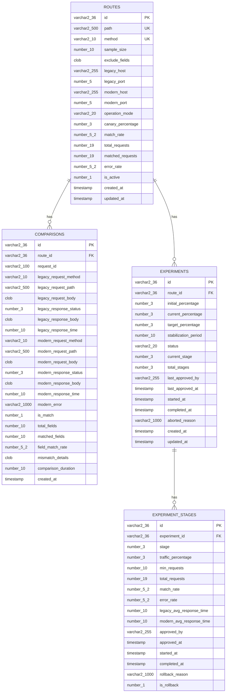

# Entity Relationship Diagram (ERD)

## 문서 목적

본 문서는 ABS 데이터베이스의 엔티티 간 관계를 시각화하고 설명합니다.

**포함 내용**:
- ERD 다이어그램
- 테이블 간 관계 설명
- 외래키 제약조건
- 카디널리티 정의

---

## 1. ERD 다이어그램

### 1.1 전체 ERD



**관계 설명**:
- `ROUTES ||--o{ COMPARISONS`: 1개 Route → 0개 이상의 Comparison
- `ROUTES ||--o{ EXPERIMENTS`: 1개 Route → 0개 이상의 Experiment
- `EXPERIMENTS ||--o{ EXPERIMENT_STAGES`: 1개 Experiment → 0개 이상의 Stage

---

## 2. 테이블 간 관계

### 2.1 routes ↔ comparisons

**관계 타입**: One-to-Many (1:N)

| 부모 테이블 | 자식 테이블 | 관계 |
|------------|------------|------|
| `routes` | `comparisons` | 1 Route → N Comparisons |

**외래키 제약조건**:
- **FK 이름**: `fk_comparisons_routes`
- **FK 컬럼**: `comparisons.route_id`
- **PK 참조**: `routes.id`
- **ON DELETE**: CASCADE (라우트 삭제 시 비교 결과도 삭제)

**의미**:
- 하나의 라우트(API 엔드포인트)에 대해 여러 번의 비교 결과가 저장됩니다.
- 라우트가 삭제되면 해당 라우트의 모든 비교 결과도 함께 삭제됩니다.

---

### 2.2 routes ↔ experiments

**관계 타입**: One-to-Many (1:N)

| 부모 테이블 | 자식 테이블 | 관계 |
|------------|------------|------|
| `routes` | `experiments` | 1 Route → N Experiments |

**외래키 제약조건**:
- **FK 이름**: `fk_experiments_routes`
- **FK 컬럼**: `experiments.route_id`
- **PK 참조**: `routes.id`
- **ON DELETE**: CASCADE (라우트 삭제 시 실험도 삭제)

**의미**:
- 하나의 라우트에 대해 여러 번의 실험이 진행될 수 있습니다.
- 일반적으로는 한 번에 하나의 실험만 진행 중이지만, 이력 관리를 위해 1:N 관계로 설계합니다.
- 라우트가 삭제되면 해당 라우트의 모든 실험 이력도 함께 삭제됩니다.

---

### 2.3 experiments ↔ experiment_stages

**관계 타입**: One-to-Many (1:N)

| 부모 테이블 | 자식 테이블 | 관계 |
|------------|------------|------|
| `experiments` | `experiment_stages` | 1 Experiment → N Stages |

**외래키 제약조건**:
- **FK 이름**: `fk_experiment_stages_experiments`
- **FK 컬럼**: `experiment_stages.experiment_id`
- **PK 참조**: `experiments.id`
- **ON DELETE**: CASCADE (실험 삭제 시 모든 단계도 삭제)

**의미**:
- 하나의 실험은 최대 6개의 단계로 구성됩니다.
  - Stage 1: 1% → 5%
  - Stage 2: 5% → 10%
  - Stage 3: 10% → 25%
  - Stage 4: 25% → 50%
  - Stage 5: 50% → 100%
  - (롤백 발생 시 추가 단계)
- 각 단계는 독립적인 메트릭과 승인 정보를 가집니다.
- 실험이 삭제되면 모든 단계 이력도 함께 삭제됩니다.

---

## 3. 카디널리티 정의

### 3.1 카디널리티 표기법

| 표기 | 의미 |
|------|------|
| `1` | 정확히 하나 (Exactly One) |
| `0..1` | 0개 또는 1개 (Zero or One) |
| `1..*` | 1개 이상 (One or Many) |
| `0..*` | 0개 이상 (Zero or Many) |

### 3.2 관계별 카디널리티

#### routes ↔ comparisons

| 방향 | 카디널리티 | 설명 |
|------|-----------|------|
| routes → comparisons | `1` → `0..*` | 라우트는 0개 이상의 비교 결과를 가질 수 있음 |
| comparisons → routes | `*` → `1` | 비교 결과는 반드시 하나의 라우트에 속함 |

#### routes ↔ experiments

| 방향 | 카디널리티 | 설명 |
|------|-----------|------|
| routes → experiments | `1` → `0..*` | 라우트는 0개 이상의 실험을 가질 수 있음 |
| experiments → routes | `*` → `1` | 실험은 반드시 하나의 라우트에 속함 |

**비즈니스 규칙**:
- 한 라우트에 대해 동시에 진행 중인 실험(`status = 'running'`)은 최대 1개
- 이력 관리를 위해 완료/중단된 실험은 모두 보관

#### experiments ↔ experiment_stages

| 방향 | 카디널리티 | 설명 |
|------|-----------|------|
| experiments → experiment_stages | `1` → `1..*` | 실험은 최소 1개 이상의 단계를 가짐 |
| experiment_stages → experiments | `*` → `1` | 단계는 반드시 하나의 실험에 속함 |

**비즈니스 규칙**:
- 실험 시작 시 첫 번째 단계(Stage 1) 자동 생성
- 각 단계 승인 시 다음 단계 생성
- 최대 6개 단계까지 생성 가능

---

## 4. 외래키 제약조건 상세

### 4.1 ON DELETE 정책

| 외래키 | 정책 | 이유 |
|--------|------|------|
| `fk_comparisons_routes` | CASCADE | 라우트 삭제 시 비교 결과도 의미 없음 |
| `fk_experiments_routes` | CASCADE | 라우트 삭제 시 실험 이력도 의미 없음 |
| `fk_experiment_stages_experiments` | CASCADE | 실험 삭제 시 단계 이력도 의미 없음 |

**주의사항**:
- CASCADE 정책으로 인해 라우트 삭제 시 대량의 데이터가 함께 삭제될 수 있음
- 운영 환경에서 라우트 삭제는 신중히 수행해야 함
- 필요 시 `is_active = 0`으로 비활성화하여 논리 삭제 사용

### 4.2 외래키 인덱스

외래키 컬럼은 조인 성능을 위해 인덱스 생성 필요:

| 테이블 | 컬럼 | 인덱스명 |
|--------|------|----------|
| `comparisons` | `route_id` | `idx_comparisons_route_id` |
| `experiments` | `route_id` | `idx_experiments_route_id` |
| `experiment_stages` | `experiment_id` | `idx_experiment_stages_experiment_id` |

---

## 5. 관계 무결성 규칙

### 5.1 참조 무결성

**규칙**:
- 자식 테이블의 FK는 반드시 부모 테이블의 PK를 참조해야 함
- 부모 테이블에 존재하지 않는 FK 값은 삽입 불가

**예시**:
```sql
-- ✓ 성공: routes.id가 존재
INSERT INTO comparisons (id, route_id, ...)
VALUES ('comp-001', 'route-001', ...);

-- ✗ 실패: routes.id가 존재하지 않음
INSERT INTO comparisons (id, route_id, ...)
VALUES ('comp-002', 'non-existent-route', ...);
```

### 5.2 도메인 무결성

**routes 테이블**:
- `path` + `method` 조합은 유니크 (UK 제약조건)
- 동일한 API 경로와 메서드는 중복 등록 불가

**experiments 테이블**:
- 한 라우트에 대해 진행 중인 실험(`status = 'running'`)은 최대 1개
- 애플리케이션 레벨에서 비즈니스 규칙으로 관리

**experiment_stages 테이블**:
- 한 실험 내에서 `stage` 번호는 순차적으로 증가
- 애플리케이션 레벨에서 비즈니스 규칙으로 관리

---

## 6. 조인 쿼리 예시

### 6.1 라우트별 비교 결과 조회

```sql
SELECT
    r.id AS route_id,
    r.path,
    r.method,
    r.match_rate,
    COUNT(c.id) AS total_comparisons,
    SUM(CASE WHEN c.is_match = 1 THEN 1 ELSE 0 END) AS matched_comparisons
FROM routes r
LEFT JOIN comparisons c ON r.id = c.route_id
WHERE r.is_active = 1
GROUP BY r.id, r.path, r.method, r.match_rate
ORDER BY r.path;
```

### 6.2 라우트별 진행 중인 실험 조회

```sql
SELECT
    r.id AS route_id,
    r.path,
    r.method,
    e.id AS experiment_id,
    e.status,
    e.current_percentage,
    e.current_stage
FROM routes r
INNER JOIN experiments e ON r.id = e.route_id
WHERE e.status IN ('running', 'paused')
ORDER BY r.path;
```

### 6.3 실험 단계별 메트릭 조회

```sql
SELECT
    e.id AS experiment_id,
    r.path,
    r.method,
    s.stage,
    s.traffic_percentage,
    s.total_requests,
    s.match_rate,
    s.error_rate,
    s.approved_by,
    s.approved_at
FROM experiments e
INNER JOIN routes r ON e.route_id = r.id
INNER JOIN experiment_stages s ON e.id = s.experiment_id
WHERE e.id = :experiment_id
ORDER BY s.stage;
```

### 6.4 라우트별 최신 비교 결과 조회

```sql
SELECT
    r.path,
    r.method,
    c.is_match,
    c.field_match_rate,
    c.legacy_response_time,
    c.modern_response_time,
    c.created_at
FROM routes r
INNER JOIN (
    SELECT route_id, MAX(created_at) AS max_created_at
    FROM comparisons
    GROUP BY route_id
) latest ON r.id = latest.route_id
INNER JOIN comparisons c
    ON c.route_id = latest.route_id
    AND c.created_at = latest.max_created_at
WHERE r.is_active = 1;
```

---

## 7. 데이터 삭제 시나리오

### 7.1 라우트 삭제

```sql
-- 1개의 라우트 삭제 시 CASCADE로 함께 삭제되는 데이터:
-- - comparisons: N개 (해당 라우트의 모든 비교 결과)
-- - experiments: M개 (해당 라우트의 모든 실험)
-- - experiment_stages: M×6개 (실험별 최대 6개 단계)

DELETE FROM routes WHERE id = 'route-001';
```

### 7.2 실험 삭제

```sql
-- 1개의 실험 삭제 시 CASCADE로 함께 삭제되는 데이터:
-- - experiment_stages: 최대 6개 (해당 실험의 모든 단계)

DELETE FROM experiments WHERE id = 'experiment-001';
```

### 7.3 안전한 삭제 (논리 삭제)

```sql
-- 라우트 비활성화 (데이터 보존)
UPDATE routes
SET is_active = 0, updated_at = SYSTIMESTAMP
WHERE id = 'route-001';

-- 실험 중단 (데이터 보존)
UPDATE experiments
SET status = 'aborted',
    aborted_reason = '관리자 수동 중단',
    updated_at = SYSTIMESTAMP
WHERE id = 'experiment-001';
```

---

## 8. 참고 사항

### 8.1 데이터 일관성 유지

**트랜잭션 범위**:
- 실험 승인 시: `experiments`, `experiment_stages`, `routes` 테이블 동시 수정
- 트랜잭션으로 묶어 원자성 보장 필요

**예시**:
```sql
BEGIN TRANSACTION;

-- 1. 새로운 단계 생성
INSERT INTO experiment_stages (...) VALUES (...);

-- 2. 실험 정보 갱신
UPDATE experiments
SET current_percentage = 10, current_stage = 2, updated_at = SYSTIMESTAMP
WHERE id = 'experiment-001';

-- 3. 라우트 운영 모드 갱신
UPDATE routes
SET operation_mode = 'canary', canary_percentage = 10, updated_at = SYSTIMESTAMP
WHERE id = 'route-001';

COMMIT;
```

### 8.2 성능 최적화

**인덱스 전략**:
- 외래키 컬럼에 인덱스 생성 (조인 성능)
- 조회 빈도가 높은 컬럼에 복합 인덱스 생성
- 상세 내용은 `03-index-strategy.md` 참조

**파티셔닝**:
- `comparisons` 테이블: `created_at` 기준 Range Partitioning 고려
- 대량 데이터 발생 시 월별 또는 주별 파티션 분리

---

## 9. ERD 시각화 도구

본 문서의 ERD는 텍스트 기반으로 작성되었습니다.
시각화가 필요한 경우 다음 도구 사용 권장:

| 도구 | 설명 |
|------|------|
| **dbdiagram.io** | 온라인 ERD 도구, 텍스트 기반 다이어그램 생성 |
| **Oracle SQL Developer** | OracleDB용 공식 도구, ERD 자동 생성 |
| **ERDPlus** | 무료 온라인 ERD 도구 |
| **draw.io** | 범용 다이어그램 도구 |

---

**최종 수정일**: 2025-11-30
**작성자**: ABS 개발팀
