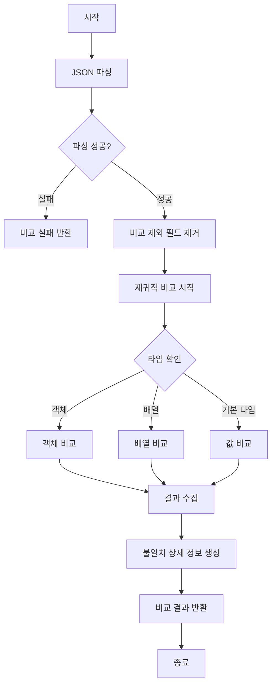

# JSON 비교 알고리즘

## 문서 목적

본 문서는 Legacy API와 Modern API의 JSON 응답을 비교하는 알고리즘을 정의합니다.

**포함 내용**:
- JSON 비교 규칙 및 알고리즘
- 필드별 값 비교 로직
- 타입 검증 로직
- 비교 제외 필드 처리
- 불일치 상세 정보 생성

---

## 1. 비교 규칙 개요

### 1.1 기본 원칙

| 원칙 | 설명 |
|------|------|
| **정확성** | 필드명, 값, 타입이 모두 일치해야 일치로 판정 |
| **재귀성** | 중첩된 객체와 배열은 재귀적으로 비교 |
| **타입 엄격성** | 숫자와 문자열, null과 빈 문자열 등 타입을 엄격히 구분 |
| **순서 민감성** | 배열은 순서 일치, 객체는 순서 무시 |

### 1.2 비교 흐름도



---

## 2. 필드명 비교

### 2.1 대소문자 구분

필드명은 대소문자를 구분합니다.

| Legacy | Modern | 결과 |
|--------|--------|------|
| `userName` | `userName` | ✓ 일치 |
| `userName` | `username` | ✗ 불일치 (대소문자 다름) |
| `UserName` | `username` | ✗ 불일치 |

### 2.2 공백 처리

필드명의 선행/후행 공백은 제거 후 비교합니다.

```go
// 의사코드
fieldName = strings.TrimSpace(fieldName)
```

| Legacy | Modern | 결과 |
|--------|--------|------|
| `"name"` | `" name "` | ✓ 일치 (공백 제거 후) |
| `"age "` | `"age"` | ✓ 일치 (공백 제거 후) |

---

## 3. 값 비교 규칙

### 3.1 기본 타입 비교

#### 3.1.1 문자열 (string)

- **비교 방식**: 완전 일치 (`==`)
- **대소문자**: 구분
- **공백**: 있는 그대로 비교

```go
// 예시
legacy: "hello"
modern: "hello"
결과: ✓ 일치

legacy: "Hello"
modern: "hello"
결과: ✗ 불일치 (대소문자 다름)

legacy: "hello "
modern: "hello"
결과: ✗ 불일치 (공백 포함)
```

#### 3.1.2 정수 (integer)

- **비교 방식**: 값 비교 (`==`)
- **타입**: 정수형만 허용

```go
// 예시
legacy: 123
modern: 123
결과: ✓ 일치

legacy: 123
modern: "123"
결과: ✗ 불일치 (타입 다름)
```

#### 3.1.3 부동소수점 (float)

- **비교 방식**: 허용 오차 범위 내 비교
- **허용 오차**: `1e-6` (소수점 6자리)
- **공식**: `abs(legacy - modern) < 1e-6`

```go
// 의사코드
func compareFloat(a, b float64) bool {
    epsilon := 1e-6
    return math.Abs(a - b) < epsilon
}

// 예시
legacy: 3.141592
modern: 3.141593
결과: ✓ 일치 (차이 0.000001 < 1e-6)

legacy: 3.141592
modern: 3.141692
결과: ✗ 불일치 (차이 0.0001 > 1e-6)
```

#### 3.1.4 불리언 (boolean)

- **비교 방식**: 값 비교 (`==`)

```go
// 예시
legacy: true
modern: true
결과: ✓ 일치

legacy: true
modern: false
결과: ✗ 불일치
```

#### 3.1.5 null 처리

- **null과 빈 문자열**: 다른 값으로 처리
- **null과 0**: 다른 값으로 처리
- **null과 false**: 다른 값으로 처리

```go
// 예시
legacy: null
modern: null
결과: ✓ 일치

legacy: null
modern: ""
결과: ✗ 불일치

legacy: null
modern: 0
결과: ✗ 불일치

legacy: null
modern: false
결과: ✗ 불일치
```

---

### 3.2 객체 (Object) 비교

#### 3.2.1 비교 규칙

- **필드 순서 무시**: 필드 순서와 무관하게 비교
- **필드 누락**: 한쪽에만 있는 필드는 불일치
- **재귀 비교**: 중첩된 객체는 재귀적으로 비교

#### 3.2.2 알고리즘

```go
// 의사코드
func compareObject(legacy, modern map[string]interface{}) CompareResult {
    result := CompareResult{IsMatch: true}

    // 1. 필드 개수 확인
    if len(legacy) != len(modern) {
        result.IsMatch = false
    }

    // 2. Legacy의 모든 필드 검증
    for key, legacyValue := range legacy {
        modernValue, exists := modern[key]

        if !exists {
            // 필드 누락
            result.IsMatch = false
            result.MismatchDetails = append(result.MismatchDetails, MismatchDetail{
                FieldPath: key,
                Reason: "field missing in modern response"
            })
            continue
        }

        // 3. 재귀적으로 값 비교
        if !compareValue(legacyValue, modernValue) {
            result.IsMatch = false
            result.MismatchDetails = append(result.MismatchDetails, ...)
        }
    }

    // 4. Modern에만 있는 필드 확인
    for key := range modern {
        if _, exists := legacy[key]; !exists {
            result.IsMatch = false
            result.MismatchDetails = append(result.MismatchDetails, MismatchDetail{
                FieldPath: key,
                Reason: "extra field in modern response"
            })
        }
    }

    return result
}
```

#### 3.2.3 예시

**✓ 일치 (필드 순서 무시)**
```json
Legacy:  {"name": "John", "age": 30}
Modern:  {"age": 30, "name": "John"}
결과: 일치
```

**✗ 불일치 (필드 누락)**
```json
Legacy:  {"name": "John", "age": 30}
Modern:  {"name": "John"}
결과: 불일치 (age 필드 누락)
```

**✗ 불일치 (추가 필드)**
```json
Legacy:  {"name": "John"}
Modern:  {"name": "John", "age": 30}
결과: 불일치 (age 필드 추가)
```

---

### 3.3 배열 (Array) 비교

#### 3.3.1 비교 규칙

- **순서 일치**: 배열 요소 순서가 동일해야 함
- **길이 일치**: 배열 길이가 다르면 불일치
- **요소별 비교**: 각 인덱스의 요소를 재귀적으로 비교

#### 3.3.2 알고리즘

```go
// 의사코드
func compareArray(legacy, modern []interface{}) CompareResult {
    result := CompareResult{IsMatch: true}

    // 1. 길이 확인
    if len(legacy) != len(modern) {
        result.IsMatch = false
        result.MismatchDetails = append(result.MismatchDetails, MismatchDetail{
            Reason: fmt.Sprintf("array length mismatch: %d vs %d", len(legacy), len(modern))
        })
        return result
    }

    // 2. 각 인덱스별 요소 비교
    for i := 0; i < len(legacy); i++ {
        if !compareValue(legacy[i], modern[i]) {
            result.IsMatch = false
            result.MismatchDetails = append(result.MismatchDetails, MismatchDetail{
                FieldPath: fmt.Sprintf("[%d]", i),
                LegacyValue: legacy[i],
                ModernValue: modern[i]
            })
        }
    }

    return result
}
```

#### 3.3.3 예시

**✓ 일치**
```json
Legacy:  [1, 2, 3]
Modern:  [1, 2, 3]
결과: 일치
```

**✗ 불일치 (순서 다름)**
```json
Legacy:  [1, 2, 3]
Modern:  [3, 2, 1]
결과: 불일치
```

**✗ 불일치 (길이 다름)**
```json
Legacy:  [1, 2, 3]
Modern:  [1, 2]
결과: 불일치
```

**✓ 중첩 배열 일치**
```json
Legacy:  [[1, 2], [3, 4]]
Modern:  [[1, 2], [3, 4]]
결과: 일치
```

---

## 4. 비교 제외 필드

### 4.1 기본 제외 필드

다음 필드는 항상 비교에서 제외됩니다.

| 필드명 | 사유 |
|--------|------|
| `timestamp` | 응답 생성 시간 (매번 다름) |
| `requestId` | 요청별 고유 ID (매번 다름) |
| `traceId` | 분산 추적 ID (매번 다름) |
| `responseTime` | 응답 시간 (매번 다름) |
| `serverTime` | 서버 시간 (매번 다름) |

### 4.2 API별 제외 필드

Route Entity의 `ExcludeFields` 속성에 정의된 필드를 추가로 제외합니다.

```json
// 예시: Route 설정
{
  "id": "route-001",
  "path": "/api/v1/users",
  "exclude_fields": ["createdAt", "updatedAt", "lastModified"]
}
```

### 4.3 제외 로직

```go
// 의사코드
func removeExcludedFields(data map[string]interface{}, excludeFields []string) map[string]interface{} {
    result := make(map[string]interface{})

    for key, value := range data {
        // 제외 필드 목록에 있는지 확인
        if contains(excludeFields, key) {
            continue
        }

        // 중첩된 객체인 경우 재귀적으로 처리
        if nestedObj, ok := value.(map[string]interface{}); ok {
            result[key] = removeExcludedFields(nestedObj, excludeFields)
        } else if nestedArr, ok := value.([]interface{}); ok {
            result[key] = removeExcludedFieldsFromArray(nestedArr, excludeFields)
        } else {
            result[key] = value
        }
    }

    return result
}
```

---

## 5. 불일치 상세 정보

### 5.1 MismatchDetail 구조

```go
type MismatchDetail struct {
    FieldPath     string      // 필드 경로 (예: "user.address.city")
    LegacyValue   interface{} // Legacy 값
    ModernValue   interface{} // Modern 값
    ExpectedType  string      // 기대 타입
    ActualType    string      // 실제 타입
    Reason        string      // 불일치 사유
}
```

### 5.2 필드 경로 표현

중첩된 구조의 필드 경로는 점(`.`) 표기법으로 표현합니다.

| 구조 | 필드 경로 |
|------|----------|
| 객체 내 필드 | `user.name` |
| 중첩 객체 | `user.address.city` |
| 배열 요소 | `users[0].name` |
| 배열 내 객체 | `orders[2].items[0].price` |

### 5.3 예시

```json
// Legacy
{
  "user": {
    "name": "John",
    "age": 30,
    "address": {
      "city": "Seoul"
    }
  }
}

// Modern
{
  "user": {
    "name": "John",
    "age": "30",
    "address": {
      "city": "Busan"
    }
  }
}

// MismatchDetails
[
  {
    "fieldPath": "user.age",
    "legacyValue": 30,
    "modernValue": "30",
    "expectedType": "number",
    "actualType": "string",
    "reason": "type mismatch"
  },
  {
    "fieldPath": "user.address.city",
    "legacyValue": "Seoul",
    "modernValue": "Busan",
    "expectedType": "string",
    "actualType": "string",
    "reason": "value mismatch"
  }
]
```

---

## 6. 타임아웃 처리

### 6.1 타임아웃 설정

- **제한 시간**: 10초
- **초과 시 동작**: 비교 중단, 타임아웃 기록

### 6.2 구현

```go
// 의사코드
func Compare(ctx context.Context, req CompareRequest) (*CompareResult, error) {
    // Context에 타임아웃 설정
    ctx, cancel := context.WithTimeout(ctx, 10*time.Second)
    defer cancel()

    // 비교 작업을 goroutine에서 실행
    resultChan := make(chan *CompareResult)
    errorChan := make(chan error)

    go func() {
        result, err := doCompare(req)
        if err != nil {
            errorChan <- err
        } else {
            resultChan <- result
        }
    }()

    // 타임아웃 또는 완료 대기
    select {
    case result := <-resultChan:
        return result, nil
    case err := <-errorChan:
        return nil, err
    case <-ctx.Done():
        return nil, ErrComparisonTimeout
    }
}
```

---

## 7. 성능 최적화

### 7.1 조기 종료 (Early Exit)

- **길이 불일치**: 배열/객체 길이가 다르면 즉시 불일치 반환
- **필드 누락**: 필수 필드가 누락되면 즉시 불일치 반환

### 7.2 병렬 처리 (선택사항)

대규모 객체 비교 시 병렬 처리 고려:

```go
// 의사코드
func compareObjectParallel(legacy, modern map[string]interface{}) CompareResult {
    var wg sync.WaitGroup
    resultChan := make(chan MismatchDetail, len(legacy))

    for key, legacyValue := range legacy {
        wg.Add(1)
        go func(k string, lv interface{}) {
            defer wg.Done()
            if modernValue, exists := modern[k]; exists {
                if !compareValue(lv, modernValue) {
                    resultChan <- MismatchDetail{FieldPath: k, ...}
                }
            }
        }(key, legacyValue)
    }

    wg.Wait()
    close(resultChan)

    // 결과 수집
    mismatches := []MismatchDetail{}
    for detail := range resultChan {
        mismatches = append(mismatches, detail)
    }

    return CompareResult{
        IsMatch: len(mismatches) == 0,
        MismatchDetails: mismatches
    }
}
```

---

## 8. 엣지 케이스 처리

### 8.1 빈 값 처리

| Legacy | Modern | 결과 |
|--------|--------|------|
| `{}` | `{}` | ✓ 일치 (빈 객체) |
| `[]` | `[]` | ✓ 일치 (빈 배열) |
| `""` | `""` | ✓ 일치 (빈 문자열) |
| `null` | `null` | ✓ 일치 |
| `{}` | `null` | ✗ 불일치 |
| `[]` | `null` | ✗ 불일치 |

### 8.2 특수 문자 처리

- **이스케이프 문자**: JSON 표준에 따라 처리
- **유니코드**: UTF-8 인코딩으로 처리

```json
// 예시
Legacy:  {"message": "Hello\nWorld"}
Modern:  {"message": "Hello\nWorld"}
결과: 일치

Legacy:  {"emoji": "😀"}
Modern:  {"emoji": "😀"}
결과: 일치
```

### 8.3 매우 큰 숫자

- **정밀도 손실**: float64 범위를 초과하는 숫자는 문자열로 처리 권장
- **과학적 표기법**: `1e10` → `10000000000` 동일하게 처리

---

## 9. 참고 사항

### 9.1 라이브러리 선택

Go 표준 라이브러리 사용 권장:
- `encoding/json`: JSON 파싱
- `reflect`: 타입 검사
- `math`: 부동소수점 비교

### 9.2 테스트 케이스

비교 로직은 다음 케이스를 모두 테스트해야 합니다:
- 기본 타입 비교 (string, int, float, bool, null)
- 객체 비교 (중첩, 순서, 필드 누락)
- 배열 비교 (순서, 길이, 중첩)
- 혼합 구조 (객체 내 배열, 배열 내 객체)
- 비교 제외 필드
- 타임아웃
- 엣지 케이스

---

**최종 수정일**: 2025-11-30
**작성자**: ABS 개발팀
