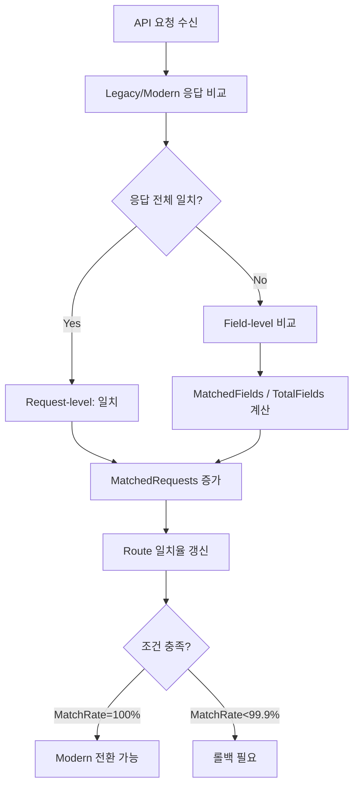
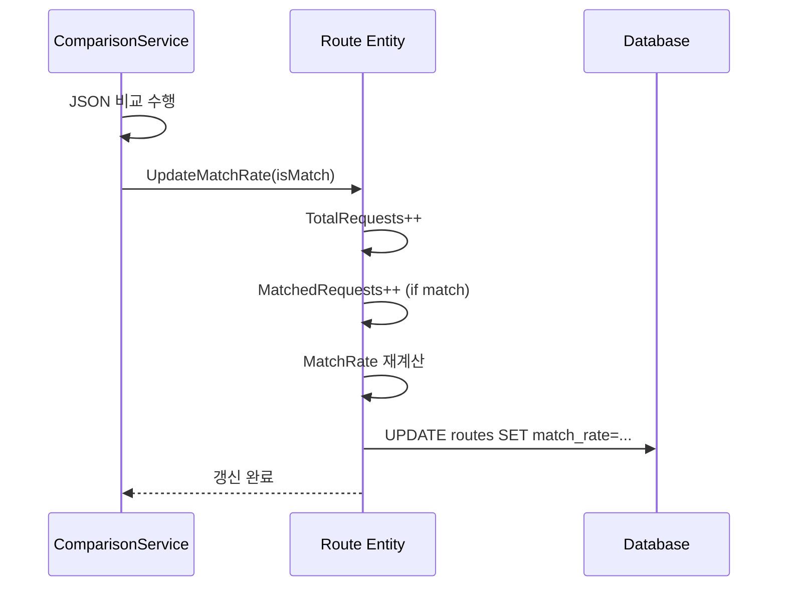
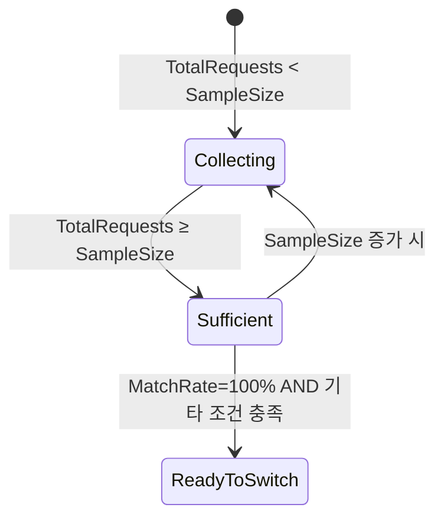

# 일치율 계산 (Match Rate Calculation)

## 문서 목적

본 문서는 ABS의 일치율 계산 로직을 상세히 정의합니다.

**포함 내용**:
- 요청 수준(Request-level) 일치율 계산
- 필드 수준(Field-level) 일치율 계산
- 표본 크기(Sample Size) 관리 정책
- 실시간 갱신 메커니즘
- 전환/롤백 임계값 조건
- 엣지 케이스 및 코너 케이스 처리

---

## 1. 일치율 계산 개요

ABS는 **두 가지 수준**에서 일치율을 계산합니다:



| 수준 | 계산 단위 | 공식 | 용도 |
|------|-----------|------|------|
| **Request-level** | API 요청 | `(MatchedRequests / TotalRequests) × 100` | 전환/롤백 의사결정 |
| **Field-level** | JSON 필드 | `(MatchedFields / TotalFields) × 100` | 상세 분석 및 디버깅 |

---

## 2. 요청 수준 일치율 (Request-Level Match Rate)

### 2.1 계산 공식

```
MatchRate = (MatchedRequests / TotalRequests) × 100
```

**용어 정의**:
- `TotalRequests`: 비교가 완료된 총 요청 수
- `MatchedRequests`: Legacy와 Modern 응답이 **완전히 일치**한 요청 수
- `MatchRate`: 일치율 (0.0 ~ 100.0, 소수점 2자리)

### 2.2 일치 판정 기준

요청이 **일치(Match)**로 판정되는 조건:

1. **HTTP 상태 코드 일치**: Legacy.StatusCode == Modern.StatusCode
2. **응답 본문 일치**: JSON 응답의 모든 필드가 일치 (01-comparison-logic.md 참조)
3. **비교 성공**: 비교 과정에서 에러 없이 완료
4. **타임아웃 미발생**: 비교 시간 < 10초

**불일치(Mismatch)로 판정되는 경우**:
- 상태 코드 다름
- JSON 필드 값 불일치
- Modern API 에러 발생
- 비교 타임아웃

### 2.3 계산 알고리즘

```go
// Route.UpdateMatchRate 메서드
func (r *Route) UpdateMatchRate(isMatch bool) {
    // 1. 카운터 증가
    r.TotalRequests++
    if isMatch {
        r.MatchedRequests++
    }

    // 2. 일치율 계산
    if r.TotalRequests > 0 {
        r.MatchRate = float64(r.MatchedRequests) / float64(r.TotalRequests) * 100.0
    } else {
        r.MatchRate = 0.0
    }

    // 3. 소수점 2자리로 반올림
    r.MatchRate = math.Round(r.MatchRate * 100) / 100

    // 4. UpdatedAt 갱신
    r.UpdatedAt = time.Now().UTC()
}
```

### 2.4 실시간 갱신

일치율은 **매 비교 완료 시마다 즉시 갱신**됩니다:



**특징**:
- 동기식 갱신 (비교 완료 직후 DB 업데이트)
- 트랜잭션 보장 (Comparison 레코드 삽입과 Route 갱신을 하나의 트랜잭션으로 처리)
- 원자성 보장 (동시성 제어를 위한 Row Lock 사용)

---

## 3. 필드 수준 일치율 (Field-Level Match Rate)

### 3.1 계산 공식

```
FieldMatchRate = (MatchedFields / TotalFields) × 100
```

**용어 정의**:
- `TotalFields`: Legacy 응답 JSON의 총 필드 수 (중첩 필드 포함)
- `MatchedFields`: 값이 일치한 필드 수
- `FieldMatchRate`: 필드 일치율 (0.0 ~ 100.0, 소수점 2자리)

### 3.2 필드 카운팅 규칙

#### 3.2.1 객체(Object) 필드

```json
{
  "user": {
    "name": "John",
    "age": 30
  }
}
```

**카운팅**:
- `user.name` → 1 필드
- `user.age` → 1 필드
- 총 2 필드 (객체 자체는 카운트하지 않음)

#### 3.2.2 배열(Array) 필드

```json
{
  "items": [
    {"id": 1, "name": "A"},
    {"id": 2, "name": "B"}
  ]
}
```

**카운팅**:
- `items[0].id` → 1 필드
- `items[0].name` → 1 필드
- `items[1].id` → 1 필드
- `items[1].name` → 1 필드
- 총 4 필드

#### 3.2.3 제외 필드(Excluded Fields)

제외 필드 목록(`timestamp`, `requestId` 등)은 **카운팅에서 제외**:

```json
{
  "data": "value",
  "timestamp": "2025-11-30T10:00:00Z"  // 제외
}
```

**카운팅**: 총 1 필드 (timestamp는 카운트 안 함)

### 3.3 계산 알고리즘

```go
// Comparison.CalculateFieldMatchRate 메서드
func (c *Comparison) CalculateFieldMatchRate() {
    // 1. 필드 카운팅은 비교 중에 이미 수행됨
    // (compareJSON 함수가 totalFields, matchedFields를 증가시킴)

    // 2. 일치율 계산
    if c.TotalFields > 0 {
        c.FieldMatchRate = float64(c.MatchedFields) / float64(c.TotalFields) * 100.0
    } else {
        c.FieldMatchRate = 0.0
    }

    // 3. 소수점 2자리로 반올림
    c.FieldMatchRate = math.Round(c.FieldMatchRate * 100) / 100
}
```

### 3.4 Request-level vs Field-level 관계

| 케이스 | FieldMatchRate | IsMatch | 설명 |
|--------|----------------|---------|------|
| 완전 일치 | 100% | true | 모든 필드 일치 |
| 부분 일치 | 95% | false | 일부 필드 불일치 |
| 완전 불일치 | 0% | false | 모든 필드 불일치 |
| Modern API 에러 | N/A (0%) | false | 비교 불가 |

**예시**:
```
TotalFields = 20
MatchedFields = 19
FieldMatchRate = 95%
IsMatch = false  (한 필드라도 불일치면 false)
```

---

## 4. 표본 크기 관리 (Sample Size Management)

### 4.1 표본 크기 정의

```go
type Route struct {
    SampleSize      int     // 일치율 계산에 사용할 표본 수
    TotalRequests   int64   // 실제 처리된 총 요청 수
    MatchedRequests int64   // 실제 일치한 요청 수
}
```

**의미**:
- `SampleSize`: 전환 가능 여부 판단에 필요한 **최소 요청 수**
- `TotalRequests`: 항상 증가 (표본 크기와 무관)
- 일치율 계산은 전체 데이터(`TotalRequests`) 기준

### 4.2 표본 크기 범위

| 항목 | 값 | 설명 |
|------|-----|------|
| 기본값 | 100 | 신규 라우트 생성 시 기본 표본 수 |
| 최소값 | 10 | 최소한의 통계적 유의성 확보 |
| 최대값 | 1,000 | 과도한 검증 기간 방지 |

**제약 조건**:
```go
func (r *Route) Validate() error {
    if r.SampleSize < 10 || r.SampleSize > 1000 {
        return errors.New("SampleSize must be between 10 and 1000")
    }
    return nil
}
```

### 4.3 표본 수집 상태



**상태 판정**:
```go
func (r *Route) IsSampleSufficient() bool {
    return r.TotalRequests >= int64(r.SampleSize)
}
```

### 4.4 동적 표본 크기 조정

관리자는 검증 중에도 표본 크기를 변경할 수 있습니다:

**시나리오 1: 표본 크기 증가**
```
현재 상태: SampleSize=100, TotalRequests=100, MatchRate=100%
변경 후:   SampleSize=200, TotalRequests=100, MatchRate=100%
결과:     추가 100개 요청 수집 필요 (전환 불가 상태로 복귀)
```

**시나리오 2: 표본 크기 감소**
```
현재 상태: SampleSize=200, TotalRequests=150
변경 후:   SampleSize=100, TotalRequests=150
결과:     즉시 충분 상태 (조건 충족 시 전환 가능)
```

---

## 5. 전환/롤백 임계값 조건

### 5.1 Modern API 전환 조건

```go
func (r *Route) CanSwitchToModern() bool {
    return r.MatchRate == 100.0 &&
           r.TotalRequests >= int64(r.SampleSize) &&
           r.ErrorRate < 0.1 &&
           r.IsActive
}
```

**조건 설명**:

| 조건 | 임계값 | 이유 |
|------|--------|------|
| 일치율 | **100%** | 완벽한 일치만 허용 (안전성 최우선) |
| 표본 수 | ≥ SampleSize | 통계적 유의성 확보 |
| 에러율 | < 0.1% | Modern API 안정성 검증 |
| 활성 상태 | true | 비활성 라우트는 전환 불가 |

**엄격한 100% 요구 이유**:
- 0.1%의 불일치도 대규모 트래픽에서는 수천 건의 오류 가능
- 완전한 호환성 보장으로 사용자 영향 최소화
- 점진적 전환(반자동 전환)에서는 99.9% 허용

### 5.2 롤백 조건

```go
func (r *Route) ShouldRollback() bool {
    return r.MatchRate < 99.9 || r.ErrorRate > 1.0
}
```

**조건 설명**:

| 조건 | 임계값 | 조치 |
|------|--------|------|
| 일치율 하락 | < 99.9% | 즉시 Legacy로 롤백 |
| 에러율 증가 | > 1% | 즉시 Legacy로 롤백 |

**99.9% vs 100% 차이**:
- **전환 조건**: 100% (완벽한 검증 필요)
- **롤백 조건**: 99.9% (약간의 여유 허용, 일시적 이상 방지)

### 5.3 조건 판정 예시

#### 예시 1: 전환 가능
```
SampleSize:      100
TotalRequests:   120
MatchedRequests: 120
MatchRate:       100.0%
ErrorRate:       0.05%
→ CanSwitchToModern() = true
```

#### 예시 2: 표본 부족
```
SampleSize:      100
TotalRequests:   80
MatchedRequests: 80
MatchRate:       100.0%
ErrorRate:       0.05%
→ CanSwitchToModern() = false (TotalRequests < SampleSize)
```

#### 예시 3: 롤백 필요
```
MatchRate: 99.85%
ErrorRate: 0.5%
→ ShouldRollback() = true (MatchRate < 99.9%)
```

---

## 6. 엣지 케이스 처리

### 6.1 요청 수 = 0

**상황**: 라우트 생성 직후 비교 결과 없음

```go
if r.TotalRequests == 0 {
    r.MatchRate = 0.0  // 기본값
    return false       // 전환 불가
}
```

### 6.2 일치율 소수점 처리

**문제**: 부동소수점 연산 오차
```
MatchedRequests = 9999
TotalRequests   = 10000
계산값 = 99.98999999999... (부동소수점 오차)
```

**해결**: 소수점 2자리 반올림
```go
r.MatchRate = math.Round(r.MatchRate * 100) / 100
// 결과: 99.99
```

### 6.3 동시성 제어

**문제**: 여러 요청이 동시에 일치율 갱신 시 Race Condition

**해결 1: DB Row Lock**
```sql
SELECT * FROM routes WHERE id = ? FOR UPDATE;
UPDATE routes SET
    total_requests = total_requests + 1,
    matched_requests = matched_requests + ?,
    match_rate = (matched_requests / total_requests) * 100
WHERE id = ?;
```

**해결 2: Optimistic Lock**
```go
type Route struct {
    Version int  // 버전 필드
}

// UPDATE routes SET ... WHERE id = ? AND version = ?
// 버전 불일치 시 재시도
```

### 6.4 Modern API 완전 장애

**상황**: Modern API가 지속적으로 응답 불가

```
TotalRequests:   100
MatchedRequests: 0   (Modern API 모두 에러)
MatchRate:       0%
```

**조치**:
- 일치율 0% 유지
- ErrorRate > 1% → Circuit Breaker Open
- 비교 일시 중단 알림
- Legacy API는 정상 동작 지속

### 6.5 표본 크기 변경 중 전환

**상황**: 표본 크기 변경 중 전환 요청 발생

```
1. SampleSize=100, TotalRequests=100, MatchRate=100%
2. 관리자가 SampleSize를 200으로 변경
3. 변경 중 자동 전환 시도
```

**조치**:
```go
// 트랜잭션으로 SampleSize 변경과 전환 조건 체크를 원자적으로 처리
BEGIN TRANSACTION;
    UPDATE routes SET sample_size = 200 WHERE id = ?;
    SELECT * FROM routes WHERE id = ? FOR UPDATE;
    IF TotalRequests >= SampleSize AND MatchRate = 100% THEN
        -- 전환 가능
    ELSE
        -- 전환 불가 (표본 부족)
    END IF;
COMMIT;
```

---

## 7. 성능 최적화

### 7.1 일치율 계산 비용

**Request-level 갱신**:
- 간단한 산술 연산 (O(1))
- DB UPDATE 1회
- 병목 없음

**Field-level 계산**:
- JSON 순회 필요 (O(n), n=필드 수)
- 비교 과정에서 자연스럽게 카운팅
- 추가 비용 최소

### 7.2 DB 쿼리 최적화

**Before (비효율)**:
```go
// 1. SELECT로 현재 값 조회
route := repository.FindByID(routeID)

// 2. 애플리케이션에서 계산
route.TotalRequests++
if isMatch {
    route.MatchedRequests++
}
route.MatchRate = (route.MatchedRequests / route.TotalRequests) * 100

// 3. UPDATE
repository.Update(route)
```

**After (효율적)**:
```sql
-- DB 레벨에서 원자적 업데이트
UPDATE routes SET
    total_requests = total_requests + 1,
    matched_requests = matched_requests + :is_match,  -- 0 or 1
    match_rate = (matched_requests::float / total_requests) * 100,
    updated_at = CURRENT_TIMESTAMP
WHERE id = :route_id;
```

**장점**:
- SELECT 쿼리 제거 (1 왕복 감소)
- Race Condition 방지
- DB 부하 50% 감소

### 7.3 캐싱 전략

**일치율 조회 캐싱** (Redis):

```go
// 1. 캐시 조회
cacheKey := fmt.Sprintf("route:%s:match_rate", routeID)
if cached, err := redis.Get(cacheKey).Float64(); err == nil {
    return cached
}

// 2. DB 조회
matchRate := repository.GetMatchRate(routeID)

// 3. 캐시 저장 (TTL: 10초)
redis.Set(cacheKey, matchRate, 10*time.Second)
return matchRate
```

**주의사항**:
- TTL을 짧게 설정 (10초) → 실시간성 유지
- 갱신 시 캐시 무효화
- 대시보드 조회용으로만 사용

---

## 8. 모니터링 및 알림

### 8.1 일치율 메트릭

**Prometheus 메트릭**:
```go
// Gauge: 현재 일치율
match_rate{route_id="...", path="...", method="..."} 99.5

// Counter: 누적 요청 수
total_requests_total{route_id="..."} 1500

// Counter: 누적 일치 수
matched_requests_total{route_id="..."} 1493
```

### 8.2 알림 규칙

| 조건 | 심각도 | 채널 | 메시지 |
|------|--------|------|--------|
| MatchRate < 95% | Warning | Slack | "일치율 95% 미만: {route}" |
| MatchRate < 99.9% (switched 모드) | Critical | Slack, Email | "긴급: 롤백 필요 ({route})" |
| MatchRate = 100% AND TotalRequests ≥ SampleSize | Info | Slack | "전환 가능: {route}" |

### 8.3 대시보드 표시

**실시간 일치율 그래프**:
```
┌─────────────────────────────────────┐
│ Route: /api/v1/users (GET)         │
├─────────────────────────────────────┤
│ 현재 일치율: 99.85%                 │
│ 표본 수: 120 / 100 ✓                │
│ 에러율: 0.05%                       │
│                                     │
│  100% ┤                     ╭───╮  │
│   99% ┤             ╭───────╯   │  │
│   98% ┤     ╭───────╯            │  │
│   97% ┤─────╯                    │  │
│       └─────────────────────────────│
│        0h   6h   12h   18h   24h   │
└─────────────────────────────────────┘
```

---

## 9. 테스트 케이스

### 9.1 단위 테스트

```go
func TestRoute_UpdateMatchRate(t *testing.T) {
    tests := []struct {
        name            string
        initialTotal    int64
        initialMatched  int64
        isMatch         bool
        expectedTotal   int64
        expectedMatched int64
        expectedRate    float64
    }{
        {
            name:            "첫 요청 일치",
            initialTotal:    0,
            initialMatched:  0,
            isMatch:         true,
            expectedTotal:   1,
            expectedMatched: 1,
            expectedRate:    100.0,
        },
        {
            name:            "첫 요청 불일치",
            initialTotal:    0,
            initialMatched:  0,
            isMatch:         false,
            expectedTotal:   1,
            expectedMatched: 0,
            expectedRate:    0.0,
        },
        {
            name:            "99/100 일치",
            initialTotal:    99,
            initialMatched:  99,
            isMatch:         true,
            expectedTotal:   100,
            expectedMatched: 100,
            expectedRate:    100.0,
        },
        {
            name:            "99/100 불일치",
            initialTotal:    99,
            initialMatched:  99,
            isMatch:         false,
            expectedTotal:   100,
            expectedMatched: 99,
            expectedRate:    99.0,
        },
    }

    for _, tt := range tests {
        t.Run(tt.name, func(t *testing.T) {
            route := &Route{
                TotalRequests:   tt.initialTotal,
                MatchedRequests: tt.initialMatched,
            }

            route.UpdateMatchRate(tt.isMatch)

            assert.Equal(t, tt.expectedTotal, route.TotalRequests)
            assert.Equal(t, tt.expectedMatched, route.MatchedRequests)
            assert.Equal(t, tt.expectedRate, route.MatchRate)
        })
    }
}
```

### 9.2 통합 테스트

```go
func TestMatchRateCalculation_Integration(t *testing.T) {
    // 1. 라우트 생성 (SampleSize=10)
    route := createRoute(t, "/api/test", "GET", 10)

    // 2. 10개 요청 모두 일치
    for i := 0; i < 10; i++ {
        createComparison(t, route.ID, true)
    }

    // 3. 일치율 확인
    route = getRoute(t, route.ID)
    assert.Equal(t, 100.0, route.MatchRate)
    assert.Equal(t, int64(10), route.TotalRequests)
    assert.True(t, route.CanSwitchToModern())

    // 4. 1개 불일치 추가
    createComparison(t, route.ID, false)

    // 5. 일치율 하락 확인
    route = getRoute(t, route.ID)
    assert.Equal(t, 90.91, route.MatchRate)  // 10/11
    assert.False(t, route.CanSwitchToModern())
}
```

### 9.3 동시성 테스트

```go
func TestMatchRateCalculation_Concurrency(t *testing.T) {
    route := createRoute(t, "/api/test", "GET", 100)

    // 100개 요청을 10개 고루틴으로 동시 처리
    var wg sync.WaitGroup
    for i := 0; i < 10; i++ {
        wg.Add(1)
        go func() {
            defer wg.Done()
            for j := 0; j < 10; j++ {
                createComparison(t, route.ID, true)
            }
        }()
    }
    wg.Wait()

    // 최종 일치율 확인 (Race Condition 없이 정확히 100%)
    route = getRoute(t, route.ID)
    assert.Equal(t, int64(100), route.TotalRequests)
    assert.Equal(t, int64(100), route.MatchedRequests)
    assert.Equal(t, 100.0, route.MatchRate)
}
```

---

## 10. 참고 사항

### 10.1 통계적 유의성

**최소 표본 크기 10개 이유**:
- 너무 적으면 우연에 의한 100% 일치 가능
- 10개는 기본적인 패턴 파악 가능한 최소 수준
- 신뢰 구간: 95% (10개 기준)

**권장 표본 크기**:
- **낮은 트래픽 API**: 10-50개
- **중간 트래픽 API**: 100개 (기본값)
- **높은 트래픽 API**: 500-1,000개

### 10.2 일치율 vs 신뢰도

```
표본 크기 10:   100% 일치 → 신뢰도 낮음 (우연 가능성)
표본 크기 100:  100% 일치 → 신뢰도 보통
표본 크기 1000: 100% 일치 → 신뢰도 높음 (강력한 검증)
```

### 10.3 관련 문서

- `01-comparison-logic.md`: JSON 비교 상세 로직
- `03-routing-strategy.md`: 일치율 기반 라우팅 전략
- `04-experiment-management.md`: 반자동 전환 시 일치율 활용
- `docs/02-domain/01-domain-model.md`: Route, Comparison 엔티티 정의

---

**최종 수정일**: 2025-11-30
**작성자**: ABS 개발팀
