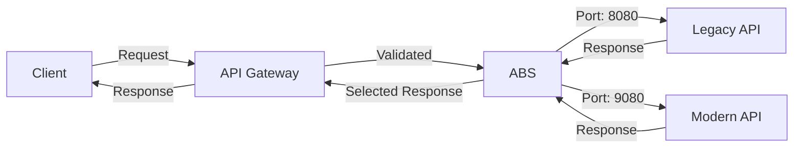
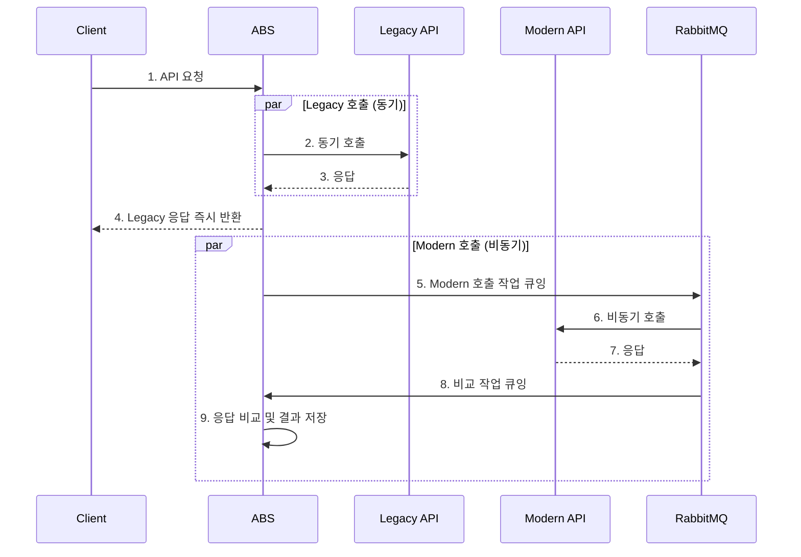
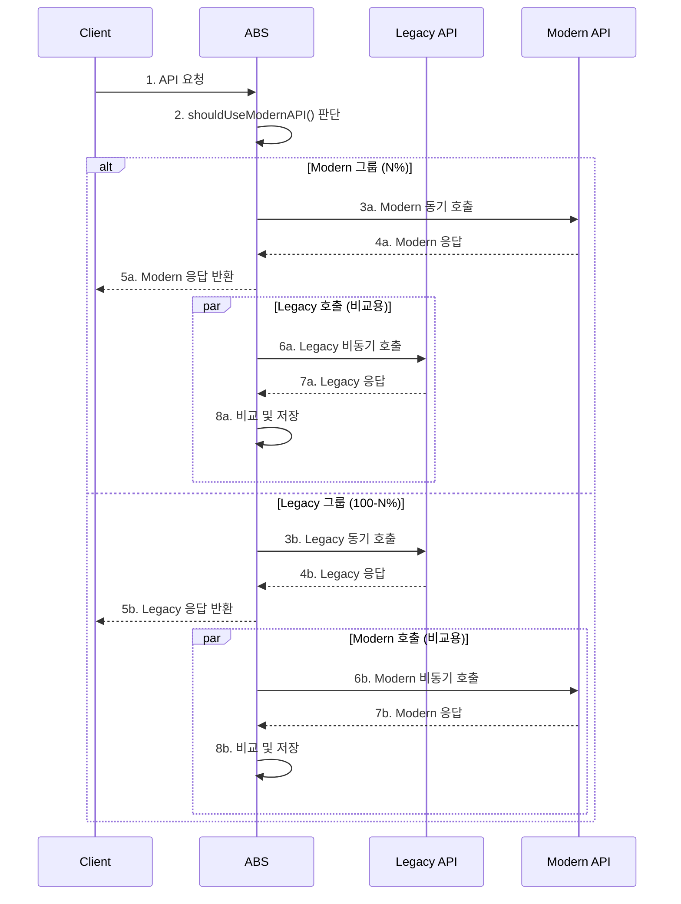
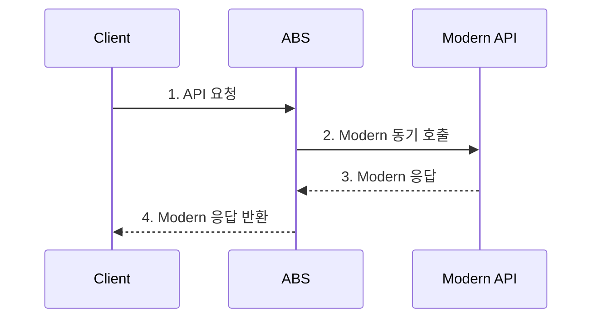
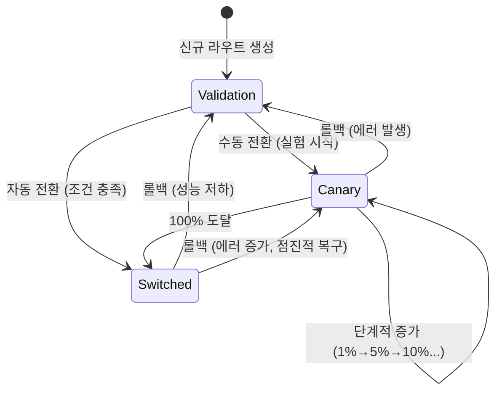

# 라우팅 전략 (Routing Strategy)

## 문서 목적

본 문서는 ABS의 요청 라우팅 전략 및 운영 모드별 동작 방식을 정의합니다.

**포함 내용**:
- 운영 모드별 라우팅 정책 (Validation, Canary, Switched)
- 포트 기반 라우팅 메커니즘
- Canary 모드 트래픽 분배 알고리즘
- 모드 전환 로직 및 조건
- 요청 처리 흐름 및 응답 반환 정책

---

## 1. 라우팅 개요

### 1.1 포트 기반 라우팅

ABS는 **포트 번호**를 변경하여 Legacy/Modern API로 요청을 라우팅합니다.



**라우팅 규칙**:
- **동일 호스트**: Legacy와 Modern API는 같은 호스트에서 서비스
- **포트 구분**: Legacy(8080), Modern(9080) - 설정 파일에서 관리
- **경로 유지**: API Path, 쿼리 파라미터, 헤더는 동일하게 전달
- **메서드 유지**: HTTP Method(GET, POST, PUT, DELETE 등) 유지

**URL 변환 예시**:
```
원본 요청:     http://api-gateway/api/v1/users?page=1
Legacy 호출:   http://api-host:8080/api/v1/users?page=1
Modern 호출:   http://api-host:9080/api/v1/users?page=1
```

### 1.2 운영 모드 (Operation Mode)

ABS는 3가지 운영 모드를 지원합니다:

| 모드 | 값 | Legacy 호출 | Modern 호출 | 응답 소스 | 비교 수행 |
|------|-----|-------------|-------------|-----------|-----------|
| **검증 모드** | `validation` | 동기 | 비동기 | Legacy | ✓ |
| **Canary 모드** | `canary` | 동기 | 동기 (N%) | Legacy (100-N%) / Modern (N%) | ✓ |
| **전환 모드** | `switched` | - | 동기 | Modern | - |

---

## 2. 검증 모드 (Validation Mode)

### 2.1 개요

**목적**: Modern API의 응답을 검증하면서 사용자에게는 안정적인 Legacy 응답 제공

**특징**:
- 기본 운영 모드
- 사용자 영향 없음 (항상 Legacy 응답 반환)
- 모든 요청에 대해 비교 수행

### 2.2 요청 처리 흐름



**단계 설명**:
1. 클라이언트가 ABS로 요청 전송
2. ABS가 Legacy API를 **동기** 호출 (포트 8080)
3. Legacy 응답 수신
4. **즉시 클라이언트에 Legacy 응답 반환** (사용자 대기 시간 최소화)
5-9. Modern API 호출 및 비교는 **백그라운드**에서 비동기 처리

### 2.3 응답 정책

| 시나리오 | Legacy 상태 | Modern 상태 | 클라이언트 응답 | 비교 수행 |
|----------|-------------|-------------|----------------|-----------|
| 정상 | 200 OK | 200 OK | Legacy 응답 | ✓ |
| Legacy 에러 | 500 Error | - | Legacy 500 Error | - |
| Modern 에러 | 200 OK | 500 Error | Legacy 응답 | 불일치 기록 |
| Modern 타임아웃 | 200 OK | Timeout | Legacy 응답 | 타임아웃 기록 |

**핵심 원칙**: Legacy API가 정상 응답하면 클라이언트는 항상 정상 서비스 이용 가능

### 2.4 알고리즘

```go
func (s *RoutingService) HandleValidationMode(req *http.Request, route *Route) (*http.Response, error) {
    ctx := req.Context()

    // 1. Legacy API 동기 호출
    legacyResp, legacyErr := s.callLegacyAPI(ctx, req, route)
    if legacyErr != nil {
        // Legacy 실패 시 에러 반환
        return nil, legacyErr
    }

    // 2. 클라이언트에 즉시 응답 반환 (대기 시간 최소화)
    // (실제로는 응답을 복제하여 반환)

    // 3. Modern API 비동기 호출 및 비교 (고루틴)
    go func() {
        // 새로운 context 사용 (원본 요청 context와 독립)
        bgCtx := context.Background()

        modernResp, modernErr := s.callModernAPI(bgCtx, req, route)

        // 비교 수행
        s.compareAndStore(bgCtx, route, req, legacyResp, modernResp, modernErr)
    }()

    return legacyResp, nil
}
```

**주의사항**:
- 비동기 고루틴은 원본 요청 context와 **독립적인 context** 사용
- 클라이언트 연결 종료와 무관하게 비교 완료
- 고루틴 누수 방지를 위한 타임아웃 설정 (10초)

---

## 3. Canary 모드 (Canary Mode)

### 3.1 개요

**목적**: 트래픽의 일부만 Modern API로 전환하여 점진적 검증

**특징**:
- 트래픽 비율(N%) 설정 가능 (1-100%)
- N% 사용자는 Modern 응답 수신
- (100-N)% 사용자는 Legacy 응답 수신
- 모든 요청에 대해 비교 수행

### 3.2 트래픽 분배 알고리즘

#### 3.2.1 해시 기반 분배

**목적**: 동일 사용자는 항상 동일한 API 버전 호출 (일관성 보장)

```go
func (s *RoutingService) shouldUseModernAPI(req *http.Request, canaryPercentage int) bool {
    // 1. 요청 식별자 추출 (우선순위 순)
    identifier := s.extractIdentifier(req)

    // 2. 해시 계산
    hash := crc32.ChecksumIEEE([]byte(identifier))

    // 3. 0-99 범위로 정규화
    bucket := hash % 100

    // 4. Canary 비율과 비교
    return int(bucket) < canaryPercentage
}

func (s *RoutingService) extractIdentifier(req *http.Request) string {
    // 우선순위 1: User ID (헤더에서 추출)
    if userID := req.Header.Get("X-User-ID"); userID != "" {
        return userID
    }

    // 우선순위 2: Session ID
    if sessionID := req.Header.Get("X-Session-ID"); sessionID != "" {
        return sessionID
    }

    // 우선순위 3: Client IP
    return getClientIP(req)
}
```

**장점**:
- 동일 사용자는 항상 같은 버전 사용 → 일관된 경험
- 무작위 분포 → 공정한 트래픽 분배
- 빠른 계산 (O(1))

**예시**:
```
Canary 10% 설정 시:
- User A (hash % 100 = 5)  → 5 < 10  → Modern
- User B (hash % 100 = 15) → 15 < 10 → Legacy
- User C (hash % 100 = 99) → 99 < 10 → Legacy
```

#### 3.2.2 대안: 랜덤 분배

```go
func (s *RoutingService) shouldUseModernAPIRandom(canaryPercentage int) bool {
    return rand.Intn(100) < canaryPercentage
}
```

**장점**: 간단한 구현
**단점**: 동일 사용자가 요청마다 다른 버전 호출 가능 (비일관성)

**권장**: 해시 기반 분배 사용

### 3.3 요청 처리 흐름



**핵심 차이**:
- **Modern 그룹**: Modern을 동기 호출, Legacy를 비동기 호출
- **Legacy 그룹**: Legacy를 동기 호출, Modern을 비동기 호출

### 3.4 응답 정책

| 시나리오 | 그룹 | 주 API 상태 | 클라이언트 응답 | Fallback |
|----------|------|-------------|----------------|----------|
| Modern 그룹 정상 | Modern | 200 OK | Modern 응답 | - |
| Modern 그룹 에러 | Modern | 500 Error | Modern 500 Error | - |
| Modern 타임아웃 | Modern | Timeout | 503 Timeout | - |
| Legacy 그룹 정상 | Legacy | 200 OK | Legacy 응답 | - |

**Fallback 정책 (선택사항)**:
```go
// Modern 실패 시 Legacy로 자동 전환
if modernErr != nil && route.EnableFallback {
    legacyResp, legacyErr := s.callLegacyAPI(ctx, req, route)
    if legacyErr == nil {
        return legacyResp, nil  // Fallback 성공
    }
}
return nil, modernErr  // Fallback도 실패
```

### 3.5 알고리즘

```go
func (s *RoutingService) HandleCanaryMode(req *http.Request, route *Route) (*http.Response, error) {
    ctx := req.Context()

    // 1. Modern API 사용 여부 판단
    useModern := s.shouldUseModernAPI(req, route.CanaryPercentage)

    if useModern {
        // 2a. Modern 그룹: Modern 동기, Legacy 비동기
        modernResp, modernErr := s.callModernAPI(ctx, req, route)
        if modernErr != nil {
            // Fallback 또는 에러 반환
            return s.handleModernError(ctx, req, route, modernErr)
        }

        // Legacy 비교용 비동기 호출
        go s.callLegacyAndCompare(context.Background(), req, route, modernResp)

        return modernResp, nil

    } else {
        // 2b. Legacy 그룹: Legacy 동기, Modern 비동기
        legacyResp, legacyErr := s.callLegacyAPI(ctx, req, route)
        if legacyErr != nil {
            return nil, legacyErr
        }

        // Modern 비교용 비동기 호출
        go s.callModernAndCompare(context.Background(), req, route, legacyResp)

        return legacyResp, nil
    }
}
```

---

## 4. 전환 모드 (Switched Mode)

### 4.1 개요

**목적**: 100% Modern API로 완전 전환 (Legacy 호출 중단)

**특징**:
- Legacy API 호출하지 않음
- 응답 비교 수행하지 않음 (성능 최적화)
- Modern API만 사용

### 4.2 요청 처리 흐름



**간단한 프록시 역할**: 요청을 Modern API로 전달하고 응답을 그대로 반환

### 4.3 응답 정책

| 시나리오 | Modern 상태 | 클라이언트 응답 |
|----------|-------------|----------------|
| 정상 | 200 OK | Modern 200 OK |
| 에러 | 500 Error | Modern 500 Error |
| 타임아웃 | Timeout | 503 Service Unavailable |

**롤백 모니터링**:
- 에러율, 응답 시간은 계속 모니터링
- 롤백 조건 충족 시 Validation 또는 Canary 모드로 복귀

### 4.4 알고리즘

```go
func (s *RoutingService) HandleSwitchedMode(req *http.Request, route *Route) (*http.Response, error) {
    ctx := req.Context()

    // 1. Modern API만 호출
    modernResp, modernErr := s.callModernAPI(ctx, req, route)
    if modernErr != nil {
        // 에러 모니터링 (롤백 조건 체크용)
        s.recordModernError(route, modernErr)
        return nil, modernErr
    }

    // 2. 응답 시간 모니터링
    s.recordModernResponseTime(route, modernResp.ResponseTime)

    return modernResp, nil
}
```

---

## 5. 모드 전환 로직

### 5.1 모드 전환 상태도



### 5.2 전환 조건

#### 5.2.1 Validation → Switched (자동 전환)

```go
func (r *Route) CanSwitchToModern() bool {
    return r.MatchRate == 100.0 &&
           r.TotalRequests >= int64(r.SampleSize) &&
           r.ErrorRate < 0.1 &&
           r.OperationMode == OperationModeValidation
}
```

**조건**:
- 일치율 = 100%
- 표본 크기 충족
- 에러율 < 0.1%
- 현재 Validation 모드

#### 5.2.2 Validation → Canary (수동 전환)

```go
// 관리자가 실험 시작 API 호출
POST /abs/api/v1/routes/{id}/experiments
{
    "initialPercentage": 1,
    "stabilizationPeriod": 3600
}

// 라우트 모드 변경
route.OperationMode = OperationModeCanary
route.CanaryPercentage = 1
```

#### 5.2.3 Canary → Switched (점진적 전환 완료)

```go
// Experiment가 100%에 도달하면 자동 전환
if experiment.CurrentPercentage == 100 && experiment.Status == ExperimentStatusCompleted {
    route.OperationMode = OperationModeSwitched
    route.CanaryPercentage = 0  // Canary 비율 초기화
}
```

#### 5.2.4 Switched → Validation (롤백)

```go
func (r *Route) ShouldRollback() bool {
    return r.MatchRate < 99.9 || r.ErrorRate > 1.0
}

// 자동 롤백
if route.ShouldRollback() {
    route.OperationMode = OperationModeValidation
    route.CanaryPercentage = 0
    // 알림 발송
    notifyRollback(route, "일치율 또는 에러율 임계값 초과")
}
```

### 5.3 전환 API

```go
// 수동 모드 전환
func (s *RouteService) SwitchMode(routeID string, mode OperationMode, percentage int) error {
    route, err := s.repository.FindByID(routeID)
    if err != nil {
        return err
    }

    // 모드별 검증
    switch mode {
    case OperationModeValidation:
        // 항상 허용
        route.CanaryPercentage = 0

    case OperationModeCanary:
        // Canary 비율 검증 (0-100)
        if percentage < 0 || percentage > 100 {
            return errors.New("invalid canary percentage")
        }
        route.CanaryPercentage = percentage

    case OperationModeSwitched:
        // 전환 조건 확인 (경고만, 강제 가능)
        if !route.CanSwitchToModern() {
            log.Warn("switching without meeting conditions", "routeID", routeID)
        }
        route.CanaryPercentage = 0

    default:
        return errors.New("invalid operation mode")
    }

    route.OperationMode = mode
    route.UpdatedAt = time.Now().UTC()

    // 감사 로그 기록
    s.auditLog.RecordModeSwitch(routeID, mode, percentage)

    return s.repository.Update(route)
}
```

---

## 6. Context-Path 기반 라우팅

### 6.1 ABS 관리 API vs 프록시 API 구분

```go
func (s *RoutingService) Route(req *http.Request) (*http.Response, error) {
    // 1. Context-Path 확인
    if strings.HasPrefix(req.URL.Path, "/abs/") {
        // ABS 관리 API → 내부 처리
        return s.handleManagementAPI(req)
    }

    // 2. 프록시 API → 라우트 조회
    route, err := s.findRoute(req.URL.Path, req.Method)
    if err != nil {
        return nil, errors.New("route not found")
    }

    // 3. 운영 모드에 따라 라우팅
    switch route.OperationMode {
    case OperationModeValidation:
        return s.HandleValidationMode(req, route)
    case OperationModeCanary:
        return s.HandleCanaryMode(req, route)
    case OperationModeSwitched:
        return s.HandleSwitchedMode(req, route)
    default:
        return nil, errors.New("invalid operation mode")
    }
}
```

### 6.2 라우트 매칭

```go
func (s *RoutingService) findRoute(path, method string) (*Route, error) {
    // 1. 정확한 매칭 우선 (Exact Match)
    route, err := s.repository.FindByPathAndMethod(path, method)
    if err == nil {
        return route, nil
    }

    // 2. 와일드카드 매칭 (선택사항)
    // /api/v1/users/* → /api/v1/users/123 매칭
    route, err = s.repository.FindByPattern(path, method)
    if err == nil {
        return route, nil
    }

    return nil, errors.New("no matching route")
}
```

---

## 7. 에러 처리 및 Fallback

### 7.1 타임아웃 관리

```go
const (
    LegacyAPITimeout = 30 * time.Second
    ModernAPITimeout = 30 * time.Second
)

func (s *RoutingService) callLegacyAPI(ctx context.Context, req *http.Request, route *Route) (*http.Response, error) {
    // 타임아웃 컨텍스트 생성
    ctx, cancel := context.WithTimeout(ctx, LegacyAPITimeout)
    defer cancel()

    // HTTP 요청
    httpReq := s.buildHTTPRequest(ctx, req, route.LegacyHost, route.LegacyPort)

    resp, err := s.httpClient.Do(httpReq)
    if err != nil {
        if ctx.Err() == context.DeadlineExceeded {
            return nil, errors.New("legacy API timeout")
        }
        return nil, err
    }

    return resp, nil
}
```

### 7.2 Circuit Breaker

```go
type CircuitBreaker struct {
    consecutiveFailures int
    state               CircuitState  // Closed, Open, HalfOpen
    openUntil           time.Time
}

func (cb *CircuitBreaker) Call(fn func() error) error {
    // 1. Circuit Open 상태 확인
    if cb.state == CircuitOpen {
        if time.Now().Before(cb.openUntil) {
            return errors.New("circuit breaker open")
        }
        cb.state = CircuitHalfOpen
    }

    // 2. 함수 실행
    err := fn()

    // 3. 상태 갱신
    if err != nil {
        cb.consecutiveFailures++
        if cb.consecutiveFailures >= 5 {
            cb.state = CircuitOpen
            cb.openUntil = time.Now().Add(30 * time.Second)
        }
        return err
    }

    // 성공 시 초기화
    cb.consecutiveFailures = 0
    cb.state = CircuitClosed
    return nil
}
```

**적용**:
```go
func (s *RoutingService) callModernAPI(ctx context.Context, req *http.Request, route *Route) (*http.Response, error) {
    var resp *http.Response
    var err error

    cbErr := s.modernCircuitBreaker.Call(func() error {
        resp, err = s.doHTTPCall(ctx, req, route.ModernHost, route.ModernPort)
        return err
    })

    if cbErr != nil {
        return nil, cbErr
    }

    return resp, err
}
```

---

## 8. 성능 최적화

### 8.1 Connection Pooling

```go
var httpClient = &http.Client{
    Transport: &http.Transport{
        MaxIdleConns:        100,              // 최대 유휴 연결
        MaxIdleConnsPerHost: 10,               // 호스트당 최대 유휴 연결
        IdleConnTimeout:     90 * time.Second, // 유휴 연결 타임아웃
        DisableKeepAlives:   false,            // Keep-Alive 활성화
    },
    Timeout: 30 * time.Second,
}
```

### 8.2 고루틴 풀 (Goroutine Pool)

```go
type WorkerPool struct {
    workers   int
    taskQueue chan func()
}

func NewWorkerPool(workers int) *WorkerPool {
    pool := &WorkerPool{
        workers:   workers,
        taskQueue: make(chan func(), 1000),
    }

    // Worker 고루틴 시작
    for i := 0; i < workers; i++ {
        go pool.worker()
    }

    return pool
}

func (p *WorkerPool) worker() {
    for task := range p.taskQueue {
        task()
    }
}

func (p *WorkerPool) Submit(task func()) {
    p.taskQueue <- task
}

// 사용
workerPool := NewWorkerPool(100)

// 비동기 비교 작업 제출
workerPool.Submit(func() {
    s.compareAndStore(ctx, route, req, legacyResp, modernResp, modernErr)
})
```

### 8.3 캐싱 전략

**라우트 캐싱**:
```go
// Redis에 라우트 정보 캐싱 (TTL: 5분)
cacheKey := fmt.Sprintf("route:%s:%s", path, method)
if cached, err := redis.Get(cacheKey).Result(); err == nil {
    return parseRoute(cached), nil
}

route, err := db.FindRoute(path, method)
if err == nil {
    redis.Set(cacheKey, serializeRoute(route), 5*time.Minute)
}
return route, err
```

---

## 9. 모니터링 및 메트릭

### 9.1 라우팅 메트릭

```go
// Prometheus 메트릭
var (
    // 모드별 요청 수
    requestsByMode = prometheus.NewCounterVec(
        prometheus.CounterOpts{
            Name: "abs_requests_total",
            Help: "Total number of requests by operation mode",
        },
        []string{"mode", "route_id", "target"},  // target: legacy/modern
    )

    // Canary 분배 비율
    canaryDistribution = prometheus.NewCounterVec(
        prometheus.CounterOpts{
            Name: "abs_canary_distribution_total",
            Help: "Canary traffic distribution",
        },
        []string{"route_id", "target"},  // target: legacy/modern
    )

    // 응답 시간
    responseTime = prometheus.NewHistogramVec(
        prometheus.HistogramOpts{
            Name:    "abs_response_time_seconds",
            Help:    "Response time by target API",
            Buckets: prometheus.DefBuckets,
        },
        []string{"mode", "target"},
    )
)

// 메트릭 기록
func (s *RoutingService) recordMetrics(route *Route, target string, duration time.Duration) {
    requestsByMode.WithLabelValues(
        string(route.OperationMode),
        route.ID,
        target,
    ).Inc()

    responseTime.WithLabelValues(
        string(route.OperationMode),
        target,
    ).Observe(duration.Seconds())

    if route.OperationMode == OperationModeCanary {
        canaryDistribution.WithLabelValues(route.ID, target).Inc()
    }
}
```

### 9.2 대시보드 항목

**라우팅 현황**:
```
┌─────────────────────────────────────────────┐
│ Route: /api/v1/users (GET)                 │
├─────────────────────────────────────────────┤
│ Mode: Canary (25%)                          │
│                                             │
│ 트래픽 분배:                                │
│ ├─ Legacy:  75% (750 req/min)              │
│ └─ Modern:  25% (250 req/min)              │
│                                             │
│ 평균 응답 시간:                             │
│ ├─ Legacy:  120ms                           │
│ └─ Modern:  115ms  ✓ (-4%)                 │
│                                             │
│ 에러율:                                     │
│ ├─ Legacy:  0.05%                           │
│ └─ Modern:  0.08%  ⚠                       │
└─────────────────────────────────────────────┘
```

---

## 10. 테스트 전략

### 10.1 단위 테스트

```go
func TestShouldUseModernAPI(t *testing.T) {
    tests := []struct {
        name              string
        userID            string
        canaryPercentage  int
        expectedModern    bool
    }{
        {
            name:             "Canary 0% - 모두 Legacy",
            userID:           "user-123",
            canaryPercentage: 0,
            expectedModern:   false,
        },
        {
            name:             "Canary 100% - 모두 Modern",
            userID:           "user-123",
            canaryPercentage: 100,
            expectedModern:   true,
        },
        {
            name:             "Canary 50% - 해시 기반",
            userID:           "user-123",
            canaryPercentage: 50,
            expectedModern:   true,  // hash("user-123") % 100 = 38 < 50
        },
    }

    for _, tt := range tests {
        t.Run(tt.name, func(t *testing.T) {
            req := httptest.NewRequest("GET", "/api/test", nil)
            req.Header.Set("X-User-ID", tt.userID)

            service := NewRoutingService()
            result := service.shouldUseModernAPI(req, tt.canaryPercentage)

            assert.Equal(t, tt.expectedModern, result)
        })
    }
}
```

### 10.2 통합 테스트

```go
func TestCanaryModeRouting(t *testing.T) {
    // 1. Mock 서버 생성
    legacyServer := httptest.NewServer(http.HandlerFunc(func(w http.ResponseWriter, r *http.Request) {
        w.WriteHeader(200)
        w.Write([]byte(`{"source": "legacy"}`))
    }))
    defer legacyServer.Close()

    modernServer := httptest.NewServer(http.HandlerFunc(func(w http.ResponseWriter, r *http.Request) {
        w.WriteHeader(200)
        w.Write([]byte(`{"source": "modern"}`))
    }))
    defer modernServer.Close()

    // 2. 라우트 생성 (Canary 50%)
    route := createTestRoute(t, OperationModeCanary, 50, legacyServer.URL, modernServer.URL)

    // 3. 100개 요청 전송
    legacyCount := 0
    modernCount := 0

    for i := 0; i < 100; i++ {
        req := httptest.NewRequest("GET", "/api/test", nil)
        req.Header.Set("X-User-ID", fmt.Sprintf("user-%d", i))

        resp, err := routingService.HandleCanaryMode(req, route)
        require.NoError(t, err)

        body, _ := ioutil.ReadAll(resp.Body)
        if strings.Contains(string(body), "legacy") {
            legacyCount++
        } else {
            modernCount++
        }
    }

    // 4. 분배 비율 확인 (±10% 허용)
    assert.InDelta(t, 50, legacyCount, 10)
    assert.InDelta(t, 50, modernCount, 10)
}
```

---

## 11. 참고 사항

### 11.1 관련 문서

- `02-match-rate-calculation.md`: 일치율 계산 로직
- `04-experiment-management.md`: Canary 모드 실험 관리
- `docs/02-domain/01-domain-model.md`: Route 엔티티 정의

### 11.2 제약사항

- Legacy/Modern API는 동일 네트워크 내 위치
- 포트 번호는 설정 파일에서 관리 (하드코딩 금지)
- Context-Path `/abs/*`는 예약어 (프록시 대상 아님)

---

**최종 수정일**: 2025-11-30
**작성자**: ABS 개발팀
