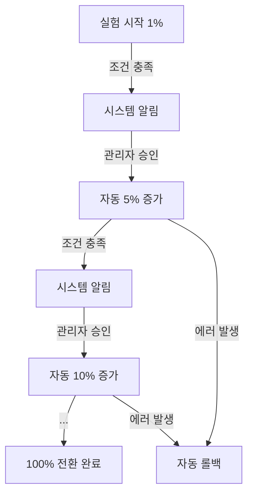
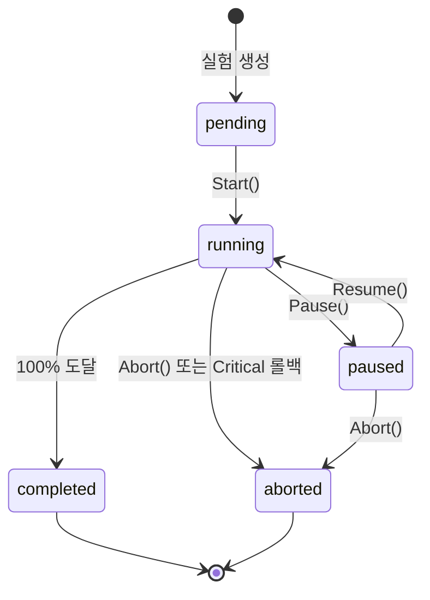

# 실험 관리 (Experiment Management)

## 문서 목적

본 문서는 ABS의 반자동 전환 실험 시스템을 정의합니다.

**포함 내용**:
- 실험 생명주기 및 상태 전이
- 단계별 트래픽 증가 전략 (1% → 5% → 10% → 25% → 50% → 100%)
- 승인 프로세스 및 안정화 기간
- 자동 롤백 조건 (Critical/Warning)
- 메트릭 수집 및 평가
- 알림 시스템 및 Kill Switch

---

## 1. 실험 개요

### 1.1 반자동 전환 시스템

**목적**: 안전하고 점진적인 Modern API 전환을 위한 자동화된 실험 관리

**핵심 개념**:
- **시스템 자동화**: 조건 모니터링, 메트릭 수집, 롤백 자동 실행
- **사람의 승인**: 각 단계 진행은 관리자 승인 필요 (안전장치)
- **API별 독립성**: 각 API 엔드포인트는 독립적인 실험 진행



### 1.2 실험 범위

**API 단위 실험**:
- 각 API 엔드포인트는 **독립적인 실험** 진행
- 예: `/api/v1/users`는 50% 진행, `/api/v1/orders`는 5% 진행
- 한 API의 실패가 다른 API에 영향 없음

**동시 실험 제한**:
- 동일 API는 **하나의 실험**만 진행 가능
- 실험 중인 API는 신규 실험 시작 불가

---

## 2. 실험 생명주기

### 2.1 실험 상태 (Experiment Status)



| 상태 | 값 | 설명 | 가능한 전이 |
|------|-----|------|------------|
| **대기** | `pending` | 실험 생성 완료, 시작 전 | → running |
| **진행 중** | `running` | 실험 진행 중 | → paused, completed, aborted |
| **일시 정지** | `paused` | 관리자가 일시 정지 | → running, aborted |
| **완료** | `completed` | 100% 전환 완료 (종료 상태) | - |
| **중단** | `aborted` | 오류 또는 관리자 요청으로 중단 (종료 상태) | - |

### 2.2 실험 생성

```go
func (s *ExperimentService) CreateExperiment(routeID string, req CreateExperimentRequest) (*Experiment, error) {
    // 1. 라우트 조회 및 검증
    route, err := s.routeRepo.FindByID(routeID)
    if err != nil {
        return nil, err
    }

    // 2. 중복 실험 확인
    if s.hasActiveExperiment(routeID) {
        return nil, errors.New("active experiment already exists for this route")
    }

    // 3. 실험 생성
    experiment := &Experiment{
        ID:                   uuid.New().String(),
        RouteID:              routeID,
        InitialPercentage:    req.InitialPercentage,      // 기본값: 1
        CurrentPercentage:    req.InitialPercentage,
        TargetPercentage:     100,
        StabilizationPeriod:  req.StabilizationPeriod,    // 기본값: 3600초 (1시간)
        Status:               ExperimentStatusPending,
        CurrentStage:         1,
        TotalStages:          6,  // 1→5→10→25→50→100
        CreatedAt:            time.Now().UTC(),
        UpdatedAt:            time.Now().UTC(),
    }

    // 4. 실험 저장
    if err := s.experimentRepo.Create(experiment); err != nil {
        return nil, err
    }

    return experiment, nil
}
```

**요청 예시**:
```json
POST /abs/api/v1/routes/{route_id}/experiments
{
    "initialPercentage": 1,
    "stabilizationPeriod": 3600
}
```

### 2.3 실험 시작

```go
func (e *Experiment) Start() error {
    // 1. 상태 검증
    if e.Status != ExperimentStatusPending {
        return errors.New("experiment must be in pending status")
    }

    // 2. 상태 전이
    e.Status = ExperimentStatusRunning
    e.CurrentPercentage = e.InitialPercentage
    e.StartedAt = timePtr(time.Now().UTC())
    e.UpdatedAt = time.Now().UTC()

    return nil
}
```

**시작 시 동작**:
1. 라우트를 Canary 모드로 전환
2. CanaryPercentage를 InitialPercentage로 설정
3. 첫 번째 ExperimentStage 생성
4. 메트릭 수집 시작

### 2.4 실험 일시 정지/재개

```go
func (e *Experiment) Pause() error {
    if e.Status != ExperimentStatusRunning {
        return errors.New("only running experiment can be paused")
    }

    e.Status = ExperimentStatusPaused
    e.UpdatedAt = time.Now().UTC()
    return nil
}

func (e *Experiment) Resume() error {
    if e.Status != ExperimentStatusPaused {
        return errors.New("only paused experiment can be resumed")
    }

    e.Status = ExperimentStatusRunning
    e.UpdatedAt = time.Now().UTC()
    return nil
}
```

**일시 정지 효과**:
- 현재 트래픽 비율 유지
- 다음 단계 자동 진행 중단
- 메트릭 수집은 계속
- 롤백 조건 모니터링 계속

### 2.5 실험 중단

```go
func (e *Experiment) Abort(reason string) error {
    // 1. 종료 상태는 중단 불가
    if e.Status == ExperimentStatusCompleted || e.Status == ExperimentStatusAborted {
        return errors.New("cannot abort terminated experiment")
    }

    // 2. 상태 전이
    e.Status = ExperimentStatusAborted
    e.AbortedReason = reason
    e.UpdatedAt = time.Now().UTC()

    return nil
}
```

**중단 시나리오**:
1. **관리자 수동 중단**: Kill Switch 사용
2. **Critical 롤백**: 에러율 > 1% 또는 응답 시간 > Legacy × 2.0
3. **실험 오류**: 시스템 오류로 진행 불가

**중단 후 조치**:
- 라우트를 Validation 모드로 복귀 (0% Modern)
- 긴급 알림 발송
- 롤백 이유 상세 로깅

---

## 3. 단계별 트래픽 증가

### 3.1 단계 정의

| 단계 | 트래픽 비율 | 최소 요청 수 | 안정화 기간 | 설명 |
|------|-------------|--------------|-------------|------|
| 1 | 1% → 5% | 100 | 1시간 | 초기 검증 |
| 2 | 5% → 10% | 500 | 1시간 | 소규모 트래픽 검증 |
| 3 | 10% → 25% | 1,000 | 1시간 | 중규모 트래픽 검증 |
| 4 | 25% → 50% | 5,000 | 1시간 | 대규모 트래픽 검증 |
| 5 | 50% → 100% | 10,000 | 1시간 | 완전 전환 전 최종 검증 |
| 6 | 100% | - | - | 전환 완료 |

**트래픽 비율 증가 전략**:
- 초기에는 작은 증가폭 (1% → 5%)
- 점진적으로 증가폭 확대 (10% → 25% → 50%)
- 마지막은 100% 완전 전환

### 3.2 ExperimentStage 생성

```go
func (s *ExperimentService) createStage(experimentID string, stage int, percentage int) (*ExperimentStage, error) {
    // 최소 요청 수 매핑
    minRequests := map[int]int{
        1: 100,
        2: 500,
        3: 1000,
        4: 5000,
        5: 10000,
    }

    experimentStage := &ExperimentStage{
        ID:                   uuid.New().String(),
        ExperimentID:         experimentID,
        Stage:                stage,
        TrafficPercentage:    percentage,
        MinRequests:          minRequests[stage],
        TotalRequests:        0,
        MatchRate:            0.0,
        ErrorRate:            0.0,
        LegacyAvgResponseTime:  0,
        ModernAvgResponseTime:  0,
        StartedAt:            time.Now().UTC(),
    }

    return s.stageRepo.Create(experimentStage)
}
```

### 3.3 단계 진행 조건

```go
func (es *ExperimentStage) CanProceedToNextStage(stabilizationPeriod int) bool {
    // 1. 안정화 기간 경과
    if !es.isStabilizationPeriodElapsed(stabilizationPeriod) {
        return false
    }

    // 2. 최소 요청 수 충족
    if es.TotalRequests < int64(es.MinRequests) {
        return false
    }

    // 3. 일치율 ≥ 99.9%
    if es.MatchRate < 99.9 {
        return false
    }

    // 4. 에러율 < 0.1%
    if es.ErrorRate >= 0.1 {
        return false
    }

    // 5. 응답 시간 ≤ Legacy × 1.2
    if es.ModernAvgResponseTime > int64(float64(es.LegacyAvgResponseTime) * 1.2) {
        return false
    }

    return true
}

func (es *ExperimentStage) isStabilizationPeriodElapsed(period int) bool {
    elapsed := time.Since(es.StartedAt).Seconds()
    return elapsed >= float64(period)
}
```

**조건 충족 시 동작**:
1. 관리자에게 알림 발송
2. 대시보드에 승인 대기 표시
3. 자동 진행은 **하지 않음** (승인 대기)

---

## 4. 승인 프로세스

### 4.1 승인 API

```go
func (s *ExperimentService) ApproveNextStage(experimentID string, approvedBy string) error {
    // 1. 실험 조회
    experiment, err := s.experimentRepo.FindByID(experimentID)
    if err != nil {
        return err
    }

    // 2. 상태 검증
    if experiment.Status != ExperimentStatusRunning {
        return errors.New("experiment is not running")
    }

    // 3. 현재 단계 조회
    currentStage, err := s.stageRepo.FindByExperimentAndStage(experimentID, experiment.CurrentStage)
    if err != nil {
        return err
    }

    // 4. 진행 조건 확인
    if !currentStage.CanProceedToNextStage(experiment.StabilizationPeriod) {
        return errors.New("conditions not met for next stage")
    }

    // 5. 현재 단계 완료 처리
    currentStage.Complete(approvedBy)
    s.stageRepo.Update(currentStage)

    // 6. 다음 트래픽 비율 계산
    nextPercentage := s.getNextPercentage(experiment.CurrentPercentage)

    // 7. 실험 업데이트
    experiment.Approve(approvedBy, nextPercentage)
    s.experimentRepo.Update(experiment)

    // 8. 라우트 Canary 비율 업데이트
    route, _ := s.routeRepo.FindByID(experiment.RouteID)
    route.CanaryPercentage = nextPercentage
    s.routeRepo.Update(route)

    // 9. 100% 도달 시 완료 처리
    if nextPercentage == 100 {
        experiment.Status = ExperimentStatusCompleted
        route.OperationMode = OperationModeSwitched
        s.routeRepo.Update(route)
    } else {
        // 10. 다음 단계 생성
        s.createStage(experimentID, experiment.CurrentStage, nextPercentage)
    }

    return nil
}
```

**트래픽 비율 계산**:
```go
func (s *ExperimentService) getNextPercentage(current int) int {
    stages := []int{1, 5, 10, 25, 50, 100}

    for _, stage := range stages {
        if current < stage {
            return stage
        }
    }

    return 100
}
```

**승인 요청 예시**:
```json
POST /abs/api/v1/experiments/{experiment_id}/approve
{
    "approvedBy": "admin@example.com",
    "comment": "메트릭 확인 완료, 다음 단계 진행"
}
```

### 4.2 승인 권한

```go
type ApprovalPolicy struct {
    RequireAdminRole bool
    RequireTwoFactorAuth bool
    AllowedApprovers []string
}

func (s *ExperimentService) CanApprove(userID string, experimentID string) bool {
    // 1. 관리자 권한 확인
    if s.policy.RequireAdminRole && !s.isAdmin(userID) {
        return false
    }

    // 2. 허용된 승인자 목록 확인
    if len(s.policy.AllowedApprovers) > 0 {
        if !contains(s.policy.AllowedApprovers, userID) {
            return false
        }
    }

    // 3. 2FA 인증 확인 (선택사항)
    if s.policy.RequireTwoFactorAuth && !s.isTwoFactorAuthenticated(userID) {
        return false
    }

    return true
}
```

### 4.3 감사 로그

```go
type ApprovalAuditLog struct {
    ID               string
    ExperimentID     string
    Stage            int
    ApprovedBy       string
    ApprovedAt       time.Time
    FromPercentage   int
    ToPercentage     int
    Metrics          StageMetrics
    Comment          string
}

func (s *ExperimentService) recordApproval(experiment *Experiment, stage *ExperimentStage, approvedBy string) {
    log := &ApprovalAuditLog{
        ID:             uuid.New().String(),
        ExperimentID:   experiment.ID,
        Stage:          stage.Stage,
        ApprovedBy:     approvedBy,
        ApprovedAt:     time.Now().UTC(),
        FromPercentage: experiment.CurrentPercentage,
        ToPercentage:   s.getNextPercentage(experiment.CurrentPercentage),
        Metrics: StageMetrics{
            MatchRate:            stage.MatchRate,
            ErrorRate:            stage.ErrorRate,
            TotalRequests:        stage.TotalRequests,
            LegacyAvgResponseTime: stage.LegacyAvgResponseTime,
            ModernAvgResponseTime: stage.ModernAvgResponseTime,
        },
        Comment: "Stage approved",
    }

    s.auditRepo.Create(log)
}
```

---

## 5. 자동 롤백 시스템

### 5.1 롤백 조건 분류

#### 5.1.1 즉시 롤백 (Critical)

**자동 롤백 조건**:
```go
func (es *ExperimentStage) ShouldRollback() (bool, string) {
    // 1. 에러율 > 1%
    if es.ErrorRate > 1.0 {
        return true, fmt.Sprintf("Error rate too high: %.2f%%", es.ErrorRate)
    }

    // 2. 응답 시간 > Legacy × 2.0
    if es.ModernAvgResponseTime > es.LegacyAvgResponseTime * 2 {
        return true, fmt.Sprintf(
            "Response time too slow: Modern %dms vs Legacy %dms",
            es.ModernAvgResponseTime,
            es.LegacyAvgResponseTime,
        )
    }

    return false, ""
}
```

**롤백 동작**:
- 즉시 이전 안정 단계로 복귀
- 실험 상태를 `aborted`로 변경
- 긴급 알림 발송 (Slack + Email)
- 상세 메트릭 및 이유 로깅

#### 5.1.2 경고 후 롤백 (Warning)

**경고 조건**:
```go
func (es *ExperimentStage) ShouldWarnRollback() (bool, string) {
    // 1. 일치율 < 99.5%
    if es.MatchRate < 99.5 {
        return true, fmt.Sprintf("Match rate below threshold: %.2f%%", es.MatchRate)
    }

    // 2. 에러율 > 0.5%
    if es.ErrorRate > 0.5 {
        return true, fmt.Sprintf("Error rate elevated: %.2f%%", es.ErrorRate)
    }

    // 3. 응답 시간 > Legacy × 1.5
    if es.ModernAvgResponseTime > int64(float64(es.LegacyAvgResponseTime) * 1.5) {
        return true, fmt.Sprintf(
            "Response time degraded: Modern %dms vs Legacy %dms",
            es.ModernAvgResponseTime,
            es.LegacyAvgResponseTime,
        )
    }

    return false, ""
}
```

**경고 동작**:
- Slack 경고 알림 발송
- 대시보드에 경고 표시
- **5분간 지속 시 자동 롤백**
- 일시적 이상이면 자동 해제

**경고 상태 추적**:
```go
type WarningTracker struct {
    ExperimentID string
    WarningType  string
    StartedAt    time.Time
    IsActive     bool
}

func (s *ExperimentService) monitorWarnings() {
    for _, tracker := range s.activeWarnings {
        // 경고 지속 시간 확인
        duration := time.Since(tracker.StartedAt)

        if duration > 5*time.Minute {
            // 5분 지속 → 자동 롤백
            s.rollbackExperiment(tracker.ExperimentID, tracker.WarningType)
        }
    }
}
```

### 5.2 롤백 알고리즘

```go
func (s *ExperimentService) RollbackExperiment(experimentID string, reason string) error {
    // 1. 실험 조회
    experiment, err := s.experimentRepo.FindByID(experimentID)
    if err != nil {
        return err
    }

    // 2. 이전 안정 단계 찾기
    previousStage := s.findLastStableStage(experimentID)
    if previousStage == nil {
        // 이전 안정 단계 없음 → Validation 모드로 복귀
        previousStage = &ExperimentStage{TrafficPercentage: 0}
    }

    // 3. 실험 중단
    experiment.Abort(reason)
    s.experimentRepo.Update(experiment)

    // 4. 라우트 복원
    route, _ := s.routeRepo.FindByID(experiment.RouteID)

    if previousStage.TrafficPercentage == 0 {
        route.OperationMode = OperationModeValidation
        route.CanaryPercentage = 0
    } else {
        route.OperationMode = OperationModeCanary
        route.CanaryPercentage = previousStage.TrafficPercentage
    }

    s.routeRepo.Update(route)

    // 5. 현재 단계에 롤백 기록
    currentStage, _ := s.stageRepo.FindByExperimentAndStage(experimentID, experiment.CurrentStage)
    currentStage.Rollback(reason)
    s.stageRepo.Update(currentStage)

    // 6. 긴급 알림 발송
    s.notificationService.SendCriticalAlert(
        fmt.Sprintf("Experiment %s rolled back: %s", experimentID, reason),
        route,
        currentStage,
    )

    return nil
}

func (s *ExperimentService) findLastStableStage(experimentID string) *ExperimentStage {
    stages, _ := s.stageRepo.FindByExperiment(experimentID)

    // 역순으로 완료된 단계 찾기
    for i := len(stages) - 1; i >= 0; i-- {
        if stages[i].ApprovedAt != nil && !stages[i].IsRollback {
            return stages[i]
        }
    }

    return nil
}
```

### 5.3 롤백 모니터링

```go
// 백그라운드 고루틴으로 지속 모니터링
func (s *ExperimentService) StartRollbackMonitor() {
    ticker := time.NewTicker(10 * time.Second)

    go func() {
        for range ticker.C {
            // 진행 중인 모든 실험 조회
            experiments, _ := s.experimentRepo.FindByStatus(ExperimentStatusRunning)

            for _, exp := range experiments {
                stage, _ := s.stageRepo.FindByExperimentAndStage(exp.ID, exp.CurrentStage)

                // Critical 롤백 확인
                if shouldRollback, reason := stage.ShouldRollback(); shouldRollback {
                    log.Error("Critical rollback triggered", "experiment", exp.ID, "reason", reason)
                    s.RollbackExperiment(exp.ID, reason)
                    continue
                }

                // Warning 롤백 확인
                if shouldWarn, reason := stage.ShouldWarnRollback(); shouldWarn {
                    s.handleWarning(exp.ID, reason)
                }
            }
        }
    }()
}
```

---

## 6. 메트릭 수집

### 6.1 실시간 메트릭 수집

```go
func (s *ExperimentService) RecordRequest(routeID string, isMatch bool, legacyTime, modernTime int64, isError bool) {
    // 1. 진행 중인 실험 확인
    experiment, err := s.experimentRepo.FindActiveByRoute(routeID)
    if err != nil {
        return  // 진행 중인 실험 없음
    }

    // 2. 현재 단계 조회
    stage, err := s.stageRepo.FindByExperimentAndStage(experiment.ID, experiment.CurrentStage)
    if err != nil {
        return
    }

    // 3. 메트릭 업데이트 (원자적 연산)
    s.stageRepo.UpdateMetrics(stage.ID, StageMetricsUpdate{
        IncrementTotalRequests: 1,
        IncrementMatchedRequests: boolToInt(isMatch),
        IncrementErrorRequests: boolToInt(isError),
        AddLegacyResponseTime: legacyTime,
        AddModernResponseTime: modernTime,
    })
}
```

**DB 원자적 업데이트**:
```sql
UPDATE experiment_stages SET
    total_requests = total_requests + 1,
    matched_requests = matched_requests + :is_match,
    error_requests = error_requests + :is_error,
    legacy_total_response_time = legacy_total_response_time + :legacy_time,
    modern_total_response_time = modern_total_response_time + :modern_time,
    match_rate = (matched_requests::float / total_requests) * 100,
    error_rate = (error_requests::float / total_requests) * 100,
    legacy_avg_response_time = legacy_total_response_time / total_requests,
    modern_avg_response_time = modern_total_response_time / total_requests
WHERE id = :stage_id;
```

### 6.2 집계 메트릭

```go
type StageMetrics struct {
    TotalRequests         int64
    MatchedRequests       int64
    ErrorRequests         int64
    MatchRate             float64
    ErrorRate             float64
    LegacyAvgResponseTime int64
    ModernAvgResponseTime int64
    P50ResponseTime       int64
    P95ResponseTime       int64
    P99ResponseTime       int64
}

func (s *ExperimentService) CalculateStageMetrics(stageID string) (*StageMetrics, error) {
    // 1. 기본 메트릭 조회
    stage, err := s.stageRepo.FindByID(stageID)
    if err != nil {
        return nil, err
    }

    // 2. Percentile 계산 (Redis에서 응답 시간 히스토그램 조회)
    p50, p95, p99 := s.calculatePercentiles(stageID)

    return &StageMetrics{
        TotalRequests:         stage.TotalRequests,
        MatchedRequests:       stage.MatchedRequests,
        ErrorRequests:         stage.ErrorRequests,
        MatchRate:             stage.MatchRate,
        ErrorRate:             stage.ErrorRate,
        LegacyAvgResponseTime: stage.LegacyAvgResponseTime,
        ModernAvgResponseTime: stage.ModernAvgResponseTime,
        P50ResponseTime:       p50,
        P95ResponseTime:       p95,
        P99ResponseTime:       p99,
    }, nil
}
```

---

## 7. 알림 시스템

### 7.1 알림 유형

| 이벤트 | 심각도 | 채널 | 설명 |
|--------|--------|------|------|
| 조건 충족 (다음 단계 준비) | Info | Slack | 승인 대기 알림 |
| 실험 완료 (100% 전환) | Info | Slack, Email | 전환 완료 알림 |
| Warning 조건 발생 | Warning | Slack | 경고 알림 (5분 지속 시 롤백) |
| Critical 롤백 | Critical | Slack, Email, SMS | 긴급 롤백 알림 |
| 실험 중단 (관리자) | Info | Slack | 수동 중단 알림 |

### 7.2 승인 대기 알림

```go
func (s *NotificationService) SendApprovalReadyNotification(experiment *Experiment, stage *ExperimentStage) {
    message := fmt.Sprintf(`
🎯 *실험 승인 대기*

*Route*: %s (%s)
*현재 단계*: %d/%d (%d%% → %d%%)
*상태*: 조건 충족 ✓

*메트릭*:
- 일치율: %.2f%%
- 에러율: %.2f%%
- 총 요청: %d개
- 응답 시간: Modern %dms vs Legacy %dms

*승인 링크*: %s
`,
        experiment.Route.Path,
        experiment.Route.Method,
        experiment.CurrentStage,
        experiment.TotalStages,
        experiment.CurrentPercentage,
        s.getNextPercentage(experiment.CurrentPercentage),
        stage.MatchRate,
        stage.ErrorRate,
        stage.TotalRequests,
        stage.ModernAvgResponseTime,
        stage.LegacyAvgResponseTime,
        s.getApprovalURL(experiment.ID),
    )

    s.slack.Send(message)
}
```

**원클릭 승인 링크**:
```
https://abs-dashboard/experiments/{experiment_id}/approve?token=xxx
```

### 7.3 롤백 알림

```go
func (s *NotificationService) SendCriticalAlert(message string, route *Route, stage *ExperimentStage) {
    alert := fmt.Sprintf(`
🚨 *긴급 롤백 발생*

*Route*: %s (%s)
*이유*: %s

*현재 메트릭*:
- 일치율: %.2f%%
- 에러율: %.2f%%
- 응답 시간: Modern %dms vs Legacy %dms

*조치*: 이전 안정 단계로 자동 복귀
*상세*: %s
`,
        route.Path,
        route.Method,
        message,
        stage.MatchRate,
        stage.ErrorRate,
        stage.ModernAvgResponseTime,
        stage.LegacyAvgResponseTime,
        s.getDashboardURL(route.ID),
    )

    // 다중 채널 발송
    s.slack.SendUrgent(alert)
    s.email.SendToAdmins(alert)
    s.sms.SendToOnCall(alert)  // 선택사항
}
```

### 7.4 알림 재발송 정책

```go
type NotificationTracker struct {
    ExperimentID string
    EventType    string
    LastSentAt   time.Time
    SentCount    int
}

func (s *NotificationService) ShouldSendNotification(experimentID, eventType string) bool {
    tracker := s.getTracker(experimentID, eventType)

    switch eventType {
    case "approval_ready":
        // 24시간마다 재알림
        return time.Since(tracker.LastSentAt) >= 24*time.Hour

    case "warning":
        // 1분마다 재알림 (최대 5회)
        return time.Since(tracker.LastSentAt) >= 1*time.Minute && tracker.SentCount < 5

    case "critical_rollback":
        // 즉시 발송 (재발송 없음)
        return tracker.SentCount == 0

    default:
        return true
    }
}
```

---

## 8. Kill Switch (긴급 중단)

### 8.1 전체 실험 중단

```go
func (s *ExperimentService) KillAllExperiments(reason string) error {
    // 1. 진행 중인 모든 실험 조회
    experiments, err := s.experimentRepo.FindByStatus(ExperimentStatusRunning)
    if err != nil {
        return err
    }

    // 2. 모든 실험 중단
    for _, exp := range experiments {
        exp.Abort(reason)
        s.experimentRepo.Update(&exp)

        // 3. 라우트를 Validation 모드로 복귀
        route, _ := s.routeRepo.FindByID(exp.RouteID)
        route.OperationMode = OperationModeValidation
        route.CanaryPercentage = 0
        s.routeRepo.Update(route)
    }

    // 4. 긴급 알림
    s.notificationService.SendGlobalAlert(
        fmt.Sprintf("All experiments killed: %s", reason),
        len(experiments),
    )

    return nil
}
```

**Kill Switch API**:
```json
POST /abs/api/v1/experiments/kill-all
{
    "reason": "Critical production issue detected",
    "authorization": "KILL_SWITCH_TOKEN"
}
```

### 8.2 특정 실험 강제 중단

```go
POST /abs/api/v1/experiments/{experiment_id}/abort
{
    "reason": "Modern API 이상 감지",
    "rollbackTo": "validation"  // 또는 "canary:10"
}
```

**rollbackTo 옵션**:
- `validation`: Validation 모드 (0%)
- `canary:N`: Canary 모드 (N%)
- `previous`: 이전 안정 단계

---

## 9. 대시보드 및 시각화

### 9.1 실험 현황 대시보드

```
┌──────────────────────────────────────────────────────────┐
│ 진행 중인 실험: /api/v1/users (GET)                       │
├──────────────────────────────────────────────────────────┤
│ 현재 단계: 3/6 (10% → 25%)                               │
│ 상태: 조건 충족 ✓ 승인 대기                              │
│                                                          │
│ 진행률: [████████░░] 50%                                │
│         1% → 5% → 10% → 25% → 50% → 100%                │
│         ✓    ✓     ✓     ⏳    ⏳    ⏳                  │
│                                                          │
│ 현재 메트릭:                                             │
│ ├─ 일치율:   99.95% ✓                                   │
│ ├─ 에러율:   0.05% ✓                                    │
│ ├─ 총 요청:  1,250 / 1,000 (최소) ✓                     │
│ ├─ 응답시간: Modern 105ms vs Legacy 110ms ✓             │
│ └─ 안정화:   3,720초 / 3,600초 ✓                        │
│                                                          │
│ [승인] [일시정지] [중단]                                 │
└──────────────────────────────────────────────────────────┘
```

### 9.2 실험 타임라인

```
┌──────────────────────────────────────────────────────────┐
│ 실험 타임라인: /api/v1/users (GET)                       │
├──────────────────────────────────────────────────────────┤
│                                                          │
│ 11/30 10:00  ● 실험 시작 (1%)                           │
│              ├─ 승인자: admin@example.com               │
│              └─ 일치율: 100%, 에러율: 0.05%             │
│                                                          │
│ 11/30 11:30  ● 5% 승인                                  │
│              ├─ 승인자: admin@example.com               │
│              ├─ 일치율: 99.98%, 에러율: 0.06%           │
│              └─ 처리: 125개 요청                        │
│                                                          │
│ 11/30 13:00  ● 10% 승인                                 │
│              ├─ 승인자: manager@example.com             │
│              ├─ 일치율: 99.95%, 에러율: 0.05%           │
│              └─ 처리: 520개 요청                        │
│                                                          │
│ 11/30 14:30  ⏳ 25% 승인 대기                           │
│              ├─ 일치율: 99.95%, 에러율: 0.05%           │
│              └─ 처리: 1,250개 요청                      │
│                                                          │
└──────────────────────────────────────────────────────────┘
```

---

## 10. 테스트 전략

### 10.1 승인 프로세스 테스트

```go
func TestExperimentApprovalFlow(t *testing.T) {
    // 1. 실험 생성
    experiment := createExperiment(t, "/api/test", "GET", 1, 3600)
    assert.Equal(t, ExperimentStatusPending, experiment.Status)

    // 2. 실험 시작
    experiment.Start()
    assert.Equal(t, ExperimentStatusRunning, experiment.Status)
    assert.Equal(t, 1, experiment.CurrentPercentage)

    // 3. 첫 번째 단계 완료 (1% → 5%)
    stage1 := getStage(t, experiment.ID, 1)
    simulateRequests(t, stage1, 100, 99.9, 0.05)  // 100개 요청, 99.9% 일치율, 0.05% 에러
    time.Sleep(1 * time.Hour)  // 안정화 기간 대기 (테스트에서는 시뮬레이션)

    assert.True(t, stage1.CanProceedToNextStage(3600))

    // 4. 승인
    approveNextStage(t, experiment.ID, "admin@example.com")
    experiment = getExperiment(t, experiment.ID)
    assert.Equal(t, 5, experiment.CurrentPercentage)
    assert.Equal(t, 2, experiment.CurrentStage)

    // 5. 반복 (5% → 10% → 25% → 50% → 100%)
    // ...

    // 6. 100% 도달 시 완료
    assert.Equal(t, ExperimentStatusCompleted, experiment.Status)
}
```

### 10.2 자동 롤백 테스트

```go
func TestCriticalRollback(t *testing.T) {
    // 1. 실험 시작 (10% 단계)
    experiment := createAndStartExperiment(t, "/api/test", "GET")
    approveToStage(t, experiment.ID, 3)  // 10% 단계까지 진행

    // 2. 에러율 급증 시뮬레이션
    stage := getStage(t, experiment.ID, 3)
    simulateRequests(t, stage, 100, 95.0, 5.0)  // 에러율 5% (임계값 1% 초과)

    // 3. 롤백 모니터 실행
    experimentService.StartRollbackMonitor()
    time.Sleep(15 * time.Second)  // 모니터링 주기 대기

    // 4. 롤백 확인
    experiment = getExperiment(t, experiment.ID)
    assert.Equal(t, ExperimentStatusAborted, experiment.Status)

    route := getRoute(t, experiment.RouteID)
    assert.Equal(t, OperationModeCanary, route.OperationMode)
    assert.Equal(t, 5, route.CanaryPercentage)  // 이전 안정 단계 (5%)로 복귀
}
```

### 10.3 경고 후 롤백 테스트

```go
func TestWarningRollback(t *testing.T) {
    // 1. 실험 시작
    experiment := createAndStartExperiment(t, "/api/test", "GET")

    // 2. Warning 조건 발생 (일치율 99.4%)
    stage := getStage(t, experiment.ID, 1)
    simulateRequests(t, stage, 100, 99.4, 0.1)  // 일치율 99.4% (임계값 99.5% 미만)

    // 3. 1분 대기 (경고 지속)
    time.Sleep(1 * time.Minute)
    assert.True(t, warningTrackerIsActive(experiment.ID))

    // 4. 5분 대기 (자동 롤백)
    time.Sleep(4 * time.Minute)
    experiment = getExperiment(t, experiment.ID)
    assert.Equal(t, ExperimentStatusAborted, experiment.Status)
}
```

---

## 11. 운영 가이드

### 11.1 실험 시작 체크리스트

- [ ] Modern API 충분히 테스트 완료
- [ ] Validation 모드에서 일치율 100% 확인
- [ ] 표본 크기 충족 (최소 100개 요청)
- [ ] 알림 채널 설정 확인 (Slack/Email)
- [ ] 관리자 승인 권한 확인
- [ ] 롤백 절차 숙지

### 11.2 승인 시 확인 사항

- [ ] 일치율 ≥ 99.9%
- [ ] 에러율 < 0.1%
- [ ] 응답 시간 ≤ Legacy × 1.2
- [ ] 최소 요청 수 충족
- [ ] 안정화 기간 경과

### 11.3 롤백 발생 시 조치

1. **원인 파악**: 로그 및 메트릭 확인
2. **Modern API 점검**: 에러 원인 분석
3. **수정 후 재시작**: 문제 해결 후 새 실험 시작
4. **보고서 작성**: 롤백 원인 및 조치 사항 문서화

---

## 12. 참고 사항

### 12.1 관련 문서

- `02-match-rate-calculation.md`: 일치율 계산 로직
- `03-routing-strategy.md`: Canary 모드 라우팅
- `docs/02-domain/01-domain-model.md`: Experiment, ExperimentStage 엔티티

### 12.2 제약사항

- 동일 API는 하나의 실험만 진행 가능
- 안정화 기간 최소 1시간 (3600초)
- 실험 완료 후 새 실험 시작 가능

---

**최종 수정일**: 2025-11-30
**작성자**: ABS 개발팀
