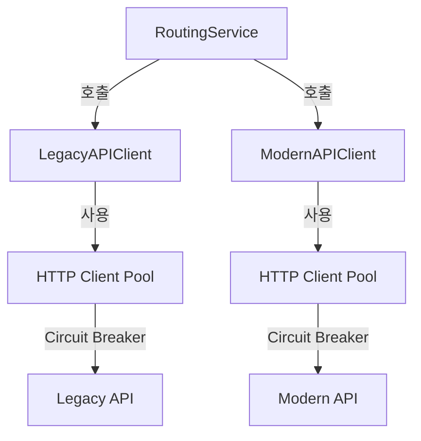

# Legacy/Modern API Client 설계

## 문서 목적

본 문서는 Legacy API와 Modern API 호출을 위한 HTTP Client 설계를 정의합니다.

**포함 내용**:
- HTTP Client 설정 (Timeout, Connection Pool)
- Retry 전략 (Exponential Backoff)
- 에러 처리 및 Circuit Breaker 통합
- 요청/응답 로깅

---

## 1. HTTP Client 개요

### 1.1 클라이언트 구조



**특징**:
- Legacy와 Modern API는 **별도의 Client 인스턴스** 사용
- 각 Client는 독립적인 Connection Pool 보유
- Circuit Breaker로 장애 격리

### 1.2 인터페이스 정의

```go
// internal/domain/port/api_client.go

type APIClient interface {
    // Do executes HTTP request
    Do(ctx context.Context, req *APIRequest) (*APIResponse, error)

    // GetMetrics returns client metrics
    GetMetrics() ClientMetrics
}

type APIRequest struct {
    Method      string
    URL         string
    QueryParams map[string]string
    Headers     map[string]string
    Body        []byte
}

type APIResponse struct {
    StatusCode   int
    Headers      map[string]string
    Body         []byte
    ResponseTime int64 // milliseconds
    Error        string
}

type ClientMetrics struct {
    TotalRequests     int64
    SuccessRequests   int64
    FailedRequests    int64
    AvgResponseTime   int64
    CircuitBreakerOpen bool
}
```

---

## 2. HTTP Client 설정

### 2.1 Connection Pool

```go
// internal/adapter/out/httpclient/client.go

func NewHTTPClient(config ClientConfig) *http.Client {
    transport := &http.Transport{
        // Connection Pool 설정
        MaxIdleConns:        100,   // 전체 최대 유휴 연결
        MaxIdleConnsPerHost: 10,    // 호스트당 최대 유휴 연결
        MaxConnsPerHost:     100,   // 호스트당 최대 총 연결
        IdleConnTimeout:     90 * time.Second,  // 유휴 연결 타임아웃

        // TCP 설정
        DialContext: (&net.Dialer{
            Timeout:   10 * time.Second,  // 연결 타임아웃
            KeepAlive: 30 * time.Second,  // Keep-Alive
        }).DialContext,

        // TLS 설정
        TLSHandshakeTimeout: 10 * time.Second,

        // HTTP/2 비활성화 (선택사항)
        ForceAttemptHTTP2: false,

        // Keep-Alive 활성화
        DisableKeepAlives: false,
    }

    return &http.Client{
        Transport: transport,
        Timeout:   config.Timeout,  // 전체 요청 타임아웃
    }
}
```

**설정값 설명**:
| 설정 | 값 | 이유 |
|------|-----|------|
| `MaxIdleConns` | 100 | 전체 유휴 연결 풀 크기 |
| `MaxIdleConnsPerHost` | 10 | 호스트당 재사용 가능한 연결 수 |
| `MaxConnsPerHost` | 100 | 호스트당 동시 연결 제한 |
| `IdleConnTimeout` | 90초 | 유휴 연결 유지 시간 |
| `DialContext.Timeout` | 10초 | TCP 연결 수립 타임아웃 |
| `KeepAlive` | 30초 | TCP Keep-Alive 간격 |

### 2.2 Timeout 설정

```go
type ClientConfig struct {
    // 전체 요청 타임아웃 (요청 전송 + 응답 수신)
    Timeout time.Duration  // 30초

    // 연결 타임아웃
    DialTimeout time.Duration  // 10초

    // TLS Handshake 타임아웃
    TLSHandshakeTimeout time.Duration  // 10초

    // 응답 헤더 읽기 타임아웃
    ResponseHeaderTimeout time.Duration  // 10초

    // Idle Connection 타임아웃
    IdleConnTimeout time.Duration  // 90초
}

// Legacy API Client 설정
var legacyClientConfig = ClientConfig{
    Timeout:               30 * time.Second,
    DialTimeout:           10 * time.Second,
    TLSHandshakeTimeout:   10 * time.Second,
    ResponseHeaderTimeout: 10 * time.Second,
    IdleConnTimeout:       90 * time.Second,
}

// Modern API Client 설정 (동일)
var modernClientConfig = ClientConfig{
    Timeout:               30 * time.Second,
    DialTimeout:           10 * time.Second,
    TLSHandshakeTimeout:   10 * time.Second,
    ResponseHeaderTimeout: 10 * time.Second,
    IdleConnTimeout:       90 * time.Second,
}
```

**타임아웃 계층**:
```
Context Timeout (30초)
└── Transport Timeout
    ├── Dial Timeout (10초)
    ├── TLS Handshake Timeout (10초)
    └── Response Header Timeout (10초)
```

---

## 3. Retry 전략

### 3.1 Exponential Backoff

```go
type RetryConfig struct {
    MaxRetries     int           // 최대 재시도 횟수
    InitialBackoff time.Duration // 초기 대기 시간
    MaxBackoff     time.Duration // 최대 대기 시간
    Multiplier     float64       // 지수 승수
    Jitter         bool          // 지터 활성화
}

var defaultRetryConfig = RetryConfig{
    MaxRetries:     3,
    InitialBackoff: 100 * time.Millisecond,
    MaxBackoff:     10 * time.Second,
    Multiplier:     2.0,
    Jitter:         true,
}

func (c *HTTPClient) doWithRetry(ctx context.Context, req *APIRequest) (*APIResponse, error) {
    var lastErr error

    for attempt := 0; attempt <= c.retryConfig.MaxRetries; attempt++ {
        // 재시도 전 대기
        if attempt > 0 {
            backoff := c.calculateBackoff(attempt)
            select {
            case <-time.After(backoff):
            case <-ctx.Done():
                return nil, ctx.Err()
            }
        }

        // 요청 실행
        resp, err := c.do(ctx, req)

        // 성공 시 즉시 반환
        if err == nil && !c.isRetryable(resp) {
            return resp, nil
        }

        // 재시도 불가능한 에러
        if err != nil && !c.isRetryableError(err) {
            return nil, err
        }

        lastErr = err

        // 로그 기록
        c.logger.Warn("Request failed, retrying",
            "attempt", attempt+1,
            "max_retries", c.retryConfig.MaxRetries,
            "error", err,
        )
    }

    return nil, fmt.Errorf("max retries exceeded: %w", lastErr)
}

func (c *HTTPClient) calculateBackoff(attempt int) time.Duration {
    // Exponential Backoff: initialBackoff * (multiplier ^ attempt)
    backoff := float64(c.retryConfig.InitialBackoff) * math.Pow(c.retryConfig.Multiplier, float64(attempt-1))

    // Max Backoff 제한
    if backoff > float64(c.retryConfig.MaxBackoff) {
        backoff = float64(c.retryConfig.MaxBackoff)
    }

    // Jitter 적용 (±25% 랜덤)
    if c.retryConfig.Jitter {
        jitter := backoff * 0.25
        backoff = backoff - jitter + (rand.Float64() * jitter * 2)
    }

    return time.Duration(backoff)
}
```

**Backoff 계산 예시**:
```
Attempt 1: 100ms * 2^0 = 100ms  (± 25ms jitter)
Attempt 2: 100ms * 2^1 = 200ms  (± 50ms jitter)
Attempt 3: 100ms * 2^2 = 400ms  (± 100ms jitter)
Attempt 4: 100ms * 2^3 = 800ms  (± 200ms jitter)
```

### 3.2 재시도 가능 조건

```go
func (c *HTTPClient) isRetryableError(err error) bool {
    // Context 취소/타임아웃은 재시도 불가
    if errors.Is(err, context.Canceled) || errors.Is(err, context.DeadlineExceeded) {
        return false
    }

    // 네트워크 에러는 재시도 가능
    var netErr net.Error
    if errors.As(err, &netErr) {
        return netErr.Temporary() || netErr.Timeout()
    }

    // DNS 에러는 재시도 가능
    var dnsErr *net.DNSError
    if errors.As(err, &dnsErr) {
        return dnsErr.Temporary()
    }

    return false
}

func (c *HTTPClient) isRetryable(resp *APIResponse) bool {
    // HTTP 상태 코드 기반 재시도 판단
    switch resp.StatusCode {
    case 408: // Request Timeout
        return true
    case 429: // Too Many Requests
        return true
    case 500: // Internal Server Error
        return true
    case 502: // Bad Gateway
        return true
    case 503: // Service Unavailable
        return true
    case 504: // Gateway Timeout
        return true
    default:
        return false
    }
}
```

**재시도 규칙**:
| 상황 | 재시도 | 이유 |
|------|--------|------|
| 네트워크 타임아웃 | ✓ | 일시적 장애 가능 |
| DNS 에러 | ✓ | 일시적 장애 가능 |
| 5xx 에러 | ✓ | 서버 재시작/일시적 장애 |
| 429 Too Many Requests | ✓ | Rate Limit 대기 |
| 4xx 에러 (400, 404 등) | ✗ | 클라이언트 오류, 재시도 무의미 |
| Context 취소 | ✗ | 사용자 취소 |

---

## 4. 에러 처리

### 4.1 에러 분류

```go
type ErrorType int

const (
    ErrorTypeNetwork ErrorType = iota  // 네트워크 에러
    ErrorTypeTimeout                   // 타임아웃
    ErrorTypeHTTP                      // HTTP 에러 (4xx, 5xx)
    ErrorTypeCircuitBreaker            // Circuit Breaker Open
    ErrorTypeUnknown                   // 알 수 없는 에러
)

type ClientError struct {
    Type       ErrorType
    Message    string
    StatusCode int        // HTTP 에러 시
    Err        error      // 원본 에러
}

func (e *ClientError) Error() string {
    return fmt.Sprintf("[%s] %s", e.TypeString(), e.Message)
}

func (e *ClientError) TypeString() string {
    switch e.Type {
    case ErrorTypeNetwork:
        return "NETWORK_ERROR"
    case ErrorTypeTimeout:
        return "TIMEOUT"
    case ErrorTypeHTTP:
        return "HTTP_ERROR"
    case ErrorTypeCircuitBreaker:
        return "CIRCUIT_BREAKER_OPEN"
    default:
        return "UNKNOWN_ERROR"
    }
}
```

### 4.2 에러 처리 로직

```go
func (c *HTTPClient) handleError(err error, resp *http.Response) error {
    // 1. Context 에러
    if errors.Is(err, context.DeadlineExceeded) {
        return &ClientError{
            Type:    ErrorTypeTimeout,
            Message: "request timeout",
            Err:     err,
        }
    }

    if errors.Is(err, context.Canceled) {
        return &ClientError{
            Type:    ErrorTypeNetwork,
            Message: "request canceled",
            Err:     err,
        }
    }

    // 2. 네트워크 에러
    var netErr net.Error
    if errors.As(err, &netErr) {
        if netErr.Timeout() {
            return &ClientError{
                Type:    ErrorTypeTimeout,
                Message: "network timeout",
                Err:     err,
            }
        }
        return &ClientError{
            Type:    ErrorTypeNetwork,
            Message: "network error",
            Err:     err,
        }
    }

    // 3. HTTP 에러
    if resp != nil && resp.StatusCode >= 400 {
        return &ClientError{
            Type:       ErrorTypeHTTP,
            Message:    fmt.Sprintf("HTTP %d", resp.StatusCode),
            StatusCode: resp.StatusCode,
            Err:        err,
        }
    }

    // 4. 알 수 없는 에러
    return &ClientError{
        Type:    ErrorTypeUnknown,
        Message: "unknown error",
        Err:     err,
    }
}
```

---

## 5. 요청/응답 로깅

### 5.1 로깅 구조

```go
type RequestLog struct {
    RequestID       string
    Method          string
    URL             string
    QueryParams     map[string]string
    Headers         map[string]string
    BodySize        int
    Timestamp       time.Time
}

type ResponseLog struct {
    RequestID       string
    StatusCode      int
    Headers         map[string]string
    BodySize        int
    ResponseTime    int64  // milliseconds
    Error           string
    Timestamp       time.Time
}

func (c *HTTPClient) logRequest(req *APIRequest) {
    c.logger.Debug("HTTP request",
        "request_id", req.RequestID,
        "method", req.Method,
        "url", req.URL,
        "headers", c.sanitizeHeaders(req.Headers),
        "body_size", len(req.Body),
    )
}

func (c *HTTPClient) logResponse(req *APIRequest, resp *APIResponse, err error) {
    logLevel := "info"
    if err != nil || resp.StatusCode >= 500 {
        logLevel = "error"
    } else if resp.StatusCode >= 400 {
        logLevel = "warn"
    }

    c.logger.Log(logLevel, "HTTP response",
        "request_id", req.RequestID,
        "status_code", resp.StatusCode,
        "response_time_ms", resp.ResponseTime,
        "body_size", len(resp.Body),
        "error", err,
    )
}
```

### 5.2 헤더 마스킹

```go
var sensitiveHeaders = []string{
    "Authorization",
    "Cookie",
    "Set-Cookie",
    "X-API-Key",
    "X-Auth-Token",
}

func (c *HTTPClient) sanitizeHeaders(headers map[string]string) map[string]string {
    sanitized := make(map[string]string)

    for key, value := range headers {
        if c.isSensitiveHeader(key) {
            sanitized[key] = "***MASKED***"
        } else {
            sanitized[key] = value
        }
    }

    return sanitized
}

func (c *HTTPClient) isSensitiveHeader(header string) bool {
    headerLower := strings.ToLower(header)

    for _, sensitive := range sensitiveHeaders {
        if strings.ToLower(sensitive) == headerLower {
            return true
        }
    }

    return false
}
```

---

## 6. Circuit Breaker 통합

### 6.1 Circuit Breaker 래퍼

```go
// internal/adapter/out/httpclient/circuit_breaker_client.go

type CircuitBreakerClient struct {
    client         APIClient
    circuitBreaker *circuitbreaker.CircuitBreaker
    logger         *slog.Logger
}

func NewCircuitBreakerClient(client APIClient, cb *circuitbreaker.CircuitBreaker) *CircuitBreakerClient {
    return &CircuitBreakerClient{
        client:         client,
        circuitBreaker: cb,
        logger:         slog.Default(),
    }
}

func (c *CircuitBreakerClient) Do(ctx context.Context, req *APIRequest) (*APIResponse, error) {
    // Circuit Breaker를 통해 요청 실행
    err := c.circuitBreaker.Call(func() error {
        resp, err := c.client.Do(ctx, req)

        // 응답을 context에 저장 (Circuit Breaker 콜백 외부에서 사용)
        if err == nil {
            ctx = context.WithValue(ctx, "response", resp)
        }

        return err
    })

    // Circuit Breaker Open 시
    if errors.Is(err, circuitbreaker.ErrCircuitOpen) {
        c.logger.Warn("Circuit breaker open",
            "request_id", req.RequestID,
            "url", req.URL,
        )
        return nil, &ClientError{
            Type:    ErrorTypeCircuitBreaker,
            Message: "circuit breaker open",
            Err:     err,
        }
    }

    // 에러 발생 시
    if err != nil {
        return nil, err
    }

    // 성공 시 응답 반환
    resp := ctx.Value("response").(*APIResponse)
    return resp, nil
}
```

---

## 7. 구현 예시

### 7.1 Legacy API Client

```go
// internal/adapter/out/httpclient/legacy_client.go

type LegacyAPIClient struct {
    httpClient     *http.Client
    retryConfig    RetryConfig
    circuitBreaker *circuitbreaker.CircuitBreaker
    logger         *slog.Logger
    metrics        *ClientMetrics
}

func NewLegacyAPIClient(config ClientConfig) *LegacyAPIClient {
    httpClient := NewHTTPClient(config)

    cb := circuitbreaker.NewCircuitBreaker(circuitbreaker.Config{
        MaxFailures:    5,
        Timeout:        30 * time.Second,
        ResetTimeout:   60 * time.Second,
    })

    client := &LegacyAPIClient{
        httpClient:     httpClient,
        retryConfig:    defaultRetryConfig,
        circuitBreaker: cb,
        logger:         slog.Default(),
        metrics:        &ClientMetrics{},
    }

    return NewCircuitBreakerClient(client, cb)
}

func (c *LegacyAPIClient) Do(ctx context.Context, req *APIRequest) (*APIResponse, error) {
    // 메트릭 증가
    atomic.AddInt64(&c.metrics.TotalRequests, 1)

    // 요청 로깅
    c.logRequest(req)

    // Retry와 함께 요청 실행
    startTime := time.Now()
    resp, err := c.doWithRetry(ctx, req)
    responseTime := time.Since(startTime).Milliseconds()

    // 응답 로깅
    c.logResponse(req, resp, err)

    // 메트릭 업데이트
    if err != nil {
        atomic.AddInt64(&c.metrics.FailedRequests, 1)
    } else {
        atomic.AddInt64(&c.metrics.SuccessRequests, 1)
    }

    // 평균 응답 시간 업데이트
    c.updateAvgResponseTime(responseTime)

    return resp, err
}
```

### 7.2 Modern API Client

```go
// internal/adapter/out/httpclient/modern_client.go

type ModernAPIClient struct {
    httpClient     *http.Client
    retryConfig    RetryConfig
    circuitBreaker *circuitbreaker.CircuitBreaker
    logger         *slog.Logger
    metrics        *ClientMetrics
}

func NewModernAPIClient(config ClientConfig) *ModernAPIClient {
    httpClient := NewHTTPClient(config)

    cb := circuitbreaker.NewCircuitBreaker(circuitbreaker.Config{
        MaxFailures:    5,
        Timeout:        30 * time.Second,
        ResetTimeout:   60 * time.Second,
    })

    client := &ModernAPIClient{
        httpClient:     httpClient,
        retryConfig:    defaultRetryConfig,
        circuitBreaker: cb,
        logger:         slog.Default(),
        metrics:        &ClientMetrics{},
    }

    return NewCircuitBreakerClient(client, cb)
}

// Do 메서드는 LegacyAPIClient와 동일
```

---

## 8. 메트릭 수집

### 8.1 Prometheus 메트릭

```go
var (
    // HTTP 요청 카운터
    httpRequestsTotal = prometheus.NewCounterVec(
        prometheus.CounterOpts{
            Name: "abs_http_requests_total",
            Help: "Total number of HTTP requests",
        },
        []string{"target", "method", "status"},
    )

    // HTTP 요청 지속 시간
    httpRequestDuration = prometheus.NewHistogramVec(
        prometheus.HistogramOpts{
            Name:    "abs_http_request_duration_seconds",
            Help:    "HTTP request duration",
            Buckets: prometheus.DefBuckets,
        },
        []string{"target", "method"},
    )

    // Circuit Breaker 상태
    circuitBreakerState = prometheus.NewGaugeVec(
        prometheus.GaugeOpts{
            Name: "abs_circuit_breaker_state",
            Help: "Circuit breaker state (0=closed, 1=open, 2=half-open)",
        },
        []string{"target"},
    )
)

func (c *HTTPClient) recordMetrics(target, method string, statusCode int, duration time.Duration) {
    httpRequestsTotal.WithLabelValues(target, method, fmt.Sprintf("%d", statusCode)).Inc()
    httpRequestDuration.WithLabelValues(target, method).Observe(duration.Seconds())
}
```

---

## 9. 테스트

### 9.1 단위 테스트

```go
func TestHTTPClient_Retry(t *testing.T) {
    // Mock 서버 생성 (처음 2번 실패, 3번째 성공)
    callCount := 0
    server := httptest.NewServer(http.HandlerFunc(func(w http.ResponseWriter, r *http.Request) {
        callCount++
        if callCount < 3 {
            w.WriteHeader(500)
            return
        }
        w.WriteHeader(200)
        w.Write([]byte(`{"success": true}`))
    }))
    defer server.Close()

    // Client 생성
    client := NewHTTPClient(ClientConfig{
        Timeout: 30 * time.Second,
    })

    // 요청 실행
    req := &APIRequest{
        Method: "GET",
        URL:    server.URL,
    }

    resp, err := client.Do(context.Background(), req)

    // 검증
    assert.NoError(t, err)
    assert.Equal(t, 200, resp.StatusCode)
    assert.Equal(t, 3, callCount) // 3번 시도 후 성공
}
```

---

## 10. 참고 사항

### 10.1 관련 문서

- `04-circuit-breaker.md`: Circuit Breaker 상세 설계
- `docs/04-business-logic/03-routing-strategy.md`: 라우팅 전략
- `docs/07-security/02-log-security.md`: 로그 보안

### 10.2 구현 위치

```
internal/adapter/out/httpclient/
├── client.go                 # HTTP Client 기본 구현
├── legacy_client.go          # Legacy API Client
├── modern_client.go          # Modern API Client
├── circuit_breaker_client.go # Circuit Breaker 래퍼
├── retry.go                  # Retry 로직
└── error.go                  # 에러 처리
```

---

**최종 수정일**: 2025-11-30
**작성자**: ABS 개발팀
