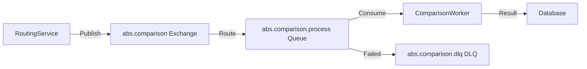

# RabbitMQ 메시징 설계

## 문서 목적

본 문서는 ABS의 RabbitMQ 메시징 시스템 설계를 정의합니다.

**포함 내용**:
- Exchange/Queue 설계
- Message 포맷
- Dead Letter Queue (DLQ) 처리
- Consumer 설계
- 장애 처리

---

## 1. RabbitMQ 개요

### 1.1 사용 목적

| 용도 | Exchange | Queue | 설명 |
|------|----------|-------|------|
| **비동기 비교** | `abs.comparison` | `abs.comparison.process` | Modern API 비교 작업 |
| **알림 발송** | `abs.notification` | `abs.notification.slack`<br>`abs.notification.email` | Slack/Email 알림 |
| **통계 집계** | `abs.stats` | `abs.stats.aggregate` | 통계 데이터 집계 |

### 1.2 아키텍처



---

## 2. Exchange 설계

### 2.1 Exchange 목록

| Exchange명 | Type | Durable | 설명 |
|------------|------|---------|------|
| `abs.comparison` | Direct | Yes | 비교 작업 Exchange |
| `abs.notification` | Topic | Yes | 알림 Exchange |
| `abs.stats` | Fanout | Yes | 통계 집계 Exchange |

#### 2.1.1 abs.comparison Exchange

```go
// Direct Exchange
exchangeName := "abs.comparison"
exchangeType := "direct"

err := ch.ExchangeDeclare(
    exchangeName,  // name
    exchangeType,  // type
    true,          // durable
    false,         // auto-deleted
    false,         // internal
    false,         // no-wait
    nil,           // arguments
)
```

**Routing Key**:
- `comparison.process`: 비교 작업
- `comparison.retry`: 재시도 작업

#### 2.1.2 abs.notification Exchange

```go
// Topic Exchange
exchangeName := "abs.notification"
exchangeType := "topic"

err := ch.ExchangeDeclare(
    exchangeName,
    exchangeType,
    true,
    false,
    false,
    false,
    nil,
)
```

**Routing Key 패턴**:
- `notification.slack.*`: Slack 알림
- `notification.email.*`: Email 알림
- `notification.*.critical`: 긴급 알림

#### 2.1.3 abs.stats Exchange

```go
// Fanout Exchange (모든 Queue에 브로드캐스트)
exchangeName := "abs.stats"
exchangeType := "fanout"

err := ch.ExchangeDeclare(
    exchangeName,
    exchangeType,
    true,
    false,
    false,
    false,
    nil,
)
```

---

## 3. Queue 설계

### 3.1 Queue 목록

| Queue명 | Exchange | Routing Key | DLQ | Consumer 수 |
|---------|----------|-------------|-----|-------------|
| `abs.comparison.process` | `abs.comparison` | `comparison.process` | Yes | 10 |
| `abs.notification.slack` | `abs.notification` | `notification.slack.*` | Yes | 3 |
| `abs.notification.email` | `abs.notification` | `notification.email.*` | Yes | 3 |
| `abs.stats.aggregate` | `abs.stats` | - | No | 1 |

### 3.2 Queue 선언 예시

```go
// abs.comparison.process Queue
queueName := "abs.comparison.process"

args := amqp.Table{
    // Message TTL (30초)
    "x-message-ttl": int32(30000),

    // Dead Letter Exchange
    "x-dead-letter-exchange": "abs.comparison.dlx",
    "x-dead-letter-routing-key": "comparison.failed",

    // Queue Length Limit
    "x-max-length": int32(100000),

    // Queue Priority (선택사항)
    "x-max-priority": int32(10),
}

queue, err := ch.QueueDeclare(
    queueName,  // name
    true,       // durable
    false,      // delete when unused
    false,      // exclusive
    false,      // no-wait
    args,       // arguments
)

// Binding
err = ch.QueueBind(
    queue.Name,              // queue name
    "comparison.process",    // routing key
    "abs.comparison",        // exchange
    false,
    nil,
)
```

---

## 4. Message 포맷

### 4.1 비교 작업 메시지

```json
{
  "message_id": "550e8400-e29b-41d4-a716-446655440000",
  "timestamp": "2025-11-30T15:30:00Z",
  "type": "comparison.process",
  "payload": {
    "route_id": "123e4567-e89b-12d3-a456-426614174000",
    "request_id": "req-12345",
    "legacy_request": {
      "method": "GET",
      "path": "/api/v1/users/123",
      "query_params": {},
      "headers": {"Content-Type": "application/json"},
      "body": null,
      "timestamp": "2025-11-30T15:30:00Z"
    },
    "legacy_response": {
      "status_code": 200,
      "headers": {"Content-Type": "application/json"},
      "body": "{\"id\":123,\"name\":\"John\"}",
      "response_time": 120,
      "timestamp": "2025-11-30T15:30:00.120Z"
    },
    "modern_request": {
      "method": "GET",
      "path": "/api/v1/users/123",
      "query_params": {},
      "headers": {"Content-Type": "application/json"},
      "body": null,
      "timestamp": "2025-11-30T15:30:00Z"
    },
    "modern_response": {
      "status_code": 200,
      "headers": {"Content-Type": "application/json"},
      "body": "{\"id\":123,\"name\":\"John\"}",
      "response_time": 115,
      "timestamp": "2025-11-30T15:30:00.115Z"
    }
  },
  "metadata": {
    "priority": 5,
    "retry_count": 0,
    "max_retries": 3
  }
}
```

### 4.2 알림 메시지

```json
{
  "message_id": "660f9511-f89b-12d3-a456-426614174000",
  "timestamp": "2025-11-30T16:00:00Z",
  "type": "notification.slack.critical",
  "payload": {
    "title": "실험 자동 롤백 발생",
    "message": "Experiment 456e7890 롤백됨: Error rate > 1%",
    "route": {
      "id": "123e4567",
      "path": "/api/v1/users",
      "method": "GET"
    },
    "experiment_id": "456e7890",
    "rollback_reason": "Error rate exceeded threshold",
    "metrics": {
      "error_rate": 1.5,
      "match_rate": 98.5
    }
  },
  "metadata": {
    "priority": 10,
    "retry_count": 0,
    "max_retries": 5
  }
}
```

---

## 5. Publisher 구현

### 5.1 Publisher 인터페이스

```go
// internal/domain/port/message_publisher.go

type MessagePublisher interface {
    // PublishComparison publishes comparison task
    PublishComparison(ctx context.Context, task *ComparisonTask) error

    // PublishNotification publishes notification
    PublishNotification(ctx context.Context, notification *Notification) error

    // PublishStats publishes stats aggregation task
    PublishStats(ctx context.Context, stats *StatsTask) error
}

type ComparisonTask struct {
    RouteID         string
    RequestID       string
    LegacyRequest   *APIRequest
    LegacyResponse  *APIResponse
    ModernRequest   *APIRequest
    ModernResponse  *APIResponse
    Priority        int
}

type Notification struct {
    Type     string  // "slack.critical", "email.warning"
    Title    string
    Message  string
    Metadata map[string]interface{}
}
```

### 5.2 RabbitMQ Publisher 구현

```go
// internal/adapter/out/messaging/rabbitmq_publisher.go

type RabbitMQPublisher struct {
    conn    *amqp.Connection
    channel *amqp.Channel
    logger  *slog.Logger
}

func NewRabbitMQPublisher(url string) (*RabbitMQPublisher, error) {
    conn, err := amqp.Dial(url)
    if err != nil {
        return nil, fmt.Errorf("failed to connect to RabbitMQ: %w", err)
    }

    ch, err := conn.Channel()
    if err != nil {
        return nil, fmt.Errorf("failed to open channel: %w", err)
    }

    publisher := &RabbitMQPublisher{
        conn:    conn,
        channel: ch,
        logger:  slog.Default(),
    }

    // Exchange 선언
    publisher.declareExchanges()

    return publisher, nil
}

func (p *RabbitMQPublisher) PublishComparison(ctx context.Context, task *ComparisonTask) error {
    // Message 구성
    message := Message{
        MessageID: uuid.New().String(),
        Timestamp: time.Now().UTC(),
        Type:      "comparison.process",
        Payload:   task,
        Metadata: MessageMetadata{
            Priority:   task.Priority,
            RetryCount: 0,
            MaxRetries: 3,
        },
    }

    body, err := json.Marshal(message)
    if err != nil {
        return err
    }

    // Publish
    err = p.channel.PublishWithContext(
        ctx,
        "abs.comparison",      // exchange
        "comparison.process",  // routing key
        false,                 // mandatory
        false,                 // immediate
        amqp.Publishing{
            ContentType:  "application/json",
            Body:         body,
            DeliveryMode: amqp.Persistent,  // 메시지 영속성
            Priority:     uint8(task.Priority),
            Timestamp:    time.Now(),
            MessageId:    message.MessageID,
        },
    )

    if err != nil {
        p.logger.Error("Failed to publish comparison task",
            "error", err,
            "route_id", task.RouteID,
        )
        return err
    }

    p.logger.Debug("Comparison task published",
        "message_id", message.MessageID,
        "route_id", task.RouteID,
    )

    return nil
}
```

---

## 6. Consumer 구현

### 6.1 Consumer 인터페이스

```go
type MessageConsumer interface {
    // Start starts consuming messages
    Start(ctx context.Context) error

    // Stop stops consuming
    Stop() error

    // GetMetrics returns consumer metrics
    GetMetrics() ConsumerMetrics
}

type ConsumerMetrics struct {
    TotalProcessed int64
    TotalFailed    int64
    TotalRetried   int64
    AvgProcessTime int64  // milliseconds
}
```

### 6.2 RabbitMQ Consumer 구현

```go
// internal/adapter/in/messaging/rabbitmq_consumer.go

type RabbitMQConsumer struct {
    conn         *amqp.Connection
    channel      *amqp.Channel
    queueName    string
    concurrency  int
    handler      MessageHandler
    logger       *slog.Logger
    metrics      *ConsumerMetrics
}

func NewRabbitMQConsumer(url, queueName string, concurrency int, handler MessageHandler) (*RabbitMQConsumer, error) {
    conn, err := amqp.Dial(url)
    if err != nil {
        return nil, err
    }

    ch, err := conn.Channel()
    if err != nil {
        return nil, err
    }

    // QoS 설정 (Prefetch)
    err = ch.Qos(
        concurrency,  // prefetch count
        0,            // prefetch size
        false,        // global
    )
    if err != nil {
        return nil, err
    }

    return &RabbitMQConsumer{
        conn:        conn,
        channel:     ch,
        queueName:   queueName,
        concurrency: concurrency,
        handler:     handler,
        logger:      slog.Default(),
        metrics:     &ConsumerMetrics{},
    }, nil
}

func (c *RabbitMQConsumer) Start(ctx context.Context) error {
    // Consume
    msgs, err := c.channel.Consume(
        c.queueName,  // queue
        "",           // consumer tag (auto-generated)
        false,        // auto-ack (수동 Ack)
        false,        // exclusive
        false,        // no-local
        false,        // no-wait
        nil,          // args
    )
    if err != nil {
        return err
    }

    c.logger.Info("Consumer started",
        "queue", c.queueName,
        "concurrency", c.concurrency,
    )

    // Worker Pool
    var wg sync.WaitGroup
    for i := 0; i < c.concurrency; i++ {
        wg.Add(1)
        go func(workerID int) {
            defer wg.Done()
            c.worker(ctx, workerID, msgs)
        }(i)
    }

    // Context 취소 대기
    <-ctx.Done()

    c.logger.Info("Consumer stopping...")
    wg.Wait()

    return nil
}

func (c *RabbitMQConsumer) worker(ctx context.Context, workerID int, msgs <-chan amqp.Delivery) {
    for {
        select {
        case <-ctx.Done():
            return

        case msg, ok := <-msgs:
            if !ok {
                return
            }

            c.processMessage(ctx, workerID, msg)
        }
    }
}

func (c *RabbitMQConsumer) processMessage(ctx context.Context, workerID int, delivery amqp.Delivery) {
    startTime := time.Now()

    c.logger.Debug("Processing message",
        "worker_id", workerID,
        "message_id", delivery.MessageId,
    )

    // Message 파싱
    var message Message
    err := json.Unmarshal(delivery.Body, &message)
    if err != nil {
        c.logger.Error("Failed to unmarshal message",
            "error", err,
            "message_id", delivery.MessageId,
        )
        // Reject & Requeue=false (DLQ로 이동)
        delivery.Nack(false, false)
        return
    }

    // Handler 실행
    err = c.handler.Handle(ctx, &message)

    if err != nil {
        c.logger.Error("Failed to process message",
            "error", err,
            "message_id", message.MessageID,
            "retry_count", message.Metadata.RetryCount,
        )

        // Retry 로직
        if message.Metadata.RetryCount < message.Metadata.MaxRetries {
            // Nack & Requeue (재시도)
            delivery.Nack(false, true)
            atomic.AddInt64(&c.metrics.TotalRetried, 1)
        } else {
            // Max retries 초과 → DLQ
            delivery.Nack(false, false)
            atomic.AddInt64(&c.metrics.TotalFailed, 1)
        }

        return
    }

    // 성공 → Ack
    delivery.Ack(false)
    atomic.AddInt64(&c.metrics.TotalProcessed, 1)

    // 처리 시간 기록
    processTime := time.Since(startTime).Milliseconds()
    c.logger.Debug("Message processed",
        "worker_id", workerID,
        "message_id", message.MessageID,
        "process_time_ms", processTime,
    )
}
```

---

## 7. Message Handler

### 7.1 Comparison Handler

```go
type ComparisonHandler struct {
    comparisonService *service.ComparisonService
    logger            *slog.Logger
}

func (h *ComparisonHandler) Handle(ctx context.Context, message *Message) error {
    // Payload 추출
    var task ComparisonTask
    payload, _ := json.Marshal(message.Payload)
    err := json.Unmarshal(payload, &task)
    if err != nil {
        return err
    }

    // 비교 수행
    comparison, err := h.comparisonService.Compare(
        ctx,
        task.RouteID,
        task.RequestID,
        task.LegacyRequest,
        task.LegacyResponse,
        task.ModernRequest,
        task.ModernResponse,
    )
    if err != nil {
        return err
    }

    // 결과 저장
    err = h.comparisonService.SaveComparison(ctx, comparison)
    if err != nil {
        return err
    }

    h.logger.Info("Comparison completed",
        "route_id", task.RouteID,
        "request_id", task.RequestID,
        "is_match", comparison.IsMatch,
    )

    return nil
}
```

---

## 8. Dead Letter Queue (DLQ)

### 8.1 DLQ 설정

```go
// DLX (Dead Letter Exchange) 선언
err := ch.ExchangeDeclare(
    "abs.comparison.dlx",  // name
    "direct",              // type
    true,                  // durable
    false,                 // auto-deleted
    false,                 // internal
    false,                 // no-wait
    nil,
)

// DLQ 선언
dlqArgs := amqp.Table{
    // DLQ 메시지 보관 기간 (7일)
    "x-message-ttl": int32(7 * 24 * 60 * 60 * 1000),
}

dlq, err := ch.QueueDeclare(
    "abs.comparison.dlq",  // name
    true,                  // durable
    false,                 // delete when unused
    false,                 // exclusive
    false,                 // no-wait
    dlqArgs,
)

// DLQ Binding
err = ch.QueueBind(
    dlq.Name,             // queue
    "comparison.failed",  // routing key
    "abs.comparison.dlx", // exchange
    false,
    nil,
)
```

### 8.2 DLQ 모니터링

```go
func (m *RabbitMQMonitor) GetDLQDepth(queueName string) (int, error) {
    queue, err := m.channel.QueueInspect(queueName)
    if err != nil {
        return 0, err
    }

    return queue.Messages, nil
}

// 알림 발송
func (m *RabbitMQMonitor) MonitorDLQ(ctx context.Context) {
    ticker := time.NewTicker(5 * time.Minute)
    defer ticker.Stop()

    for {
        select {
        case <-ctx.Done():
            return

        case <-ticker.C:
            depth, _ := m.GetDLQDepth("abs.comparison.dlq")

            if depth > 100 {
                m.sendAlert(fmt.Sprintf("DLQ depth high: %d messages", depth))
            }
        }
    }
}
```

### 8.3 DLQ 재처리

```go
func (s *AdminService) ReprocessDLQMessages(queueName string, limit int) error {
    dlqName := queueName + ".dlq"

    // DLQ에서 메시지 가져오기
    for i := 0; i < limit; i++ {
        delivery, ok, err := s.channel.Get(dlqName, false)
        if err != nil || !ok {
            break
        }

        // 원본 Queue로 재발행
        err = s.channel.Publish(
            "abs.comparison",
            "comparison.process",
            false,
            false,
            amqp.Publishing{
                ContentType:  delivery.ContentType,
                Body:         delivery.Body,
                DeliveryMode: amqp.Persistent,
            },
        )

        if err != nil {
            delivery.Nack(false, true)  // 다시 DLQ로
            continue
        }

        // DLQ에서 제거
        delivery.Ack(false)
    }

    return nil
}
```

---

## 9. 장애 처리

### 9.1 연결 재시도

```go
func (p *RabbitMQPublisher) connectWithRetry(url string, maxRetries int) (*amqp.Connection, error) {
    var conn *amqp.Connection
    var err error

    for attempt := 0; attempt < maxRetries; attempt++ {
        conn, err = amqp.Dial(url)
        if err == nil {
            return conn, nil
        }

        backoff := time.Duration(math.Pow(2, float64(attempt))) * time.Second
        p.logger.Warn("Failed to connect to RabbitMQ, retrying",
            "attempt", attempt+1,
            "backoff", backoff,
            "error", err,
        )

        time.Sleep(backoff)
    }

    return nil, fmt.Errorf("failed to connect after %d attempts: %w", maxRetries, err)
}
```

### 9.2 Connection/Channel 재연결

```go
func (p *RabbitMQPublisher) handleConnectionClosure() {
    for {
        reason, ok := <-p.conn.NotifyClose(make(chan *amqp.Error))
        if !ok {
            break
        }

        p.logger.Error("RabbitMQ connection closed", "reason", reason)

        // 재연결 시도
        for {
            conn, err := p.connectWithRetry(p.url, 5)
            if err != nil {
                time.Sleep(5 * time.Second)
                continue
            }

            p.conn = conn
            p.channel, _ = conn.Channel()
            p.logger.Info("RabbitMQ reconnected")
            break
        }
    }
}
```

---

## 10. 메트릭 및 모니터링

### 10.1 Prometheus 메트릭

```go
var (
    // 발행된 메시지 수
    messagesPublished = prometheus.NewCounterVec(
        prometheus.CounterOpts{
            Name: "abs_rabbitmq_messages_published_total",
            Help: "Total number of messages published",
        },
        []string{"exchange", "routing_key"},
    )

    // 처리된 메시지 수
    messagesProcessed = prometheus.NewCounterVec(
        prometheus.CounterOpts{
            Name: "abs_rabbitmq_messages_processed_total",
            Help: "Total number of messages processed",
        },
        []string{"queue", "status"},  // status: success, failed, retried
    )

    // Queue 깊이
    queueDepth = prometheus.NewGaugeVec(
        prometheus.GaugeOpts{
            Name: "abs_rabbitmq_queue_depth",
            Help: "Current queue depth",
        },
        []string{"queue"},
    )

    // 메시지 처리 시간
    messageProcessTime = prometheus.NewHistogramVec(
        prometheus.HistogramOpts{
            Name:    "abs_rabbitmq_message_process_seconds",
            Help:    "Message processing time",
            Buckets: []float64{0.01, 0.05, 0.1, 0.5, 1.0, 5.0},
        },
        []string{"queue"},
    )
)
```

---

## 11. 참고 사항

### 11.1 관련 문서

- `01-legacy-modern-client.md`: HTTP Client 설계
- `docs/04-business-logic/01-comparison-logic.md`: 비교 로직

### 11.2 구현 위치

```
internal/adapter/
├── out/messaging/
│   └── rabbitmq_publisher.go
└── in/messaging/
    ├── rabbitmq_consumer.go
    └── handlers/
        ├── comparison_handler.go
        └── notification_handler.go
```

---

**최종 수정일**: 2025-11-30
**작성자**: ABS 개발팀
