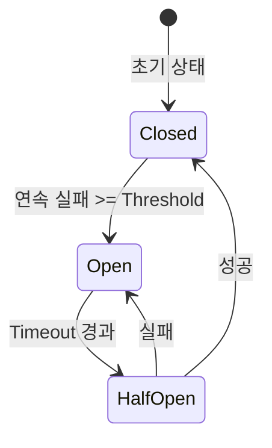

# Circuit Breaker 설계

## 문서 목적

본 문서는 ABS의 Circuit Breaker 패턴 구현을 정의합니다.

**포함 내용**:
- Circuit Breaker 개념 및 상태
- 설정값 (Threshold, Timeout)
- Fallback 전략
- 모니터링 및 알림

---

## 1. Circuit Breaker 개요

### 1.1 개념

Circuit Breaker는 외부 서비스 장애 시 **연쇄 장애(Cascading Failure)를 방지**하는 패턴입니다.



**상태 설명**:
| 상태 | 설명 | 요청 처리 |
|------|------|-----------|
| **Closed** | 정상 상태 | 모든 요청 허용 |
| **Open** | 장애 상태 | 모든 요청 즉시 실패 (Fallback) |
| **Half-Open** | 회복 시도 | 일부 요청 허용하여 테스트 |

### 1.2 적용 대상

| 대상 | Circuit Breaker | 설정 |
|------|----------------|------|
| **Legacy API** | ✓ | MaxFailures: 5, Timeout: 60초 |
| **Modern API** | ✓ | MaxFailures: 5, Timeout: 60초 |
| **Redis** | ✓ | MaxFailures: 3, Timeout: 30초 |
| **RabbitMQ** | ✗ | - |
| **OracleDB** | ✗ | - (Connection Pool에서 처리) |

---

## 2. Circuit Breaker 상태

### 2.1 Closed 상태 (정상)

```go
type ClosedState struct {
    consecutiveFailures int
    lastFailureTime     time.Time
}

func (s *ClosedState) Call(fn func() error) error {
    err := fn()

    if err != nil {
        s.consecutiveFailures++
        s.lastFailureTime = time.Now()

        // Threshold 초과 → Open 전이
        if s.consecutiveFailures >= MaxFailures {
            return ErrTransitionToOpen
        }

        return err
    }

    // 성공 시 카운터 초기화
    s.consecutiveFailures = 0
    return nil
}
```

**특징**:
- 모든 요청 허용
- 실패 카운트 추적
- 연속 실패 >= Threshold → Open 전이

### 2.2 Open 상태 (장애)

```go
type OpenState struct {
    openedAt time.Time
    timeout  time.Duration
}

func (s *OpenState) Call(fn func() error) error {
    // Timeout 경과 확인
    if time.Since(s.openedAt) >= s.timeout {
        return ErrTransitionToHalfOpen
    }

    // 즉시 실패 (fn 실행하지 않음)
    return ErrCircuitOpen
}
```

**특징**:
- 모든 요청 즉시 실패
- 외부 서비스 호출하지 않음 (부하 차단)
- Timeout 경과 → Half-Open 전이

### 2.3 Half-Open 상태 (회복 시도)

```go
type HalfOpenState struct {
    successCount        int
    failureCount        int
    requiredSuccesses   int
}

func (s *HalfOpenState) Call(fn func() error) error {
    err := fn()

    if err != nil {
        s.failureCount++
        return ErrTransitionToOpen  // 즉시 Open으로 복귀
    }

    s.successCount++

    // 필요한 성공 횟수 달성 → Closed 전이
    if s.successCount >= s.requiredSuccesses {
        return ErrTransitionToClosed
    }

    return nil
}
```

**특징**:
- 일부 요청 허용 (테스트용)
- 1회 실패 시 → 즉시 Open
- N회 성공 시 → Closed

---

## 3. Circuit Breaker 설정

### 3.1 설정값

```go
type CircuitBreakerConfig struct {
    // Closed → Open 전환 조건
    MaxFailures int  // 연속 실패 임계값

    // Open → Half-Open 전환 조건
    Timeout time.Duration  // Open 상태 지속 시간

    // Half-Open → Closed 전환 조건
    RequiredSuccesses int  // 필요한 연속 성공 횟수

    // Half-Open 상태에서 허용할 요청 수
    HalfOpenMaxRequests int
}

// Legacy API Circuit Breaker
var legacyCBConfig = CircuitBreakerConfig{
    MaxFailures:         5,
    Timeout:             60 * time.Second,
    RequiredSuccesses:   3,
    HalfOpenMaxRequests: 10,
}

// Modern API Circuit Breaker
var modernCBConfig = CircuitBreakerConfig{
    MaxFailures:         5,
    Timeout:             60 * time.Second,
    RequiredSuccesses:   3,
    HalfOpenMaxRequests: 10,
}

// Redis Circuit Breaker
var redisCBConfig = CircuitBreakerConfig{
    MaxFailures:         3,
    Timeout:             30 * time.Second,
    RequiredSuccesses:   1,
    HalfOpenMaxRequests: 5,
}
```

### 3.2 설정값 선택 기준

**MaxFailures** (연속 실패 임계값):
- 너무 낮음 (1-2): 일시적 장애에도 Open → 가용성 저하
- 적정 (3-5): 진짜 장애 감지 + 일시적 장애 허용
- 너무 높음 (10+): 장애 감지 지연

**Timeout** (Open 상태 지속 시간):
- 너무 짧음 (< 30초): 서비스 회복 전에 재시도 → 부하 증가
- 적정 (30-60초): 서비스 회복 대기
- 너무 길음 (> 120초): 가용성 저하

**RequiredSuccesses** (필요한 연속 성공):
- 1회: 빠른 회복, 불안정 가능성
- 2-3회: 안정성 확보
- 5회 이상: 회복 지연

---

## 4. Circuit Breaker 구현

### 4.1 인터페이스 정의

```go
// pkg/circuitbreaker/circuit_breaker.go

type CircuitBreaker interface {
    // Call executes function with circuit breaker
    Call(fn func() error) error

    // GetState returns current state
    GetState() State

    // GetMetrics returns circuit breaker metrics
    GetMetrics() Metrics

    // Reset resets circuit breaker (admin only)
    Reset()
}

type State string

const (
    StateClosed    State = "closed"
    StateOpen      State = "open"
    StateHalfOpen  State = "half_open"
)

type Metrics struct {
    State              State
    ConsecutiveFailures int
    TotalRequests      int64
    TotalSuccesses     int64
    TotalFailures      int64
    LastStateChange    time.Time
}
```

### 4.2 Circuit Breaker 구현

```go
type CircuitBreakerImpl struct {
    config  CircuitBreakerConfig
    state   State
    metrics Metrics
    mu      sync.RWMutex

    // State-specific data
    openedAt              time.Time
    consecutiveFailures   int
    halfOpenSuccesses     int
    halfOpenFailures      int
    halfOpenRequestsCount int

    logger *slog.Logger
}

func NewCircuitBreaker(config CircuitBreakerConfig) *CircuitBreakerImpl {
    return &CircuitBreakerImpl{
        config:  config,
        state:   StateClosed,
        metrics: Metrics{State: StateClosed},
        logger:  slog.Default(),
    }
}

func (cb *CircuitBreakerImpl) Call(fn func() error) error {
    cb.mu.Lock()

    // 상태별 처리
    switch cb.state {
    case StateClosed:
        cb.mu.Unlock()
        return cb.callInClosedState(fn)

    case StateOpen:
        // Timeout 확인
        if time.Since(cb.openedAt) >= cb.config.Timeout {
            cb.transitionToHalfOpen()
            cb.mu.Unlock()
            return cb.callInHalfOpenState(fn)
        }

        cb.mu.Unlock()
        cb.logger.Warn("Circuit breaker open, request rejected")
        return ErrCircuitOpen

    case StateHalfOpen:
        // Half-Open 요청 제한
        if cb.halfOpenRequestsCount >= cb.config.HalfOpenMaxRequests {
            cb.mu.Unlock()
            return ErrCircuitOpen
        }

        cb.halfOpenRequestsCount++
        cb.mu.Unlock()
        return cb.callInHalfOpenState(fn)

    default:
        cb.mu.Unlock()
        return errors.New("unknown circuit breaker state")
    }
}

func (cb *CircuitBreakerImpl) callInClosedState(fn func() error) error {
    err := fn()

    cb.mu.Lock()
    defer cb.mu.Unlock()

    cb.metrics.TotalRequests++

    if err != nil {
        cb.metrics.TotalFailures++
        cb.consecutiveFailures++

        cb.logger.Warn("Request failed in closed state",
            "consecutive_failures", cb.consecutiveFailures,
            "max_failures", cb.config.MaxFailures,
        )

        // Threshold 초과 → Open 전이
        if cb.consecutiveFailures >= cb.config.MaxFailures {
            cb.transitionToOpen()
        }

        return err
    }

    // 성공
    cb.metrics.TotalSuccesses++
    cb.consecutiveFailures = 0
    return nil
}

func (cb *CircuitBreakerImpl) callInHalfOpenState(fn func() error) error {
    err := fn()

    cb.mu.Lock()
    defer cb.mu.Unlock()

    cb.metrics.TotalRequests++

    if err != nil {
        cb.metrics.TotalFailures++
        cb.halfOpenFailures++

        cb.logger.Warn("Request failed in half-open state, transitioning to open")

        // 1회 실패 → 즉시 Open
        cb.transitionToOpen()
        return err
    }

    // 성공
    cb.metrics.TotalSuccesses++
    cb.halfOpenSuccesses++

    // Required successes 달성 → Closed 전이
    if cb.halfOpenSuccesses >= cb.config.RequiredSuccesses {
        cb.transitionToClosed()
    }

    return nil
}

func (cb *CircuitBreakerImpl) transitionToOpen() {
    cb.logger.Error("Circuit breaker transitioning to OPEN",
        "consecutive_failures", cb.consecutiveFailures,
    )

    cb.state = StateOpen
    cb.openedAt = time.Now()
    cb.metrics.State = StateOpen
    cb.metrics.LastStateChange = time.Now()

    // 알림 발송
    cb.sendAlert("Circuit breaker opened")
}

func (cb *CircuitBreakerImpl) transitionToHalfOpen() {
    cb.logger.Info("Circuit breaker transitioning to HALF-OPEN")

    cb.state = StateHalfOpen
    cb.halfOpenSuccesses = 0
    cb.halfOpenFailures = 0
    cb.halfOpenRequestsCount = 0
    cb.metrics.State = StateHalfOpen
    cb.metrics.LastStateChange = time.Now()
}

func (cb *CircuitBreakerImpl) transitionToClosed() {
    cb.logger.Info("Circuit breaker transitioning to CLOSED")

    cb.state = StateClosed
    cb.consecutiveFailures = 0
    cb.metrics.State = StateClosed
    cb.metrics.LastStateChange = time.Now()

    // 알림 발송
    cb.sendAlert("Circuit breaker closed (recovered)")
}
```

---

## 5. Fallback 전략

### 5.1 Fallback 유형

| 서비스 | Fallback 전략 | 설명 |
|--------|---------------|------|
| **Legacy API** | 에러 반환 | 클라이언트에 502 Bad Gateway |
| **Modern API** | 비교 스킵 | Legacy 응답 반환, 비교 수행 안 함 |
| **Redis** | DB 직접 조회 | 캐시 미사용 모드로 전환 |

### 5.2 Modern API Fallback

```go
func (s *RoutingService) callModernAPIWithFallback(ctx context.Context, req *http.Request) (*http.Response, error) {
    var resp *http.Response
    var err error

    // Circuit Breaker로 래핑
    cbErr := s.modernCircuitBreaker.Call(func() error {
        resp, err = s.modernClient.Do(ctx, req)
        return err
    })

    // Circuit Breaker Open → Fallback
    if errors.Is(cbErr, circuitbreaker.ErrCircuitOpen) {
        s.logger.Warn("Modern API circuit breaker open, skipping comparison")

        // 비교 스킵, Legacy 응답 반환
        return nil, nil  // nil 반환 → 비교 수행 안 함
    }

    return resp, err
}
```

### 5.3 Redis Fallback

```go
func (s *RouteService) GetRouteWithFallback(routeID string) (*Route, error) {
    var route *Route
    var err error

    // Circuit Breaker로 Redis 조회
    cbErr := s.redisCircuitBreaker.Call(func() error {
        cached, e := s.cache.Get(fmt.Sprintf("abs:route:%s", routeID))
        if e == redis.Nil {
            return e  // 캐시 미스
        }
        if e != nil {
            return e  // Redis 에러
        }

        json.Unmarshal([]byte(cached), &route)
        return nil
    })

    // Circuit Breaker Open 또는 캐시 미스 → DB 조회
    if errors.Is(cbErr, circuitbreaker.ErrCircuitOpen) || errors.Is(cbErr, redis.Nil) {
        s.logger.Info("Redis unavailable or cache miss, querying DB")
        return s.repository.FindByID(routeID)
    }

    if cbErr != nil {
        return nil, cbErr
    }

    return route, nil
}
```

---

## 6. 모니터링 및 알림

### 6.1 Prometheus 메트릭

```go
var (
    // Circuit Breaker 상태
    circuitBreakerState = prometheus.NewGaugeVec(
        prometheus.GaugeOpts{
            Name: "abs_circuit_breaker_state",
            Help: "Circuit breaker state (0=closed, 1=open, 2=half-open)",
        },
        []string{"name"},
    )

    // 상태 전이 횟수
    circuitBreakerTransitions = prometheus.NewCounterVec(
        prometheus.CounterOpts{
            Name: "abs_circuit_breaker_transitions_total",
            Help: "Total number of circuit breaker state transitions",
        },
        []string{"name", "from_state", "to_state"},
    )

    // Circuit Breaker 거부 횟수
    circuitBreakerRejections = prometheus.NewCounterVec(
        prometheus.CounterOpts{
            Name: "abs_circuit_breaker_rejections_total",
            Help: "Total number of requests rejected by circuit breaker",
        },
        []string{"name"},
    )
)

func (cb *CircuitBreakerImpl) recordStateTransition(from, to State) {
    circuitBreakerTransitions.WithLabelValues(cb.name, string(from), string(to)).Inc()

    // State를 숫자로 변환
    stateValue := 0
    switch to {
    case StateClosed:
        stateValue = 0
    case StateOpen:
        stateValue = 1
    case StateHalfOpen:
        stateValue = 2
    }

    circuitBreakerState.WithLabelValues(cb.name).Set(float64(stateValue))
}
```

### 6.2 알림 발송

```go
func (cb *CircuitBreakerImpl) sendAlert(message string) {
    alert := &Notification{
        Type:    "slack.critical",
        Title:   "Circuit Breaker Alert",
        Message: message,
        Metadata: map[string]interface{}{
            "circuit_breaker": cb.name,
            "state":           string(cb.state),
            "metrics":         cb.metrics,
        },
    }

    cb.notificationService.Send(alert)
}
```

### 6.3 대시보드 표시

```
┌──────────────────────────────────────────────┐
│ Circuit Breaker 상태                          │
├──────────────────────────────────────────────┤
│ Legacy API:   ● CLOSED (정상)                │
│ Modern API:   ⚠ HALF-OPEN (회복 중)          │
│ Redis:        🔴 OPEN (장애)                  │
│                                              │
│ Modern API 상태 변화:                         │
│  15:30  CLOSED → OPEN (에러 5회)             │
│  15:31  OPEN → HALF-OPEN (60초 경과)         │
│  현재   HALF-OPEN (성공 2/3)                  │
└──────────────────────────────────────────────┘
```

---

## 7. 테스트

### 7.1 단위 테스트

```go
func TestCircuitBreaker_StateTransition(t *testing.T) {
    cb := NewCircuitBreaker(CircuitBreakerConfig{
        MaxFailures:       3,
        Timeout:           1 * time.Second,
        RequiredSuccesses: 2,
    })

    // 1. Closed 상태에서 3회 실패 → Open 전이
    for i := 0; i < 3; i++ {
        err := cb.Call(func() error {
            return errors.New("test error")
        })
        assert.Error(t, err)
    }
    assert.Equal(t, StateOpen, cb.GetState())

    // 2. Open 상태에서 요청 거부
    err := cb.Call(func() error {
        return nil
    })
    assert.ErrorIs(t, err, ErrCircuitOpen)

    // 3. Timeout 경과 → Half-Open 전이
    time.Sleep(1100 * time.Millisecond)
    err = cb.Call(func() error {
        return nil  // 성공
    })
    assert.NoError(t, err)
    assert.Equal(t, StateHalfOpen, cb.GetState())

    // 4. Half-Open에서 2회 성공 → Closed 전이
    err = cb.Call(func() error {
        return nil
    })
    assert.NoError(t, err)
    assert.Equal(t, StateClosed, cb.GetState())
}
```

### 7.2 통합 테스트

```go
func TestCircuitBreaker_WithHTTPClient(t *testing.T) {
    // Mock 서버 (처음 5회 실패)
    callCount := 0
    server := httptest.NewServer(http.HandlerFunc(func(w http.ResponseWriter, r *http.Request) {
        callCount++
        if callCount <= 5 {
            w.WriteHeader(500)
            return
        }
        w.WriteHeader(200)
    }))
    defer server.Close()

    // Circuit Breaker + HTTP Client
    cb := NewCircuitBreaker(CircuitBreakerConfig{
        MaxFailures: 5,
        Timeout:     2 * time.Second,
    })

    client := &http.Client{Timeout: 5 * time.Second}

    // 5회 실패 → Circuit Open
    for i := 0; i < 5; i++ {
        cb.Call(func() error {
            resp, err := client.Get(server.URL)
            if err != nil {
                return err
            }
            if resp.StatusCode >= 500 {
                return errors.New("server error")
            }
            return nil
        })
    }

    assert.Equal(t, StateOpen, cb.GetState())

    // Open 상태에서 요청 즉시 거부 (서버 호출 안 함)
    oldCallCount := callCount
    err := cb.Call(func() error {
        resp, _ := client.Get(server.URL)
        if resp.StatusCode >= 500 {
            return errors.New("server error")
        }
        return nil
    })
    assert.ErrorIs(t, err, ErrCircuitOpen)
    assert.Equal(t, oldCallCount, callCount)  // 서버 호출 안 됨
}
```

---

## 8. 관리 API

### 8.1 Circuit Breaker 상태 조회

```http
GET /abs/api/v1/circuit-breakers
```

**Response**:
```json
{
  "circuit_breakers": [
    {
      "name": "legacy_api",
      "state": "closed",
      "metrics": {
        "total_requests": 10000,
        "total_successes": 9950,
        "total_failures": 50,
        "consecutive_failures": 0,
        "last_state_change": "2025-11-30T10:00:00Z"
      }
    },
    {
      "name": "modern_api",
      "state": "half_open",
      "metrics": {
        "total_requests": 8000,
        "total_successes": 7900,
        "total_failures": 100,
        "consecutive_failures": 0,
        "last_state_change": "2025-11-30T15:30:00Z"
      }
    }
  ]
}
```

### 8.2 Circuit Breaker 수동 초기화

```http
POST /abs/api/v1/circuit-breakers/{name}/reset
```

**Response**:
```json
{
  "success": true,
  "message": "Circuit breaker reset successfully",
  "name": "modern_api",
  "state": "closed"
}
```

---

## 9. 참고 사항

### 9.1 관련 문서

- `01-legacy-modern-client.md`: HTTP Client 통합
- `02-redis-cache.md`: Redis 통합
- `docs/04-business-logic/03-routing-strategy.md`: 라우팅 전략

### 9.2 구현 위치

```
pkg/circuitbreaker/
├── circuit_breaker.go       # Circuit Breaker 인터페이스
├── circuit_breaker_impl.go  # 구현체
├── state.go                 # 상태 관리
└── metrics.go               # 메트릭 수집
```

### 9.3 참고 자료

- [Martin Fowler - CircuitBreaker](https://martinfowler.com/bliki/CircuitBreaker.html)
- [Release It! - Michael Nygard](https://pragprog.com/titles/mnee2/release-it-second-edition/)

---

**최종 수정일**: 2025-11-30
**작성자**: ABS 개발팀
