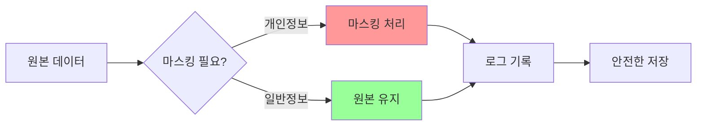
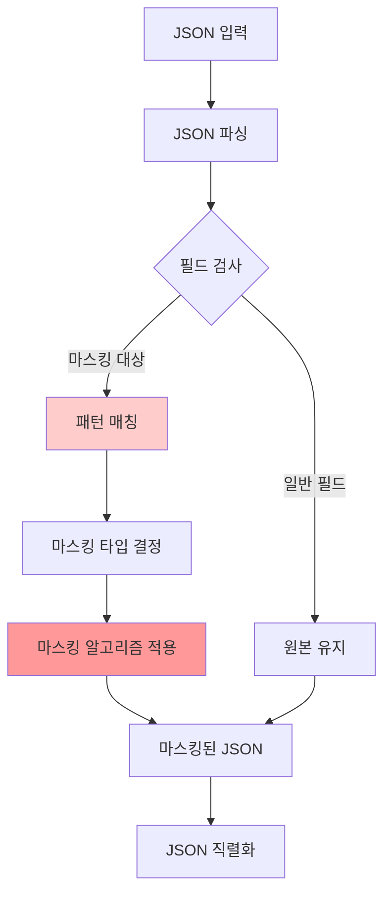

# 01. 데이터 마스킹 설계

## 1. 문서 개요

본 문서는 ABS에서 개인정보 및 민감정보를 안전하게 처리하기 위한 데이터 마스킹 설계를 정의합니다.

### 1.1 포함 내용

- 마스킹 대상 필드 및 패턴 정의
- 마스킹 알고리즘 (전체/부분/해시)
- Request/Response Body 마스킹
- 로그 데이터 마스킹
- 성능 최적화 전략

### 1.2 마스킹 필요성



## 2. 마스킹 대상 필드

### 2.1 개인정보 필드

| 필드 타입 | 필드명 예시 | 마스킹 타입 | 예시 |
|----------|-----------|-----------|------|
| 이름 | name, userName, customerName | 부분 마스킹 | 홍길동 → 홍*동 |
| 이메일 | email, emailAddress | 부분 마스킹 | user@example.com → u***@example.com |
| 전화번호 | phone, phoneNumber, mobile | 부분 마스킹 | 010-1234-5678 → 010-****-5678 |
| 주민등록번호 | ssn, residentNumber | 부분 마스킹 | 123456-1234567 → 123456-******* |
| 신용카드 | cardNumber, creditCard | 부분 마스킹 | 1234-5678-9012-3456 → ****-****-****-3456 |
| 주소 | address, homeAddress | 부분 마스킹 | 서울시 강남구 테헤란로 123 → 서울시 강남구 ********* |
| 계좌번호 | accountNumber, bankAccount | 부분 마스킹 | 110-123-456789 → 110-***-***789 |
| 비밀번호 | password, passwd, pwd | 전체 마스킹 | ******** |
| IP 주소 | ipAddress, clientIP | 부분 마스킹 | 192.168.1.100 → 192.168.*.* |

### 2.2 필드 감지 패턴

```go
// MaskingPattern 필드 감지를 위한 패턴 정의
type MaskingPattern struct {
    FieldPattern *regexp.Regexp // JSON 필드명 패턴
    ValuePattern *regexp.Regexp // 값 형식 패턴
    MaskType     MaskType       // 마스킹 타입
}

var defaultPatterns = []MaskingPattern{
    // 이메일
    {
        FieldPattern: regexp.MustCompile(`(?i)(email|e-mail|mail)`),
        ValuePattern: regexp.MustCompile(`^[a-zA-Z0-9._%+-]+@[a-zA-Z0-9.-]+\.[a-zA-Z]{2,}$`),
        MaskType:     MaskTypeEmail,
    },
    // 전화번호
    {
        FieldPattern: regexp.MustCompile(`(?i)(phone|mobile|tel|cellphone)`),
        ValuePattern: regexp.MustCompile(`^(\d{2,3})-?(\d{3,4})-?(\d{4})$`),
        MaskType:     MaskTypePhone,
    },
    // 주민등록번호
    {
        FieldPattern: regexp.MustCompile(`(?i)(ssn|resident|jumin)`),
        ValuePattern: regexp.MustCompile(`^\d{6}-?\d{7}$`),
        MaskType:     MaskTypeSSN,
    },
    // 신용카드
    {
        FieldPattern: regexp.MustCompile(`(?i)(card|credit)`),
        ValuePattern: regexp.MustCompile(`^\d{4}-?\d{4}-?\d{4}-?\d{4}$`),
        MaskType:     MaskTypeCreditCard,
    },
    // 비밀번호
    {
        FieldPattern: regexp.MustCompile(`(?i)(password|passwd|pwd|secret)`),
        ValuePattern: nil, // 필드명만으로 판단
        MaskType:     MaskTypeFull,
    },
}
```

## 3. 마스킹 알고리즘

### 3.1 마스킹 타입

```go
type MaskType int

const (
    MaskTypeNone        MaskType = iota // 마스킹 없음
    MaskTypeFull                        // 전체 마스킹: ********
    MaskTypePartial                     // 부분 마스킹: 홍*동
    MaskTypeEmail                       // 이메일: u***@example.com
    MaskTypePhone                       // 전화: 010-****-5678
    MaskTypeSSN                         // 주민번호: 123456-*******
    MaskTypeCreditCard                  // 카드: ****-****-****-3456
    MaskTypeHash                        // 해시: SHA-256
)
```

### 3.2 마스킹 알고리즘 구현

```go
package security

import (
    "crypto/sha256"
    "encoding/hex"
    "strings"
)

// Masker 데이터 마스킹 인터페이스
type Masker interface {
    Mask(value string, maskType MaskType) string
}

// DefaultMasker 기본 마스킹 구현
type DefaultMasker struct {
    maskChar rune
}

func NewDefaultMasker() *DefaultMasker {
    return &DefaultMasker{
        maskChar: '*',
    }
}

// Mask 마스킹 타입에 따라 값을 마스킹
func (m *DefaultMasker) Mask(value string, maskType MaskType) string {
    if value == "" {
        return value
    }

    switch maskType {
    case MaskTypeNone:
        return value

    case MaskTypeFull:
        return m.maskFull(value)

    case MaskTypePartial:
        return m.maskPartial(value)

    case MaskTypeEmail:
        return m.maskEmail(value)

    case MaskTypePhone:
        return m.maskPhone(value)

    case MaskTypeSSN:
        return m.maskSSN(value)

    case MaskTypeCreditCard:
        return m.maskCreditCard(value)

    case MaskTypeHash:
        return m.maskHash(value)

    default:
        return m.maskFull(value)
    }
}

// maskFull 전체 마스킹
func (m *DefaultMasker) maskFull(value string) string {
    return strings.Repeat(string(m.maskChar), 8)
}

// maskPartial 부분 마스킹 (중간 부분을 마스킹)
func (m *DefaultMasker) maskPartial(value string) string {
    runes := []rune(value)
    length := len(runes)

    if length <= 2 {
        return string(m.maskChar)
    }

    // 앞 1자 + 중간 마스킹 + 뒤 1자
    start := 1
    end := length - 1

    for i := start; i < end; i++ {
        runes[i] = m.maskChar
    }

    return string(runes)
}

// maskEmail 이메일 마스킹
// 예: user@example.com → u***@example.com
func (m *DefaultMasker) maskEmail(value string) string {
    parts := strings.Split(value, "@")
    if len(parts) != 2 {
        return m.maskFull(value)
    }

    localPart := parts[0]
    domain := parts[1]

    if len(localPart) <= 1 {
        return string(m.maskChar) + "@" + domain
    }

    // 첫 글자 + *** + @domain
    maskedLocal := string([]rune(localPart)[0]) + strings.Repeat(string(m.maskChar), 3)
    return maskedLocal + "@" + domain
}

// maskPhone 전화번호 마스킹
// 예: 010-1234-5678 → 010-****-5678
func (m *DefaultMasker) maskPhone(value string) string {
    // 하이픈 제거
    cleaned := strings.ReplaceAll(value, "-", "")

    if len(cleaned) < 10 {
        return m.maskFull(value)
    }

    // 010-****-5678 형식
    if len(cleaned) == 11 {
        return cleaned[:3] + "-" + strings.Repeat(string(m.maskChar), 4) + "-" + cleaned[7:]
    }

    // 02-****-5678 형식 (10자리)
    return cleaned[:2] + "-" + strings.Repeat(string(m.maskChar), 4) + "-" + cleaned[6:]
}

// maskSSN 주민등록번호 마스킹
// 예: 123456-1234567 → 123456-*******
func (m *DefaultMasker) maskSSN(value string) string {
    cleaned := strings.ReplaceAll(value, "-", "")

    if len(cleaned) != 13 {
        return m.maskFull(value)
    }

    return cleaned[:6] + "-" + strings.Repeat(string(m.maskChar), 7)
}

// maskCreditCard 신용카드 마스킹
// 예: 1234-5678-9012-3456 → ****-****-****-3456
func (m *DefaultMasker) maskCreditCard(value string) string {
    cleaned := strings.ReplaceAll(value, "-", "")

    if len(cleaned) != 16 {
        return m.maskFull(value)
    }

    masked := strings.Repeat(string(m.maskChar), 4)
    return masked + "-" + masked + "-" + masked + "-" + cleaned[12:]
}

// maskHash SHA-256 해시
func (m *DefaultMasker) maskHash(value string) string {
    hash := sha256.Sum256([]byte(value))
    return hex.EncodeToString(hash[:])
}
```

## 4. JSON Body 마스킹

### 4.1 JSON 마스킹 프로세스



### 4.2 JSON 마스킹 구현

```go
package security

import (
    "encoding/json"
)

// JSONMasker JSON 데이터 마스킹
type JSONMasker struct {
    masker   Masker
    patterns []MaskingPattern
}

func NewJSONMasker(masker Masker, patterns []MaskingPattern) *JSONMasker {
    return &JSONMasker{
        masker:   masker,
        patterns: patterns,
    }
}

// MaskJSON JSON 문자열을 마스킹
func (j *JSONMasker) MaskJSON(jsonStr string) (string, error) {
    var data interface{}

    if err := json.Unmarshal([]byte(jsonStr), &data); err != nil {
        return "", err
    }

    masked := j.maskValue(data)

    result, err := json.Marshal(masked)
    if err != nil {
        return "", err
    }

    return string(result), nil
}

// maskValue 재귀적으로 값을 마스킹
func (j *JSONMasker) maskValue(value interface{}) interface{} {
    switch v := value.(type) {
    case map[string]interface{}:
        return j.maskMap(v)
    case []interface{}:
        return j.maskArray(v)
    default:
        return v
    }
}

// maskMap 맵의 각 필드를 검사하고 마스킹
func (j *JSONMasker) maskMap(m map[string]interface{}) map[string]interface{} {
    result := make(map[string]interface{})

    for key, value := range m {
        // 필드명 기반 마스킹 체크
        maskType := j.detectMaskType(key, value)

        if maskType != MaskTypeNone {
            // 문자열인 경우에만 마스킹
            if strValue, ok := value.(string); ok {
                result[key] = j.masker.Mask(strValue, maskType)
                continue
            }
        }

        // 중첩된 객체/배열 재귀 처리
        result[key] = j.maskValue(value)
    }

    return result
}

// maskArray 배열의 각 요소를 마스킹
func (j *JSONMasker) maskArray(arr []interface{}) []interface{} {
    result := make([]interface{}, len(arr))

    for i, value := range arr {
        result[i] = j.maskValue(value)
    }

    return result
}

// detectMaskType 필드명과 값을 기반으로 마스킹 타입 감지
func (j *JSONMasker) detectMaskType(fieldName string, value interface{}) MaskType {
    strValue, ok := value.(string)
    if !ok {
        return MaskTypeNone
    }

    for _, pattern := range j.patterns {
        // 필드명 패턴 매칭
        if pattern.FieldPattern != nil && pattern.FieldPattern.MatchString(fieldName) {
            // 값 패턴이 없거나, 값 패턴도 매칭되면
            if pattern.ValuePattern == nil || pattern.ValuePattern.MatchString(strValue) {
                return pattern.MaskType
            }
        }
    }

    return MaskTypeNone
}
```

### 4.3 사용 예시

```go
package main

import (
    "fmt"
    "log"

    "demo-abs/internal/infrastructure/security"
)

func main() {
    // Masker 생성
    masker := security.NewDefaultMasker()

    // JSON Masker 생성
    jsonMasker := security.NewJSONMasker(masker, security.GetDefaultPatterns())

    // 원본 JSON
    originalJSON := `{
        "userName": "홍길동",
        "email": "user@example.com",
        "phone": "010-1234-5678",
        "ssn": "123456-1234567",
        "cardNumber": "1234-5678-9012-3456",
        "address": "서울시 강남구 테헤란로 123",
        "normalField": "일반 데이터"
    }`

    // 마스킹 수행
    maskedJSON, err := jsonMasker.MaskJSON(originalJSON)
    if err != nil {
        log.Fatal(err)
    }

    fmt.Println("원본:", originalJSON)
    fmt.Println("마스킹:", maskedJSON)
}

// 출력:
// 원본: {"userName":"홍길동","email":"user@example.com",...}
// 마스킹: {"userName":"홍*동","email":"u***@example.com","phone":"010-****-5678","ssn":"123456-*******","cardNumber":"****-****-****-3456","address":"서울시 강남구 *********","normalField":"일반 데이터"}
```

## 5. 로그 마스킹

### 5.1 로그 마스킹 인터셉터

```go
package middleware

import (
    "bytes"
    "encoding/json"
    "io"
    "net/http"

    "demo-abs/internal/infrastructure/security"
    "github.com/gin-gonic/gin"
)

// LogMaskingMiddleware 로그 마스킹 미들웨어
func LogMaskingMiddleware(jsonMasker *security.JSONMasker) gin.HandlerFunc {
    return func(c *gin.Context) {
        // Request Body 읽기 및 마스킹
        var requestBody []byte
        if c.Request.Body != nil {
            requestBody, _ = io.ReadAll(c.Request.Body)
            c.Request.Body = io.NopCloser(bytes.NewBuffer(requestBody))
        }

        // Response Writer 래핑
        blw := &bodyLogWriter{body: bytes.NewBufferString(""), ResponseWriter: c.Writer}
        c.Writer = blw

        // 다음 핸들러 실행
        c.Next()

        // Request Body 마스킹
        maskedRequest := string(requestBody)
        if len(requestBody) > 0 && isJSON(requestBody) {
            maskedRequest, _ = jsonMasker.MaskJSON(string(requestBody))
        }

        // Response Body 마스킹
        maskedResponse := blw.body.String()
        if isJSON([]byte(maskedResponse)) {
            maskedResponse, _ = jsonMasker.MaskJSON(maskedResponse)
        }

        // 로그 기록 (마스킹된 데이터)
        log.Printf("[%s] %s - Request: %s, Response: %s",
            c.Request.Method,
            c.Request.URL.Path,
            maskedRequest,
            maskedResponse,
        )
    }
}

type bodyLogWriter struct {
    gin.ResponseWriter
    body *bytes.Buffer
}

func (w bodyLogWriter) Write(b []byte) (int, error) {
    w.body.Write(b)
    return w.ResponseWriter.Write(b)
}

func isJSON(data []byte) bool {
    var js json.RawMessage
    return json.Unmarshal(data, &js) == nil
}
```

### 5.2 구조화된 로그 마스킹

```go
package logger

import (
    "demo-abs/internal/infrastructure/security"
    "go.uber.org/zap"
    "go.uber.org/zap/zapcore"
)

// MaskedLogger 마스킹을 지원하는 로거
type MaskedLogger struct {
    logger *zap.Logger
    masker security.Masker
}

func NewMaskedLogger(logger *zap.Logger, masker security.Masker) *MaskedLogger {
    return &MaskedLogger{
        logger: logger,
        masker: masker,
    }
}

// Info 마스킹된 로그 출력
func (l *MaskedLogger) Info(msg string, fields ...zap.Field) {
    maskedFields := l.maskFields(fields)
    l.logger.Info(msg, maskedFields...)
}

// Error 마스킹된 에러 로그
func (l *MaskedLogger) Error(msg string, fields ...zap.Field) {
    maskedFields := l.maskFields(fields)
    l.logger.Error(msg, maskedFields...)
}

// maskFields 필드를 마스킹
func (l *MaskedLogger) maskFields(fields []zap.Field) []zap.Field {
    maskedFields := make([]zap.Field, len(fields))

    for i, field := range fields {
        // 필드명 기반 마스킹 필요 여부 체크
        if l.needsMasking(field.Key) {
            if field.Type == zapcore.StringType {
                // 문자열 값 마스킹
                maskedValue := l.masker.Mask(field.String, l.getMaskType(field.Key))
                maskedFields[i] = zap.String(field.Key, maskedValue)
                continue
            }
        }

        maskedFields[i] = field
    }

    return maskedFields
}

// needsMasking 마스킹이 필요한 필드인지 확인
func (l *MaskedLogger) needsMasking(fieldName string) bool {
    sensitiveFields := []string{
        "email", "phone", "ssn", "password", "cardNumber",
        "accountNumber", "address", "userName",
    }

    for _, sensitive := range sensitiveFields {
        if fieldName == sensitive {
            return true
        }
    }

    return false
}

// getMaskType 필드명에 따른 마스킹 타입 반환
func (l *MaskedLogger) getMaskType(fieldName string) security.MaskType {
    maskTypeMap := map[string]security.MaskType{
        "email":         security.MaskTypeEmail,
        "phone":         security.MaskTypePhone,
        "ssn":           security.MaskTypeSSN,
        "password":      security.MaskTypeFull,
        "cardNumber":    security.MaskTypeCreditCard,
        "accountNumber": security.MaskTypePartial,
        "address":       security.MaskTypePartial,
        "userName":      security.MaskTypePartial,
    }

    if maskType, exists := maskTypeMap[fieldName]; exists {
        return maskType
    }

    return security.MaskTypePartial
}
```

## 6. 성능 최적화

### 6.1 마스킹 캐시

```go
package security

import (
    "crypto/sha256"
    "encoding/hex"
    "sync"
)

// CachedMasker 캐시를 사용하는 마스킹
type CachedMasker struct {
    underlying Masker
    cache      sync.Map // key: hash(value+maskType), value: masked string
    maxSize    int
    currentSize int
    mu         sync.Mutex
}

func NewCachedMasker(underlying Masker, maxSize int) *CachedMasker {
    return &CachedMasker{
        underlying: underlying,
        maxSize:    maxSize,
    }
}

// Mask 캐시를 사용한 마스킹
func (c *CachedMasker) Mask(value string, maskType MaskType) string {
    // 캐시 키 생성
    cacheKey := c.getCacheKey(value, maskType)

    // 캐시 조회
    if cached, ok := c.cache.Load(cacheKey); ok {
        return cached.(string)
    }

    // 마스킹 수행
    masked := c.underlying.Mask(value, maskType)

    // 캐시 저장 (크기 제한)
    c.mu.Lock()
    if c.currentSize < c.maxSize {
        c.cache.Store(cacheKey, masked)
        c.currentSize++
    }
    c.mu.Unlock()

    return masked
}

// getCacheKey 캐시 키 생성
func (c *CachedMasker) getCacheKey(value string, maskType MaskType) string {
    data := value + string(rune(maskType))
    hash := sha256.Sum256([]byte(data))
    return hex.EncodeToString(hash[:])[:16] // 16자로 축약
}

// ClearCache 캐시 초기화
func (c *CachedMasker) ClearCache() {
    c.mu.Lock()
    defer c.mu.Unlock()

    c.cache = sync.Map{}
    c.currentSize = 0
}
```

### 6.2 병렬 마스킹

```go
package security

import (
    "sync"
)

// ParallelJSONMasker 병렬 JSON 마스킹
type ParallelJSONMasker struct {
    *JSONMasker
    workerPool int
}

func NewParallelJSONMasker(masker Masker, patterns []MaskingPattern, workers int) *ParallelJSONMasker {
    return &ParallelJSONMasker{
        JSONMasker: NewJSONMasker(masker, patterns),
        workerPool: workers,
    }
}

// maskMap 병렬로 맵 마스킹
func (p *ParallelJSONMasker) maskMap(m map[string]interface{}) map[string]interface{} {
    if len(m) < 10 { // 작은 맵은 순차 처리
        return p.JSONMasker.maskMap(m)
    }

    result := make(map[string]interface{})
    var mu sync.Mutex
    var wg sync.WaitGroup

    // 작업 채널
    jobs := make(chan struct {
        key   string
        value interface{}
    }, len(m))

    // Worker 시작
    for i := 0; i < p.workerPool; i++ {
        wg.Add(1)
        go func() {
            defer wg.Done()
            for job := range jobs {
                maskType := p.detectMaskType(job.key, job.value)

                var maskedValue interface{}
                if maskType != MaskTypeNone {
                    if strValue, ok := job.value.(string); ok {
                        maskedValue = p.masker.Mask(strValue, maskType)
                    } else {
                        maskedValue = p.maskValue(job.value)
                    }
                } else {
                    maskedValue = p.maskValue(job.value)
                }

                mu.Lock()
                result[job.key] = maskedValue
                mu.Unlock()
            }
        }()
    }

    // 작업 분배
    for key, value := range m {
        jobs <- struct {
            key   string
            value interface{}
        }{key: key, value: value}
    }
    close(jobs)

    wg.Wait()
    return result
}
```

### 6.3 성능 벤치마크

```go
package security_test

import (
    "testing"

    "demo-abs/internal/infrastructure/security"
)

func BenchmarkMasker_Email(b *testing.B) {
    masker := security.NewDefaultMasker()
    email := "testuser@example.com"

    b.ResetTimer()
    for i := 0; i < b.N; i++ {
        masker.Mask(email, security.MaskTypeEmail)
    }
}

func BenchmarkCachedMasker_Email(b *testing.B) {
    underlying := security.NewDefaultMasker()
    masker := security.NewCachedMasker(underlying, 1000)
    email := "testuser@example.com"

    b.ResetTimer()
    for i := 0; i < b.N; i++ {
        masker.Mask(email, security.MaskTypeEmail)
    }
}

func BenchmarkJSONMasker_SmallJSON(b *testing.B) {
    masker := security.NewDefaultMasker()
    jsonMasker := security.NewJSONMasker(masker, security.GetDefaultPatterns())

    jsonStr := `{"email":"test@example.com","phone":"010-1234-5678"}`

    b.ResetTimer()
    for i := 0; i < b.N; i++ {
        jsonMasker.MaskJSON(jsonStr)
    }
}

func BenchmarkJSONMasker_LargeJSON(b *testing.B) {
    masker := security.NewDefaultMasker()
    jsonMasker := security.NewJSONMasker(masker, security.GetDefaultPatterns())

    // 100개 필드를 가진 JSON
    jsonStr := generateLargeJSON(100)

    b.ResetTimer()
    for i := 0; i < b.N; i++ {
        jsonMasker.MaskJSON(jsonStr)
    }
}
```

## 7. 설정 및 관리

### 7.1 마스킹 설정

```yaml
# config/masking.yaml
masking:
  enabled: true

  # 마스킹 대상 필드 (대소문자 구분 없음)
  sensitive_fields:
    - email
    - phone
    - mobile
    - ssn
    - residentNumber
    - password
    - passwd
    - cardNumber
    - creditCard
    - accountNumber
    - address
    - userName
    - customerName

  # 마스킹 규칙
  rules:
    email:
      type: email
      keep_first: 1  # 첫 N자 유지
      mask_char: '*'

    phone:
      type: phone
      pattern: "###-****-####"

    ssn:
      type: ssn
      pattern: "######-*******"

    password:
      type: full
      length: 8

  # 성능 설정
  performance:
    cache_enabled: true
    cache_max_size: 10000
    parallel_workers: 4
    parallel_threshold: 50  # 필드 개수 임계값

  # 로깅
  logging:
    log_masking_enabled: true
    log_original_length: true  # 원본 길이 로깅
```

### 7.2 설정 로딩

```go
package config

import (
    "demo-abs/internal/infrastructure/security"
)

type MaskingConfig struct {
    Enabled         bool                        `yaml:"enabled"`
    SensitiveFields []string                    `yaml:"sensitive_fields"`
    Rules           map[string]MaskingRuleConfig `yaml:"rules"`
    Performance     PerformanceConfig           `yaml:"performance"`
    Logging         LoggingConfig               `yaml:"logging"`
}

type MaskingRuleConfig struct {
    Type      string `yaml:"type"`
    KeepFirst int    `yaml:"keep_first"`
    MaskChar  string `yaml:"mask_char"`
    Pattern   string `yaml:"pattern"`
    Length    int    `yaml:"length"`
}

type PerformanceConfig struct {
    CacheEnabled      bool `yaml:"cache_enabled"`
    CacheMaxSize      int  `yaml:"cache_max_size"`
    ParallelWorkers   int  `yaml:"parallel_workers"`
    ParallelThreshold int  `yaml:"parallel_threshold"`
}

type LoggingConfig struct {
    LogMaskingEnabled  bool `yaml:"log_masking_enabled"`
    LogOriginalLength  bool `yaml:"log_original_length"`
}

// BuildMasker 설정으로부터 Masker 생성
func (c *MaskingConfig) BuildMasker() security.Masker {
    baseMasker := security.NewDefaultMasker()

    if c.Performance.CacheEnabled {
        return security.NewCachedMasker(baseMasker, c.Performance.CacheMaxSize)
    }

    return baseMasker
}
```

## 8. 테스트 전략

### 8.1 단위 테스트

```go
package security_test

import (
    "testing"

    "demo-abs/internal/infrastructure/security"
    "github.com/stretchr/testify/assert"
)

func TestMasker_Email(t *testing.T) {
    masker := security.NewDefaultMasker()

    tests := []struct {
        name     string
        input    string
        expected string
    }{
        {"일반 이메일", "user@example.com", "u***@example.com"},
        {"긴 이메일", "verylonguser@example.com", "v***@example.com"},
        {"짧은 이메일", "a@example.com", "*@example.com"},
        {"잘못된 형식", "notanemail", "********"},
    }

    for _, tt := range tests {
        t.Run(tt.name, func(t *testing.T) {
            result := masker.Mask(tt.input, security.MaskTypeEmail)
            assert.Equal(t, tt.expected, result)
        })
    }
}

func TestJSONMasker_NestedJSON(t *testing.T) {
    masker := security.NewDefaultMasker()
    jsonMasker := security.NewJSONMasker(masker, security.GetDefaultPatterns())

    input := `{
        "user": {
            "email": "test@example.com",
            "profile": {
                "phone": "010-1234-5678"
            }
        }
    }`

    result, err := jsonMasker.MaskJSON(input)
    assert.NoError(t, err)
    assert.Contains(t, result, "t***@example.com")
    assert.Contains(t, result, "010-****-5678")
}
```

### 8.2 통합 테스트

```go
package middleware_test

import (
    "bytes"
    "net/http"
    "net/http/httptest"
    "testing"

    "demo-abs/internal/adapter/http/middleware"
    "demo-abs/internal/infrastructure/security"
    "github.com/gin-gonic/gin"
    "github.com/stretchr/testify/assert"
)

func TestLogMaskingMiddleware(t *testing.T) {
    gin.SetMode(gin.TestMode)

    // Setup
    masker := security.NewDefaultMasker()
    jsonMasker := security.NewJSONMasker(masker, security.GetDefaultPatterns())

    router := gin.New()
    router.Use(middleware.LogMaskingMiddleware(jsonMasker))
    router.POST("/test", func(c *gin.Context) {
        c.JSON(200, gin.H{"message": "success"})
    })

    // Request with sensitive data
    reqBody := `{"email":"test@example.com","password":"secret123"}`
    req := httptest.NewRequest("POST", "/test", bytes.NewBufferString(reqBody))
    req.Header.Set("Content-Type", "application/json")

    w := httptest.NewRecorder()
    router.ServeHTTP(w, req)

    assert.Equal(t, 200, w.Code)
    // 로그에 마스킹된 데이터가 기록되었는지 확인 (실제로는 로그 출력 검증)
}
```

## 9. 모니터링

### 9.1 마스킹 메트릭

```go
package metrics

import (
    "github.com/prometheus/client_golang/prometheus"
    "github.com/prometheus/client_golang/prometheus/promauto"
)

var (
    // 마스킹 수행 횟수
    maskingOperations = promauto.NewCounterVec(
        prometheus.CounterOpts{
            Name: "abs_masking_operations_total",
            Help: "Total number of masking operations",
        },
        []string{"mask_type"},
    )

    // 마스킹 처리 시간
    maskingDuration = promauto.NewHistogramVec(
        prometheus.HistogramOpts{
            Name:    "abs_masking_duration_seconds",
            Help:    "Time spent masking data",
            Buckets: prometheus.DefBuckets,
        },
        []string{"mask_type"},
    )

    // 캐시 히트/미스
    maskingCacheHits = promauto.NewCounter(
        prometheus.CounterOpts{
            Name: "abs_masking_cache_hits_total",
            Help: "Total number of masking cache hits",
        },
    )

    maskingCacheMisses = promauto.NewCounter(
        prometheus.CounterOpts{
            Name: "abs_masking_cache_misses_total",
            Help: "Total number of masking cache misses",
        },
    )
)
```

## 10. 참고 자료

- GDPR Article 32: Security of processing
- OWASP Data Masking Guidelines
- Go Privacy Best Practices
- Regex Pattern Library for PII Detection

## 11. 구현 위치

```
internal/
├── infrastructure/
│   └── security/
│       ├── masker.go              # Masker 인터페이스 및 기본 구현
│       ├── json_masker.go         # JSON 마스킹
│       ├── cached_masker.go       # 캐시 기반 마스킹
│       ├── patterns.go            # 마스킹 패턴 정의
│       └── masker_test.go         # 테스트
├── adapter/
│   └── http/
│       └── middleware/
│           └── log_masking.go     # 로그 마스킹 미들웨어
└── pkg/
    └── logger/
        └── masked_logger.go        # 마스킹 로거
config/
└── masking.yaml                    # 마스킹 설정
```

---

최종 수정일: 2025-11-30, 작성자: ABS 개발팀
