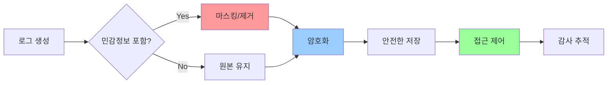

# 02. 로그 보안 설계

## 1. 문서 개요

본 문서는 ABS의 로그 시스템에서 민감 정보를 안전하게 관리하기 위한 보안 정책과 구현 방법을 정의합니다.

### 1.1 포함 내용

- 로그 레벨별 필터링 정책
- 민감 정보 자동 제거 메커니즘
- 로그 파일 권한 및 접근 제어
- 로그 순환(Rotation) 및 보관 정책
- 로그 암호화 및 무결성 보장
- 감사 로그(Audit Log) 관리

### 1.2 로그 보안 목표



## 2. 로그 레벨 정책

### 2.1 로그 레벨 정의

| 레벨 | 용도 | 환경 | 민감정보 처리 | 보관 기간 |
|-----|------|------|-------------|---------|
| DEBUG | 상세 디버깅 정보 | 개발 | 전체 마스킹 | 3일 |
| INFO | 일반 정보 로그 | 개발, 스테이징, 운영 | 자동 마스킹 | 7일 |
| WARN | 경고 메시지 | 개발, 스테이징, 운영 | 자동 마스킹 | 30일 |
| ERROR | 에러 로그 | 모든 환경 | 자동 마스킹 | 90일 |
| FATAL | 치명적 에러 | 모든 환경 | 자동 마스킹 + 알림 | 365일 |

### 2.2 환경별 로그 레벨

```go
package logger

import (
    "os"

    "go.uber.org/zap"
    "go.uber.org/zap/zapcore"
)

// GetLogLevel 환경별 로그 레벨 반환
func GetLogLevel(env string) zapcore.Level {
    switch env {
    case "development":
        return zapcore.DebugLevel
    case "staging":
        return zapcore.InfoLevel
    case "production":
        return zapcore.WarnLevel
    default:
        return zapcore.InfoLevel
    }
}

// NewLogger 환경에 맞는 로거 생성
func NewLogger(env string) (*zap.Logger, error) {
    var config zap.Config

    if env == "production" {
        // 운영 환경: JSON 포맷, 최소 로그
        config = zap.NewProductionConfig()
        config.Level = zap.NewAtomicLevelAt(GetLogLevel(env))
        config.DisableStacktrace = true // 스택 트레이스 비활성화
    } else {
        // 개발/스테이징: 콘솔 포맷, 상세 로그
        config = zap.NewDevelopmentConfig()
        config.Level = zap.NewAtomicLevelAt(GetLogLevel(env))
    }

    // 출력 경로 설정
    config.OutputPaths = []string{
        "stdout",
        "/var/log/abs/app.log",
    }

    // 에러 로그는 별도 파일
    config.ErrorOutputPaths = []string{
        "stderr",
        "/var/log/abs/error.log",
    }

    return config.Build()
}
```

## 3. 민감 정보 필터링

### 3.1 필터링 대상

```go
package logger

import (
    "regexp"
)

// SensitivePattern 민감 정보 패턴
type SensitivePattern struct {
    Name        string
    Pattern     *regexp.Regexp
    Replacement string
}

var defaultSensitivePatterns = []SensitivePattern{
    // 이메일
    {
        Name:        "email",
        Pattern:     regexp.MustCompile(`[a-zA-Z0-9._%+-]+@[a-zA-Z0-9.-]+\.[a-zA-Z]{2,}`),
        Replacement: "[EMAIL_REDACTED]",
    },
    // 전화번호 (한국)
    {
        Name:        "phone",
        Pattern:     regexp.MustCompile(`01[016789]-?\d{3,4}-?\d{4}`),
        Replacement: "[PHONE_REDACTED]",
    },
    // 주민등록번호
    {
        Name:        "ssn",
        Pattern:     regexp.MustCompile(`\d{6}-?\d{7}`),
        Replacement: "[SSN_REDACTED]",
    },
    // 신용카드 번호
    {
        Name:        "credit_card",
        Pattern:     regexp.MustCompile(`\d{4}-?\d{4}-?\d{4}-?\d{4}`),
        Replacement: "[CARD_REDACTED]",
    },
    // Bearer Token
    {
        Name:        "bearer_token",
        Pattern:     regexp.MustCompile(`Bearer\s+[A-Za-z0-9\-._~+/]+=*`),
        Replacement: "Bearer [TOKEN_REDACTED]",
    },
    // API Key
    {
        Name:        "api_key",
        Pattern:     regexp.MustCompile(`(?i)(api[_-]?key|apikey)\s*[:=]\s*["']?([A-Za-z0-9]{32,})["']?`),
        Replacement: `$1=[API_KEY_REDACTED]`,
    },
    // Password
    {
        Name:        "password",
        Pattern:     regexp.MustCompile(`(?i)(password|passwd|pwd)\s*[:=]\s*["']?([^"'\s]+)["']?`),
        Replacement: `$1=[PASSWORD_REDACTED]`,
    },
    // IP 주소 (내부 IP는 일부 마스킹)
    {
        Name:        "ip_address",
        Pattern:     regexp.MustCompile(`\b(\d{1,3})\.(\d{1,3})\.(\d{1,3})\.(\d{1,3})\b`),
        Replacement: "$1.$2.*.*",
    },
}
```

### 3.2 로그 필터 구현

```go
package logger

import (
    "go.uber.org/zap/zapcore"
)

// SensitiveInfoFilter 민감 정보 필터링 Core
type SensitiveInfoFilter struct {
    zapcore.Core
    patterns []SensitivePattern
}

func NewSensitiveInfoFilter(core zapcore.Core, patterns []SensitivePattern) *SensitiveInfoFilter {
    if patterns == nil {
        patterns = defaultSensitivePatterns
    }

    return &SensitiveInfoFilter{
        Core:     core,
        patterns: patterns,
    }
}

// Write 로그 메시지에서 민감 정보 제거
func (f *SensitiveInfoFilter) Write(entry zapcore.Entry, fields []zapcore.Field) error {
    // 메시지 필터링
    entry.Message = f.filterString(entry.Message)

    // 필드 필터링
    filteredFields := make([]zapcore.Field, len(fields))
    for i, field := range fields {
        filteredFields[i] = f.filterField(field)
    }

    return f.Core.Write(entry, filteredFields)
}

// filterString 문자열에서 민감 정보 제거
func (f *SensitiveInfoFilter) filterString(s string) string {
    result := s

    for _, pattern := range f.patterns {
        result = pattern.Pattern.ReplaceAllString(result, pattern.Replacement)
    }

    return result
}

// filterField 필드 값 필터링
func (f *SensitiveInfoFilter) filterField(field zapcore.Field) zapcore.Field {
    // String 타입 필드만 필터링
    if field.Type == zapcore.StringType {
        field.String = f.filterString(field.String)
    }

    return field
}
```

### 3.3 필터 적용

```go
package logger

import (
    "os"

    "go.uber.org/zap"
    "go.uber.org/zap/zapcore"
)

// NewSecureLogger 보안 필터가 적용된 로거 생성
func NewSecureLogger(env string) (*zap.Logger, error) {
    // Encoder 설정
    encoderConfig := zapcore.EncoderConfig{
        TimeKey:        "timestamp",
        LevelKey:       "level",
        NameKey:        "logger",
        CallerKey:      "caller",
        MessageKey:     "message",
        StacktraceKey:  "stacktrace",
        LineEnding:     zapcore.DefaultLineEnding,
        EncodeLevel:    zapcore.LowercaseLevelEncoder,
        EncodeTime:     zapcore.ISO8601TimeEncoder,
        EncodeDuration: zapcore.SecondsDurationEncoder,
        EncodeCaller:   zapcore.ShortCallerEncoder,
    }

    // 파일 출력
    appLogFile, _ := os.OpenFile("/var/log/abs/app.log",
        os.O_APPEND|os.O_CREATE|os.O_WRONLY, 0640)

    errorLogFile, _ := os.OpenFile("/var/log/abs/error.log",
        os.O_APPEND|os.O_CREATE|os.O_WRONLY, 0640)

    // Core 생성
    appCore := zapcore.NewCore(
        zapcore.NewJSONEncoder(encoderConfig),
        zapcore.AddSync(appLogFile),
        GetLogLevel(env),
    )

    errorCore := zapcore.NewCore(
        zapcore.NewJSONEncoder(encoderConfig),
        zapcore.AddSync(errorLogFile),
        zapcore.ErrorLevel,
    )

    // 민감 정보 필터 적용
    filteredAppCore := NewSensitiveInfoFilter(appCore, defaultSensitivePatterns)
    filteredErrorCore := NewSensitiveInfoFilter(errorCore, defaultSensitivePatterns)

    // Tee Core (여러 Core 결합)
    core := zapcore.NewTee(filteredAppCore, filteredErrorCore)

    // Logger 생성
    logger := zap.New(core, zap.AddCaller(), zap.AddStacktrace(zapcore.ErrorLevel))

    return logger, nil
}
```

## 4. 로그 파일 보안

### 4.1 파일 권한

```bash
# 로그 디렉토리 및 파일 권한 설정

# 로그 디렉토리 생성
sudo mkdir -p /var/log/abs

# 소유자: abs 사용자, 그룹: abs
sudo chown abs:abs /var/log/abs

# 디렉토리 권한: 750 (소유자: rwx, 그룹: r-x, 기타: ---)
sudo chmod 750 /var/log/abs

# 로그 파일 권한: 640 (소유자: rw-, 그룹: r--, 기타: ---)
sudo chmod 640 /var/log/abs/*.log
```

### 4.2 로그 파일 생성 시 권한 설정

```go
package logger

import (
    "os"
    "path/filepath"
    "syscall"
)

// CreateSecureLogFile 안전한 로그 파일 생성
func CreateSecureLogFile(logPath string) (*os.File, error) {
    // 디렉토리 존재 확인
    dir := filepath.Dir(logPath)
    if err := os.MkdirAll(dir, 0750); err != nil {
        return nil, err
    }

    // 파일 생성 (0640 권한)
    file, err := os.OpenFile(logPath,
        os.O_APPEND|os.O_CREATE|os.O_WRONLY,
        0640)
    if err != nil {
        return nil, err
    }

    // 소유자 변경 (abs:abs)
    // uid, gid는 시스템에서 조회
    if err := file.Chown(getABSUserID(), getABSGroupID()); err != nil {
        file.Close()
        return nil, err
    }

    return file, nil
}

// SetFilePermissions 파일 권한 설정
func SetFilePermissions(path string, mode os.FileMode) error {
    return os.Chmod(path, mode)
}

// getABSUserID ABS 사용자 ID 조회
func getABSUserID() int {
    // 실제 구현에서는 user.Lookup 사용
    return 1000 // 예시
}

// getABSGroupID ABS 그룹 ID 조회
func getABSGroupID() int {
    return 1000 // 예시
}
```

## 5. 로그 순환 (Rotation)

### 5.1 로그 순환 정책

| 로그 타입 | 순환 조건 | 보관 기간 | 압축 | 백업 개수 |
|---------|---------|---------|-----|---------|
| app.log | 100MB 또는 1일 | 7일 | Yes | 7 |
| error.log | 50MB 또는 1일 | 90일 | Yes | 90 |
| access.log | 200MB 또는 1일 | 30일 | Yes | 30 |
| audit.log | 100MB 또는 1일 | 365일 | Yes | 365 |

### 5.2 Lumberjack을 사용한 로그 순환

```go
package logger

import (
    "go.uber.org/zap"
    "go.uber.org/zap/zapcore"
    "gopkg.in/natefinch/lumberjack.v2"
)

// RotatingFileConfig 로그 순환 설정
type RotatingFileConfig struct {
    Filename   string // 로그 파일 경로
    MaxSize    int    // 최대 크기 (MB)
    MaxAge     int    // 최대 보관 일수
    MaxBackups int    // 최대 백업 파일 수
    Compress   bool   // 압축 여부
}

var defaultRotatingConfigs = map[string]RotatingFileConfig{
    "app": {
        Filename:   "/var/log/abs/app.log",
        MaxSize:    100,
        MaxAge:     7,
        MaxBackups: 7,
        Compress:   true,
    },
    "error": {
        Filename:   "/var/log/abs/error.log",
        MaxSize:    50,
        MaxAge:     90,
        MaxBackups: 90,
        Compress:   true,
    },
    "access": {
        Filename:   "/var/log/abs/access.log",
        MaxSize:    200,
        MaxAge:     30,
        MaxBackups: 30,
        Compress:   true,
    },
    "audit": {
        Filename:   "/var/log/abs/audit.log",
        MaxSize:    100,
        MaxAge:     365,
        MaxBackups: 365,
        Compress:   true,
    },
}

// NewRotatingLogger 로그 순환이 적용된 로거 생성
func NewRotatingLogger(env string) (*zap.Logger, error) {
    encoderConfig := zapcore.EncoderConfig{
        TimeKey:        "timestamp",
        LevelKey:       "level",
        MessageKey:     "message",
        CallerKey:      "caller",
        StacktraceKey:  "stacktrace",
        EncodeLevel:    zapcore.LowercaseLevelEncoder,
        EncodeTime:     zapcore.ISO8601TimeEncoder,
        EncodeDuration: zapcore.SecondsDurationEncoder,
        EncodeCaller:   zapcore.ShortCallerEncoder,
    }

    // App Log (INFO 이상)
    appLogger := &lumberjack.Logger{
        Filename:   defaultRotatingConfigs["app"].Filename,
        MaxSize:    defaultRotatingConfigs["app"].MaxSize,
        MaxAge:     defaultRotatingConfigs["app"].MaxAge,
        MaxBackups: defaultRotatingConfigs["app"].MaxBackups,
        Compress:   defaultRotatingConfigs["app"].Compress,
    }

    // Error Log (ERROR 이상)
    errorLogger := &lumberjack.Logger{
        Filename:   defaultRotatingConfigs["error"].Filename,
        MaxSize:    defaultRotatingConfigs["error"].MaxSize,
        MaxAge:     defaultRotatingConfigs["error"].MaxAge,
        MaxBackups: defaultRotatingConfigs["error"].MaxBackups,
        Compress:   defaultRotatingConfigs["error"].Compress,
    }

    // Core 생성
    appCore := zapcore.NewCore(
        zapcore.NewJSONEncoder(encoderConfig),
        zapcore.AddSync(appLogger),
        GetLogLevel(env),
    )

    errorCore := zapcore.NewCore(
        zapcore.NewJSONEncoder(encoderConfig),
        zapcore.AddSync(errorLogger),
        zapcore.ErrorLevel,
    )

    // 민감 정보 필터 적용
    filteredAppCore := NewSensitiveInfoFilter(appCore, defaultSensitivePatterns)
    filteredErrorCore := NewSensitiveInfoFilter(errorCore, defaultSensitivePatterns)

    core := zapcore.NewTee(filteredAppCore, filteredErrorCore)

    return zap.New(core, zap.AddCaller()), nil
}
```

### 5.3 Logrotate 설정 (대안)

```bash
# /etc/logrotate.d/abs

/var/log/abs/*.log {
    daily                # 매일 순환
    rotate 90            # 90개 백업 보관
    compress             # gzip 압축
    delaycompress        # 최근 파일은 압축 안함
    missingok            # 파일 없어도 에러 안남
    notifempty           # 빈 파일은 순환 안함
    create 0640 abs abs  # 새 파일 권한
    sharedscripts        # 스크립트 한번만 실행
    postrotate
        # 로그 순환 후 ABS 프로세스에 SIGHUP 전송
        /usr/bin/killall -HUP abs || true
    endscript
}

/var/log/abs/audit.log {
    daily
    rotate 365           # 감사 로그는 1년 보관
    compress
    delaycompress
    missingok
    notifempty
    create 0640 abs abs
}
```

## 6. 로그 암호화

### 6.1 암호화된 로그 Writer

```go
package logger

import (
    "crypto/aes"
    "crypto/cipher"
    "crypto/rand"
    "encoding/base64"
    "io"
)

// EncryptedWriter 암호화된 로그 Writer
type EncryptedWriter struct {
    writer io.Writer
    gcm    cipher.AEAD
}

func NewEncryptedWriter(writer io.Writer, key []byte) (*EncryptedWriter, error) {
    // AES 블록 생성
    block, err := aes.NewCipher(key)
    if err != nil {
        return nil, err
    }

    // GCM 모드
    gcm, err := cipher.NewGCM(block)
    if err != nil {
        return nil, err
    }

    return &EncryptedWriter{
        writer: writer,
        gcm:    gcm,
    }, nil
}

// Write 데이터 암호화 후 쓰기
func (e *EncryptedWriter) Write(p []byte) (n int, err error) {
    // Nonce 생성
    nonce := make([]byte, e.gcm.NonceSize())
    if _, err := io.ReadFull(rand.Reader, nonce); err != nil {
        return 0, err
    }

    // 암호화
    encrypted := e.gcm.Seal(nonce, nonce, p, nil)

    // Base64 인코딩 (텍스트 파일 저장용)
    encoded := base64.StdEncoding.EncodeToString(encrypted)

    // 개행 추가
    encoded += "\n"

    return e.writer.Write([]byte(encoded))
}
```

### 6.2 암호화 로그 사용

```go
package logger

import (
    "os"

    "go.uber.org/zap"
    "go.uber.org/zap/zapcore"
)

// NewEncryptedLogger 암호화된 로거 생성
func NewEncryptedLogger(encryptionKey []byte) (*zap.Logger, error) {
    // 로그 파일 생성
    file, err := CreateSecureLogFile("/var/log/abs/encrypted.log")
    if err != nil {
        return nil, err
    }

    // 암호화 Writer
    encWriter, err := NewEncryptedWriter(file, encryptionKey)
    if err != nil {
        return nil, err
    }

    // Encoder 설정
    encoderConfig := zapcore.EncoderConfig{
        TimeKey:        "timestamp",
        LevelKey:       "level",
        MessageKey:     "message",
        EncodeLevel:    zapcore.LowercaseLevelEncoder,
        EncodeTime:     zapcore.ISO8601TimeEncoder,
        EncodeDuration: zapcore.SecondsDurationEncoder,
    }

    // Core 생성
    core := zapcore.NewCore(
        zapcore.NewJSONEncoder(encoderConfig),
        zapcore.AddSync(encWriter),
        zapcore.InfoLevel,
    )

    return zap.New(core), nil
}
```

## 7. 감사 로그 (Audit Log)

### 7.1 감사 대상 이벤트

```go
package audit

// AuditEventType 감사 이벤트 타입
type AuditEventType string

const (
    // 인증/인가
    EventLogin         AuditEventType = "LOGIN"
    EventLogout        AuditEventType = "LOGOUT"
    EventLoginFailed   AuditEventType = "LOGIN_FAILED"
    EventUnauthorized  AuditEventType = "UNAUTHORIZED"

    // 리소스 변경
    EventRouteCreated  AuditEventType = "ROUTE_CREATED"
    EventRouteUpdated  AuditEventType = "ROUTE_UPDATED"
    EventRouteDeleted  AuditEventType = "ROUTE_DELETED"
    EventRouteSwitched AuditEventType = "ROUTE_SWITCHED"

    // 실험
    EventExperimentStarted AuditEventType = "EXPERIMENT_STARTED"
    EventExperimentStopped AuditEventType = "EXPERIMENT_STOPPED"

    // 설정 변경
    EventConfigChanged AuditEventType = "CONFIG_CHANGED"

    // 시스템
    EventSystemStartup  AuditEventType = "SYSTEM_STARTUP"
    EventSystemShutdown AuditEventType = "SYSTEM_SHUTDOWN"
)

// AuditEvent 감사 이벤트
type AuditEvent struct {
    EventID   string         `json:"event_id"`
    Timestamp string         `json:"timestamp"`
    EventType AuditEventType `json:"event_type"`
    UserID    string         `json:"user_id,omitempty"`
    UserIP    string         `json:"user_ip,omitempty"`
    Resource  string         `json:"resource,omitempty"`
    Action    string         `json:"action"`
    Result    string         `json:"result"` // SUCCESS, FAILURE
    Details   interface{}    `json:"details,omitempty"`
    RequestID string         `json:"request_id,omitempty"`
}
```

### 7.2 감사 로거 구현

```go
package audit

import (
    "encoding/json"
    "time

    "github.com/google/uuid"
    "go.uber.org/zap"
)

// AuditLogger 감사 로거
type AuditLogger struct {
    logger *zap.Logger
}

func NewAuditLogger(logger *zap.Logger) *AuditLogger {
    return &AuditLogger{
        logger: logger,
    }
}

// Log 감사 이벤트 기록
func (a *AuditLogger) Log(event AuditEvent) {
    // Event ID 생성 (없을 경우)
    if event.EventID == "" {
        event.EventID = uuid.New().String()
    }

    // Timestamp 생성 (없을 경우)
    if event.Timestamp == "" {
        event.Timestamp = time.Now().UTC().Format(time.RFC3339)
    }

    // JSON 직렬화
    eventJSON, _ := json.Marshal(event)

    // 감사 로그 기록 (항상 INFO 레벨)
    a.logger.Info("AUDIT",
        zap.String("event_id", event.EventID),
        zap.String("event_type", string(event.EventType)),
        zap.String("user_id", event.UserID),
        zap.String("action", event.Action),
        zap.String("result", event.Result),
        zap.String("event_json", string(eventJSON)),
    )
}

// LogLogin 로그인 이벤트
func (a *AuditLogger) LogLogin(userID, userIP string, success bool) {
    result := "SUCCESS"
    eventType := EventLogin

    if !success {
        result = "FAILURE"
        eventType = EventLoginFailed
    }

    a.Log(AuditEvent{
        EventType: eventType,
        UserID:    userID,
        UserIP:    userIP,
        Action:    "login",
        Result:    result,
    })
}

// LogResourceChange 리소스 변경 이벤트
func (a *AuditLogger) LogResourceChange(
    eventType AuditEventType,
    userID string,
    resource string,
    action string,
    details interface{},
) {
    a.Log(AuditEvent{
        EventType: eventType,
        UserID:    userID,
        Resource:  resource,
        Action:    action,
        Result:    "SUCCESS",
        Details:   details,
    })
}
```

### 7.3 감사 로그 사용 예시

```go
package service

import (
    "demo-abs/internal/audit"
    "demo-abs/internal/domain/model"
)

type RouteService struct {
    auditLogger *audit.AuditLogger
    // ...
}

// CreateRoute 라우트 생성 (감사 로그 기록)
func (s *RouteService) CreateRoute(userID string, route *model.Route) error {
    // 라우트 생성 로직
    err := s.repository.Save(route)
    if err != nil {
        return err
    }

    // 감사 로그 기록
    s.auditLogger.LogResourceChange(
        audit.EventRouteCreated,
        userID,
        route.ID,
        "create_route",
        map[string]interface{}{
            "route_id":     route.ID,
            "path":         route.Path,
            "method":       route.Method,
            "legacy_host":  route.LegacyHost,
            "modern_host":  route.ModernHost,
        },
    )

    return nil
}

// SwitchRoute 라우트 전환 (감사 로그 기록)
func (s *RouteService) SwitchRoute(userID, routeID string) error {
    route, err := s.repository.FindByID(routeID)
    if err != nil {
        return err
    }

    oldMode := route.OperationMode
    route.OperationMode = model.OperationModeSwitched

    err = s.repository.Update(route)
    if err != nil {
        return err
    }

    // 감사 로그 기록
    s.auditLogger.LogResourceChange(
        audit.EventRouteSwitched,
        userID,
        routeID,
        "switch_route",
        map[string]interface{}{
            "route_id":  routeID,
            "old_mode":  oldMode,
            "new_mode":  model.OperationModeSwitched,
        },
    )

    return nil
}
```

## 8. 로그 접근 제어

### 8.1 접근 권한 매트릭스

| 역할 | app.log | error.log | access.log | audit.log |
|-----|---------|-----------|-----------|-----------|
| 개발자 | 읽기 | 읽기 | 읽기 | 읽기 |
| 운영자 | 읽기/삭제 | 읽기/삭제 | 읽기/삭제 | 읽기 |
| 보안 관리자 | 읽기 | 읽기 | 읽기 | 읽기/내보내기 |
| 시스템 관리자 | 전체 | 전체 | 전체 | 전체 |

### 8.2 로그 조회 API

```go
package handler

import (
    "bufio"
    "net/http"
    "os"
    "path/filepath"

    "demo-abs/internal/domain/model"
    "github.com/gin-gonic/gin"
)

// LogViewerHandler 로그 조회 핸들러
type LogViewerHandler struct {
    logDir string
}

func NewLogViewerHandler(logDir string) *LogViewerHandler {
    return &LogViewerHandler{
        logDir: logDir,
    }
}

// GetLogs 로그 조회
func (h *LogViewerHandler) GetLogs(c *gin.Context) {
    // 인증/인가 확인
    user := c.MustGet("user").(*model.User)
    if !user.HasPermission("logs:read") {
        c.JSON(http.StatusForbidden, gin.H{"error": "permission denied"})
        return
    }

    logType := c.Query("type")      // app, error, access, audit
    lines := c.DefaultQuery("lines", "100")

    // 로그 파일 경로 검증
    logPath := filepath.Join(h.logDir, logType+".log")
    if !h.isValidLogPath(logPath) {
        c.JSON(http.StatusBadRequest, gin.H{"error": "invalid log type"})
        return
    }

    // audit.log는 보안 관리자만 조회 가능
    if logType == "audit" && !user.HasPermission("logs:read:audit") {
        c.JSON(http.StatusForbidden, gin.H{"error": "audit log access denied"})
        return
    }

    // 로그 파일 읽기
    logs, err := h.readLastLines(logPath, lines)
    if err != nil {
        c.JSON(http.StatusInternalServerError, gin.H{"error": err.Error()})
        return
    }

    c.JSON(http.StatusOK, gin.H{
        "log_type": logType,
        "lines":    logs,
    })
}

// isValidLogPath 로그 파일 경로 검증
func (h *LogViewerHandler) isValidLogPath(logPath string) bool {
    // 허용된 로그 디렉토리 내부인지 확인
    absLogPath, _ := filepath.Abs(logPath)
    absLogDir, _ := filepath.Abs(h.logDir)

    return filepath.HasPrefix(absLogPath, absLogDir)
}

// readLastLines 마지막 N줄 읽기
func (h *LogViewerHandler) readLastLines(path string, count string) ([]string, error) {
    file, err := os.Open(path)
    if err != nil {
        return nil, err
    }
    defer file.Close()

    var lines []string
    scanner := bufio.NewScanner(file)

    for scanner.Scan() {
        lines = append(lines, scanner.Text())
    }

    // 마지막 N줄만 반환
    // (실제로는 더 효율적인 tail 구현 필요)
    return lines, scanner.Err()
}
```

## 9. 로그 무결성 검증

### 9.1 로그 해시 체인

```go
package logger

import (
    "crypto/sha256"
    "encoding/hex"
    "encoding/json"
)

// LogEntry 해시 체인을 가진 로그 엔트리
type LogEntry struct {
    Timestamp    string      `json:"timestamp"`
    Level        string      `json:"level"`
    Message      string      `json:"message"`
    Data         interface{} `json:"data,omitempty"`
    PreviousHash string      `json:"previous_hash"`
    Hash         string      `json:"hash"`
}

// HashChainLogger 해시 체인 로거
type HashChainLogger struct {
    logger       *zap.Logger
    previousHash string
}

func NewHashChainLogger(logger *zap.Logger) *HashChainLogger {
    return &HashChainLogger{
        logger:       logger,
        previousHash: "0000000000000000000000000000000000000000000000000000000000000000",
    }
}

// Log 해시 체인이 적용된 로그 기록
func (h *HashChainLogger) Log(level, message string, data interface{}) {
    entry := LogEntry{
        Timestamp:    time.Now().UTC().Format(time.RFC3339),
        Level:        level,
        Message:      message,
        Data:         data,
        PreviousHash: h.previousHash,
    }

    // 현재 엔트리 해시 계산
    entry.Hash = h.calculateHash(entry)

    // 다음 엔트리를 위해 저장
    h.previousHash = entry.Hash

    // 로그 기록
    entryJSON, _ := json.Marshal(entry)
    h.logger.Info(string(entryJSON))
}

// calculateHash 로그 엔트리의 해시 계산
func (h *HashChainLogger) calculateHash(entry LogEntry) string {
    record := entry.Timestamp + entry.Level + entry.Message + entry.PreviousHash

    if entry.Data != nil {
        dataJSON, _ := json.Marshal(entry.Data)
        record += string(dataJSON)
    }

    hash := sha256.Sum256([]byte(record))
    return hex.EncodeToString(hash[:])
}

// VerifyChain 로그 체인 무결성 검증
func VerifyLogChain(logs []LogEntry) bool {
    for i := 1; i < len(logs); i++ {
        if logs[i].PreviousHash != logs[i-1].Hash {
            return false
        }
    }
    return true
}
```

## 10. 테스트 전략

### 10.1 필터링 테스트

```go
package logger_test

import (
    "testing"

    "demo-abs/internal/pkg/logger"
    "github.com/stretchr/testify/assert"
)

func TestSensitiveInfoFilter_Email(t *testing.T) {
    filter := logger.NewSensitiveInfoFilter(nil, logger.GetDefaultPatterns())

    input := "User email is user@example.com"
    expected := "User email is [EMAIL_REDACTED]"

    result := filter.FilterString(input)
    assert.Equal(t, expected, result)
}

func TestSensitiveInfoFilter_MultiplePatterns(t *testing.T) {
    filter := logger.NewSensitiveInfoFilter(nil, logger.GetDefaultPatterns())

    input := "Contact: user@example.com, Phone: 010-1234-5678"
    result := filter.FilterString(input)

    assert.NotContains(t, result, "user@example.com")
    assert.NotContains(t, result, "010-1234-5678")
    assert.Contains(t, result, "[EMAIL_REDACTED]")
    assert.Contains(t, result, "[PHONE_REDACTED]")
}
```

## 11. 모니터링

### 11.1 로그 메트릭

```go
package metrics

import (
    "github.com/prometheus/client_golang/prometheus"
    "github.com/prometheus/client_golang/prometheus/promauto"
)

var (
    // 로그 발생 횟수
    logEntriesTotal = promauto.NewCounterVec(
        prometheus.CounterOpts{
            Name: "abs_log_entries_total",
            Help: "Total number of log entries",
        },
        []string{"level", "logger"},
    )

    // 민감 정보 필터링 횟수
    sensitiveInfoFiltered = promauto.NewCounterVec(
        prometheus.CounterOpts{
            Name: "abs_sensitive_info_filtered_total",
            Help: "Total number of sensitive information filtered",
        },
        []string{"pattern"},
    )

    // 로그 파일 크기
    logFileSize = promauto.NewGaugeVec(
        prometheus.GaugeOpts{
            Name: "abs_log_file_size_bytes",
            Help: "Size of log files in bytes",
        },
        []string{"log_type"},
    )
)
```

## 12. 참고 자료

- OWASP Logging Cheat Sheet
- CWE-532: Insertion of Sensitive Information into Log File
- ISO/IEC 27001:2013 - A.12.4 Logging and monitoring
- NIST SP 800-92 - Guide to Computer Security Log Management

## 13. 구현 위치

```
internal/
├── pkg/
│   └── logger/
│       ├── logger.go              # 기본 로거
│       ├── sensitive_filter.go    # 민감 정보 필터
│       ├── rotating_logger.go     # 로그 순환
│       ├── encrypted_logger.go    # 암호화 로거
│       ├── hashchain_logger.go    # 해시 체인 로거
│       └── logger_test.go         # 테스트
├── audit/
│   ├── audit_logger.go            # 감사 로거
│   ├── event.go                   # 감사 이벤트 정의
│   └── audit_test.go              # 테스트
├── adapter/
│   └── http/
│       └── handler/
│           └── log_viewer.go      # 로그 조회 API
config/
├── logging.yaml                    # 로깅 설정
└── logrotate.conf                  # Logrotate 설정
```

---

최종 수정일: 2025-11-30, 작성자: ABS 개발팀
