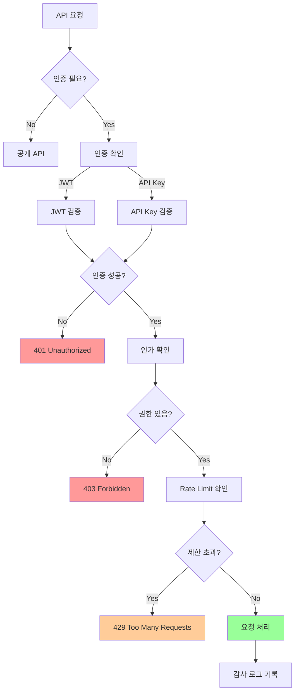

# 03. 접근 제어 설계

## 1. 문서 개요

본 문서는 ABS의 관리 API 및 리소스에 대한 접근 제어 메커니즘을 정의합니다.

### 1.1 포함 내용

- 역할 기반 접근 제어 (RBAC)
- API 인증/인가 메커니즘
- JWT 기반 토큰 관리
- API Key 관리
- IP 화이트리스트
- Rate Limiting
- 감사 로그 연동

### 1.2 접근 제어 아키텍처



## 2. 역할 기반 접근 제어 (RBAC)

### 2.1 역할 정의

| 역할 | 코드 | 설명 | 권한 |
|-----|------|------|------|
| 시스템 관리자 | SYSTEM_ADMIN | 전체 시스템 관리 | 모든 권한 |
| 운영자 | OPERATOR | 라우트 및 실험 관리 | 라우트/실험 생성/수정/삭제, 통계 조회 |
| 개발자 | DEVELOPER | 모니터링 및 조회 | 라우트/실험 조회, 통계 조회 |
| 뷰어 | VIEWER | 읽기 전용 | 조회만 가능 |
| API 클라이언트 | API_CLIENT | 외부 시스템 연동 | API Key 기반, 제한된 엔드포인트 |

### 2.2 권한 정의

```go
package auth

// Permission 권한
type Permission string

const (
    // 라우트 관리
    PermissionRouteCreate  Permission = "route:create"
    PermissionRouteRead    Permission = "route:read"
    PermissionRouteUpdate  Permission = "route:update"
    PermissionRouteDelete  Permission = "route:delete"
    PermissionRouteSwitch  Permission = "route:switch"

    // 실험 관리
    PermissionExperimentCreate Permission = "experiment:create"
    PermissionExperimentRead   Permission = "experiment:read"
    PermissionExperimentUpdate Permission = "experiment:update"
    PermissionExperimentDelete Permission = "experiment:delete"
    PermissionExperimentStart  Permission = "experiment:start"
    PermissionExperimentStop   Permission = "experiment:stop"

    // 통계/모니터링
    PermissionStatsRead      Permission = "stats:read"
    PermissionMetricsRead    Permission = "metrics:read"
    PermissionLogsRead       Permission = "logs:read"
    PermissionLogsReadAudit  Permission = "logs:read:audit"

    // 시스템 관리
    PermissionConfigRead   Permission = "config:read"
    PermissionConfigWrite  Permission = "config:write"
    PermissionUserManage   Permission = "user:manage"
    PermissionSystemManage Permission = "system:manage"
)

// Role 역할
type Role struct {
    Code        string       `json:"code"`
    Name        string       `json:"name"`
    Description string       `json:"description"`
    Permissions []Permission `json:"permissions"`
}

// 역할별 권한 매핑
var rolePermissions = map[string][]Permission{
    "SYSTEM_ADMIN": {
        // 모든 권한
        PermissionRouteCreate, PermissionRouteRead, PermissionRouteUpdate, PermissionRouteDelete, PermissionRouteSwitch,
        PermissionExperimentCreate, PermissionExperimentRead, PermissionExperimentUpdate, PermissionExperimentDelete,
        PermissionExperimentStart, PermissionExperimentStop,
        PermissionStatsRead, PermissionMetricsRead, PermissionLogsRead, PermissionLogsReadAudit,
        PermissionConfigRead, PermissionConfigWrite, PermissionUserManage, PermissionSystemManage,
    },
    "OPERATOR": {
        PermissionRouteCreate, PermissionRouteRead, PermissionRouteUpdate, PermissionRouteDelete, PermissionRouteSwitch,
        PermissionExperimentCreate, PermissionExperimentRead, PermissionExperimentUpdate, PermissionExperimentDelete,
        PermissionExperimentStart, PermissionExperimentStop,
        PermissionStatsRead, PermissionMetricsRead, PermissionLogsRead,
    },
    "DEVELOPER": {
        PermissionRouteRead,
        PermissionExperimentRead,
        PermissionStatsRead, PermissionMetricsRead, PermissionLogsRead,
    },
    "VIEWER": {
        PermissionRouteRead,
        PermissionExperimentRead,
        PermissionStatsRead,
    },
    "API_CLIENT": {
        PermissionRouteRead,
        PermissionStatsRead,
    },
}

// GetRole 역할 조회
func GetRole(code string) *Role {
    permissions, exists := rolePermissions[code]
    if !exists {
        return nil
    }

    return &Role{
        Code:        code,
        Permissions: permissions,
    }
}

// HasPermission 권한 확인
func (r *Role) HasPermission(permission Permission) bool {
    for _, p := range r.Permissions {
        if p == permission {
            return true
        }
    }
    return false
}
```

## 3. JWT 기반 인증

### 3.1 JWT 토큰 구조

```json
{
  "header": {
    "alg": "HS256",
    "typ": "JWT"
  },
  "payload": {
    "sub": "user-123",
    "name": "Hong Gildong",
    "role": "OPERATOR",
    "permissions": [
      "route:create",
      "route:read",
      "route:update"
    ],
    "iat": 1638316800,
    "exp": 1638320400,
    "iss": "abs-api"
  }
}
```

### 3.2 JWT 관리자 구현

```go
package auth

import (
    "errors"
    "time"

    "github.com/golang-jwt/jwt/v5"
)

var (
    ErrInvalidToken = errors.New("invalid token")
    ErrExpiredToken = errors.New("expired token")
)

// Claims JWT Claims
type Claims struct {
    UserID      string       `json:"sub"`
    Name        string       `json:"name"`
    Role        string       `json:"role"`
    Permissions []Permission `json:"permissions"`
    jwt.RegisteredClaims
}

// JWTManager JWT 토큰 관리
type JWTManager struct {
    secretKey     []byte
    tokenDuration time.Duration
    issuer        string
}

func NewJWTManager(secretKey string, tokenDuration time.Duration) *JWTManager {
    return &JWTManager{
        secretKey:     []byte(secretKey),
        tokenDuration: tokenDuration,
        issuer:        "abs-api",
    }
}

// Generate JWT 토큰 생성
func (m *JWTManager) Generate(userID, name, roleCode string) (string, error) {
    role := GetRole(roleCode)
    if role == nil {
        return "", errors.New("invalid role")
    }

    now := time.Now()
    claims := &Claims{
        UserID:      userID,
        Name:        name,
        Role:        roleCode,
        Permissions: role.Permissions,
        RegisteredClaims: jwt.RegisteredClaims{
            IssuedAt:  jwt.NewNumericDate(now),
            ExpiresAt: jwt.NewNumericDate(now.Add(m.tokenDuration)),
            Issuer:    m.issuer,
        },
    }

    token := jwt.NewWithClaims(jwt.SigningMethodHS256, claims)
    return token.SignedString(m.secretKey)
}

// Verify JWT 토큰 검증
func (m *JWTManager) Verify(tokenString string) (*Claims, error) {
    token, err := jwt.ParseWithClaims(
        tokenString,
        &Claims{},
        func(token *jwt.Token) (interface{}, error) {
            return m.secretKey, nil
        },
    )

    if err != nil {
        if errors.Is(err, jwt.ErrTokenExpired) {
            return nil, ErrExpiredToken
        }
        return nil, ErrInvalidToken
    }

    claims, ok := token.Claims.(*Claims)
    if !ok || !token.Valid {
        return nil, ErrInvalidToken
    }

    return claims, nil
}

// Refresh JWT 토큰 갱신
func (m *JWTManager) Refresh(tokenString string) (string, error) {
    claims, err := m.Verify(tokenString)
    if err != nil && !errors.Is(err, ErrExpiredToken) {
        return "", err
    }

    // 새 토큰 생성
    return m.Generate(claims.UserID, claims.Name, claims.Role)
}
```

### 3.3 JWT 인증 미들웨어

```go
package middleware

import (
    "net/http"
    "strings"

    "demo-abs/internal/infrastructure/auth"
    "github.com/gin-gonic/gin"
)

// JWTAuthMiddleware JWT 인증 미들웨어
func JWTAuthMiddleware(jwtManager *auth.JWTManager) gin.HandlerFunc {
    return func(c *gin.Context) {
        // Authorization 헤더에서 토큰 추출
        authHeader := c.GetHeader("Authorization")
        if authHeader == "" {
            c.AbortWithStatusJSON(http.StatusUnauthorized, gin.H{
                "error": "authorization header is required",
            })
            return
        }

        // Bearer 토큰 파싱
        parts := strings.SplitN(authHeader, " ", 2)
        if len(parts) != 2 || parts[0] != "Bearer" {
            c.AbortWithStatusJSON(http.StatusUnauthorized, gin.H{
                "error": "invalid authorization header format",
            })
            return
        }

        tokenString := parts[1]

        // 토큰 검증
        claims, err := jwtManager.Verify(tokenString)
        if err != nil {
            status := http.StatusUnauthorized
            message := "invalid token"

            if err == auth.ErrExpiredToken {
                message = "token expired"
            }

            c.AbortWithStatusJSON(status, gin.H{
                "error": message,
            })
            return
        }

        // Context에 사용자 정보 저장
        c.Set("user_id", claims.UserID)
        c.Set("role", claims.Role)
        c.Set("permissions", claims.Permissions)

        c.Next()
    }
}
```

## 4. API Key 인증

### 4.1 API Key 모델

```go
package model

import (
    "crypto/rand"
    "encoding/hex"
    "time"
)

// APIKey API 키
type APIKey struct {
    ID          string    `db:"id" json:"id"`
    Key         string    `db:"key" json:"key"`
    Name        string    `db:"name" json:"name"`
    Description string    `db:"description" json:"description"`
    Role        string    `db:"role" json:"role"`
    Active      bool      `db:"active" json:"active"`
    ExpiresAt   time.Time `db:"expires_at" json:"expires_at"`
    CreatedAt   time.Time `db:"created_at" json:"created_at"`
    UpdatedAt   time.Time `db:"updated_at" json:"updated_at"`
    LastUsedAt  *time.Time `db:"last_used_at" json:"last_used_at,omitempty"`
}

// GenerateAPIKey API 키 생성
func GenerateAPIKey() (string, error) {
    bytes := make([]byte, 32)
    if _, err := rand.Read(bytes); err != nil {
        return "", err
    }

    return "abs_" + hex.EncodeToString(bytes), nil
}

// IsExpired 만료 여부 확인
func (a *APIKey) IsExpired() bool {
    return time.Now().After(a.ExpiresAt)
}

// IsValid 유효성 확인
func (a *APIKey) IsValid() bool {
    return a.Active && !a.IsExpired()
}
```

### 4.2 API Key 저장소

```go
package repository

import (
    "context"
    "database/sql"
    "time"

    "demo-abs/internal/domain/model"
)

// APIKeyRepository API Key 저장소
type APIKeyRepository interface {
    FindByKey(ctx context.Context, key string) (*model.APIKey, error)
    Create(ctx context.Context, apiKey *model.APIKey) error
    UpdateLastUsed(ctx context.Context, key string) error
    Revoke(ctx context.Context, id string) error
}

type apiKeyRepositoryImpl struct {
    db *sql.DB
}

func NewAPIKeyRepository(db *sql.DB) APIKeyRepository {
    return &apiKeyRepositoryImpl{db: db}
}

// FindByKey API Key 조회
func (r *apiKeyRepositoryImpl) FindByKey(ctx context.Context, key string) (*model.APIKey, error) {
    query := `
        SELECT id, key, name, description, role, active, expires_at, created_at, updated_at, last_used_at
        FROM api_keys
        WHERE key = $1
    `

    var apiKey model.APIKey
    err := r.db.QueryRowContext(ctx, query, key).Scan(
        &apiKey.ID,
        &apiKey.Key,
        &apiKey.Name,
        &apiKey.Description,
        &apiKey.Role,
        &apiKey.Active,
        &apiKey.ExpiresAt,
        &apiKey.CreatedAt,
        &apiKey.UpdatedAt,
        &apiKey.LastUsedAt,
    )

    if err == sql.ErrNoRows {
        return nil, nil
    }

    if err != nil {
        return nil, err
    }

    return &apiKey, nil
}

// Create API Key 생성
func (r *apiKeyRepositoryImpl) Create(ctx context.Context, apiKey *model.APIKey) error {
    query := `
        INSERT INTO api_keys (id, key, name, description, role, active, expires_at, created_at, updated_at)
        VALUES ($1, $2, $3, $4, $5, $6, $7, $8, $9)
    `

    _, err := r.db.ExecContext(ctx, query,
        apiKey.ID,
        apiKey.Key,
        apiKey.Name,
        apiKey.Description,
        apiKey.Role,
        apiKey.Active,
        apiKey.ExpiresAt,
        apiKey.CreatedAt,
        apiKey.UpdatedAt,
    )

    return err
}

// UpdateLastUsed 마지막 사용 시간 업데이트
func (r *apiKeyRepositoryImpl) UpdateLastUsed(ctx context.Context, key string) error {
    query := `
        UPDATE api_keys
        SET last_used_at = $1
        WHERE key = $2
    `

    _, err := r.db.ExecContext(ctx, query, time.Now(), key)
    return err
}

// Revoke API Key 폐기
func (r *apiKeyRepositoryImpl) Revoke(ctx context.Context, id string) error {
    query := `
        UPDATE api_keys
        SET active = false, updated_at = $1
        WHERE id = $2
    `

    _, err := r.db.ExecContext(ctx, query, time.Now(), id)
    return err
}
```

### 4.3 API Key 인증 미들웨어

```go
package middleware

import (
    "context"
    "net/http"
    "strings"

    "demo-abs/internal/domain/repository"
    "github.com/gin-gonic/gin"
)

// APIKeyAuthMiddleware API Key 인증 미들웨어
func APIKeyAuthMiddleware(apiKeyRepo repository.APIKeyRepository) gin.HandlerFunc {
    return func(c *gin.Context) {
        // X-API-Key 헤더에서 API Key 추출
        apiKey := c.GetHeader("X-API-Key")
        if apiKey == "" {
            c.AbortWithStatusJSON(http.StatusUnauthorized, gin.H{
                "error": "API key is required",
            })
            return
        }

        // API Key 접두사 확인
        if !strings.HasPrefix(apiKey, "abs_") {
            c.AbortWithStatusJSON(http.StatusUnauthorized, gin.H{
                "error": "invalid API key format",
            })
            return
        }

        // API Key 조회
        ctx := context.Background()
        key, err := apiKeyRepo.FindByKey(ctx, apiKey)
        if err != nil {
            c.AbortWithStatusJSON(http.StatusInternalServerError, gin.H{
                "error": "failed to verify API key",
            })
            return
        }

        if key == nil {
            c.AbortWithStatusJSON(http.StatusUnauthorized, gin.H{
                "error": "invalid API key",
            })
            return
        }

        // API Key 유효성 확인
        if !key.IsValid() {
            message := "API key is inactive"
            if key.IsExpired() {
                message = "API key has expired"
            }

            c.AbortWithStatusJSON(http.StatusUnauthorized, gin.H{
                "error": message,
            })
            return
        }

        // 마지막 사용 시간 업데이트 (비동기)
        go apiKeyRepo.UpdateLastUsed(context.Background(), apiKey)

        // Context에 API Key 정보 저장
        c.Set("api_key_id", key.ID)
        c.Set("api_key_name", key.Name)
        c.Set("role", key.Role)

        c.Next()
    }
}
```

## 5. 권한 검증 미들웨어

### 5.1 권한 확인 미들웨어

```go
package middleware

import (
    "net/http"

    "demo-abs/internal/infrastructure/auth"
    "github.com/gin-gonic/gin"
)

// RequirePermission 권한 확인 미들웨어
func RequirePermission(requiredPermission auth.Permission) gin.HandlerFunc {
    return func(c *gin.Context) {
        // Context에서 권한 목록 가져오기
        permissionsInterface, exists := c.Get("permissions")
        if !exists {
            c.AbortWithStatusJSON(http.StatusForbidden, gin.H{
                "error": "permissions not found",
            })
            return
        }

        permissions, ok := permissionsInterface.([]auth.Permission)
        if !ok {
            c.AbortWithStatusJSON(http.StatusForbidden, gin.H{
                "error": "invalid permissions format",
            })
            return
        }

        // 권한 확인
        hasPermission := false
        for _, p := range permissions {
            if p == requiredPermission {
                hasPermission = true
                break
            }
        }

        if !hasPermission {
            c.AbortWithStatusJSON(http.StatusForbidden, gin.H{
                "error":      "insufficient permissions",
                "required":   requiredPermission,
            })
            return
        }

        c.Next()
    }
}

// RequireAnyPermission 여러 권한 중 하나 확인
func RequireAnyPermission(requiredPermissions ...auth.Permission) gin.HandlerFunc {
    return func(c *gin.Context) {
        permissionsInterface, exists := c.Get("permissions")
        if !exists {
            c.AbortWithStatusJSON(http.StatusForbidden, gin.H{
                "error": "permissions not found",
            })
            return
        }

        permissions, ok := permissionsInterface.([]auth.Permission)
        if !ok {
            c.AbortWithStatusJSON(http.StatusForbidden, gin.H{
                "error": "invalid permissions format",
            })
            return
        }

        // 권한 확인
        hasPermission := false
        for _, required := range requiredPermissions {
            for _, p := range permissions {
                if p == required {
                    hasPermission = true
                    break
                }
            }
            if hasPermission {
                break
            }
        }

        if !hasPermission {
            c.AbortWithStatusJSON(http.StatusForbidden, gin.H{
                "error":    "insufficient permissions",
                "required": requiredPermissions,
            })
            return
        }

        c.Next()
    }
}
```

### 5.2 라우트 설정 예시

```go
package router

import (
    "demo-abs/internal/adapter/http/handler"
    "demo-abs/internal/adapter/http/middleware"
    "demo-abs/internal/infrastructure/auth"
    "github.com/gin-gonic/gin"
)

func SetupRoutes(
    r *gin.Engine,
    jwtManager *auth.JWTManager,
    handlers *handler.Handlers,
) {
    // 공개 API
    public := r.Group("/abs/api/v1")
    {
        public.GET("/health", handlers.Health.Check)
    }

    // JWT 인증 필요
    protected := r.Group("/abs/api/v1")
    protected.Use(middleware.JWTAuthMiddleware(jwtManager))
    {
        // 라우트 관리
        routes := protected.Group("/routes")
        {
            // 조회: DEVELOPER 이상
            routes.GET("",
                middleware.RequirePermission(auth.PermissionRouteRead),
                handlers.Route.List)
            routes.GET("/:id",
                middleware.RequirePermission(auth.PermissionRouteRead),
                handlers.Route.Get)

            // 생성/수정/삭제: OPERATOR 이상
            routes.POST("",
                middleware.RequirePermission(auth.PermissionRouteCreate),
                handlers.Route.Create)
            routes.PUT("/:id",
                middleware.RequirePermission(auth.PermissionRouteUpdate),
                handlers.Route.Update)
            routes.DELETE("/:id",
                middleware.RequirePermission(auth.PermissionRouteDelete),
                handlers.Route.Delete)

            // 전환: OPERATOR 이상
            routes.POST("/:id/switch",
                middleware.RequirePermission(auth.PermissionRouteSwitch),
                handlers.Route.Switch)
        }

        // 통계 조회: DEVELOPER 이상
        stats := protected.Group("/stats")
        stats.Use(middleware.RequirePermission(auth.PermissionStatsRead))
        {
            stats.GET("/daily", handlers.Stats.GetDaily)
            stats.GET("/summary", handlers.Stats.GetSummary)
        }

        // 로그 조회
        logs := protected.Group("/logs")
        {
            logs.GET("",
                middleware.RequirePermission(auth.PermissionLogsRead),
                handlers.Logs.GetLogs)

            // 감사 로그: 보안 관리자만
            logs.GET("/audit",
                middleware.RequirePermission(auth.PermissionLogsReadAudit),
                handlers.Logs.GetAuditLogs)
        }

        // 시스템 관리: SYSTEM_ADMIN만
        system := protected.Group("/system")
        system.Use(middleware.RequirePermission(auth.PermissionSystemManage))
        {
            system.POST("/shutdown", handlers.System.Shutdown)
            system.POST("/config/reload", handlers.System.ReloadConfig)
        }
    }
}
```

## 6. IP 화이트리스트

### 6.1 IP 화이트리스트 설정

```yaml
# config/security.yaml
security:
  ip_whitelist:
    enabled: true
    # 허용 IP 목록
    allowed_ips:
      - "192.168.1.0/24"      # 내부 네트워크
      - "10.0.0.0/8"          # 개발 네트워크
      - "172.16.0.100"        # 특정 서버
    # 화이트리스트 제외 경로 (공개 API)
    excluded_paths:
      - "/abs/api/v1/health"
      - "/metrics"
```

### 6.2 IP 화이트리스트 미들웨어

```go
package middleware

import (
    "net"
    "net/http"
    "strings"

    "github.com/gin-gonic/gin"
)

// IPWhitelistConfig IP 화이트리스트 설정
type IPWhitelistConfig struct {
    Enabled       bool     `yaml:"enabled"`
    AllowedIPs    []string `yaml:"allowed_ips"`
    ExcludedPaths []string `yaml:"excluded_paths"`
}

// IPWhitelistMiddleware IP 화이트리스트 미들웨어
func IPWhitelistMiddleware(config IPWhitelistConfig) gin.HandlerFunc {
    // CIDR 파싱
    var allowedNetworks []*net.IPNet
    for _, cidr := range config.AllowedIPs {
        if strings.Contains(cidr, "/") {
            _, network, err := net.ParseCIDR(cidr)
            if err == nil {
                allowedNetworks = append(allowedNetworks, network)
            }
        } else {
            // 단일 IP: /32 추가
            _, network, err := net.ParseCIDR(cidr + "/32")
            if err == nil {
                allowedNetworks = append(allowedNetworks, network)
            }
        }
    }

    return func(c *gin.Context) {
        // 비활성화 상태
        if !config.Enabled {
            c.Next()
            return
        }

        // 제외 경로 확인
        path := c.Request.URL.Path
        for _, excluded := range config.ExcludedPaths {
            if path == excluded || strings.HasPrefix(path, excluded) {
                c.Next()
                return
            }
        }

        // 클라이언트 IP 추출
        clientIP := getClientIP(c)
        ip := net.ParseIP(clientIP)
        if ip == nil {
            c.AbortWithStatusJSON(http.StatusForbidden, gin.H{
                "error": "invalid client IP",
            })
            return
        }

        // IP 화이트리스트 확인
        allowed := false
        for _, network := range allowedNetworks {
            if network.Contains(ip) {
                allowed = true
                break
            }
        }

        if !allowed {
            c.AbortWithStatusJSON(http.StatusForbidden, gin.H{
                "error": "IP not allowed",
                "ip":    clientIP,
            })
            return
        }

        c.Next()
    }
}

// getClientIP 클라이언트 IP 추출
func getClientIP(c *gin.Context) string {
    // X-Forwarded-For 헤더 확인 (프록시 경유)
    if xff := c.GetHeader("X-Forwarded-For"); xff != "" {
        ips := strings.Split(xff, ",")
        return strings.TrimSpace(ips[0])
    }

    // X-Real-IP 헤더 확인
    if xri := c.GetHeader("X-Real-IP"); xri != "" {
        return xri
    }

    // RemoteAddr 사용
    ip, _, _ := net.SplitHostPort(c.Request.RemoteAddr)
    return ip
}
```

## 7. Rate Limiting

### 7.1 Rate Limit 설정

```yaml
# config/security.yaml
security:
  rate_limiting:
    enabled: true
    # 전역 Rate Limit
    global:
      requests_per_second: 1000
      burst: 2000
    # 엔드포인트별 Rate Limit
    endpoints:
      - path: "/abs/api/v1/routes"
        method: "POST"
        requests_per_second: 10
        burst: 20
      - path: "/abs/api/v1/experiments"
        method: "POST"
        requests_per_second: 5
        burst: 10
    # IP별 Rate Limit
    per_ip:
      requests_per_second: 100
      burst: 200
```

### 7.2 Rate Limiter 구현

```go
package ratelimit

import (
    "sync"
    "time"

    "golang.org/x/time/rate"
)

// RateLimiter Rate Limiter
type RateLimiter struct {
    limiters map[string]*rate.Limiter
    mu       sync.RWMutex
    rps      rate.Limit
    burst    int
}

func NewRateLimiter(requestsPerSecond int, burst int) *RateLimiter {
    return &RateLimiter{
        limiters: make(map[string]*rate.Limiter),
        rps:      rate.Limit(requestsPerSecond),
        burst:    burst,
    }
}

// GetLimiter 키별 Limiter 조회 또는 생성
func (rl *RateLimiter) GetLimiter(key string) *rate.Limiter {
    rl.mu.Lock()
    defer rl.mu.Unlock()

    limiter, exists := rl.limiters[key]
    if !exists {
        limiter = rate.NewLimiter(rl.rps, rl.burst)
        rl.limiters[key] = limiter

        // 10분 후 자동 삭제 (메모리 누수 방지)
        go func(k string) {
            time.Sleep(10 * time.Minute)
            rl.mu.Lock()
            delete(rl.limiters, k)
            rl.mu.Unlock()
        }(key)
    }

    return limiter
}

// Allow 요청 허용 여부 확인
func (rl *RateLimiter) Allow(key string) bool {
    limiter := rl.GetLimiter(key)
    return limiter.Allow()
}
```

### 7.3 Rate Limiting 미들웨어

```go
package middleware

import (
    "net/http"

    "demo-abs/internal/infrastructure/ratelimit"
    "github.com/gin-gonic/gin"
)

// RateLimitMiddleware Rate Limiting 미들웨어
func RateLimitMiddleware(limiter *ratelimit.RateLimiter) gin.HandlerFunc {
    return func(c *gin.Context) {
        // 클라이언트 IP 기반 Rate Limit
        clientIP := getClientIP(c)

        if !limiter.Allow(clientIP) {
            c.AbortWithStatusJSON(http.StatusTooManyRequests, gin.H{
                "error": "rate limit exceeded",
                "retry_after": "1s",
            })
            return
        }

        c.Next()
    }
}

// PerEndpointRateLimitMiddleware 엔드포인트별 Rate Limiting
func PerEndpointRateLimitMiddleware(limiter *ratelimit.RateLimiter) gin.HandlerFunc {
    return func(c *gin.Context) {
        // 엔드포인트 + IP 조합으로 키 생성
        key := c.Request.Method + ":" + c.Request.URL.Path + ":" + getClientIP(c)

        if !limiter.Allow(key) {
            c.AbortWithStatusJSON(http.StatusTooManyRequests, gin.H{
                "error": "endpoint rate limit exceeded",
                "retry_after": "1s",
            })
            return
        }

        c.Next()
    }
}
```

## 8. Redis 기반 Rate Limiting (분산 환경)

### 8.1 Redis Rate Limiter

```go
package ratelimit

import (
    "context"
    "fmt"
    "time"

    "github.com/go-redis/redis/v8"
)

// RedisRateLimiter Redis 기반 Rate Limiter
type RedisRateLimiter struct {
    client *redis.Client
    limit  int           // 제한 횟수
    window time.Duration // 시간 윈도우
}

func NewRedisRateLimiter(client *redis.Client, limit int, window time.Duration) *RedisRateLimiter {
    return &RedisRateLimiter{
        client: client,
        limit:  limit,
        window: window,
    }
}

// Allow Sliding Window 알고리즘으로 요청 허용 여부 확인
func (r *RedisRateLimiter) Allow(ctx context.Context, key string) (bool, error) {
    now := time.Now()
    windowStart := now.Add(-r.window)

    redisKey := fmt.Sprintf("ratelimit:%s", key)

    pipe := r.client.Pipeline()

    // 1. 오래된 요청 삭제
    pipe.ZRemRangeByScore(ctx, redisKey, "0", fmt.Sprintf("%d", windowStart.UnixNano()))

    // 2. 현재 윈도우 내 요청 수 조회
    pipe.ZCard(ctx, redisKey)

    // 3. 현재 요청 추가
    pipe.ZAdd(ctx, redisKey, &redis.Z{
        Score:  float64(now.UnixNano()),
        Member: now.UnixNano(),
    })

    // 4. TTL 설정
    pipe.Expire(ctx, redisKey, r.window+time.Minute)

    cmds, err := pipe.Exec(ctx)
    if err != nil && err != redis.Nil {
        return false, err
    }

    // 요청 수 확인
    count := cmds[1].(*redis.IntCmd).Val()

    return count < int64(r.limit), nil
}
```

## 9. 감사 로그 연동

### 9.1 접근 제어 이벤트 로깅

```go
package middleware

import (
    "demo-abs/internal/audit"
    "github.com/gin-gonic/gin"
)

// AuditLogMiddleware 감사 로그 미들웨어
func AuditLogMiddleware(auditLogger *audit.AuditLogger) gin.HandlerFunc {
    return func(c *gin.Context) {
        // 요청 처리
        c.Next()

        // 인증/인가 실패 시 감사 로그 기록
        if c.Writer.Status() == 401 {
            auditLogger.Log(audit.AuditEvent{
                EventType: audit.EventUnauthorized,
                UserIP:    getClientIP(c),
                Resource:  c.Request.URL.Path,
                Action:    c.Request.Method,
                Result:    "FAILURE",
                Details: map[string]interface{}{
                    "reason": "unauthorized",
                },
            })
        }

        if c.Writer.Status() == 403 {
            userID, _ := c.Get("user_id")
            auditLogger.Log(audit.AuditEvent{
                EventType: audit.EventUnauthorized,
                UserID:    userID.(string),
                UserIP:    getClientIP(c),
                Resource:  c.Request.URL.Path,
                Action:    c.Request.Method,
                Result:    "FAILURE",
                Details: map[string]interface{}{
                    "reason": "forbidden",
                },
            })
        }
    }
}
```

## 10. 테스트 전략

### 10.1 인증 테스트

```go
package auth_test

import (
    "testing"
    "time"

    "demo-abs/internal/infrastructure/auth"
    "github.com/stretchr/testify/assert"
)

func TestJWTManager_Generate(t *testing.T) {
    manager := auth.NewJWTManager("test-secret", 1*time.Hour)

    token, err := manager.Generate("user-123", "Test User", "OPERATOR")
    assert.NoError(t, err)
    assert.NotEmpty(t, token)
}

func TestJWTManager_Verify(t *testing.T) {
    manager := auth.NewJWTManager("test-secret", 1*time.Hour)

    token, _ := manager.Generate("user-123", "Test User", "OPERATOR")

    claims, err := manager.Verify(token)
    assert.NoError(t, err)
    assert.Equal(t, "user-123", claims.UserID)
    assert.Equal(t, "OPERATOR", claims.Role)
}

func TestJWTManager_ExpiredToken(t *testing.T) {
    manager := auth.NewJWTManager("test-secret", -1*time.Hour) // 이미 만료

    token, _ := manager.Generate("user-123", "Test User", "OPERATOR")

    _, err := manager.Verify(token)
    assert.Equal(t, auth.ErrExpiredToken, err)
}
```

### 10.2 권한 테스트

```go
package auth_test

import (
    "testing"

    "demo-abs/internal/infrastructure/auth"
    "github.com/stretchr/testify/assert"
)

func TestRole_HasPermission(t *testing.T) {
    role := auth.GetRole("OPERATOR")

    assert.True(t, role.HasPermission(auth.PermissionRouteCreate))
    assert.True(t, role.HasPermission(auth.PermissionRouteRead))
    assert.False(t, role.HasPermission(auth.PermissionSystemManage))
}

func TestRole_Viewer(t *testing.T) {
    role := auth.GetRole("VIEWER")

    assert.True(t, role.HasPermission(auth.PermissionRouteRead))
    assert.False(t, role.HasPermission(auth.PermissionRouteCreate))
}
```

### 10.3 Rate Limiting 테스트

```go
package ratelimit_test

import (
    "testing"
    "time"

    "demo-abs/internal/infrastructure/ratelimit"
    "github.com/stretchr/testify/assert"
)

func TestRateLimiter_Allow(t *testing.T) {
    limiter := ratelimit.NewRateLimiter(10, 10) // 10 RPS, burst 10

    // 10개 요청 허용
    for i := 0; i < 10; i++ {
        assert.True(t, limiter.Allow("test-key"))
    }

    // 11번째 요청 거부
    assert.False(t, limiter.Allow("test-key"))

    // 1초 후 다시 허용
    time.Sleep(1 * time.Second)
    assert.True(t, limiter.Allow("test-key"))
}
```

## 11. 모니터링

### 11.1 접근 제어 메트릭

```go
package metrics

import (
    "github.com/prometheus/client_golang/prometheus"
    "github.com/prometheus/client_golang/prometheus/promauto"
)

var (
    // 인증 시도
    authAttempts = promauto.NewCounterVec(
        prometheus.CounterOpts{
            Name: "abs_auth_attempts_total",
            Help: "Total number of authentication attempts",
        },
        []string{"method", "result"}, // method: jwt, api_key / result: success, failure
    )

    // 권한 확인
    authzChecks = promauto.NewCounterVec(
        prometheus.CounterOpts{
            Name: "abs_authz_checks_total",
            Help: "Total number of authorization checks",
        },
        []string{"permission", "result"},
    )

    // Rate Limit
    rateLimitHits = promauto.NewCounterVec(
        prometheus.CounterOpts{
            Name: "abs_rate_limit_hits_total",
            Help: "Total number of rate limit hits",
        },
        []string{"endpoint", "client_ip"},
    )

    // API Key 사용
    apiKeyUsage = promauto.NewCounterVec(
        prometheus.CounterOpts{
            Name: "abs_api_key_usage_total",
            Help: "Total number of API key usages",
        },
        []string{"api_key_name"},
    )
)
```

## 12. 참고 자료

- JWT Best Practices: https://tools.ietf.org/html/rfc8725
- OWASP Authentication Cheat Sheet
- NIST SP 800-63B - Digital Identity Guidelines
- OAuth 2.0 Security Best Current Practice

## 13. 구현 위치

```
internal/
├── infrastructure/
│   ├── auth/
│   │   ├── jwt.go                # JWT 관리
│   │   ├── permission.go         # 권한 정의
│   │   ├── role.go               # 역할 정의
│   │   └── auth_test.go          # 테스트
│   └── ratelimit/
│       ├── rate_limiter.go       # Rate Limiter
│       ├── redis_limiter.go      # Redis Rate Limiter
│       └── limiter_test.go       # 테스트
├── domain/
│   ├── model/
│   │   └── api_key.go            # API Key 모델
│   └── repository/
│       └── api_key_repository.go # API Key 저장소
├── adapter/
│   └── http/
│       └── middleware/
│           ├── jwt_auth.go       # JWT 인증 미들웨어
│           ├── api_key_auth.go   # API Key 인증 미들웨어
│           ├── permission.go     # 권한 확인 미들웨어
│           ├── ip_whitelist.go   # IP 화이트리스트
│           ├── rate_limit.go     # Rate Limiting
│           └── audit_log.go      # 감사 로그
config/
└── security.yaml                  # 보안 설정
```

---

최종 수정일: 2025-11-30, 작성자: ABS 개발팀
