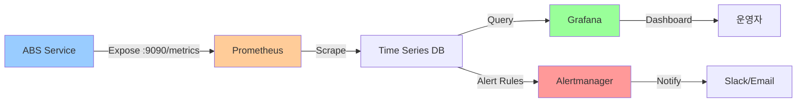
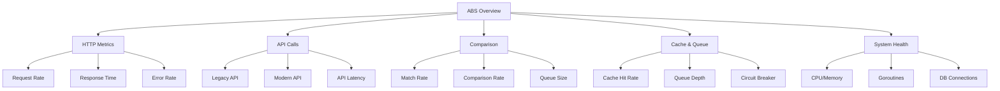

# 01. 메트릭 설계

## 1. 문서 개요

본 문서는 ABS의 시스템 및 비즈니스 메트릭 설계와 Prometheus 기반 모니터링 전략을 정의합니다.

### 1.1 포함 내용

- Prometheus 메트릭 타입별 정의
- HTTP 요청 메트릭
- 비교 로직 메트릭
- Circuit Breaker 메트릭
- 캐시 메트릭
- 메시지 큐 메트릭
- 비즈니스 메트릭
- Grafana 대시보드 설계
- 메트릭 수집 및 보관 정책

### 1.2 모니터링 아키텍처



## 2. Prometheus 메트릭 타입

### 2.1 메트릭 타입 개요

| 타입 | 설명 | 사용 예시 | 집계 함수 |
|-----|------|---------|---------|
| Counter | 증가만 하는 카운터 | 요청 수, 에러 수 | rate(), increase() |
| Gauge | 증가/감소 가능한 값 | 동시 연결 수, 메모리 사용량 | avg(), max(), min() |
| Histogram | 값의 분포 측정 | 응답 시간, 요청 크기 | histogram_quantile() |
| Summary | 분위수 계산 | 응답 시간 백분위수 | quantile |

### 2.2 네이밍 규칙

```
# 형식: {namespace}_{subsystem}_{metric_name}_{unit}
abs_http_requests_total          # Counter
abs_cache_hits_total             # Counter
abs_active_connections           # Gauge
abs_request_duration_seconds     # Histogram
abs_comparison_match_rate        # Gauge
```

## 3. HTTP 요청 메트릭

### 3.1 메트릭 정의

```go
package metrics

import (
    "github.com/prometheus/client_golang/prometheus"
    "github.com/prometheus/client_golang/prometheus/promauto"
)

var (
    // HTTP 요청 총 수
    httpRequestsTotal = promauto.NewCounterVec(
        prometheus.CounterOpts{
            Name: "abs_http_requests_total",
            Help: "Total number of HTTP requests",
        },
        []string{"method", "path", "status"},
    )

    // HTTP 요청 처리 시간
    httpRequestDuration = promauto.NewHistogramVec(
        prometheus.HistogramOpts{
            Name:    "abs_http_request_duration_seconds",
            Help:    "HTTP request duration in seconds",
            Buckets: []float64{.001, .005, .01, .025, .05, .1, .25, .5, 1, 2.5, 5, 10},
        },
        []string{"method", "path"},
    )

    // HTTP 요청 크기
    httpRequestSize = promauto.NewHistogramVec(
        prometheus.HistogramOpts{
            Name:    "abs_http_request_size_bytes",
            Help:    "HTTP request size in bytes",
            Buckets: prometheus.ExponentialBuckets(100, 10, 8),
        },
        []string{"method", "path"},
    )

    // HTTP 응답 크기
    httpResponseSize = promauto.NewHistogramVec(
        prometheus.HistogramOpts{
            Name:    "abs_http_response_size_bytes",
            Help:    "HTTP response size in bytes",
            Buckets: prometheus.ExponentialBuckets(100, 10, 8),
        },
        []string{"method", "path"},
    )

    // 활성 요청 수
    httpActiveRequests = promauto.NewGauge(
        prometheus.GaugeOpts{
            Name: "abs_http_active_requests",
            Help: "Number of active HTTP requests",
        },
    )
)

// RecordHTTPRequest HTTP 요청 메트릭 기록
func RecordHTTPRequest(method, path string, status int, duration float64, reqSize, respSize int64) {
    httpRequestsTotal.WithLabelValues(method, path, strconv.Itoa(status)).Inc()
    httpRequestDuration.WithLabelValues(method, path).Observe(duration)
    httpRequestSize.WithLabelValues(method, path).Observe(float64(reqSize))
    httpResponseSize.WithLabelValues(method, path).Observe(float64(respSize))
}
```

### 3.2 미들웨어 구현

```go
package middleware

import (
    "time"

    "demo-abs/internal/infrastructure/metrics"
    "github.com/gin-gonic/gin"
)

// PrometheusMiddleware Prometheus 메트릭 수집 미들웨어
func PrometheusMiddleware() gin.HandlerFunc {
    return func(c *gin.Context) {
        start := time.Now()

        // 활성 요청 증가
        metrics.IncActiveRequests()
        defer metrics.DecActiveRequests()

        // 요청 크기
        reqSize := computeRequestSize(c.Request)

        // 다음 핸들러 실행
        c.Next()

        // 응답 크기
        respSize := c.Writer.Size()

        // 메트릭 기록
        duration := time.Since(start).Seconds()
        metrics.RecordHTTPRequest(
            c.Request.Method,
            c.FullPath(),
            c.Writer.Status(),
            duration,
            reqSize,
            int64(respSize),
        )
    }
}

func computeRequestSize(r *http.Request) int64 {
    size := int64(0)
    if r.ContentLength > 0 {
        size = r.ContentLength
    }
    return size
}
```

## 4. API 호출 메트릭 (Legacy/Modern)

### 4.1 메트릭 정의

```go
var (
    // Legacy/Modern API 호출 수
    apiCallsTotal = promauto.NewCounterVec(
        prometheus.CounterOpts{
            Name: "abs_api_calls_total",
            Help: "Total number of API calls to Legacy/Modern systems",
        },
        []string{"target", "endpoint", "status"}, // target: legacy, modern
    )

    // API 호출 응답 시간
    apiCallDuration = promauto.NewHistogramVec(
        prometheus.HistogramOpts{
            Name:    "abs_api_call_duration_seconds",
            Help:    "API call duration in seconds",
            Buckets: []float64{.01, .025, .05, .1, .25, .5, 1, 2.5, 5, 10},
        },
        []string{"target", "endpoint"},
    )

    // API 호출 에러
    apiCallErrors = promauto.NewCounterVec(
        prometheus.CounterOpts{
            Name: "abs_api_call_errors_total",
            Help: "Total number of API call errors",
        },
        []string{"target", "endpoint", "error_type"}, // error_type: network, timeout, http_error
    )

    // API 호출 재시도 횟수
    apiCallRetries = promauto.NewCounterVec(
        prometheus.CounterOpts{
            Name: "abs_api_call_retries_total",
            Help: "Total number of API call retries",
        },
        []string{"target", "endpoint"},
    )
)
```

## 5. 비교 로직 메트릭

### 5.1 메트릭 정의

```go
var (
    // 비교 작업 총 수
    comparisonsTotal = promauto.NewCounterVec(
        prometheus.CounterOpts{
            Name: "abs_comparisons_total",
            Help: "Total number of comparisons performed",
        },
        []string{"route_id", "result"}, // result: match, mismatch
    )

    // 비교 처리 시간
    comparisonDuration = promauto.NewHistogramVec(
        prometheus.HistogramOpts{
            Name:    "abs_comparison_duration_seconds",
            Help:    "Comparison processing duration in seconds",
            Buckets: []float64{.001, .005, .01, .025, .05, .1, .25, .5},
        },
        []string{"route_id"},
    )

    // 일치율 (실시간)
    matchRate = promauto.NewGaugeVec(
        prometheus.GaugeOpts{
            Name: "abs_match_rate",
            Help: "Current match rate for each route (0.0 to 1.0)",
        },
        []string{"route_id", "path"},
    )

    // 비교 대기 큐 크기
    comparisonQueueSize = promauto.NewGauge(
        prometheus.GaugeOpts{
            Name: "abs_comparison_queue_size",
            Help: "Number of comparisons waiting in queue",
        },
    )

    // JSON 필드 차이 수
    jsonFieldDifferences = promauto.NewHistogramVec(
        prometheus.HistogramOpts{
            Name:    "abs_json_field_differences",
            Help:    "Number of JSON field differences found",
            Buckets: prometheus.LinearBuckets(0, 5, 10), // 0, 5, 10, 15, ..., 45
        },
        []string{"route_id"},
    )
)

// UpdateMatchRate 일치율 업데이트
func UpdateMatchRate(routeID, path string, rate float64) {
    matchRate.WithLabelValues(routeID, path).Set(rate)
}
```

## 6. Circuit Breaker 메트릭

### 6.1 메트릭 정의

```go
var (
    // Circuit Breaker 상태
    circuitBreakerState = promauto.NewGaugeVec(
        prometheus.GaugeOpts{
            Name: "abs_circuit_breaker_state",
            Help: "Circuit breaker state (0=closed, 1=open, 2=half-open)",
        },
        []string{"name"},
    )

    // Circuit Breaker 상태 전환 횟수
    circuitBreakerTransitions = promauto.NewCounterVec(
        prometheus.CounterOpts{
            Name: "abs_circuit_breaker_transitions_total",
            Help: "Total number of circuit breaker state transitions",
        },
        []string{"name", "from", "to"},
    )

    // Circuit Breaker 실패 횟수
    circuitBreakerFailures = promauto.NewCounterVec(
        prometheus.CounterOpts{
            Name: "abs_circuit_breaker_failures_total",
            Help: "Total number of failures tracked by circuit breaker",
        },
        []string{"name"},
    )

    // Circuit Breaker에 의해 차단된 요청
    circuitBreakerRejections = promauto.NewCounterVec(
        prometheus.CounterOpts{
            Name: "abs_circuit_breaker_rejections_total",
            Help: "Total number of requests rejected by circuit breaker",
        },
        []string{"name"},
    )
)

// UpdateCircuitBreakerState Circuit Breaker 상태 업데이트
func UpdateCircuitBreakerState(name string, state int) {
    circuitBreakerState.WithLabelValues(name).Set(float64(state))
}
```

## 7. 캐시 메트릭

### 7.1 메트릭 정의

```go
var (
    // 캐시 히트/미스
    cacheRequests = promauto.NewCounterVec(
        prometheus.CounterOpts{
            Name: "abs_cache_requests_total",
            Help: "Total number of cache requests",
        },
        []string{"cache_name", "result"}, // result: hit, miss
    )

    // 캐시 작업 (get, set, delete)
    cacheOperations = promauto.NewCounterVec(
        prometheus.CounterOpts{
            Name: "abs_cache_operations_total",
            Help: "Total number of cache operations",
        },
        []string{"cache_name", "operation", "status"}, // operation: get, set, delete
    )

    // 캐시 작업 시간
    cacheOperationDuration = promauto.NewHistogramVec(
        prometheus.HistogramOpts{
            Name:    "abs_cache_operation_duration_seconds",
            Help:    "Cache operation duration in seconds",
            Buckets: []float64{.0001, .0005, .001, .005, .01, .025, .05, .1},
        },
        []string{"cache_name", "operation"},
    )

    // 캐시 키 개수
    cacheKeys = promauto.NewGaugeVec(
        prometheus.GaugeOpts{
            Name: "abs_cache_keys",
            Help: "Number of keys in cache",
        },
        []string{"cache_name"},
    )

    // 캐시 메모리 사용량 (바이트)
    cacheMemoryBytes = promauto.NewGaugeVec(
        prometheus.GaugeOpts{
            Name: "abs_cache_memory_bytes",
            Help: "Cache memory usage in bytes",
        },
        []string{"cache_name"},
    )

    // 캐시 히트율
    cacheHitRate = promauto.NewGaugeVec(
        prometheus.GaugeOpts{
            Name: "abs_cache_hit_rate",
            Help: "Cache hit rate (0.0 to 1.0)",
        },
        []string{"cache_name"},
    )
)
```

## 8. 메시지 큐 메트릭

### 8.1 메트릭 정의

```go
var (
    // 메시지 발행 수
    messagePublished = promauto.NewCounterVec(
        prometheus.CounterOpts{
            Name: "abs_message_published_total",
            Help: "Total number of messages published",
        },
        []string{"exchange", "routing_key", "status"},
    )

    // 메시지 소비 수
    messageConsumed = promauto.NewCounterVec(
        prometheus.CounterOpts{
            Name: "abs_message_consumed_total",
            Help: "Total number of messages consumed",
        },
        []string{"queue", "status"}, // status: ack, nack, requeue
    )

    // 메시지 처리 시간
    messageProcessingDuration = promauto.NewHistogramVec(
        prometheus.HistogramOpts{
            Name:    "abs_message_processing_duration_seconds",
            Help:    "Message processing duration in seconds",
            Buckets: []float64{.01, .05, .1, .25, .5, 1, 2.5, 5, 10},
        },
        []string{"queue"},
    )

    // 큐 메시지 수
    queueMessages = promauto.NewGaugeVec(
        prometheus.GaugeOpts{
            Name: "abs_queue_messages",
            Help: "Number of messages in queue",
        },
        []string{"queue"},
    )

    // DLQ 메시지 수
    dlqMessages = promauto.NewGaugeVec(
        prometheus.GaugeOpts{
            Name: "abs_dlq_messages",
            Help: "Number of messages in dead letter queue",
        },
        []string{"queue"},
    )

    // 메시지 재시도 횟수
    messageRetries = promauto.NewCounterVec(
        prometheus.CounterOpts{
            Name: "abs_message_retries_total",
            Help: "Total number of message retries",
        },
        []string{"queue"},
    )
)
```

## 9. 비즈니스 메트릭

### 9.1 메트릭 정의

```go
var (
    // 라우트 수
    routesTotal = promauto.NewGauge(
        prometheus.GaugeOpts{
            Name: "abs_routes_total",
            Help: "Total number of routes",
        },
    )

    // 운영 모드별 라우트 수
    routesByMode = promauto.NewGaugeVec(
        prometheus.GaugeOpts{
            Name: "abs_routes_by_mode",
            Help: "Number of routes by operation mode",
        },
        []string{"mode"}, // validation, canary, switched
    )

    // 실험 수
    experimentsTotal = promauto.NewGaugeVec(
        prometheus.GaugeOpts{
            Name: "abs_experiments_total",
            Help: "Total number of experiments",
        },
        []string{"status"}, // running, completed, failed
    )

    // 실험 진행 단계
    experimentStage = promauto.NewGaugeVec(
        prometheus.GaugeOpts{
            Name: "abs_experiment_stage",
            Help: "Current experiment stage (1=10%, 2=25%, 3=50%, 4=100%)",
        },
        []string{"experiment_id"},
    )

    // 일일 비교 수
    dailyComparisons = promauto.NewCounter(
        prometheus.CounterOpts{
            Name: "abs_daily_comparisons_total",
            Help: "Total number of comparisons today",
        },
    )

    // 일일 일치 수
    dailyMatches = promauto.NewCounter(
        prometheus.CounterOpts{
            Name: "abs_daily_matches_total",
            Help: "Total number of matches today",
        },
    )

    // 전체 평균 일치율
    globalMatchRate = promauto.NewGauge(
        prometheus.GaugeOpts{
            Name: "abs_global_match_rate",
            Help: "Global average match rate across all routes",
        },
    )
)
```

## 10. 시스템 메트릭

### 10.1 메트릭 정의

```go
var (
    // Go 런타임 메트릭 (자동 수집)
    // - go_goroutines: 고루틴 수
    // - go_threads: 스레드 수
    // - go_memstats_alloc_bytes: 할당된 메모리
    // - go_memstats_sys_bytes: 시스템으로부터 얻은 메모리

    // 프로세스 메트릭 (자동 수집)
    // - process_cpu_seconds_total: CPU 사용 시간
    // - process_resident_memory_bytes: 상주 메모리
    // - process_open_fds: 열린 파일 디스크립터

    // 커스텀 시스템 메트릭
    dbConnections = promauto.NewGaugeVec(
        prometheus.GaugeOpts{
            Name: "abs_db_connections",
            Help: "Number of database connections",
        },
        []string{"state"}, // active, idle, waiting
    )

    dbQueryDuration = promauto.NewHistogramVec(
        prometheus.HistogramOpts{
            Name:    "abs_db_query_duration_seconds",
            Help:    "Database query duration in seconds",
            Buckets: []float64{.001, .005, .01, .025, .05, .1, .25, .5, 1},
        },
        []string{"query_type"}, // select, insert, update, delete
    )

    dbErrors = promauto.NewCounterVec(
        prometheus.CounterOpts{
            Name: "abs_db_errors_total",
            Help: "Total number of database errors",
        },
        []string{"error_type"},
    )
)
```

## 11. Grafana 대시보드 설계

### 11.1 대시보드 구성



### 11.2 주요 패널 정의

#### Panel 1: HTTP Request Rate
```promql
# 초당 요청 수
rate(abs_http_requests_total[5m])

# 엔드포인트별 요청 수
sum(rate(abs_http_requests_total[5m])) by (path)

# 상태 코드별 요청 수
sum(rate(abs_http_requests_total[5m])) by (status)
```

#### Panel 2: HTTP Response Time (P50, P95, P99)
```promql
# P50
histogram_quantile(0.50, rate(abs_http_request_duration_seconds_bucket[5m]))

# P95
histogram_quantile(0.95, rate(abs_http_request_duration_seconds_bucket[5m]))

# P99
histogram_quantile(0.99, rate(abs_http_request_duration_seconds_bucket[5m]))
```

#### Panel 3: Error Rate
```promql
# 에러율 (%)
sum(rate(abs_http_requests_total{status=~"5.."}[5m]))
/
sum(rate(abs_http_requests_total[5m])) * 100
```

#### Panel 4: Match Rate by Route
```promql
# 라우트별 일치율
abs_match_rate

# 평균 일치율
avg(abs_match_rate)
```

#### Panel 5: API Call Latency Comparison
```promql
# Legacy API 평균 응답 시간
avg(rate(abs_api_call_duration_seconds_sum{target="legacy"}[5m]))
/
avg(rate(abs_api_call_duration_seconds_count{target="legacy"}[5m]))

# Modern API 평균 응답 시간
avg(rate(abs_api_call_duration_seconds_sum{target="modern"}[5m]))
/
avg(rate(abs_api_call_duration_seconds_count{target="modern"}[5m]))
```

#### Panel 6: Cache Hit Rate
```promql
# 캐시 히트율
sum(rate(abs_cache_requests_total{result="hit"}[5m]))
/
sum(rate(abs_cache_requests_total[5m])) * 100
```

#### Panel 7: Circuit Breaker Status
```promql
# Circuit Breaker 상태
abs_circuit_breaker_state

# Open 상태인 Circuit Breaker
abs_circuit_breaker_state > 0
```

#### Panel 8: System Resources
```promql
# CPU 사용률
rate(process_cpu_seconds_total[1m]) * 100

# 메모리 사용량
process_resident_memory_bytes / 1024 / 1024

# 고루틴 수
go_goroutines

# DB 연결 수
abs_db_connections
```

### 11.3 Grafana 대시보드 JSON

```json
{
  "dashboard": {
    "title": "ABS Overview",
    "panels": [
      {
        "id": 1,
        "title": "Request Rate (req/sec)",
        "type": "graph",
        "targets": [
          {
            "expr": "sum(rate(abs_http_requests_total[5m]))",
            "legendFormat": "Total Requests"
          }
        ]
      },
      {
        "id": 2,
        "title": "Response Time (P95, P99)",
        "type": "graph",
        "targets": [
          {
            "expr": "histogram_quantile(0.95, rate(abs_http_request_duration_seconds_bucket[5m]))",
            "legendFormat": "P95"
          },
          {
            "expr": "histogram_quantile(0.99, rate(abs_http_request_duration_seconds_bucket[5m]))",
            "legendFormat": "P99"
          }
        ]
      },
      {
        "id": 3,
        "title": "Match Rate by Route",
        "type": "graph",
        "targets": [
          {
            "expr": "abs_match_rate",
            "legendFormat": "{{route_id}}"
          }
        ]
      },
      {
        "id": 4,
        "title": "Cache Hit Rate (%)",
        "type": "stat",
        "targets": [
          {
            "expr": "sum(rate(abs_cache_requests_total{result=\"hit\"}[5m])) / sum(rate(abs_cache_requests_total[5m])) * 100"
          }
        ]
      },
      {
        "id": 5,
        "title": "Circuit Breaker Status",
        "type": "table",
        "targets": [
          {
            "expr": "abs_circuit_breaker_state",
            "format": "table"
          }
        ]
      },
      {
        "id": 6,
        "title": "API Call Latency (Legacy vs Modern)",
        "type": "graph",
        "targets": [
          {
            "expr": "avg(rate(abs_api_call_duration_seconds_sum{target=\"legacy\"}[5m])) / avg(rate(abs_api_call_duration_seconds_count{target=\"legacy\"}[5m]))",
            "legendFormat": "Legacy"
          },
          {
            "expr": "avg(rate(abs_api_call_duration_seconds_sum{target=\"modern\"}[5m])) / avg(rate(abs_api_call_duration_seconds_count{target=\"modern\"}[5m]))",
            "legendFormat": "Modern"
          }
        ]
      }
    ]
  }
}
```

## 12. Prometheus 설정

### 12.1 Prometheus 설정 파일

```yaml
# prometheus.yml
global:
  scrape_interval: 15s      # 기본 수집 주기
  evaluation_interval: 15s  # 규칙 평가 주기
  external_labels:
    cluster: 'abs-prod'
    environment: 'production'

scrape_configs:
  # ABS 서비스
  - job_name: 'abs'
    scrape_interval: 10s
    scrape_timeout: 5s
    metrics_path: '/metrics'
    static_configs:
      - targets:
          - 'abs-server-1:9090'
          - 'abs-server-2:9090'
          - 'abs-server-3:9090'
    relabel_configs:
      - source_labels: [__address__]
        target_label: instance
        regex: '([^:]+).*'
        replacement: '${1}'

  # Node Exporter (시스템 메트릭)
  - job_name: 'node'
    static_configs:
      - targets:
          - 'abs-server-1:9100'
          - 'abs-server-2:9100'
          - 'abs-server-3:9100'

  # Redis Exporter
  - job_name: 'redis'
    static_configs:
      - targets:
          - 'redis-exporter:9121'

  # RabbitMQ Exporter
  - job_name: 'rabbitmq'
    static_configs:
      - targets:
          - 'rabbitmq-exporter:9419'

# 알림 규칙
rule_files:
  - '/etc/prometheus/rules/*.yml'

# Alertmanager 설정
alerting:
  alertmanagers:
    - static_configs:
        - targets:
            - 'alertmanager:9093'

# 데이터 보관 설정
storage:
  tsdb:
    retention.time: 90d      # 90일 보관
    retention.size: 100GB    # 최대 100GB
```

### 12.2 메트릭 수집 주기

| 메트릭 카테고리 | 수집 주기 | Scrape Timeout | 보관 기간 |
|---------------|---------|----------------|---------|
| HTTP 요청 | 10s | 5s | 90일 |
| API 호출 | 10s | 5s | 90일 |
| 비교 로직 | 10s | 5s | 90일 |
| 캐시 | 15s | 5s | 30일 |
| 메시지 큐 | 15s | 5s | 30일 |
| 시스템 | 30s | 10s | 90일 |
| 비즈니스 | 60s | 10s | 365일 |

## 13. 메트릭 엔드포인트 구현

### 13.1 HTTP 핸들러

```go
package handler

import (
    "github.com/gin-gonic/gin"
    "github.com/prometheus/client_golang/prometheus/promhttp"
)

// SetupMetricsEndpoint 메트릭 엔드포인트 설정
func SetupMetricsEndpoint(r *gin.Engine) {
    // Prometheus 메트릭 엔드포인트
    r.GET("/metrics", gin.WrapH(promhttp.Handler()))
}
```

### 13.2 메트릭 초기화

```go
package main

import (
    "demo-abs/internal/infrastructure/metrics"
)

func main() {
    // 메트릭 초기화
    metrics.Init()

    // HTTP 서버 시작
    // ...
}
```

## 14. 메트릭 수집 예시

### 14.1 HTTP 핸들러에서 메트릭 기록

```go
package handler

import (
    "time"

    "demo-abs/internal/infrastructure/metrics"
    "github.com/gin-gonic/gin"
)

func (h *RouteHandler) GetRoute(c *gin.Context) {
    start := time.Now()
    routeID := c.Param("id")

    // 비즈니스 로직 실행
    route, err := h.usecase.GetRoute(c.Request.Context(), routeID)
    if err != nil {
        c.JSON(500, gin.H{"error": err.Error()})
        return
    }

    // 메트릭 기록
    duration := time.Since(start).Seconds()
    metrics.RecordHTTPRequest("GET", "/routes/:id", 200, duration, 0, 1024)

    c.JSON(200, route)
}
```

### 14.2 비교 서비스에서 메트릭 기록

```go
package service

import (
    "time"

    "demo-abs/internal/infrastructure/metrics"
)

func (s *ComparisonService) Compare(routeID string, legacy, modern []byte) (*ComparisonResult, error) {
    start := time.Now()

    // 비교 로직 실행
    result, err := s.comparator.Compare(legacy, modern)
    if err != nil {
        return nil, err
    }

    // 메트릭 기록
    duration := time.Since(start).Seconds()
    metrics.RecordComparison(routeID, result.IsMatch, duration, result.DifferenceCount)

    // 일치율 업데이트
    matchRate := s.calculateMatchRate(routeID)
    metrics.UpdateMatchRate(routeID, s.getRoutePath(routeID), matchRate)

    return result, nil
}
```

### 14.3 캐시 클라이언트에서 메트릭 기록

```go
package cache

import (
    "time"

    "demo-abs/internal/infrastructure/metrics"
)

func (c *RedisCache) Get(key string) (string, error) {
    start := time.Now()

    value, err := c.client.Get(context.Background(), key).Result()

    duration := time.Since(start).Seconds()

    if err == redis.Nil {
        // Cache Miss
        metrics.RecordCacheOperation("redis", "get", "miss", duration)
        return "", nil
    }

    if err != nil {
        metrics.RecordCacheOperation("redis", "get", "error", duration)
        return "", err
    }

    // Cache Hit
    metrics.RecordCacheOperation("redis", "get", "hit", duration)
    return value, nil
}
```

## 15. 커스텀 메트릭 추가 가이드

### 15.1 새 메트릭 추가 절차

```go
// 1. 메트릭 정의 (internal/infrastructure/metrics/metrics.go)
var customMetric = promauto.NewCounterVec(
    prometheus.CounterOpts{
        Name: "abs_custom_metric_total",
        Help: "Description of custom metric",
    },
    []string{"label1", "label2"},
)

// 2. 메트릭 기록 함수 추가
func RecordCustomMetric(label1, label2 string) {
    customMetric.WithLabelValues(label1, label2).Inc()
}

// 3. 비즈니스 로직에서 호출
metrics.RecordCustomMetric("value1", "value2")

// 4. Grafana 대시보드에 패널 추가
// PromQL: rate(abs_custom_metric_total[5m])
```

## 16. 테스트

### 16.1 메트릭 수집 테스트

```go
package metrics_test

import (
    "testing"

    "demo-abs/internal/infrastructure/metrics"
    "github.com/prometheus/client_golang/prometheus/testutil"
    "github.com/stretchr/testify/assert"
)

func TestRecordHTTPRequest(t *testing.T) {
    // 초기화
    metrics.Init()

    // 메트릭 기록
    metrics.RecordHTTPRequest("GET", "/test", 200, 0.5, 1024, 2048)

    // 검증
    count := testutil.ToFloat64(metrics.GetHTTPRequestsTotal())
    assert.Equal(t, 1.0, count)
}

func TestMatchRate(t *testing.T) {
    metrics.Init()

    routeID := "route-123"
    path := "/api/test"
    rate := 0.95

    metrics.UpdateMatchRate(routeID, path, rate)

    value := testutil.ToFloat64(metrics.GetMatchRate().WithLabelValues(routeID, path))
    assert.Equal(t, 0.95, value)
}
```

## 17. 성능 고려사항

### 17.1 메트릭 수집 오버헤드

- 메트릭 수집은 마이크로초 단위의 오버헤드
- 레이블 카디널리티 제한 (조합 수 < 10,000)
- 높은 카디널리티 레이블 지양 (user_id, request_id 등)

### 17.2 메트릭 최적화

```go
// Bad: 높은 카디널리티
httpRequests.WithLabelValues(method, path, userID, requestID).Inc()

// Good: 낮은 카디널리티
httpRequests.WithLabelValues(method, path).Inc()
```

## 18. 참고 자료

- Prometheus Best Practices: https://prometheus.io/docs/practices/naming/
- Grafana Dashboard Design: https://grafana.com/docs/grafana/latest/best-practices/
- Prometheus Query Examples: https://prometheus.io/docs/prometheus/latest/querying/examples/
- Go Client Library: https://github.com/prometheus/client_golang

## 19. 구현 위치

```
internal/
├── infrastructure/
│   └── metrics/
│       ├── metrics.go            # 메트릭 정의
│       ├── http_metrics.go       # HTTP 메트릭
│       ├── api_metrics.go        # API 호출 메트릭
│       ├── comparison_metrics.go # 비교 메트릭
│       ├── cache_metrics.go      # 캐시 메트릭
│       ├── queue_metrics.go      # 큐 메트릭
│       ├── business_metrics.go   # 비즈니스 메트릭
│       └── metrics_test.go       # 테스트
├── adapter/
│   └── http/
│       ├── handler/
│       │   └── metrics_handler.go # 메트릭 엔드포인트
│       └── middleware/
│           └── prometheus.go      # Prometheus 미들웨어
config/
├── prometheus.yml                 # Prometheus 설정
└── grafana/
    └── dashboards/
        ├── abs-overview.json      # 대시보드 JSON
        ├── abs-api.json
        └── abs-business.json
```

---

최종 수정일: 2025-11-30, 작성자: ABS 개발팀
