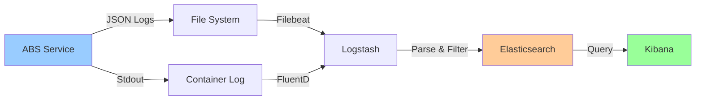

# 02. 로깅 전략

## 1. 문서 개요

본 문서는 ABS의 로그 관리 전략과 구조화된 로깅 시스템 설계를 정의합니다.

### 1.1 포함 내용

- 로그 레벨 정책
- 구조화된 로그 포맷
- 로그 컨텍스트 전파
- 로그 수집 및 저장
- 로그 검색 및 분석
- 로그 성능 최적화
- 로그 보관 정책

### 1.2 로깅 아키텍처



## 2. 로그 레벨 정책

### 2.1 로그 레벨 정의

| 레벨 | 용도 | 예시 | 운영 환경 사용 |
|-----|------|------|-------------|
| DEBUG | 상세 디버깅 정보 | 변수 값, 함수 진입/종료 | ❌ |
| INFO | 일반 정보 | 요청 처리, 작업 완료 | ✅ |
| WARN | 경고 메시지 | 재시도, 임계값 근접 | ✅ |
| ERROR | 에러 발생 | 예외 처리, 외부 API 실패 | ✅ |
| FATAL | 치명적 에러 | 시스템 종료 필요 | ✅ |

### 2.2 환경별 로그 레벨

```yaml
# config/logging.yaml
logging:
  level:
    development: DEBUG
    staging: INFO
    production: INFO

  # 패키지별 로그 레벨 오버라이드
  package_levels:
    demo-abs/internal/domain: DEBUG
    demo-abs/internal/infrastructure/cache: WARN
    demo-abs/pkg/jsoncompare: DEBUG
```

### 2.3 로그 레벨 사용 가이드

```go
package service

import (
    "go.uber.org/zap"
)

type RouteService struct {
    logger *zap.Logger
}

func (s *RouteService) CreateRoute(route *Route) error {
    // DEBUG: 함수 진입 및 상세 정보
    s.logger.Debug("CreateRoute called",
        zap.String("route_id", route.ID),
        zap.String("path", route.Path),
        zap.String("method", route.Method),
    )

    // INFO: 주요 작업 시작/완료
    s.logger.Info("Creating new route",
        zap.String("route_id", route.ID),
        zap.String("path", route.Path),
    )

    // WARN: 주의 필요하지만 에러는 아님
    if route.SampleSize > 1000 {
        s.logger.Warn("Large sample size detected",
            zap.String("route_id", route.ID),
            zap.Int("sample_size", route.SampleSize),
        )
    }

    // ERROR: 복구 가능한 에러
    if err := s.repository.Save(route); err != nil {
        s.logger.Error("Failed to save route",
            zap.String("route_id", route.ID),
            zap.Error(err),
        )
        return err
    }

    s.logger.Info("Route created successfully",
        zap.String("route_id", route.ID),
    )

    return nil
}

// FATAL: 시스템 종료가 필요한 치명적 에러
func (s *RouteService) Initialize() error {
    if err := s.repository.Connect(); err != nil {
        s.logger.Fatal("Failed to connect to database",
            zap.Error(err),
        )
        return err
    }
    return nil
}
```

## 3. 구조화된 로그 포맷

### 3.1 JSON 로그 포맷

```json
{
  "timestamp": "2025-11-30T15:30:45.123Z",
  "level": "INFO",
  "logger": "demo-abs.route.service",
  "caller": "service/route_service.go:45",
  "message": "Route created successfully",
  "request_id": "550e8400-e29b-41d4-a716-446655440000",
  "trace_id": "abc123def456",
  "user_id": "user-123",
  "route_id": "route-456",
  "duration_ms": 125,
  "error": null,
  "stacktrace": null
}
```

### 3.2 로그 필드 정의

| 필드 | 타입 | 필수 | 설명 |
|-----|------|------|------|
| timestamp | string | ✅ | ISO 8601 형식 |
| level | string | ✅ | DEBUG/INFO/WARN/ERROR/FATAL |
| logger | string | ✅ | 로거 이름 (패키지 경로) |
| caller | string | ✅ | 호출 위치 (파일:라인) |
| message | string | ✅ | 로그 메시지 |
| request_id | string | ❌ | 요청 고유 ID |
| trace_id | string | ❌ | 분산 추적 ID |
| user_id | string | ❌ | 사용자 ID |
| error | string | ❌ | 에러 메시지 |
| stacktrace | string | ❌ | 스택 트레이스 (ERROR 이상) |
| duration_ms | number | ❌ | 처리 시간 (밀리초) |

### 3.3 Zap Logger 설정

```go
package logger

import (
    "os"

    "go.uber.org/zap"
    "go.uber.org/zap/zapcore"
)

// NewLogger 구조화된 로거 생성
func NewLogger(env string) (*zap.Logger, error) {
    var config zap.Config

    if env == "production" {
        config = zap.NewProductionConfig()
    } else {
        config = zap.NewDevelopmentConfig()
    }

    // Encoder 설정
    config.EncoderConfig = zapcore.EncoderConfig{
        TimeKey:        "timestamp",
        LevelKey:       "level",
        NameKey:        "logger",
        CallerKey:      "caller",
        FunctionKey:    zapcore.OmitKey,
        MessageKey:     "message",
        StacktraceKey:  "stacktrace",
        LineEnding:     zapcore.DefaultLineEnding,
        EncodeLevel:    zapcore.LowercaseLevelEncoder,
        EncodeTime:     zapcore.ISO8601TimeEncoder,
        EncodeDuration: zapcore.MillisDurationEncoder,
        EncodeCaller:   zapcore.ShortCallerEncoder,
    }

    // 출력 경로
    config.OutputPaths = []string{
        "stdout",
        "/var/log/abs/app.log",
    }

    // 에러 로그 출력 경로
    config.ErrorOutputPaths = []string{
        "stderr",
        "/var/log/abs/error.log",
    }

    // 로그 레벨
    config.Level = zap.NewAtomicLevelAt(getLogLevel(env))

    // 스택 트레이스 레벨
    config.DisableStacktrace = false

    logger, err := config.Build(
        zap.AddCaller(),
        zap.AddCallerSkip(1),
        zap.AddStacktrace(zapcore.ErrorLevel),
    )

    if err != nil {
        return nil, err
    }

    return logger, nil
}

func getLogLevel(env string) zapcore.Level {
    switch env {
    case "development":
        return zapcore.DebugLevel
    case "staging":
        return zapcore.InfoLevel
    case "production":
        return zapcore.InfoLevel
    default:
        return zapcore.InfoLevel
    }
}
```

## 4. 로그 컨텍스트 전파

### 4.1 Context 기반 로거

```go
package logger

import (
    "context"

    "go.uber.org/zap"
)

type contextKey string

const (
    loggerKey    contextKey = "logger"
    requestIDKey contextKey = "request_id"
    traceIDKey   contextKey = "trace_id"
    userIDKey    contextKey = "user_id"
)

// WithContext Context에 로거 추가
func WithContext(ctx context.Context, logger *zap.Logger) context.Context {
    return context.WithValue(ctx, loggerKey, logger)
}

// FromContext Context에서 로거 추출
func FromContext(ctx context.Context) *zap.Logger {
    if logger, ok := ctx.Value(loggerKey).(*zap.Logger); ok {
        return logger
    }
    return zap.L() // 기본 로거 반환
}

// WithRequestID Context에 Request ID 추가
func WithRequestID(ctx context.Context, requestID string) context.Context {
    logger := FromContext(ctx)
    logger = logger.With(zap.String("request_id", requestID))
    return WithContext(ctx, logger)
}

// WithTraceID Context에 Trace ID 추가
func WithTraceID(ctx context.Context, traceID string) context.Context {
    logger := FromContext(ctx)
    logger = logger.With(zap.String("trace_id", traceID))
    return WithContext(ctx, logger)
}

// WithUserID Context에 User ID 추가
func WithUserID(ctx context.Context, userID string) context.Context {
    logger := FromContext(ctx)
    logger = logger.With(zap.String("user_id", userID))
    return WithContext(ctx, logger)
}
```

### 4.2 미들웨어에서 컨텍스트 주입

```go
package middleware

import (
    "github.com/gin-gonic/gin"
    "github.com/google/uuid"
    "demo-abs/internal/pkg/logger"
)

// LoggerMiddleware 로거 컨텍스트 미들웨어
func LoggerMiddleware(baseLogger *zap.Logger) gin.HandlerFunc {
    return func(c *gin.Context) {
        // Request ID 생성 또는 추출
        requestID := c.GetHeader("X-Request-ID")
        if requestID == "" {
            requestID = uuid.New().String()
        }

        // Trace ID 추출
        traceID := c.GetHeader("X-Trace-ID")

        // User ID 추출 (인증 후)
        userID, _ := c.Get("user_id")

        // Context에 로거 추가
        ctx := c.Request.Context()
        ctx = logger.WithContext(ctx, baseLogger)
        ctx = logger.WithRequestID(ctx, requestID)

        if traceID != "" {
            ctx = logger.WithTraceID(ctx, traceID)
        }

        if userID != nil {
            ctx = logger.WithUserID(ctx, userID.(string))
        }

        // Context 업데이트
        c.Request = c.Request.WithContext(ctx)

        // Response 헤더에 Request ID 추가
        c.Header("X-Request-ID", requestID)

        c.Next()
    }
}
```

### 4.3 서비스에서 로거 사용

```go
package service

import (
    "context"

    "demo-abs/internal/pkg/logger"
    "go.uber.org/zap"
)

type RouteService struct {
    // baseLogger는 초기화 시에만 사용
    baseLogger *zap.Logger
}

func (s *RouteService) CreateRoute(ctx context.Context, route *Route) error {
    // Context에서 로거 추출 (request_id, trace_id, user_id 자동 포함)
    log := logger.FromContext(ctx)

    log.Info("Creating route",
        zap.String("route_id", route.ID),
        zap.String("path", route.Path),
    )

    // 비즈니스 로직...

    if err := s.repository.Save(ctx, route); err != nil {
        log.Error("Failed to save route",
            zap.String("route_id", route.ID),
            zap.Error(err),
        )
        return err
    }

    log.Info("Route created successfully",
        zap.String("route_id", route.ID),
    )

    return nil
}
```

## 5. 요청/응답 로깅

### 5.1 HTTP 요청 로깅 미들웨어

```go
package middleware

import (
    "bytes"
    "io"
    "time"

    "demo-abs/internal/pkg/logger"
    "github.com/gin-gonic/gin"
    "go.uber.org/zap"
)

// RequestLoggingMiddleware HTTP 요청/응답 로깅
func RequestLoggingMiddleware() gin.HandlerFunc {
    return func(c *gin.Context) {
        start := time.Now()

        // Request Body 읽기 (필요 시)
        var requestBody []byte
        if c.Request.Body != nil && shouldLogBody(c.Request.URL.Path) {
            requestBody, _ = io.ReadAll(c.Request.Body)
            c.Request.Body = io.NopCloser(bytes.NewBuffer(requestBody))
        }

        // Response Writer 래핑
        blw := &bodyLogWriter{body: bytes.NewBufferString(""), ResponseWriter: c.Writer}
        c.Writer = blw

        // 다음 핸들러 실행
        c.Next()

        // 처리 시간 계산
        duration := time.Since(start)

        // 로거 추출
        log := logger.FromContext(c.Request.Context())

        // 요청/응답 로그
        log.Info("HTTP Request",
            zap.String("method", c.Request.Method),
            zap.String("path", c.Request.URL.Path),
            zap.String("query", c.Request.URL.RawQuery),
            zap.Int("status", c.Writer.Status()),
            zap.Duration("duration", duration),
            zap.Int("response_size", blw.body.Len()),
            zap.String("client_ip", c.ClientIP()),
            zap.String("user_agent", c.Request.UserAgent()),
        )

        // 에러가 있으면 에러 로그
        if len(c.Errors) > 0 {
            for _, e := range c.Errors {
                log.Error("Request error",
                    zap.Error(e.Err),
                )
            }
        }

        // Slow Request 경고 (500ms 이상)
        if duration > 500*time.Millisecond {
            log.Warn("Slow request detected",
                zap.String("method", c.Request.Method),
                zap.String("path", c.Request.URL.Path),
                zap.Duration("duration", duration),
            )
        }
    }
}

type bodyLogWriter struct {
    gin.ResponseWriter
    body *bytes.Buffer
}

func (w bodyLogWriter) Write(b []byte) (int, error) {
    w.body.Write(b)
    return w.ResponseWriter.Write(b)
}

func shouldLogBody(path string) bool {
    // 민감한 엔드포인트는 Body 로깅 제외
    excludePaths := []string{
        "/auth/login",
        "/auth/register",
    }

    for _, excluded := range excludePaths {
        if path == excluded {
            return false
        }
    }

    return true
}
```

## 6. 에러 로깅

### 6.1 에러 로깅 Best Practices

```go
package service

import (
    "context"
    "fmt"

    "demo-abs/internal/pkg/logger"
    "go.uber.org/zap"
)

func (s *ComparisonService) ProcessComparison(ctx context.Context, req *ComparisonRequest) error {
    log := logger.FromContext(ctx)

    // 1. 에러 발생 시 컨텍스트 정보 포함
    legacyResp, err := s.legacyClient.Call(ctx, req.Path)
    if err != nil {
        log.Error("Legacy API call failed",
            zap.String("path", req.Path),
            zap.String("method", req.Method),
            zap.Error(err),
            zap.String("error_type", "api_call"),
        )
        return fmt.Errorf("legacy API call failed: %w", err)
    }

    modernResp, err := s.modernClient.Call(ctx, req.Path)
    if err != nil {
        log.Error("Modern API call failed",
            zap.String("path", req.Path),
            zap.String("method", req.Method),
            zap.Error(err),
            zap.String("error_type", "api_call"),
        )
        return fmt.Errorf("modern API call failed: %w", err)
    }

    // 2. 비즈니스 로직 에러는 상세 정보 포함
    result, err := s.comparator.Compare(legacyResp.Body, modernResp.Body)
    if err != nil {
        log.Error("Comparison failed",
            zap.String("path", req.Path),
            zap.Int("legacy_size", len(legacyResp.Body)),
            zap.Int("modern_size", len(modernResp.Body)),
            zap.Error(err),
            zap.String("error_type", "comparison"),
        )
        return fmt.Errorf("comparison failed: %w", err)
    }

    // 3. 외부 시스템 에러는 재시도 정보 포함
    if err := s.publisher.Publish(ctx, result); err != nil {
        log.Error("Failed to publish comparison result",
            zap.String("comparison_id", result.ID),
            zap.Error(err),
            zap.Int("retry_count", req.RetryCount),
            zap.String("error_type", "messaging"),
        )
        return fmt.Errorf("failed to publish result: %w", err)
    }

    return nil
}
```

### 6.2 Panic Recovery 로깅

```go
package middleware

import (
    "runtime/debug"

    "demo-abs/internal/pkg/logger"
    "github.com/gin-gonic/gin"
    "go.uber.org/zap"
)

// RecoveryMiddleware Panic 복구 및 로깅
func RecoveryMiddleware() gin.HandlerFunc {
    return func(c *gin.Context) {
        defer func() {
            if err := recover(); err != nil {
                log := logger.FromContext(c.Request.Context())

                // Panic 로그 (스택 트레이스 포함)
                log.Error("Panic recovered",
                    zap.Any("error", err),
                    zap.String("path", c.Request.URL.Path),
                    zap.String("method", c.Request.Method),
                    zap.ByteString("stacktrace", debug.Stack()),
                )

                c.AbortWithStatusJSON(500, gin.H{
                    "error": "Internal server error",
                })
            }
        }()

        c.Next()
    }
}
```

## 7. 로그 수집 및 저장

### 7.1 Filebeat 설정

```yaml
# filebeat.yml
filebeat.inputs:
  - type: log
    enabled: true
    paths:
      - /var/log/abs/app.log
      - /var/log/abs/error.log
    json.keys_under_root: true
    json.add_error_key: true
    fields:
      service: abs
      environment: production
    fields_under_root: true

  - type: log
    enabled: true
    paths:
      - /var/log/abs/audit.log
    json.keys_under_root: true
    fields:
      service: abs
      log_type: audit
      environment: production
    fields_under_root: true

# Logstash 출력
output.logstash:
  hosts: ["logstash:5044"]
  compression_level: 3
  bulk_max_size: 2048

# 프로세서
processors:
  - add_host_metadata:
      when.not.contains.tags: forwarded
  - add_cloud_metadata: ~
  - add_docker_metadata: ~
```

### 7.2 Logstash 설정

```ruby
# logstash.conf
input {
  beats {
    port => 5044
  }
}

filter {
  # JSON 파싱
  if [message] =~ /^\{.*\}$/ {
    json {
      source => "message"
    }
  }

  # 타임스탬프 파싱
  date {
    match => [ "timestamp", "ISO8601" ]
    target => "@timestamp"
  }

  # 로그 레벨 정규화
  mutate {
    uppercase => [ "level" ]
  }

  # GeoIP 추가 (client_ip가 있는 경우)
  if [client_ip] {
    geoip {
      source => "client_ip"
      target => "geoip"
    }
  }

  # 민감 정보 필터링 (이미 마스킹되어야 하지만 추가 보호)
  mutate {
    gsub => [
      "message", "\b[A-Za-z0-9._%+-]+@[A-Za-z0-9.-]+\.[A-Z|a-z]{2,}\b", "[EMAIL]",
      "message", "\b\d{3}-\d{4}-\d{4}\b", "[PHONE]"
    ]
  }
}

output {
  elasticsearch {
    hosts => ["elasticsearch:9200"]
    index => "abs-logs-%{+YYYY.MM.dd}"
    document_type => "_doc"
  }

  # 에러 로그는 별도 인덱스
  if [level] == "ERROR" or [level] == "FATAL" {
    elasticsearch {
      hosts => ["elasticsearch:9200"]
      index => "abs-errors-%{+YYYY.MM.dd}"
      document_type => "_doc"
    }
  }

  # 감사 로그는 별도 인덱스
  if [log_type] == "audit" {
    elasticsearch {
      hosts => ["elasticsearch:9200"]
      index => "abs-audit-%{+YYYY.MM.dd}"
      document_type => "_doc"
    }
  }
}
```

### 7.3 Elasticsearch 인덱스 템플릿

```json
{
  "index_patterns": ["abs-logs-*"],
  "settings": {
    "number_of_shards": 3,
    "number_of_replicas": 1,
    "refresh_interval": "5s"
  },
  "mappings": {
    "properties": {
      "timestamp": {
        "type": "date"
      },
      "level": {
        "type": "keyword"
      },
      "logger": {
        "type": "keyword"
      },
      "message": {
        "type": "text",
        "fields": {
          "keyword": {
            "type": "keyword",
            "ignore_above": 256
          }
        }
      },
      "request_id": {
        "type": "keyword"
      },
      "trace_id": {
        "type": "keyword"
      },
      "user_id": {
        "type": "keyword"
      },
      "error": {
        "type": "text"
      },
      "stacktrace": {
        "type": "text"
      },
      "duration_ms": {
        "type": "long"
      }
    }
  }
}
```

## 8. 로그 검색 및 분석

### 8.1 Kibana 검색 쿼리

```
# 특정 Request ID로 검색
request_id: "550e8400-e29b-41d4-a716-446655440000"

# 에러 로그만 검색
level: ERROR OR level: FATAL

# 특정 사용자의 로그
user_id: "user-123"

# 느린 요청 검색 (500ms 이상)
duration_ms: >= 500

# 특정 기간 검색
timestamp: [2025-11-30T00:00:00 TO 2025-11-30T23:59:59]

# 복합 조건
level: ERROR AND logger: "demo-abs.comparison.service" AND timestamp: > now-1h

# 정규식 검색
message: /failed.*retry/
```

### 8.2 Kibana 대시보드

```
대시보드 구성:
1. Log Level Distribution (파이 차트)
2. Top 10 Error Messages (테이블)
3. Request Rate (타임 시리즈)
4. Average Response Time (타임 시리즈)
5. Top 10 Slow Requests (테이블)
6. Error Rate by Service (바 차트)
7. Geographic Distribution (지도)
```

## 9. 로그 보관 정책

### 9.1 보관 기간

| 로그 타입 | Hot (즉시 검색) | Warm (검색 가능) | Cold (아카이브) | 삭제 |
|---------|--------------|--------------|-------------|-----|
| app.log | 7일 | 30일 | 90일 | 365일 |
| error.log | 30일 | 90일 | 180일 | 365일 |
| audit.log | 30일 | 180일 | 365일 | 유지 |
| access.log | 7일 | 30일 | 90일 | 180일 |

### 9.2 Elasticsearch ILM 정책

```json
{
  "policy": "abs-logs-policy",
  "phases": {
    "hot": {
      "min_age": "0ms",
      "actions": {
        "rollover": {
          "max_size": "50gb",
          "max_age": "1d"
        },
        "set_priority": {
          "priority": 100
        }
      }
    },
    "warm": {
      "min_age": "7d",
      "actions": {
        "shrink": {
          "number_of_shards": 1
        },
        "forcemerge": {
          "max_num_segments": 1
        },
        "set_priority": {
          "priority": 50
        }
      }
    },
    "cold": {
      "min_age": "30d",
      "actions": {
        "freeze": {},
        "set_priority": {
          "priority": 0
        }
      }
    },
    "delete": {
      "min_age": "90d",
      "actions": {
        "delete": {}
      }
    }
  }
}
```

## 10. 로그 성능 최적화

### 10.1 비동기 로깅

```go
package logger

import (
    "go.uber.org/zap"
    "go.uber.org/zap/zapcore"
)

// NewAsyncLogger 비동기 로거 생성
func NewAsyncLogger(env string) (*zap.Logger, error) {
    config := zap.NewProductionConfig()

    // 비동기 Writer 사용
    config.OutputPaths = []string{"stdout"}

    // 버퍼링된 Writer 사용
    config.EncoderConfig.EncodeTime = zapcore.ISO8601TimeEncoder

    logger, err := config.Build(
        zap.AddCaller(),
        zap.WrapCore(func(core zapcore.Core) zapcore.Core {
            return &zapcore.BufferedWriteSyncer{
                WS:            core,
                Size:          256 * 1024, // 256KB 버퍼
                FlushInterval: time.Second,
            }
        }),
    )

    if err != nil {
        return nil, err
    }

    return logger, nil
}
```

### 10.2 샘플링 (Production 환경)

```go
package logger

import (
    "go.uber.org/zap"
    "go.uber.org/zap/zapcore"
)

// NewSampledLogger 샘플링 로거 생성
func NewSampledLogger() (*zap.Logger, error) {
    config := zap.NewProductionConfig()

    // INFO 레벨은 초당 최대 100개로 제한
    config.Sampling = &zap.SamplingConfig{
        Initial:    100,
        Thereafter: 100,
    }

    return config.Build()
}
```

## 11. 로그 모니터링

### 11.1 로그 기반 메트릭

```go
package metrics

import (
    "github.com/prometheus/client_golang/prometheus"
    "github.com/prometheus/client_golang/prometheus/promauto"
)

var (
    // 로그 발생 횟수
    logEntriesTotal = promauto.NewCounterVec(
        prometheus.CounterOpts{
            Name: "abs_log_entries_total",
            Help: "Total number of log entries",
        },
        []string{"level", "logger"},
    )

    // 에러 발생 횟수
    errorOccurrences = promauto.NewCounterVec(
        prometheus.CounterOpts{
            Name: "abs_error_occurrences_total",
            Help: "Total number of error occurrences",
        },
        []string{"logger", "error_type"},
    )
)

// LoggingHook 로그 발생 시 메트릭 업데이트
type LoggingHook struct{}

func (h *LoggingHook) Fire(entry *logrus.Entry) error {
    logEntriesTotal.WithLabelValues(
        entry.Level.String(),
        entry.Data["logger"].(string),
    ).Inc()

    if entry.Level == logrus.ErrorLevel || entry.Level == logrus.FatalLevel {
        errorType := "unknown"
        if et, ok := entry.Data["error_type"].(string); ok {
            errorType = et
        }

        errorOccurrences.WithLabelValues(
            entry.Data["logger"].(string),
            errorType,
        ).Inc()
    }

    return nil
}
```

## 12. 테스트

### 12.1 로깅 테스트

```go
package logger_test

import (
    "bytes"
    "encoding/json"
    "testing"

    "demo-abs/internal/pkg/logger"
    "github.com/stretchr/testify/assert"
    "go.uber.org/zap"
    "go.uber.org/zap/zapcore"
)

func TestStructuredLogging(t *testing.T) {
    // 메모리 버퍼로 로그 출력
    var buf bytes.Buffer

    encoder := zapcore.NewJSONEncoder(zapcore.EncoderConfig{
        TimeKey:     "timestamp",
        LevelKey:    "level",
        MessageKey:  "message",
        EncodeTime:  zapcore.ISO8601TimeEncoder,
        EncodeLevel: zapcore.LowercaseLevelEncoder,
    })

    core := zapcore.NewCore(encoder, zapcore.AddSync(&buf), zapcore.DebugLevel)
    logger := zap.New(core)

    // 로그 작성
    logger.Info("Test message",
        zap.String("key1", "value1"),
        zap.Int("key2", 123),
    )

    // JSON 파싱 검증
    var logEntry map[string]interface{}
    err := json.Unmarshal(buf.Bytes(), &logEntry)
    assert.NoError(t, err)

    assert.Equal(t, "info", logEntry["level"])
    assert.Equal(t, "Test message", logEntry["message"])
    assert.Equal(t, "value1", logEntry["key1"])
    assert.Equal(t, float64(123), logEntry["key2"])
}

func TestContextLogger(t *testing.T) {
    ctx := context.Background()

    baseLogger := zap.NewNop()
    ctx = logger.WithContext(ctx, baseLogger)
    ctx = logger.WithRequestID(ctx, "req-123")

    log := logger.FromContext(ctx)

    // Request ID가 로거에 포함되어 있는지 확인
    assert.NotNil(t, log)
}
```

## 13. 참고 자료

- Zap Documentation: https://pkg.go.dev/go.uber.org/zap
- Structured Logging Best Practices: https://www.elastic.co/guide/en/ecs/current/index.html
- ELK Stack Guide: https://www.elastic.co/elk-stack
- Log Aggregation Patterns: https://martinfowler.com/articles/patterns-of-distributed-systems/log-aggregation.html

## 14. 구현 위치

```
internal/
├── pkg/
│   └── logger/
│       ├── logger.go          # 로거 초기화
│       ├── context.go         # Context 기반 로거
│       ├── fields.go          # 공통 필드 정의
│       └── logger_test.go     # 테스트
├── adapter/
│   └── http/
│       └── middleware/
│           ├── logging.go     # 요청 로깅 미들웨어
│           └── recovery.go    # Panic 복구 미들웨어
config/
├── logging.yaml               # 로깅 설정
├── filebeat.yml               # Filebeat 설정
├── logstash.conf              # Logstash 설정
└── elasticsearch/
    └── index-template.json    # ES 인덱스 템플릿
```

---

최종 수정일: 2025-11-30, 작성자: ABS 개발팀
