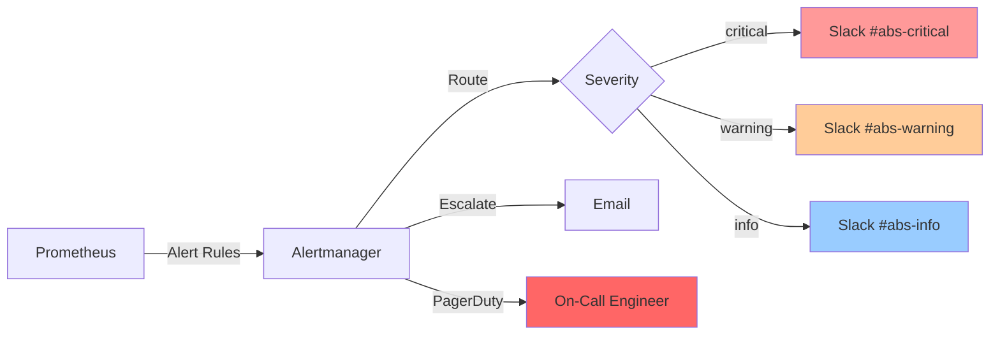
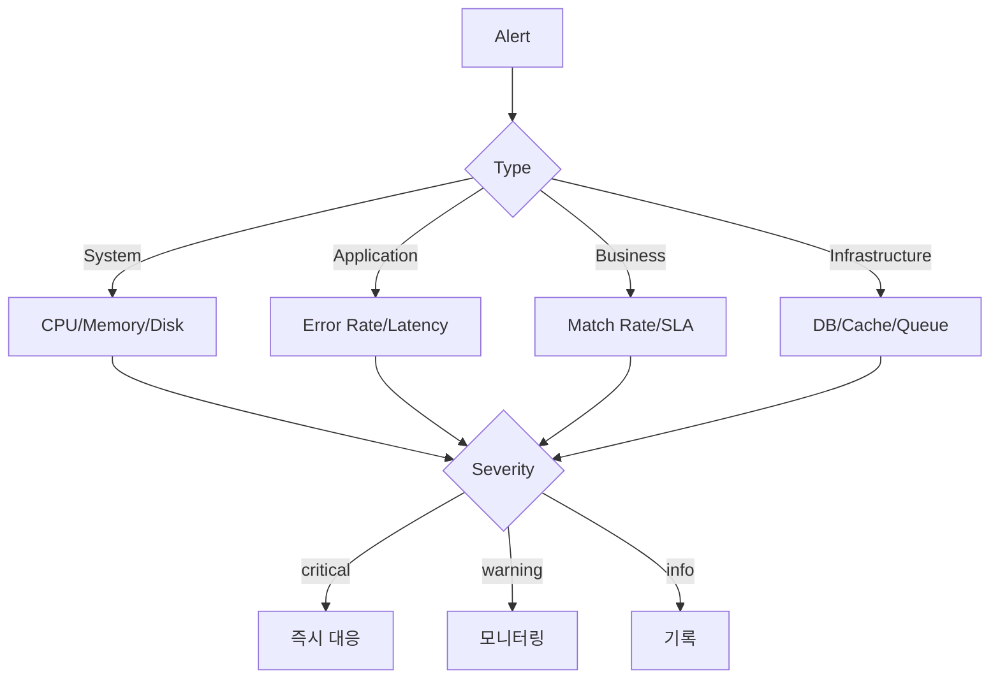
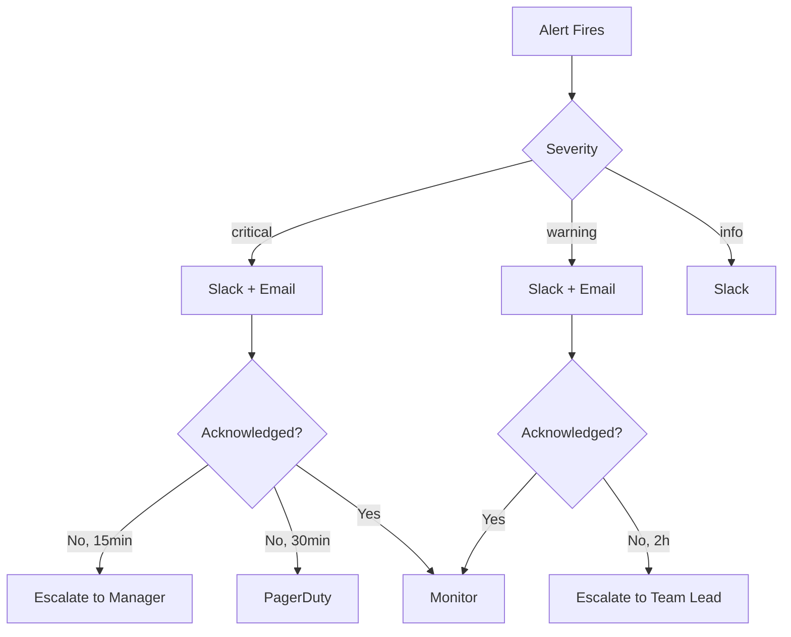

# 03. 알림 정책

## 1. 문서 개요

본 문서는 ABS의 알림 정책과 Alertmanager 기반 알림 시스템 설계를 정의합니다.

### 1.1 포함 내용

- 알림 우선순위 및 분류
- 알림 임계값 정의
- Prometheus 알림 규칙
- Alertmanager 설정
- Slack 알림 통합
- Email 알림 통합
- 알림 에스컬레이션
- On-Call 정책

### 1.2 알림 아키텍처



## 2. 알림 우선순위

### 2.1 Severity 레벨

| Severity | 설명 | 응답 시간 | 통보 채널 | 에스컬레이션 |
|----------|------|----------|---------|------------|
| critical | 즉각 조치 필요, 서비스 다운 | 5분 이내 | Slack + Email + PagerDuty | 15분 후 |
| warning | 주의 필요, 서비스 영향 가능 | 30분 이내 | Slack + Email | 2시간 후 |
| info | 정보성, 추세 모니터링 | 업무 시간 내 | Slack | 없음 |

### 2.2 알림 분류



## 3. Prometheus 알림 규칙

### 3.1 시스템 알림

```yaml
# prometheus/rules/system.yml
groups:
  - name: system_alerts
    interval: 30s
    rules:
      # CPU 사용률 높음
      - alert: HighCPUUsage
        expr: |
          100 - (avg by (instance) (rate(process_cpu_seconds_total[5m])) * 100) > 80
        for: 5m
        labels:
          severity: warning
          category: system
        annotations:
          summary: "High CPU usage on {{ $labels.instance }}"
          description: "CPU usage is {{ $value }}% (threshold: 80%)"

      # CPU 사용률 매우 높음
      - alert: CriticalCPUUsage
        expr: |
          100 - (avg by (instance) (rate(process_cpu_seconds_total[5m])) * 100) > 95
        for: 2m
        labels:
          severity: critical
          category: system
        annotations:
          summary: "Critical CPU usage on {{ $labels.instance }}"
          description: "CPU usage is {{ $value }}% (threshold: 95%)"

      # 메모리 사용률 높음
      - alert: HighMemoryUsage
        expr: |
          (process_resident_memory_bytes / node_memory_MemTotal_bytes) * 100 > 80
        for: 5m
        labels:
          severity: warning
          category: system
        annotations:
          summary: "High memory usage on {{ $labels.instance }}"
          description: "Memory usage is {{ $value }}% (threshold: 80%)"

      # 디스크 사용률 높음
      - alert: HighDiskUsage
        expr: |
          (node_filesystem_avail_bytes{mountpoint="/"} / node_filesystem_size_bytes{mountpoint="/"}) * 100 < 20
        for: 5m
        labels:
          severity: warning
          category: system
        annotations:
          summary: "Low disk space on {{ $labels.instance }}"
          description: "Available disk space is {{ $value }}% (threshold: 20%)"

      # 고루틴 수 급증
      - alert: HighGoroutineCount
        expr: go_goroutines > 10000
        for: 5m
        labels:
          severity: warning
          category: system
        annotations:
          summary: "High goroutine count on {{ $labels.instance }}"
          description: "Goroutine count is {{ $value }} (threshold: 10000)"
```

### 3.2 애플리케이션 알림

```yaml
# prometheus/rules/application.yml
groups:
  - name: application_alerts
    interval: 30s
    rules:
      # 에러율 높음
      - alert: HighErrorRate
        expr: |
          (
            sum(rate(abs_http_requests_total{status=~"5.."}[5m]))
            /
            sum(rate(abs_http_requests_total[5m]))
          ) * 100 > 5
        for: 5m
        labels:
          severity: critical
          category: application
        annotations:
          summary: "High error rate detected"
          description: "Error rate is {{ $value }}% (threshold: 5%)"

      # 응답 시간 느림 (P95)
      - alert: HighLatencyP95
        expr: |
          histogram_quantile(0.95, rate(abs_http_request_duration_seconds_bucket[5m])) > 1
        for: 5m
        labels:
          severity: warning
          category: application
        annotations:
          summary: "High P95 latency detected"
          description: "P95 latency is {{ $value }}s (threshold: 1s)"

      # 응답 시간 매우 느림 (P99)
      - alert: HighLatencyP99
        expr: |
          histogram_quantile(0.99, rate(abs_http_request_duration_seconds_bucket[5m])) > 2
        for: 5m
        labels:
          severity: critical
          category: application
        annotations:
          summary: "High P99 latency detected"
          description: "P99 latency is {{ $value }}s (threshold: 2s)"

      # 활성 요청 수 높음
      - alert: HighActiveRequests
        expr: abs_http_active_requests > 1000
        for: 5m
        labels:
          severity: warning
          category: application
        annotations:
          summary: "High number of active requests"
          description: "Active requests: {{ $value }} (threshold: 1000)"

      # 서비스 다운
      - alert: ServiceDown
        expr: up{job="abs"} == 0
        for: 1m
        labels:
          severity: critical
          category: application
        annotations:
          summary: "ABS service is down"
          description: "Instance {{ $labels.instance }} is down"
```

### 3.3 API 호출 알림

```yaml
# prometheus/rules/api.yml
groups:
  - name: api_alerts
    interval: 30s
    rules:
      # Legacy API 에러율 높음
      - alert: LegacyAPIHighErrorRate
        expr: |
          (
            sum(rate(abs_api_calls_total{target="legacy",status=~"5.."}[5m]))
            /
            sum(rate(abs_api_calls_total{target="legacy"}[5m]))
          ) * 100 > 10
        for: 5m
        labels:
          severity: critical
          category: api
          target: legacy
        annotations:
          summary: "High error rate in Legacy API calls"
          description: "Error rate is {{ $value }}% (threshold: 10%)"

      # Modern API 에러율 높음
      - alert: ModernAPIHighErrorRate
        expr: |
          (
            sum(rate(abs_api_calls_total{target="modern",status=~"5.."}[5m]))
            /
            sum(rate(abs_api_calls_total{target="modern"}[5m]))
          ) * 100 > 10
        for: 5m
        labels:
          severity: critical
          category: api
          target: modern
        annotations:
          summary: "High error rate in Modern API calls"
          description: "Error rate is {{ $value }}% (threshold: 10%)"

      # API 응답 시간 느림
      - alert: APISlowResponse
        expr: |
          avg(rate(abs_api_call_duration_seconds_sum[5m])) / avg(rate(abs_api_call_duration_seconds_count[5m])) > 2
        for: 5m
        labels:
          severity: warning
          category: api
        annotations:
          summary: "Slow API response time"
          description: "Average response time is {{ $value }}s (threshold: 2s)"

      # API 재시도 많음
      - alert: HighAPIRetries
        expr: rate(abs_api_call_retries_total[5m]) > 10
        for: 5m
        labels:
          severity: warning
          category: api
        annotations:
          summary: "High API retry rate"
          description: "Retry rate is {{ $value }}/s (threshold: 10/s)"
```

### 3.4 비즈니스 로직 알림

```yaml
# prometheus/rules/business.yml
groups:
  - name: business_alerts
    interval: 60s
    rules:
      # 일치율 낮음
      - alert: LowMatchRate
        expr: abs_match_rate < 0.95
        for: 10m
        labels:
          severity: warning
          category: business
        annotations:
          summary: "Low match rate for route {{ $labels.route_id }}"
          description: "Match rate is {{ $value }} (threshold: 0.95)"
          route_id: "{{ $labels.route_id }}"
          path: "{{ $labels.path }}"

      # 일치율 매우 낮음
      - alert: CriticalLowMatchRate
        expr: abs_match_rate < 0.90
        for: 5m
        labels:
          severity: critical
          category: business
        annotations:
          summary: "Critical low match rate for route {{ $labels.route_id }}"
          description: "Match rate is {{ $value }} (threshold: 0.90)"
          route_id: "{{ $labels.route_id }}"
          path: "{{ $labels.path }}"

      # 비교 큐 적체
      - alert: ComparisonQueueBacklog
        expr: abs_comparison_queue_size > 10000
        for: 5m
        labels:
          severity: warning
          category: business
        annotations:
          summary: "Comparison queue backlog"
          description: "Queue size is {{ $value }} (threshold: 10000)"

      # 일일 비교 수 급감
      - alert: LowComparisonRate
        expr: rate(abs_daily_comparisons_total[1h]) < 100
        for: 10m
        labels:
          severity: warning
          category: business
        annotations:
          summary: "Low comparison rate"
          description: "Comparison rate is {{ $value }}/s (threshold: 100/s)"
```

### 3.5 Infrastructure 알림

```yaml
# prometheus/rules/infrastructure.yml
groups:
  - name: infrastructure_alerts
    interval: 30s
    rules:
      # DB 연결 풀 고갈
      - alert: DBConnectionPoolExhausted
        expr: abs_db_connections{state="active"} / abs_db_connections{state="total"} > 0.9
        for: 5m
        labels:
          severity: critical
          category: infrastructure
        annotations:
          summary: "Database connection pool nearly exhausted"
          description: "Active connections: {{ $value }}%"

      # DB 쿼리 느림
      - alert: SlowDBQueries
        expr: |
          histogram_quantile(0.95, rate(abs_db_query_duration_seconds_bucket[5m])) > 1
        for: 5m
        labels:
          severity: warning
          category: infrastructure
        annotations:
          summary: "Slow database queries detected"
          description: "P95 query time is {{ $value }}s (threshold: 1s)"

      # 캐시 히트율 낮음
      - alert: LowCacheHitRate
        expr: |
          (
            sum(rate(abs_cache_requests_total{result="hit"}[5m]))
            /
            sum(rate(abs_cache_requests_total[5m]))
          ) * 100 < 70
        for: 10m
        labels:
          severity: warning
          category: infrastructure
        annotations:
          summary: "Low cache hit rate"
          description: "Cache hit rate is {{ $value }}% (threshold: 70%)"

      # Circuit Breaker Open
      - alert: CircuitBreakerOpen
        expr: abs_circuit_breaker_state > 0
        for: 1m
        labels:
          severity: critical
          category: infrastructure
        annotations:
          summary: "Circuit breaker {{ $labels.name }} is open"
          description: "Circuit breaker state: {{ $value }} (0=closed, 1=open, 2=half-open)"

      # RabbitMQ 큐 적체
      - alert: RabbitMQQueueBacklog
        expr: abs_queue_messages > 100000
        for: 5m
        labels:
          severity: warning
          category: infrastructure
        annotations:
          summary: "RabbitMQ queue {{ $labels.queue }} backlog"
          description: "Queue size is {{ $value }} (threshold: 100000)"

      # DLQ 메시지 증가
      - alert: DeadLetterQueueMessages
        expr: abs_dlq_messages > 100
        for: 5m
        labels:
          severity: warning
          category: infrastructure
        annotations:
          summary: "Messages in dead letter queue {{ $labels.queue }}"
          description: "DLQ size is {{ $value }} (threshold: 100)"
```

## 4. Alertmanager 설정

### 4.1 Alertmanager 설정 파일

```yaml
# alertmanager.yml
global:
  resolve_timeout: 5m
  slack_api_url: 'https://hooks.slack.com/services/YOUR/SLACK/WEBHOOK'

# 알림 템플릿
templates:
  - '/etc/alertmanager/templates/*.tmpl'

# 라우팅 규칙
route:
  receiver: 'default'
  group_by: ['alertname', 'cluster', 'service']
  group_wait: 10s        # 그룹화 대기 시간
  group_interval: 10s    # 그룹 알림 간격
  repeat_interval: 12h   # 동일 알림 반복 간격

  routes:
    # Critical 알림: Slack + Email + PagerDuty
    - match:
        severity: critical
      receiver: 'critical-alerts'
      group_wait: 10s
      group_interval: 5m
      repeat_interval: 4h
      continue: true

    # Warning 알림: Slack + Email
    - match:
        severity: warning
      receiver: 'warning-alerts'
      group_wait: 30s
      group_interval: 10m
      repeat_interval: 12h

    # Info 알림: Slack만
    - match:
        severity: info
      receiver: 'info-alerts'
      group_wait: 1m
      group_interval: 30m
      repeat_interval: 24h

    # 업무 시간 외 Critical 알림은 PagerDuty로
    - match:
        severity: critical
      receiver: 'pagerduty'
      time_intervals:
        - off_hours

# Receiver 정의
receivers:
  - name: 'default'
    slack_configs:
      - channel: '#abs-alerts'
        title: '{{ .GroupLabels.alertname }}'
        text: '{{ range .Alerts }}{{ .Annotations.description }}{{ end }}'

  - name: 'critical-alerts'
    slack_configs:
      - channel: '#abs-critical'
        title: ':rotating_light: [CRITICAL] {{ .GroupLabels.alertname }}'
        text: |
          {{ range .Alerts }}
          *Alert:* {{ .Labels.alertname }}
          *Severity:* {{ .Labels.severity }}
          *Category:* {{ .Labels.category }}
          *Description:* {{ .Annotations.description }}
          *Instance:* {{ .Labels.instance }}
          {{ end }}
        color: 'danger'
        send_resolved: true

    email_configs:
      - to: 'abs-oncall@example.com'
        from: 'alertmanager@example.com'
        smarthost: 'smtp.example.com:587'
        auth_username: 'alertmanager@example.com'
        auth_password: 'password'
        headers:
          Subject: '[ABS CRITICAL] {{ .GroupLabels.alertname }}'

    pagerduty_configs:
      - service_key: 'YOUR_PAGERDUTY_KEY'
        description: '{{ .GroupLabels.alertname }}: {{ .Annotations.summary }}'

  - name: 'warning-alerts'
    slack_configs:
      - channel: '#abs-warning'
        title: ':warning: [WARNING] {{ .GroupLabels.alertname }}'
        color: 'warning'
        send_resolved: true

    email_configs:
      - to: 'abs-team@example.com'
        from: 'alertmanager@example.com'
        smarthost: 'smtp.example.com:587'
        auth_username: 'alertmanager@example.com'
        auth_password: 'password'
        headers:
          Subject: '[ABS WARNING] {{ .GroupLabels.alertname }}'

  - name: 'info-alerts'
    slack_configs:
      - channel: '#abs-info'
        title: ':information_source: [INFO] {{ .GroupLabels.alertname }}'
        color: 'good'

  - name: 'pagerduty'
    pagerduty_configs:
      - service_key: 'YOUR_PAGERDUTY_KEY'
        description: '[URGENT] {{ .GroupLabels.alertname }}: {{ .Annotations.summary }}'

# Inhibition 규칙 (중복 알림 방지)
inhibit_rules:
  # Critical 알림이 발생하면 같은 인스턴스의 Warning 알림 억제
  - source_match:
      severity: 'critical'
    target_match:
      severity: 'warning'
    equal: ['instance', 'alertname']

  # ServiceDown 알림이 발생하면 해당 인스턴스의 다른 알림 억제
  - source_match:
      alertname: 'ServiceDown'
    target_match_re:
      alertname: '.*'
    equal: ['instance']

# 시간 간격 정의
time_intervals:
  - name: off_hours
    time_intervals:
      - weekdays: ['saturday', 'sunday']
      - times:
          - start_time: '00:00'
            end_time: '09:00'
          - start_time: '18:00'
            end_time: '23:59'
```

## 5. 알림 템플릿

### 5.1 Slack 템플릿

```gotmpl
{{ define "slack.abs.title" }}
[{{ .Status | toUpper }}{{ if eq .Status "firing" }}:{{ .Alerts.Firing | len }}{{ end }}] {{ .GroupLabels.alertname }}
{{ end }}

{{ define "slack.abs.text" }}
{{ range .Alerts }}
*Alert:* {{ .Labels.alertname }}
*Severity:* {{ .Labels.severity }}
*Category:* {{ .Labels.category }}
*Status:* {{ .Status }}
*Description:* {{ .Annotations.description }}
*Summary:* {{ .Annotations.summary }}
{{ if .Labels.instance }}*Instance:* {{ .Labels.instance }}{{ end }}
{{ if .Labels.route_id }}*Route ID:* {{ .Labels.route_id }}{{ end }}
{{ if .Labels.path }}*Path:* {{ .Labels.path }}{{ end }}
*Start Time:* {{ .StartsAt.Format "2006-01-02 15:04:05" }}
{{ if .EndsAt }}*End Time:* {{ .EndsAt.Format "2006-01-02 15:04:05" }}{{ end }}
{{ if .GeneratorURL }}*Source:* <{{ .GeneratorURL }}|Prometheus>{{ end }}
---
{{ end }}
{{ end }}

{{ define "slack.abs.color" }}
{{ if eq .Status "firing" }}
  {{ if eq .GroupLabels.severity "critical" }}danger{{ else if eq .GroupLabels.severity "warning" }}warning{{ else }}good{{ end }}
{{ else }}
good
{{ end }}
{{ end }}
```

### 5.2 Email 템플릿

```gotmpl
{{ define "email.abs.subject" }}
[{{ .Status | toUpper }}] {{ .GroupLabels.alertname }} ({{ .Alerts.Firing | len }} firing)
{{ end }}

{{ define "email.abs.html" }}
<!DOCTYPE html>
<html>
<head>
  <style>
    body { font-family: Arial, sans-serif; }
    .alert { border: 1px solid #ddd; padding: 15px; margin: 10px 0; border-radius: 5px; }
    .critical { border-left: 5px solid #d32f2f; background: #ffebee; }
    .warning { border-left: 5px solid #f57c00; background: #fff3e0; }
    .info { border-left: 5px solid #1976d2; background: #e3f2fd; }
    .resolved { border-left: 5px solid #388e3c; background: #e8f5e9; }
    h2 { margin-top: 0; }
    .field { margin: 5px 0; }
    .label { font-weight: bold; display: inline-block; width: 120px; }
  </style>
</head>
<body>
  <h1>ABS Alert Notification</h1>

  {{ range .Alerts }}
  <div class="alert {{ if eq .Status "resolved" }}resolved{{ else }}{{ .Labels.severity }}{{ end }}">
    <h2>{{ .Labels.alertname }}</h2>

    <div class="field">
      <span class="label">Status:</span>
      <span>{{ .Status | toUpper }}</span>
    </div>

    <div class="field">
      <span class="label">Severity:</span>
      <span>{{ .Labels.severity | toUpper }}</span>
    </div>

    <div class="field">
      <span class="label">Category:</span>
      <span>{{ .Labels.category }}</span>
    </div>

    <div class="field">
      <span class="label">Summary:</span>
      <span>{{ .Annotations.summary }}</span>
    </div>

    <div class="field">
      <span class="label">Description:</span>
      <span>{{ .Annotations.description }}</span>
    </div>

    {{ if .Labels.instance }}
    <div class="field">
      <span class="label">Instance:</span>
      <span>{{ .Labels.instance }}</span>
    </div>
    {{ end }}

    <div class="field">
      <span class="label">Started At:</span>
      <span>{{ .StartsAt.Format "2006-01-02 15:04:05 MST" }}</span>
    </div>

    {{ if .EndsAt }}
    <div class="field">
      <span class="label">Ended At:</span>
      <span>{{ .EndsAt.Format "2006-01-02 15:04:05 MST" }}</span>
    </div>
    {{ end }}

    {{ if .GeneratorURL }}
    <div class="field">
      <span class="label">Source:</span>
      <span><a href="{{ .GeneratorURL }}">View in Prometheus</a></span>
    </div>
    {{ end }}
  </div>
  {{ end }}

  <hr>
  <p><small>This is an automated alert from ABS Monitoring System</small></p>
</body>
</html>
{{ end }}
```

## 6. 알림 에스컬레이션

### 6.1 에스컬레이션 정책



### 6.2 에스컬레이션 설정

```yaml
# alertmanager.yml - Escalation Routes
route:
  routes:
    # Critical - 15분 후 에스컬레이션
    - match:
        severity: critical
      receiver: 'critical-alerts'
      repeat_interval: 15m
      routes:
        - match:
            escalated: 'false'
          receiver: 'critical-alerts'
          repeat_interval: 15m
        - match:
            escalated: 'true'
          receiver: 'escalation-manager'
          repeat_interval: 15m
          routes:
            - match:
                escalated_level: '2'
              receiver: 'pagerduty'
              repeat_interval: 30m

receivers:
  - name: 'escalation-manager'
    email_configs:
      - to: 'abs-manager@example.com'
        headers:
          Subject: '[ESCALATED] {{ .GroupLabels.alertname }}'
    slack_configs:
      - channel: '#abs-escalation'
        title: ':fire: [ESCALATED] {{ .GroupLabels.alertname }}'
```

## 7. On-Call 정책

### 7.1 On-Call 로테이션

| Week | Primary | Secondary | Backup |
|------|---------|-----------|--------|
| Week 1 | Engineer A | Engineer B | Team Lead |
| Week 2 | Engineer B | Engineer C | Team Lead |
| Week 3 | Engineer C | Engineer A | Team Lead |
| Week 4 | Engineer A | Engineer B | Team Lead |

### 7.2 On-Call 책임

**Primary On-Call:**
- Critical 알림 즉시 응답 (5분 이내)
- Warning 알림 30분 이내 확인
- 장애 대응 및 해결
- 인시던트 보고서 작성

**Secondary On-Call:**
- Primary 미응답 시 대응 (15분 후)
- Primary 지원
- 복잡한 이슈 협력 해결

**Backup (Team Lead):**
- Secondary 미응답 시 대응 (30분 후)
- 주요 의사결정
- 에스컬레이션 관리

## 8. 알림 억제 (Silencing)

### 8.1 유지보수 기간 알림 억제

```bash
# Alertmanager API를 통한 Silence 생성
curl -X POST http://alertmanager:9093/api/v2/silences \
  -H "Content-Type: application/json" \
  -d '{
    "matchers": [
      {
        "name": "instance",
        "value": "abs-server-1:9090",
        "isRegex": false
      }
    ],
    "startsAt": "2025-12-01T10:00:00Z",
    "endsAt": "2025-12-01T12:00:00Z",
    "createdBy": "admin@example.com",
    "comment": "Scheduled maintenance"
  }'
```

### 8.2 배포 중 알림 억제

```yaml
# 배포 스크립트에서 자동 Silence 생성
apiVersion: v1
kind: ConfigMap
metadata:
  name: deployment-silence
data:
  create-silence.sh: |
    #!/bin/bash
    START=$(date -u +"%Y-%m-%dT%H:%M:%SZ")
    END=$(date -u -d "+30 minutes" +"%Y-%m-%dT%H:%M:%SZ")

    curl -X POST http://alertmanager:9093/api/v2/silences \
      -H "Content-Type: application/json" \
      -d "{
        \"matchers\": [{\"name\": \"job\", \"value\": \"abs\"}],
        \"startsAt\": \"$START\",
        \"endsAt\": \"$END\",
        \"createdBy\": \"deployment-script\",
        \"comment\": \"Deployment in progress\"
      }"
```

## 9. 알림 통계 및 분석

### 9.1 알림 메트릭

```promql
# 시간당 알림 발생 수
rate(alertmanager_alerts_received_total[1h])

# Severity별 알림 수
sum(alertmanager_alerts) by (severity)

# 가장 많이 발생한 알림 (Top 10)
topk(10, count by (alertname) (ALERTS{alertstate="firing"}))

# 평균 알림 지속 시간
avg(ALERTS_FOR_STATE{alertstate="firing"})

# 억제된 알림 수
alertmanager_alerts_suppressed_total
```

### 9.2 Grafana 알림 대시보드

```json
{
  "dashboard": {
    "title": "ABS Alerts Dashboard",
    "panels": [
      {
        "title": "Alert Rate",
        "targets": [{
          "expr": "rate(alertmanager_alerts_received_total[5m])"
        }]
      },
      {
        "title": "Alerts by Severity",
        "targets": [{
          "expr": "sum(ALERTS) by (severity)"
        }]
      },
      {
        "title": "Top 10 Firing Alerts",
        "targets": [{
          "expr": "topk(10, count by (alertname) (ALERTS{alertstate=\"firing\"}))"
        }]
      },
      {
        "title": "Alert Resolution Time",
        "targets": [{
          "expr": "avg(ALERTS_FOR_STATE{alertstate=\"firing\"})"
        }]
      }
    ]
  }
}
```

## 10. 알림 개선 프로세스

### 10.1 알림 피로도 관리

```
주간 알림 리뷰:
1. 발생 빈도가 높은 알림 (하루 10회 이상)
2. False Positive 알림
3. 조치가 불필요한 알림
4. 임계값 조정이 필요한 알림

조치:
- 임계값 조정
- 그룹화 개선
- 불필요한 알림 제거
- 새로운 알림 추가
```

### 10.2 알림 품질 지표

| 지표 | 목표 | 측정 방법 |
|-----|------|---------|
| False Positive Rate | < 10% | 조치 불필요 알림 / 전체 알림 |
| Alert Response Time | < 5분 (Critical) | 알림 발생 ~ 첫 응답 |
| Alert Resolution Time | < 30분 (Critical) | 알림 발생 ~ 해결 |
| Alert Fatigue | < 20 알림/일/엔지니어 | 일일 알림 수 / On-Call 수 |

## 11. 테스트

### 11.1 알림 테스트

```bash
# Prometheus에서 테스트 알림 발생
curl -X POST http://localhost:9090/api/v1/alerts \
  -H "Content-Type: application/json" \
  -d '[{
    "labels": {
      "alertname": "TestAlert",
      "severity": "warning",
      "instance": "test-instance"
    },
    "annotations": {
      "summary": "This is a test alert",
      "description": "Testing alert routing and notification"
    }
  }]'

# Alertmanager 설정 검증
amtool check-config alertmanager.yml

# 알림 라우팅 시뮬레이션
amtool config routes test \
  --config.file=alertmanager.yml \
  alertname=TestAlert severity=critical
```

## 12. 참고 자료

- Prometheus Alerting: https://prometheus.io/docs/alerting/latest/overview/
- Alertmanager Configuration: https://prometheus.io/docs/alerting/latest/configuration/
- Alert Notification Templates: https://prometheus.io/docs/alerting/latest/notifications/
- PagerDuty Integration: https://www.pagerduty.com/docs/guides/prometheus-integration-guide/

## 13. 구현 위치

```
config/
├── prometheus/
│   └── rules/
│       ├── system.yml         # 시스템 알림 규칙
│       ├── application.yml    # 애플리케이션 알림 규칙
│       ├── api.yml            # API 알림 규칙
│       ├── business.yml       # 비즈니스 알림 규칙
│       └── infrastructure.yml # Infrastructure 알림 규칙
├── alertmanager/
│   ├── alertmanager.yml       # Alertmanager 설정
│   └── templates/
│       ├── slack.tmpl         # Slack 템플릿
│       ├── email.tmpl         # Email 템플릿
│       └── pagerduty.tmpl     # PagerDuty 템플릿
└── grafana/
    └── dashboards/
        └── alerts-dashboard.json
scripts/
└── alerting/
    ├── create-silence.sh      # Silence 생성 스크립트
    └── test-alerts.sh         # 알림 테스트 스크립트
```

---

최종 수정일: 2025-11-30, 작성자: ABS 개발팀
