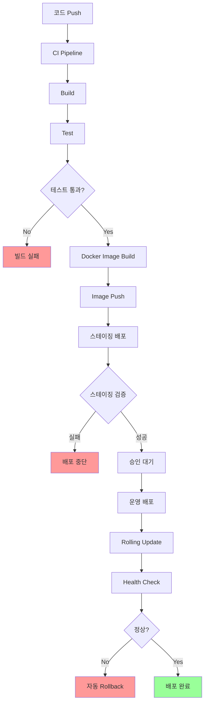
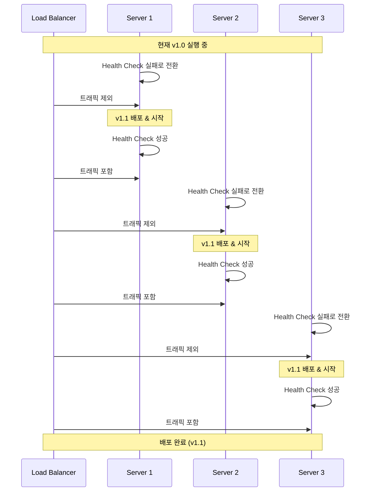
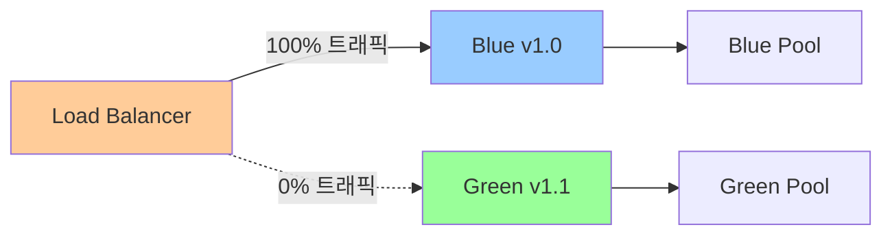
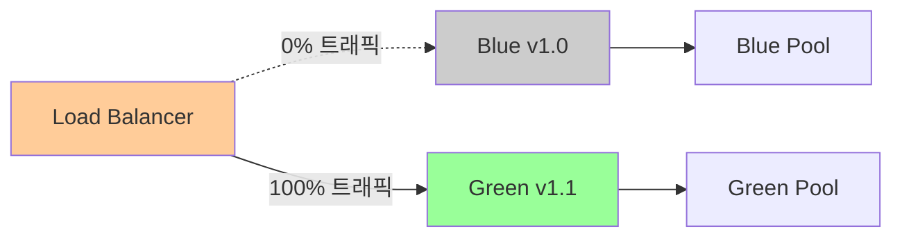

# 01. 배포 전략

## 1. 문서 개요

본 문서는 ABS의 배포 전략과 무중단 배포 절차를 정의합니다.

### 1.1 포함 내용

- Rolling Update 배포 전략
- Rollback 절차
- Blue-Green 배포 (선택사항)
- 배포 전 체크리스트
- 배포 후 검증
- 무중단 배포 보장
- CI/CD 파이프라인

### 1.2 배포 아키텍처



## 2. 배포 환경

### 2.1 환경 구성

| 환경 | 서버 수 | 용도 | 배포 방식 |
|-----|--------|------|---------|
| Development | 1 | 개발 테스트 | 수동/자동 |
| Staging | 2 | QA, 통합 테스트 | 자동 (main branch) |
| Production | 3+ | 운영 서비스 | 수동 승인 후 자동 |

### 2.2 서버 구성

```
Production 환경:
- abs-server-1: 192.168.1.101
- abs-server-2: 192.168.1.102
- abs-server-3: 192.168.1.103
- Load Balancer: 192.168.1.100

각 서버:
- OS: CentOS 8 / Ubuntu 20.04
- Go Runtime: 1.21+
- Systemd Service
- 로컬 로그: /var/log/abs/
- 애플리케이션: /opt/abs/
```

## 3. Rolling Update 배포

### 3.1 Rolling Update 개념



### 3.2 Rolling Update 절차

```bash
#!/bin/bash
# deploy-rolling.sh

set -e

VERSION=$1
SERVERS=("abs-server-1" "abs-server-2" "abs-server-3")
BINARY_NAME="abs"
DEPLOY_PATH="/opt/abs"
SERVICE_NAME="abs.service"

if [ -z "$VERSION" ]; then
    echo "Usage: $0 <version>"
    exit 1
fi

echo "=== Rolling Update 시작: $VERSION ==="

for SERVER in "${SERVERS[@]}"; do
    echo ""
    echo ">>> 서버 배포: $SERVER"

    # 1. 바이너리 복사
    echo "[1/7] 바이너리 복사 중..."
    scp "build/${BINARY_NAME}-${VERSION}" "${SERVER}:${DEPLOY_PATH}/${BINARY_NAME}-new"

    # 2. 설정 파일 복사
    echo "[2/7] 설정 파일 복사 중..."
    scp -r config/* "${SERVER}:${DEPLOY_PATH}/config/"

    # 3. Health Check 확인
    echo "[3/7] 현재 상태 확인..."
    ssh $SERVER "curl -f http://localhost:8080/health || echo 'Health check failed'"

    # 4. Graceful Shutdown 신호 전송
    echo "[4/7] Graceful Shutdown 시작..."
    ssh $SERVER "sudo systemctl reload ${SERVICE_NAME}"

    # 5. 대기 (현재 요청 완료)
    echo "[5/7] 현재 요청 완료 대기 (30초)..."
    sleep 30

    # 6. 서비스 중지 및 바이너리 교체
    echo "[6/7] 서비스 중지 및 바이너리 교체..."
    ssh $SERVER "sudo systemctl stop ${SERVICE_NAME} && \
                 sudo mv ${DEPLOY_PATH}/${BINARY_NAME} ${DEPLOY_PATH}/${BINARY_NAME}-old && \
                 sudo mv ${DEPLOY_PATH}/${BINARY_NAME}-new ${DEPLOY_PATH}/${BINARY_NAME} && \
                 sudo chmod +x ${DEPLOY_PATH}/${BINARY_NAME}"

    # 7. 서비스 시작
    echo "[7/7] 서비스 시작..."
    ssh $SERVER "sudo systemctl start ${SERVICE_NAME}"

    # 8. Health Check 대기 (최대 60초)
    echo "[8/8] Health Check 대기..."
    for i in {1..12}; do
        if ssh $SERVER "curl -f http://localhost:8080/health"; then
            echo "✓ Health Check 성공"
            break
        fi
        if [ $i -eq 12 ]; then
            echo "✗ Health Check 실패 - Rollback 필요"
            exit 1
        fi
        echo "재시도 중... ($i/12)"
        sleep 5
    done

    # 9. 메트릭 확인 (에러율)
    echo "[9/9] 메트릭 확인..."
    ERROR_RATE=$(ssh $SERVER "curl -s http://localhost:9090/metrics | grep abs_http_requests_total | grep status=\\\"5\" | awk '{print \$2}'")
    echo "에러 수: $ERROR_RATE"

    echo "✓ $SERVER 배포 완료"
    echo ""
    echo "다음 서버 배포 전 대기 (30초)..."
    sleep 30
done

echo ""
echo "=== Rolling Update 완료 ==="
echo "배포된 버전: $VERSION"
echo ""
echo "배포 후 검증을 수행하세요:"
echo "1. Health Check: curl http://192.168.1.10{1,2,3}:8080/health"
echo "2. 메트릭 확인: 'Grafana Dashboard 확인'"
echo "3. 로그 확인: ssh abs-server-1 'tail -f /var/log/abs/app.log'"
```

### 3.3 Systemd Service 파일

```ini
# /etc/systemd/system/abs.service
[Unit]
Description=ABS (API Bridge Service)
After=network.target
Requires=network.target

[Service]
Type=notify
User=abs
Group=abs
WorkingDirectory=/opt/abs
ExecStart=/opt/abs/abs
ExecReload=/bin/kill -HUP $MAINPID
KillMode=mixed
KillSignal=SIGTERM
TimeoutStopSec=30s
Restart=on-failure
RestartSec=5s

# 환경 변수
Environment="ABS_ENV=production"
Environment="ABS_CONFIG_PATH=/opt/abs/config"

# 로그
StandardOutput=journal
StandardError=journal
SyslogIdentifier=abs

# 리소스 제한
LimitNOFILE=65536
LimitNPROC=4096

# 보안
NoNewPrivileges=true
PrivateTmp=true

[Install]
WantedBy=multi-user.target
```

### 3.4 Graceful Shutdown 구현

```go
package main

import (
    "context"
    "net/http"
    "os"
    "os/signal"
    "syscall"
    "time"

    "go.uber.org/zap"
)

func main() {
    logger, _ := zap.NewProduction()
    defer logger.Sync()

    // HTTP 서버 설정
    srv := &http.Server{
        Addr:    ":8080",
        Handler: setupRouter(),
    }

    // 서버 시작 (고루틴)
    go func() {
        logger.Info("Starting server", zap.String("addr", srv.Addr))
        if err := srv.ListenAndServe(); err != nil && err != http.ErrServerClosed {
            logger.Fatal("Server failed", zap.Error(err))
        }
    }()

    // Systemd에 준비 완료 알림
    notifySystemd("READY=1")

    // Graceful Shutdown 처리
    quit := make(chan os.Signal, 1)
    signal.Notify(quit, syscall.SIGINT, syscall.SIGTERM, syscall.SIGHUP)

    sig := <-quit
    logger.Info("Shutdown signal received", zap.String("signal", sig.String()))

    // Systemd에 종료 중 알림
    notifySystemd("STOPPING=1")

    // Graceful Shutdown (30초 타임아웃)
    ctx, cancel := context.WithTimeout(context.Background(), 30*time.Second)
    defer cancel()

    logger.Info("Shutting down server...")

    if err := srv.Shutdown(ctx); err != nil {
        logger.Error("Server forced to shutdown", zap.Error(err))
    }

    logger.Info("Server exited")
}

func notifySystemd(state string) {
    if os.Getenv("NOTIFY_SOCKET") != "" {
        // Systemd 알림 (실제로는 systemd 라이브러리 사용)
        // github.com/coreos/go-systemd/v22/daemon
        // daemon.SdNotify(false, state)
    }
}
```

## 4. Rollback 절차

### 4.1 Rollback 시나리오

| 시나리오 | 감지 방법 | Rollback 트리거 |
|---------|---------|----------------|
| Health Check 실패 | 연속 3회 실패 | 자동 |
| 에러율 급증 | 5% 이상 | 자동 |
| 응답 시간 급증 | P95 > 2초 | 수동/자동 |
| 비즈니스 로직 오류 | 일치율 < 90% | 수동 |
| 메모리 누수 | 메모리 80% 초과 | 수동 |

### 4.2 Rollback 스크립트

```bash
#!/bin/bash
# rollback.sh

set -e

SERVERS=("abs-server-1" "abs-server-2" "abs-server-3")
BINARY_NAME="abs"
DEPLOY_PATH="/opt/abs"
SERVICE_NAME="abs.service"

echo "=== Rollback 시작 ==="
echo "이전 버전으로 롤백합니다."
echo ""

read -p "계속하시겠습니까? (yes/no): " CONFIRM
if [ "$CONFIRM" != "yes" ]; then
    echo "Rollback 취소됨"
    exit 0
fi

for SERVER in "${SERVERS[@]}"; do
    echo ""
    echo ">>> 서버 Rollback: $SERVER"

    # 1. 이전 바이너리 확인
    echo "[1/4] 이전 바이너리 확인..."
    if ! ssh $SERVER "test -f ${DEPLOY_PATH}/${BINARY_NAME}-old"; then
        echo "✗ 이전 바이너리가 없습니다."
        exit 1
    fi

    # 2. 서비스 중지
    echo "[2/4] 서비스 중지..."
    ssh $SERVER "sudo systemctl stop ${SERVICE_NAME}"

    # 3. 바이너리 교체
    echo "[3/4] 바이너리 롤백..."
    ssh $SERVER "sudo mv ${DEPLOY_PATH}/${BINARY_NAME} ${DEPLOY_PATH}/${BINARY_NAME}-failed && \
                 sudo mv ${DEPLOY_PATH}/${BINARY_NAME}-old ${DEPLOY_PATH}/${BINARY_NAME} && \
                 sudo chmod +x ${DEPLOY_PATH}/${BINARY_NAME}"

    # 4. 서비스 시작
    echo "[4/4] 서비스 시작..."
    ssh $SERVER "sudo systemctl start ${SERVICE_NAME}"

    # 5. Health Check
    echo "[5/5] Health Check 대기..."
    for i in {1..12}; do
        if ssh $SERVER "curl -f http://localhost:8080/health"; then
            echo "✓ Health Check 성공"
            break
        fi
        if [ $i -eq 12 ]; then
            echo "✗ Rollback 실패 - 수동 개입 필요"
            exit 1
        fi
        echo "재시도 중... ($i/12)"
        sleep 5
    done

    echo "✓ $SERVER Rollback 완료"
    sleep 10
done

echo ""
echo "=== Rollback 완료 ==="
echo ""
echo "인시던트 보고서를 작성하세요:"
echo "1. 실패 원인 분석"
echo "2. 영향받은 서비스 범위"
echo "3. 재배포 계획"
```

### 4.3 자동 Rollback 조건

```go
package deployment

import (
    "context"
    "time"

    "demo-abs/internal/infrastructure/metrics"
)

// AutoRollbackChecker 자동 롤백 체크
type AutoRollbackChecker struct {
    errorRateThreshold    float64
    latencyThreshold      time.Duration
    healthCheckFailures   int
    checkInterval         time.Duration
}

func NewAutoRollbackChecker() *AutoRollbackChecker {
    return &AutoRollbackChecker{
        errorRateThreshold:  5.0,  // 5%
        latencyThreshold:    2 * time.Second,
        healthCheckFailures: 0,
        checkInterval:       10 * time.Second,
    }
}

// Start 롤백 모니터링 시작
func (c *AutoRollbackChecker) Start(ctx context.Context) {
    ticker := time.NewTicker(c.checkInterval)
    defer ticker.Stop()

    for {
        select {
        case <-ticker.C:
            if c.shouldRollback() {
                c.triggerRollback()
                return
            }
        case <-ctx.Done():
            return
        }
    }
}

// shouldRollback 롤백 필요 여부 확인
func (c *AutoRollbackChecker) shouldRollback() bool {
    // 1. 에러율 확인
    errorRate := metrics.GetErrorRate()
    if errorRate > c.errorRateThreshold {
        log.Warn("High error rate detected", zap.Float64("rate", errorRate))
        return true
    }

    // 2. 응답 시간 확인
    p95Latency := metrics.GetP95Latency()
    if p95Latency > c.latencyThreshold {
        log.Warn("High latency detected", zap.Duration("p95", p95Latency))
        return true
    }

    // 3. Health Check 실패 횟수
    if c.healthCheckFailures >= 3 {
        log.Error("Multiple health check failures")
        return true
    }

    return false
}

// triggerRollback 롤백 트리거
func (c *AutoRollbackChecker) triggerRollback() {
    log.Error("Auto rollback triggered")

    // 1. 알림 발송
    notifySlack("🚨 Auto Rollback Triggered - Deployment Failed")

    // 2. Rollback 스크립트 실행
    cmd := exec.Command("/opt/abs/scripts/rollback.sh")
    if err := cmd.Run(); err != nil {
        log.Fatal("Rollback script failed", zap.Error(err))
    }

    log.Info("Rollback completed successfully")
}
```

## 5. Blue-Green 배포

### 5.1 Blue-Green 배포 개념



배포 후:



### 5.2 Blue-Green 배포 스크립트

```bash
#!/bin/bash
# deploy-blue-green.sh

set -e

VERSION=$1
CURRENT_COLOR=$(cat /opt/abs/current-color)  # blue 또는 green

if [ "$CURRENT_COLOR" == "blue" ]; then
    NEW_COLOR="green"
    OLD_SERVERS=("abs-blue-1" "abs-blue-2" "abs-blue-3")
    NEW_SERVERS=("abs-green-1" "abs-green-2" "abs-green-3")
else
    NEW_COLOR="blue"
    OLD_SERVERS=("abs-green-1" "abs-green-2" "abs-green-3")
    NEW_SERVERS=("abs-blue-1" "abs-blue-2" "abs-blue-3")
fi

echo "=== Blue-Green 배포 시작 ==="
echo "현재 활성: $CURRENT_COLOR"
echo "배포 대상: $NEW_COLOR"
echo "버전: $VERSION"
echo ""

# 1. Green 환경에 배포
echo ">>> $NEW_COLOR 환경에 배포 중..."
for SERVER in "${NEW_SERVERS[@]}"; do
    echo "배포: $SERVER"
    scp "build/abs-${VERSION}" "${SERVER}:/opt/abs/abs"
    ssh $SERVER "sudo systemctl restart abs.service"
done

# 2. Health Check
echo ""
echo ">>> $NEW_COLOR 환경 Health Check..."
for SERVER in "${NEW_SERVERS[@]}"; do
    for i in {1..12}; do
        if ssh $SERVER "curl -f http://localhost:8080/health"; then
            echo "✓ $SERVER Health Check 성공"
            break
        fi
        if [ $i -eq 12 ]; then
            echo "✗ Health Check 실패"
            exit 1
        fi
        sleep 5
    done
done

# 3. Smoke Test
echo ""
echo ">>> Smoke Test 실행..."
./scripts/smoke-test.sh "${NEW_SERVERS[0]}"

# 4. 트래픽 전환 확인
echo ""
read -p "트래픽을 $NEW_COLOR로 전환하시겠습니까? (yes/no): " CONFIRM
if [ "$CONFIRM" != "yes" ]; then
    echo "배포 취소됨"
    exit 0
fi

# 5. Load Balancer 트래픽 전환
echo ""
echo ">>> 트래픽 전환 중..."
ssh lb-server "sudo /opt/lb/switch-traffic.sh $NEW_COLOR"

# 6. 모니터링 (5분)
echo ""
echo ">>> 모니터링 (5분)..."
for i in {1..60}; do
    ERROR_RATE=$(curl -s http://prometheus:9090/api/v1/query?query=abs_http_requests_total | jq '.data.result[0].value[1]')
    echo "[$i/60] 에러율: $ERROR_RATE%"
    sleep 5
done

# 7. 완료
echo ""
echo "✓ Blue-Green 배포 완료"
echo "$NEW_COLOR" > /opt/abs/current-color

echo ""
echo "이전 환경 ($CURRENT_COLOR)은 24시간 후 정리됩니다."
```

## 6. 배포 전 체크리스트

### 6.1 배포 전 확인 사항

```markdown
## 배포 전 체크리스트

### 1. 코드 & 빌드
- [ ] 모든 테스트 통과 (Unit, Integration, E2E)
- [ ] 코드 리뷰 완료 및 승인
- [ ] 빌드 성공 확인
- [ ] 버전 태그 생성 (v1.2.3)
- [ ] CHANGELOG 업데이트

### 2. 환경 준비
- [ ] 스테이징 환경 배포 및 검증 완료
- [ ] 데이터베이스 마이그레이션 스크립트 준비
- [ ] 설정 파일 검증 (dev/stg/prod)
- [ ] Secret 값 확인

### 3. 인프라
- [ ] 서버 디스크 용량 확인 (80% 이하)
- [ ] 데이터베이스 연결 풀 여유 확인
- [ ] Redis 메모리 여유 확인
- [ ] RabbitMQ 큐 적체 없음

### 4. 모니터링
- [ ] Grafana 대시보드 확인
- [ ] Prometheus 알림 규칙 확인
- [ ] Alertmanager 설정 확인
- [ ] Slack 채널 알림 테스트

### 5. 백업
- [ ] 데이터베이스 백업 완료
- [ ] 현재 바이너리 백업
- [ ] 설정 파일 백업

### 6. 커뮤니케이션
- [ ] 배포 일정 공지 (팀, 이해관계자)
- [ ] On-Call 엔지니어 지정
- [ ] Rollback 담당자 지정

### 7. Rollback 준비
- [ ] Rollback 스크립트 테스트
- [ ] 이전 버전 바이너리 확인
- [ ] Rollback 시나리오 검토
```

## 7. 배포 후 검증

### 7.1 검증 체크리스트

```bash
#!/bin/bash
# post-deployment-validation.sh

echo "=== 배포 후 검증 시작 ==="

# 1. Health Check
echo ""
echo "[1/8] Health Check..."
for i in 1 2 3; do
    if curl -f "http://192.168.1.10${i}:8080/health"; then
        echo "✓ abs-server-${i} 정상"
    else
        echo "✗ abs-server-${i} 비정상"
        exit 1
    fi
done

# 2. 메트릭 확인
echo ""
echo "[2/8] 메트릭 확인..."
REQUEST_RATE=$(curl -s 'http://prometheus:9090/api/v1/query?query=rate(abs_http_requests_total[5m])' | jq '.data.result[0].value[1]')
echo "요청률: $REQUEST_RATE req/s"

ERROR_RATE=$(curl -s 'http://prometheus:9090/api/v1/query?query=abs_http_requests_total{status=~"5.."}' | jq '.data.result[0].value[1]')
echo "에러율: $ERROR_RATE%"

# 3. 로그 확인
echo ""
echo "[3/8] 로그 확인..."
ssh abs-server-1 "tail -50 /var/log/abs/app.log | grep -i error" || echo "✓ 최근 에러 없음"

# 4. 데이터베이스 연결
echo ""
echo "[4/8] DB 연결 확인..."
DB_CONNECTIONS=$(curl -s http://192.168.1.101:9090/metrics | grep abs_db_connections | grep state=\"active\" | awk '{print $2}')
echo "활성 DB 연결: $DB_CONNECTIONS"

# 5. 캐시 상태
echo ""
echo "[5/8] 캐시 상태 확인..."
CACHE_HIT_RATE=$(curl -s 'http://prometheus:9090/api/v1/query?query=abs_cache_hit_rate' | jq '.data.result[0].value[1]')
echo "캐시 히트율: $CACHE_HIT_RATE%"

# 6. Circuit Breaker 상태
echo ""
echo "[6/8] Circuit Breaker 상태..."
CB_STATE=$(curl -s http://192.168.1.101:9090/metrics | grep abs_circuit_breaker_state)
echo "$CB_STATE"

# 7. API 응답 테스트
echo ""
echo "[7/8] API 응답 테스트..."
curl -X GET http://192.168.1.100/abs/api/v1/routes || echo "✗ API 응답 실패"

# 8. 버전 확인
echo ""
echo "[8/8] 버전 확인..."
for i in 1 2 3; do
    VERSION=$(ssh abs-server-${i} "/opt/abs/abs --version")
    echo "abs-server-${i}: $VERSION"
done

echo ""
echo "=== 검증 완료 ==="
```

### 7.2 모니터링 기간

| 기간 | 모니터링 강도 | 확인 항목 |
|-----|-------------|---------|
| 0-30분 | 매우 높음 | Health Check, 에러율, 응답 시간 (1분 간격) |
| 30분-2시간 | 높음 | 메트릭, 알림, 로그 (5분 간격) |
| 2-24시간 | 중간 | 비즈니스 메트릭, 일치율 (30분 간격) |
| 1-7일 | 낮음 | 장기 추세, 메모리 누수, 성능 저하 (일 단위) |

## 8. CI/CD 파이프라인

### 8.1 GitHub Actions Workflow

```yaml
# .github/workflows/deploy.yml
name: Deploy ABS

on:
  push:
    branches:
      - main
      - staging
    tags:
      - 'v*'

env:
  GO_VERSION: '1.21'
  APP_NAME: 'abs'

jobs:
  test:
    runs-on: ubuntu-latest
    steps:
      - uses: actions/checkout@v3

      - name: Set up Go
        uses: actions/setup-go@v4
        with:
          go-version: ${{ env.GO_VERSION }}

      - name: Run tests
        run: |
          go test -v -race -coverprofile=coverage.out ./...
          go tool cover -html=coverage.out -o coverage.html

      - name: Upload coverage
        uses: actions/upload-artifact@v3
        with:
          name: coverage
          path: coverage.html

  build:
    needs: test
    runs-on: ubuntu-latest
    steps:
      - uses: actions/checkout@v3

      - name: Set up Go
        uses: actions/setup-go@v4
        with:
          go-version: ${{ env.GO_VERSION }}

      - name: Build
        run: |
          CGO_ENABLED=0 GOOS=linux GOARCH=amd64 go build \
            -ldflags="-s -w -X main.version=${{ github.ref_name }}" \
            -o build/${{ env.APP_NAME }} \
            cmd/main.go

      - name: Upload artifact
        uses: actions/upload-artifact@v3
        with:
          name: binary
          path: build/${{ env.APP_NAME }}

  deploy-staging:
    if: github.ref == 'refs/heads/staging'
    needs: build
    runs-on: ubuntu-latest
    environment: staging
    steps:
      - uses: actions/checkout@v3

      - name: Download artifact
        uses: actions/download-artifact@v3
        with:
          name: binary
          path: build/

      - name: Deploy to Staging
        env:
          SSH_PRIVATE_KEY: ${{ secrets.SSH_PRIVATE_KEY }}
        run: |
          mkdir -p ~/.ssh
          echo "$SSH_PRIVATE_KEY" > ~/.ssh/id_rsa
          chmod 600 ~/.ssh/id_rsa
          ./scripts/deploy-rolling.sh staging ${{ github.sha }}

      - name: Validate Deployment
        run: |
          ./scripts/post-deployment-validation.sh staging

  deploy-production:
    if: startsWith(github.ref, 'refs/tags/v')
    needs: build
    runs-on: ubuntu-latest
    environment: production
    steps:
      - uses: actions/checkout@v3

      - name: Download artifact
        uses: actions/download-artifact@v3
        with:
          name: binary
          path: build/

      - name: Deploy to Production
        env:
          SSH_PRIVATE_KEY: ${{ secrets.SSH_PRIVATE_KEY }}
        run: |
          mkdir -p ~/.ssh
          echo "$SSH_PRIVATE_KEY" > ~/.ssh/id_rsa
          chmod 600 ~/.ssh/id_rsa
          ./scripts/deploy-rolling.sh production ${{ github.ref_name }}

      - name: Validate Deployment
        run: |
          ./scripts/post-deployment-validation.sh production

      - name: Notify Slack
        if: always()
        uses: 8398a7/action-slack@v3
        with:
          status: ${{ job.status }}
          text: 'Deployment to Production: ${{ github.ref_name }}'
          webhook_url: ${{ secrets.SLACK_WEBHOOK }}
```

## 9. 무중단 배포 보장

### 9.1 무중단 배포 체크리스트

```
1. Load Balancer Health Check
   - Health Check 엔드포인트 구현
   - 실패 시 자동으로 트래픽 제외

2. Graceful Shutdown
   - SIGTERM 시그널 처리
   - 현재 처리 중인 요청 완료 대기
   - 타임아웃 30초 설정

3. Connection Draining
   - 새 요청 거부
   - 기존 연결 유지
   - Keep-Alive 연결 정리

4. Rolling Update
   - 한 번에 1대씩 배포
   - 각 서버 배포 후 대기 (30초)
   - Health Check 성공 확인 후 다음 서버

5. Rollback 준비
   - 이전 바이너리 보관
   - 자동 Rollback 조건 설정
   - 수동 Rollback 스크립트 준비
```

## 10. 참고 자료

- Systemd Service: https://www.freedesktop.org/software/systemd/man/systemd.service.html
- Graceful Shutdown in Go: https://pkg.go.dev/net/http#Server.Shutdown
- Blue-Green Deployment: https://martinfowler.com/bliki/BlueGreenDeployment.html
- Rolling Update: https://kubernetes.io/docs/tutorials/kubernetes-basics/update/update-intro/

## 11. 구현 위치

```
scripts/
├── deployment/
│   ├── deploy-rolling.sh          # Rolling Update 스크립트
│   ├── deploy-blue-green.sh       # Blue-Green 배포 스크립트
│   ├── rollback.sh                # Rollback 스크립트
│   ├── post-deployment-validation.sh  # 배포 후 검증
│   └── smoke-test.sh              # Smoke Test
├── systemd/
│   └── abs.service                # Systemd Service 파일
.github/
└── workflows/
    └── deploy.yml                  # GitHub Actions Workflow
cmd/
└── main.go                        # Graceful Shutdown 구현
docs/
└── deployment/
    ├── deployment-checklist.md    # 배포 체크리스트
    └── rollback-procedures.md     # Rollback 절차
```

---

최종 수정일: 2025-11-30, 작성자: ABS 개발팀
