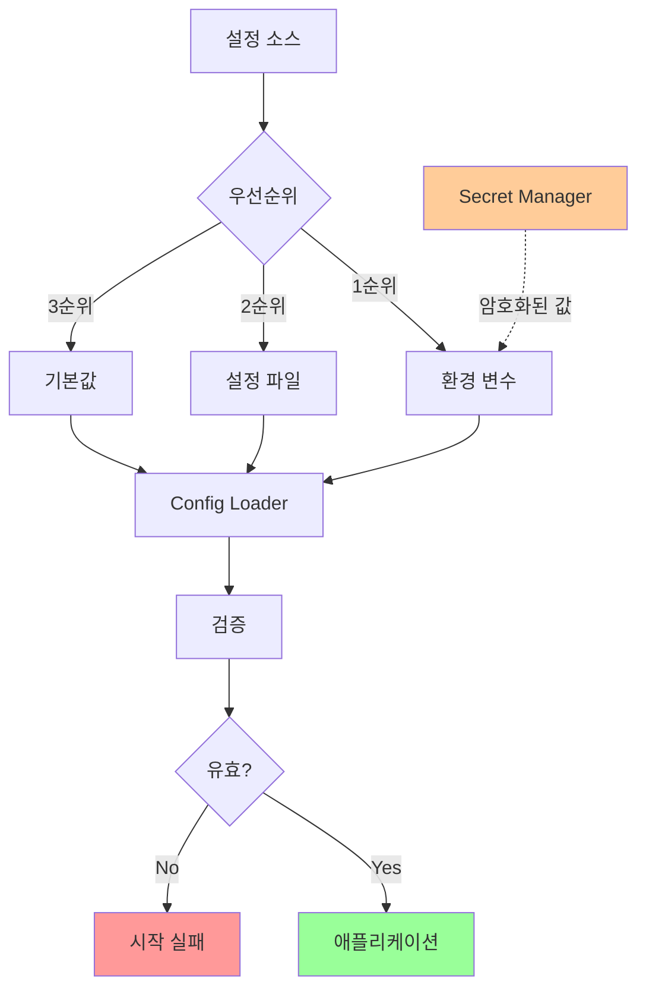
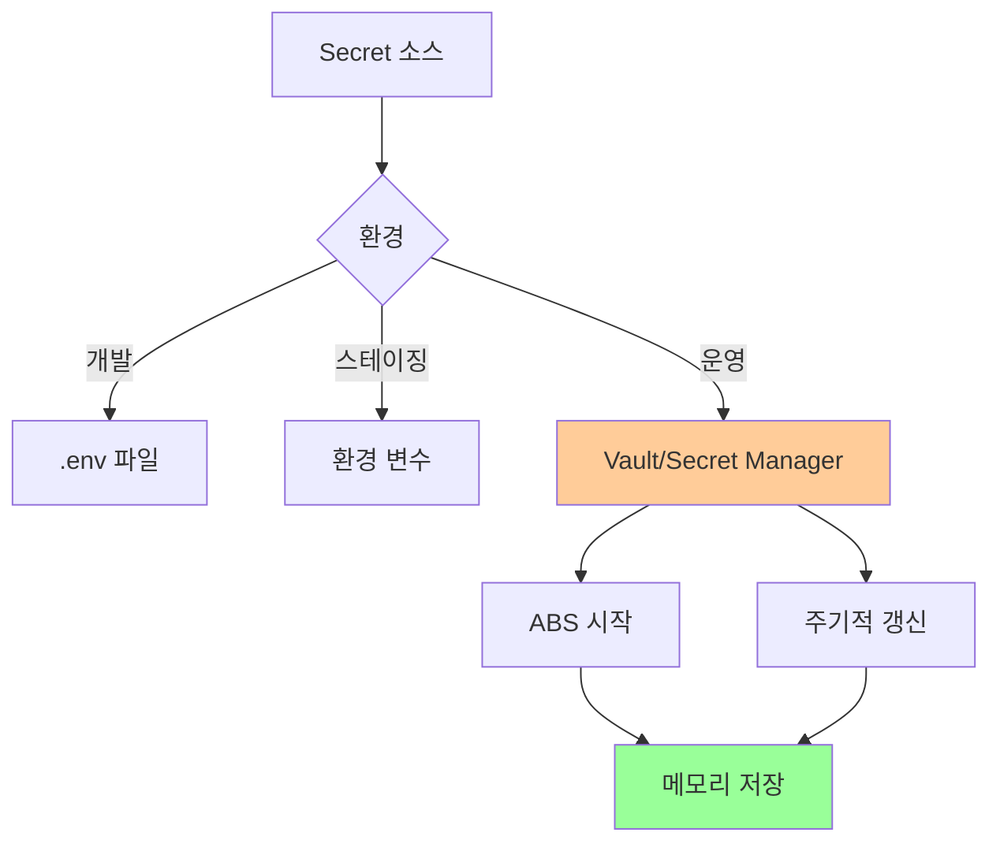

# 02. 설정 관리

## 1. 문서 개요

본 문서는 ABS의 환경별 설정 관리 전략과 Secret 관리 방법을 정의합니다.

### 1.1 포함 내용

- 환경별 설정 파일 구조
- 환경 변수 목록 및 우선순위
- Secret 관리 전략
- 설정 로딩 메커니즘
- 설정 검증
- 동적 설정 변경

### 1.2 설정 관리 아키텍처



## 2. 설정 파일 구조

### 2.1 디렉토리 구조

```
config/
├── default.yaml           # 기본 설정 (모든 환경 공통)
├── development.yaml       # 개발 환경
├── staging.yaml           # 스테이징 환경
├── production.yaml        # 운영 환경
├── database.yaml          # 데이터베이스 설정
├── cache.yaml             # 캐시 설정
├── messaging.yaml         # 메시징 설정
├── logging.yaml           # 로깅 설정
├── monitoring.yaml        # 모니터링 설정
└── security.yaml          # 보안 설정
```

### 2.2 default.yaml (기본 설정)

```yaml
# config/default.yaml
app:
  name: "ABS"
  version: "1.0.0"
  environment: "development"

server:
  host: "0.0.0.0"
  port: 8080
  read_timeout: 30s
  write_timeout: 30s
  idle_timeout: 60s
  max_header_bytes: 1048576  # 1MB

  # Graceful Shutdown
  shutdown_timeout: 30s

# HTTP Client 설정
http_client:
  timeout: 10s
  max_idle_conns: 100
  max_idle_conns_per_host: 10
  max_conns_per_host: 100
  idle_conn_timeout: 90s
  tls_handshake_timeout: 10s
  expect_continue_timeout: 1s

  # Retry 설정
  retry:
    max_attempts: 3
    initial_backoff: 100ms
    max_backoff: 10s
    multiplier: 2.0
    jitter: true

# Circuit Breaker 설정
circuit_breaker:
  legacy:
    max_failures: 5
    timeout: 60s
    required_successes: 2
    half_open_max_requests: 3

  modern:
    max_failures: 5
    timeout: 60s
    required_successes: 2
    half_open_max_requests: 3

# 비교 로직 설정
comparison:
  sample_size: 100
  queue_size: 10000
  worker_count: 10
  timeout: 30s

  # 제외 필드
  exclude_fields:
    - "timestamp"
    - "requestId"
    - "traceId"

# 실험 설정
experiment:
  stages:
    - percentage: 10
      duration: 24h
      required_match_rate: 0.95
    - percentage: 25
      duration: 24h
      required_match_rate: 0.97
    - percentage: 50
      duration: 48h
      required_match_rate: 0.98
    - percentage: 100
      duration: 0h
      required_match_rate: 0.99

# CORS 설정
cors:
  allow_origins:
    - "*"
  allow_methods:
    - "GET"
    - "POST"
    - "PUT"
    - "DELETE"
    - "OPTIONS"
  allow_headers:
    - "Origin"
    - "Content-Type"
    - "Authorization"
    - "X-Request-ID"
  expose_headers:
    - "X-Request-ID"
  allow_credentials: true
  max_age: 86400  # 24 hours
```

### 2.3 production.yaml (운영 환경)

```yaml
# config/production.yaml
app:
  environment: "production"

server:
  port: 8080
  read_timeout: 60s
  write_timeout: 60s

# CORS (운영 환경은 제한적)
cors:
  allow_origins:
    - "https://api.example.com"
    - "https://admin.example.com"

# 비교 설정 (운영 환경은 더 많은 워커)
comparison:
  worker_count: 20
  queue_size: 50000
```

### 2.4 database.yaml

```yaml
# config/database.yaml
database:
  driver: "oracle"
  host: "${DB_HOST:localhost}"
  port: "${DB_PORT:1521}"
  service_name: "${DB_SERVICE:ORCL}"
  username: "${DB_USERNAME:abs_user}"
  password: "${DB_PASSWORD:}"  # 환경 변수에서 가져옴

  # Connection Pool
  pool:
    max_open_conns: 100
    max_idle_conns: 10
    conn_max_lifetime: 1h
    conn_max_idle_time: 10m

  # Timeout
  connect_timeout: 10s
  query_timeout: 30s

  # 로깅
  log_queries: false
  slow_query_threshold: 1s
```

### 2.5 cache.yaml

```yaml
# config/cache.yaml
cache:
  redis:
    enabled: true
    host: "${REDIS_HOST:localhost}"
    port: "${REDIS_PORT:6379}"
    password: "${REDIS_PASSWORD:}"
    db: 0

    # Connection Pool
    pool:
      max_active: 100
      max_idle: 10
      idle_timeout: 5m

    # Timeout
    connect_timeout: 5s
    read_timeout: 3s
    write_timeout: 3s

    # TTL 정책
    ttl:
      route_info: 5m
      match_rate: 10s
      stats_daily: 1h
      config: 1h

    # Eviction 정책
    eviction_policy: "allkeys-lru"
    max_memory: "2gb"
```

### 2.6 messaging.yaml

```yaml
# config/messaging.yaml
messaging:
  rabbitmq:
    enabled: true
    host: "${RABBITMQ_HOST:localhost}"
    port: "${RABBITMQ_PORT:5672}"
    username: "${RABBITMQ_USERNAME:guest}"
    password: "${RABBITMQ_PASSWORD:guest}"
    vhost: "${RABBITMQ_VHOST:/}"

    # Connection
    connection_timeout: 10s
    heartbeat: 10s
    channel_max: 2047

    # Publisher
    publisher:
      confirm_mode: true
      confirm_timeout: 5s
      max_retries: 3

    # Consumer
    consumer:
      prefetch_count: 10
      auto_ack: false
      requeue_on_error: true
      max_retries: 3

    # Exchanges
    exchanges:
      - name: "abs.comparison"
        type: "direct"
        durable: true
        auto_delete: false

      - name: "abs.notification"
        type: "topic"
        durable: true
        auto_delete: false

    # Queues
    queues:
      - name: "abs.comparison.process"
        durable: true
        auto_delete: false
        arguments:
          x-message-ttl: 30000
          x-max-length: 100000
          x-dead-letter-exchange: "abs.comparison.dlx"
```

## 3. 환경 변수

### 3.1 환경 변수 목록

| 변수명 | 설명 | 필수 | 기본값 | 예시 |
|-------|------|------|-------|------|
| ABS_ENV | 실행 환경 | ✅ | development | production |
| ABS_CONFIG_PATH | 설정 파일 경로 | ❌ | ./config | /opt/abs/config |
| ABS_LOG_LEVEL | 로그 레벨 | ❌ | info | debug, info, warn, error |
| ABS_PORT | 서버 포트 | ❌ | 8080 | 8080 |
| DB_HOST | DB 호스트 | ✅ | - | db.example.com |
| DB_PORT | DB 포트 | ❌ | 1521 | 1521 |
| DB_SERVICE | DB 서비스명 | ✅ | - | ORCL |
| DB_USERNAME | DB 사용자 | ✅ | - | abs_user |
| DB_PASSWORD | DB 비밀번호 | ✅ | - | secret123 |
| REDIS_HOST | Redis 호스트 | ✅ | - | redis.example.com |
| REDIS_PORT | Redis 포트 | ❌ | 6379 | 6379 |
| REDIS_PASSWORD | Redis 비밀번호 | ❌ | - | redis_secret |
| RABBITMQ_HOST | RabbitMQ 호스트 | ✅ | - | mq.example.com |
| RABBITMQ_PORT | RabbitMQ 포트 | ❌ | 5672 | 5672 |
| RABBITMQ_USERNAME | RabbitMQ 사용자 | ✅ | - | abs_user |
| RABBITMQ_PASSWORD | RabbitMQ 비밀번호 | ✅ | - | mq_secret |
| JWT_SECRET_KEY | JWT 서명 키 | ✅ | - | super_secret_key |

### 3.2 환경 변수 파일

```bash
# .env.development
ABS_ENV=development
ABS_LOG_LEVEL=debug
ABS_PORT=8080

DB_HOST=localhost
DB_PORT=1521
DB_SERVICE=ORCL
DB_USERNAME=abs_dev
DB_PASSWORD=dev_password

REDIS_HOST=localhost
REDIS_PORT=6379
REDIS_PASSWORD=

RABBITMQ_HOST=localhost
RABBITMQ_PORT=5672
RABBITMQ_USERNAME=guest
RABBITMQ_PASSWORD=guest

JWT_SECRET_KEY=dev_jwt_secret_key
```

```bash
# .env.production
ABS_ENV=production
ABS_LOG_LEVEL=info
ABS_PORT=8080

# 운영 환경 값은 Secret Manager에서 주입
DB_HOST=${SECRET:DB_HOST}
DB_PORT=1521
DB_SERVICE=ORCL_PROD
DB_USERNAME=${SECRET:DB_USERNAME}
DB_PASSWORD=${SECRET:DB_PASSWORD}

REDIS_HOST=${SECRET:REDIS_HOST}
REDIS_PORT=6379
REDIS_PASSWORD=${SECRET:REDIS_PASSWORD}

RABBITMQ_HOST=${SECRET:RABBITMQ_HOST}
RABBITMQ_PORT=5672
RABBITMQ_USERNAME=${SECRET:RABBITMQ_USERNAME}
RABBITMQ_PASSWORD=${SECRET:RABBITMQ_PASSWORD}

JWT_SECRET_KEY=${SECRET:JWT_SECRET_KEY}
```

## 4. 설정 로더 구현

### 4.1 설정 구조체

```go
package config

import (
    "time"
)

// Config 전체 설정
type Config struct {
    App            AppConfig            `yaml:"app"`
    Server         ServerConfig         `yaml:"server"`
    HTTPClient     HTTPClientConfig     `yaml:"http_client"`
    CircuitBreaker CircuitBreakerConfig `yaml:"circuit_breaker"`
    Comparison     ComparisonConfig     `yaml:"comparison"`
    Experiment     ExperimentConfig     `yaml:"experiment"`
    CORS           CORSConfig           `yaml:"cors"`
    Database       DatabaseConfig       `yaml:"database"`
    Cache          CacheConfig          `yaml:"cache"`
    Messaging      MessagingConfig      `yaml:"messaging"`
}

// AppConfig 애플리케이션 설정
type AppConfig struct {
    Name        string `yaml:"name"`
    Version     string `yaml:"version"`
    Environment string `yaml:"environment"`
}

// ServerConfig 서버 설정
type ServerConfig struct {
    Host             string        `yaml:"host"`
    Port             int           `yaml:"port"`
    ReadTimeout      time.Duration `yaml:"read_timeout"`
    WriteTimeout     time.Duration `yaml:"write_timeout"`
    IdleTimeout      time.Duration `yaml:"idle_timeout"`
    MaxHeaderBytes   int           `yaml:"max_header_bytes"`
    ShutdownTimeout  time.Duration `yaml:"shutdown_timeout"`
}

// DatabaseConfig 데이터베이스 설정
type DatabaseConfig struct {
    Driver      string              `yaml:"driver"`
    Host        string              `yaml:"host"`
    Port        int                 `yaml:"port"`
    ServiceName string              `yaml:"service_name"`
    Username    string              `yaml:"username"`
    Password    string              `yaml:"password"`
    Pool        DatabasePoolConfig  `yaml:"pool"`
    ConnectTimeout time.Duration    `yaml:"connect_timeout"`
    QueryTimeout   time.Duration    `yaml:"query_timeout"`
}

type DatabasePoolConfig struct {
    MaxOpenConns    int           `yaml:"max_open_conns"`
    MaxIdleConns    int           `yaml:"max_idle_conns"`
    ConnMaxLifetime time.Duration `yaml:"conn_max_lifetime"`
    ConnMaxIdleTime time.Duration `yaml:"conn_max_idle_time"`
}
```

### 4.2 설정 로더

```go
package config

import (
    "fmt"
    "os"
    "path/filepath"
    "strings"

    "github.com/spf13/viper"
)

// Load 설정 로드
func Load() (*Config, error) {
    // 1. 환경 변수에서 환경 설정
    env := getEnv("ABS_ENV", "development")
    configPath := getEnv("ABS_CONFIG_PATH", "./config")

    // 2. Viper 설정
    v := viper.New()
    v.SetConfigType("yaml")
    v.AddConfigPath(configPath)

    // 3. 기본 설정 로드
    v.SetConfigName("default")
    if err := v.ReadInConfig(); err != nil {
        return nil, fmt.Errorf("failed to read default config: %w", err)
    }

    // 4. 환경별 설정 병합
    v.SetConfigName(env)
    if err := v.MergeInConfig(); err != nil {
        // 환경별 설정이 없어도 계속 진행
        fmt.Printf("Warning: %s config not found, using defaults\n", env)
    }

    // 5. 추가 설정 파일 병합
    additionalConfigs := []string{
        "database",
        "cache",
        "messaging",
        "logging",
        "monitoring",
        "security",
    }

    for _, name := range additionalConfigs {
        v.SetConfigName(name)
        if err := v.MergeInConfig(); err != nil {
            fmt.Printf("Warning: %s config not found\n", name)
        }
    }

    // 6. 환경 변수 바인딩
    v.AutomaticEnv()
    v.SetEnvKeyReplacer(strings.NewReplacer(".", "_"))

    // 7. 설정 구조체로 언마샬
    var cfg Config
    if err := v.Unmarshal(&cfg); err != nil {
        return nil, fmt.Errorf("failed to unmarshal config: %w", err)
    }

    // 8. 환경 변수 치환
    if err := expandEnvVars(&cfg); err != nil {
        return nil, fmt.Errorf("failed to expand env vars: %w", err)
    }

    // 9. 설정 검증
    if err := validate(&cfg); err != nil {
        return nil, fmt.Errorf("config validation failed: %w", err)
    }

    return &cfg, nil
}

// expandEnvVars 환경 변수 치환 ${VAR:default}
func expandEnvVars(cfg *Config) error {
    // Database
    cfg.Database.Host = expandVar(cfg.Database.Host)
    cfg.Database.Username = expandVar(cfg.Database.Username)
    cfg.Database.Password = expandVar(cfg.Database.Password)

    // Cache
    cfg.Cache.Redis.Host = expandVar(cfg.Cache.Redis.Host)
    cfg.Cache.Redis.Password = expandVar(cfg.Cache.Redis.Password)

    // Messaging
    cfg.Messaging.RabbitMQ.Host = expandVar(cfg.Messaging.RabbitMQ.Host)
    cfg.Messaging.RabbitMQ.Username = expandVar(cfg.Messaging.RabbitMQ.Username)
    cfg.Messaging.RabbitMQ.Password = expandVar(cfg.Messaging.RabbitMQ.Password)

    return nil
}

// expandVar ${VAR:default} 형식 처리
func expandVar(s string) string {
    if !strings.HasPrefix(s, "${") {
        return s
    }

    s = strings.TrimPrefix(s, "${")
    s = strings.TrimSuffix(s, "}")

    parts := strings.SplitN(s, ":", 2)
    varName := parts[0]
    defaultValue := ""

    if len(parts) > 1 {
        defaultValue = parts[1]
    }

    if value := os.Getenv(varName); value != "" {
        return value
    }

    return defaultValue
}

func getEnv(key, defaultValue string) string {
    if value := os.Getenv(key); value != "" {
        return value
    }
    return defaultValue
}
```

### 4.3 설정 검증

```go
package config

import (
    "errors"
    "fmt"
)

// validate 설정 검증
func validate(cfg *Config) error {
    var errs []error

    // App 검증
    if cfg.App.Name == "" {
        errs = append(errs, errors.New("app.name is required"))
    }
    if cfg.App.Environment == "" {
        errs = append(errs, errors.New("app.environment is required"))
    }

    // Server 검증
    if cfg.Server.Port <= 0 || cfg.Server.Port > 65535 {
        errs = append(errs, fmt.Errorf("invalid server.port: %d", cfg.Server.Port))
    }

    // Database 검증
    if cfg.Database.Host == "" {
        errs = append(errs, errors.New("database.host is required"))
    }
    if cfg.Database.Username == "" {
        errs = append(errs, errors.New("database.username is required"))
    }
    if cfg.Database.Password == "" && cfg.App.Environment == "production" {
        errs = append(errs, errors.New("database.password is required in production"))
    }

    // Redis 검증
    if cfg.Cache.Redis.Enabled {
        if cfg.Cache.Redis.Host == "" {
            errs = append(errs, errors.New("cache.redis.host is required"))
        }
    }

    // RabbitMQ 검증
    if cfg.Messaging.RabbitMQ.Enabled {
        if cfg.Messaging.RabbitMQ.Host == "" {
            errs = append(errs, errors.New("messaging.rabbitmq.host is required"))
        }
    }

    // 에러가 있으면 반환
    if len(errs) > 0 {
        return errors.Join(errs...)
    }

    return nil
}
```

## 5. Secret 관리

### 5.1 Secret 관리 전략



### 5.2 Vault 연동 (선택사항)

```go
package secret

import (
    "fmt"

    vault "github.com/hashicorp/vault/api"
)

// VaultClient Vault 클라이언트
type VaultClient struct {
    client *vault.Client
    path   string
}

// NewVaultClient Vault 클라이언트 생성
func NewVaultClient(address, token, path string) (*VaultClient, error) {
    config := vault.DefaultConfig()
    config.Address = address

    client, err := vault.NewClient(config)
    if err != nil {
        return nil, err
    }

    client.SetToken(token)

    return &VaultClient{
        client: client,
        path:   path,
    }, nil
}

// GetSecret Secret 조회
func (v *VaultClient) GetSecret(key string) (string, error) {
    secret, err := v.client.Logical().Read(fmt.Sprintf("%s/%s", v.path, key))
    if err != nil {
        return "", err
    }

    if secret == nil || secret.Data == nil {
        return "", fmt.Errorf("secret not found: %s", key)
    }

    value, ok := secret.Data["value"].(string)
    if !ok {
        return "", fmt.Errorf("invalid secret format: %s", key)
    }

    return value, nil
}

// SetSecret Secret 저장
func (v *VaultClient) SetSecret(key, value string) error {
    data := map[string]interface{}{
        "value": value,
    }

    _, err := v.client.Logical().Write(fmt.Sprintf("%s/%s", v.path, key), data)
    return err
}
```

### 5.3 환경 변수 기반 Secret (기본)

```bash
# /opt/abs/secrets/.env.production
# 파일 권한: 600 (소유자만 읽기/쓰기)
# 소유자: abs:abs

DB_PASSWORD=super_secret_db_password
REDIS_PASSWORD=redis_secret_password
RABBITMQ_PASSWORD=rabbitmq_secret_password
JWT_SECRET_KEY=jwt_super_secret_key_12345
```

```bash
# Systemd Service에서 로드
# /etc/systemd/system/abs.service

[Service]
EnvironmentFile=/opt/abs/secrets/.env.production
ExecStart=/opt/abs/abs
```

## 6. 동적 설정 변경

### 6.1 설정 Hot Reload

```go
package config

import (
    "context"
    "sync"
    "time"

    "github.com/fsnotify/fsnotify"
    "go.uber.org/zap"
)

// Watcher 설정 파일 변경 감지
type Watcher struct {
    cfg      *Config
    mu       sync.RWMutex
    logger   *zap.Logger
    onChange func(*Config)
}

func NewWatcher(cfg *Config, logger *zap.Logger) *Watcher {
    return &Watcher{
        cfg:    cfg,
        logger: logger,
    }
}

// OnChange 설정 변경 콜백 등록
func (w *Watcher) OnChange(fn func(*Config)) {
    w.onChange = fn
}

// Watch 설정 파일 변경 감지 시작
func (w *Watcher) Watch(ctx context.Context, configPath string) error {
    watcher, err := fsnotify.NewWatcher()
    if err != nil {
        return err
    }
    defer watcher.Close()

    if err := watcher.Add(configPath); err != nil {
        return err
    }

    w.logger.Info("Started config watcher", zap.String("path", configPath))

    for {
        select {
        case event := <-watcher.Events:
            if event.Op&fsnotify.Write == fsnotify.Write {
                w.logger.Info("Config file changed", zap.String("file", event.Name))
                w.reload()
            }

        case err := <-watcher.Errors:
            w.logger.Error("Watcher error", zap.Error(err))

        case <-ctx.Done():
            return nil
        }
    }
}

// reload 설정 재로드
func (w *Watcher) reload() {
    // 1초 디바운스
    time.Sleep(1 * time.Second)

    newCfg, err := Load()
    if err != nil {
        w.logger.Error("Failed to reload config", zap.Error(err))
        return
    }

    w.mu.Lock()
    w.cfg = newCfg
    w.mu.Unlock()

    w.logger.Info("Config reloaded successfully")

    if w.onChange != nil {
        w.onChange(newCfg)
    }
}

// Get 현재 설정 조회
func (w *Watcher) Get() *Config {
    w.mu.RLock()
    defer w.mu.RUnlock()
    return w.cfg
}
```

### 6.2 설정 변경 API

```go
package handler

import (
    "net/http"

    "demo-abs/internal/infrastructure/config"
    "github.com/gin-gonic/gin"
)

// ConfigHandler 설정 관리 핸들러
type ConfigHandler struct {
    watcher *config.Watcher
}

func NewConfigHandler(watcher *config.Watcher) *ConfigHandler {
    return &ConfigHandler{
        watcher: watcher,
    }
}

// GetConfig 현재 설정 조회
func (h *ConfigHandler) GetConfig(c *gin.Context) {
    cfg := h.watcher.Get()

    // 민감 정보 제거
    safeCfg := maskSensitiveInfo(cfg)

    c.JSON(http.StatusOK, safeCfg)
}

// ReloadConfig 설정 재로드
func (h *ConfigHandler) ReloadConfig(c *gin.Context) {
    newCfg, err := config.Load()
    if err != nil {
        c.JSON(http.StatusInternalServerError, gin.H{
            "error": "Failed to reload config",
        })
        return
    }

    // 설정 적용 (주의: 일부 설정은 재시작 필요)
    // ...

    c.JSON(http.StatusOK, gin.H{
        "message": "Config reloaded successfully",
    })
}

func maskSensitiveInfo(cfg *config.Config) map[string]interface{} {
    return map[string]interface{}{
        "app": cfg.App,
        "server": cfg.Server,
        "database": map[string]interface{}{
            "host":     cfg.Database.Host,
            "port":     cfg.Database.Port,
            "username": cfg.Database.Username,
            "password": "********",  // 마스킹
        },
        // ... 다른 설정
    }
}
```

## 7. 테스트

### 7.1 설정 로딩 테스트

```go
package config_test

import (
    "os"
    "testing"

    "demo-abs/internal/infrastructure/config"
    "github.com/stretchr/testify/assert"
    "github.com/stretchr/testify/require"
)

func TestLoad(t *testing.T) {
    // 환경 변수 설정
    os.Setenv("ABS_ENV", "test")
    os.Setenv("ABS_CONFIG_PATH", "./testdata")
    defer os.Unsetenv("ABS_ENV")
    defer os.Unsetenv("ABS_CONFIG_PATH")

    cfg, err := config.Load()
    require.NoError(t, err)
    assert.NotNil(t, cfg)

    assert.Equal(t, "ABS", cfg.App.Name)
    assert.Equal(t, "test", cfg.App.Environment)
    assert.Equal(t, 8080, cfg.Server.Port)
}

func TestExpandEnvVars(t *testing.T) {
    os.Setenv("TEST_DB_HOST", "test.example.com")
    defer os.Unsetenv("TEST_DB_HOST")

    cfg := &config.Config{
        Database: config.DatabaseConfig{
            Host: "${TEST_DB_HOST:localhost}",
        },
    }

    err := config.ExpandEnvVars(cfg)
    assert.NoError(t, err)
    assert.Equal(t, "test.example.com", cfg.Database.Host)
}

func TestValidate(t *testing.T) {
    tests := []struct {
        name    string
        cfg     *config.Config
        wantErr bool
    }{
        {
            name: "Valid config",
            cfg: &config.Config{
                App: config.AppConfig{
                    Name:        "ABS",
                    Environment: "test",
                },
                Server: config.ServerConfig{
                    Port: 8080,
                },
                Database: config.DatabaseConfig{
                    Host:     "localhost",
                    Username: "test",
                    Password: "test",
                },
            },
            wantErr: false,
        },
        {
            name: "Missing app name",
            cfg: &config.Config{
                App: config.AppConfig{
                    Environment: "test",
                },
            },
            wantErr: true,
        },
    }

    for _, tt := range tests {
        t.Run(tt.name, func(t *testing.T) {
            err := config.Validate(tt.cfg)
            if tt.wantErr {
                assert.Error(t, err)
            } else {
                assert.NoError(t, err)
            }
        })
    }
}
```

## 8. 참고 자료

- Viper (Configuration Library): https://github.com/spf13/viper
- 12 Factor App - Config: https://12factor.net/config
- HashiCorp Vault: https://www.vaultproject.io/docs
- YAML Specification: https://yaml.org/spec/

## 9. 구현 위치

```
config/
├── default.yaml
├── development.yaml
├── staging.yaml
├── production.yaml
├── database.yaml
├── cache.yaml
├── messaging.yaml
└── security.yaml

internal/
└── infrastructure/
    └── config/
        ├── config.go          # 설정 구조체
        ├── loader.go          # 설정 로더
        ├── validator.go       # 설정 검증
        ├── watcher.go         # 설정 Hot Reload
        └── config_test.go     # 테스트

.env.example                   # 환경 변수 예시
.env.development               # 개발 환경
.env.production.example        # 운영 환경 예시

/opt/abs/secrets/
└── .env.production            # 운영 환경 (Git 제외)
```

---

최종 수정일: 2025-11-30, 작성자: ABS 개발팀
