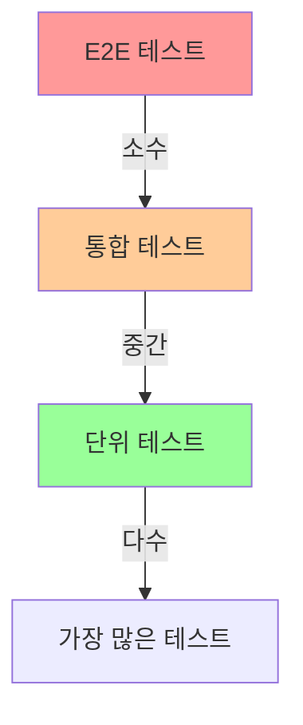

# 02. 테스트 가이드

## 1. 문서 개요

본 문서는 ABS 프로젝트의 테스트 작성 가이드와 테스트 전략을 정의합니다.

### 1.1 포함 내용

- 테스트 유형별 가이드
- 단위 테스트 (Unit Test)
- 통합 테스트 (Integration Test)
- E2E 테스트 (End-to-End Test)
- Mock 사용 가이드
- 테스트 커버리지
- 테스트 도구

### 1.2 테스트 피라미드



**비율:** 단위 70% : 통합 20% : E2E 10%

## 2. 단위 테스트 (Unit Test)

### 2.1 단위 테스트 원칙

**FIRST 원칙:**
- **Fast**: 빠르게 실행
- **Independent**: 독립적으로 실행
- **Repeatable**: 반복 가능
- **Self-Validating**: 자가 검증
- **Timely**: 적시에 작성

### 2.2 테이블 드리븐 테스트

```go
package service_test

import (
    "context"
    "testing"

    "demo-abs/internal/domain/model"
    "demo-abs/internal/domain/service"
    "github.com/stretchr/testify/assert"
    "github.com/stretchr/testify/require"
)

func TestRouteService_CreateRoute(t *testing.T) {
    tests := []struct {
        name    string
        route   *model.Route
        wantErr bool
        errMsg  string
    }{
        {
            name: "Valid route",
            route: &model.Route{
                ID:     "route-123",
                Path:   "/api/users",
                Method: "GET",
            },
            wantErr: false,
        },
        {
            name: "Empty path",
            route: &model.Route{
                ID:     "route-123",
                Path:   "",
                Method: "GET",
            },
            wantErr: true,
            errMsg:  "path is required",
        },
        {
            name: "Invalid method",
            route: &model.Route{
                ID:     "route-123",
                Path:   "/api/users",
                Method: "INVALID",
            },
            wantErr: true,
            errMsg:  "invalid HTTP method",
        },
    }

    for _, tt := range tests {
        t.Run(tt.name, func(t *testing.T) {
            // Arrange
            mockRepo := newMockRouteRepository()
            service := service.NewRouteService(mockRepo)

            // Act
            err := service.CreateRoute(context.Background(), tt.route)

            // Assert
            if tt.wantErr {
                require.Error(t, err)
                assert.Contains(t, err.Error(), tt.errMsg)
            } else {
                require.NoError(t, err)
            }
        })
    }
}
```

### 2.3 Testify 라이브러리 사용

```go
import (
    "github.com/stretchr/testify/assert"
    "github.com/stretchr/testify/require"
)

func TestMatchRateCalculator(t *testing.T) {
    calculator := NewMatchRateCalculator()

    // assert: 실패해도 계속 진행
    assert.Equal(t, 0.95, calculator.Calculate(95, 100))
    assert.NotNil(t, calculator)

    // require: 실패 시 즉시 종료
    result, err := calculator.CalculateWithError(95, 100)
    require.NoError(t, err)
    assert.Equal(t, 0.95, result)
}
```

### 2.4 서브테스트 활용

```go
func TestComparisonService(t *testing.T) {
    service := setupComparisonService()

    t.Run("Compare JSON", func(t *testing.T) {
        t.Run("Identical JSON", func(t *testing.T) {
            json1 := []byte(`{"name":"test"}`)
            json2 := []byte(`{"name":"test"}`)

            result, err := service.Compare(json1, json2)
            require.NoError(t, err)
            assert.True(t, result.IsMatch)
        })

        t.Run("Different JSON", func(t *testing.T) {
            json1 := []byte(`{"name":"test1"}`)
            json2 := []byte(`{"name":"test2"}`)

            result, err := service.Compare(json1, json2)
            require.NoError(t, err)
            assert.False(t, result.IsMatch)
        })
    })

    t.Run("Invalid JSON", func(t *testing.T) {
        json1 := []byte(`invalid`)
        json2 := []byte(`{"name":"test"}`)

        _, err := service.Compare(json1, json2)
        require.Error(t, err)
    })
}
```

## 3. Mock 사용

### 3.1 Mockery를 사용한 Mock 생성

```bash
# Mockery 설치
go install github.com/vektra/mockery/v2@latest

# Mock 생성
mockery --name=RouteRepository --output=mocks --outpkg=mocks
```

```go
// internal/domain/port/repository.go
package port

type RouteRepository interface {
    FindByID(ctx context.Context, id string) (*model.Route, error)
    Save(ctx context.Context, route *model.Route) error
    Delete(ctx context.Context, id string) error
}
```

생성된 Mock:

```go
// mocks/RouteRepository.go (자동 생성)
package mocks

import (
    "context"

    "demo-abs/internal/domain/model"
    "github.com/stretchr/testify/mock"
)

type RouteRepository struct {
    mock.Mock
}

func (m *RouteRepository) FindByID(ctx context.Context, id string) (*model.Route, error) {
    args := m.Called(ctx, id)
    if args.Get(0) == nil {
        return nil, args.Error(1)
    }
    return args.Get(0).(*model.Route), args.Error(1)
}

func (m *RouteRepository) Save(ctx context.Context, route *model.Route) error {
    args := m.Called(ctx, route)
    return args.Error(0)
}

func (m *RouteRepository) Delete(ctx context.Context, id string) error {
    args := m.Called(ctx, id)
    return args.Error(0)
}
```

### 3.2 Mock 사용 예시

```go
package service_test

import (
    "context"
    "testing"

    "demo-abs/internal/domain/model"
    "demo-abs/internal/domain/service"
    "demo-abs/mocks"
    "github.com/stretchr/testify/assert"
    "github.com/stretchr/testify/mock"
)

func TestRouteService_GetRoute(t *testing.T) {
    // Arrange
    mockRepo := new(mocks.RouteRepository)
    expectedRoute := &model.Route{
        ID:     "route-123",
        Path:   "/api/users",
        Method: "GET",
    }

    // Mock 동작 설정
    mockRepo.On("FindByID", mock.Anything, "route-123").
        Return(expectedRoute, nil)

    service := service.NewRouteService(mockRepo)

    // Act
    route, err := service.GetRoute(context.Background(), "route-123")

    // Assert
    assert.NoError(t, err)
    assert.Equal(t, expectedRoute, route)

    // Mock 호출 검증
    mockRepo.AssertExpectations(t)
    mockRepo.AssertCalled(t, "FindByID", mock.Anything, "route-123")
}
```

### 3.3 Mock 고급 사용

```go
func TestRouteService_CreateRoute_Error(t *testing.T) {
    mockRepo := new(mocks.RouteRepository)
    route := &model.Route{ID: "route-123", Path: "/api/users", Method: "GET"}

    // 에러 반환 설정
    mockRepo.On("Save", mock.Anything, route).
        Return(errors.New("database error"))

    service := service.NewRouteService(mockRepo)

    // Act
    err := service.CreateRoute(context.Background(), route)

    // Assert
    assert.Error(t, err)
    assert.Contains(t, err.Error(), "database error")
    mockRepo.AssertExpectations(t)
}

func TestRouteService_UpdateRoute_Matching(t *testing.T) {
    mockRepo := new(mocks.RouteRepository)

    // 특정 조건 매칭
    mockRepo.On("Save", mock.Anything, mock.MatchedBy(func(r *model.Route) bool {
        return r.Path == "/api/users"
    })).Return(nil)

    service := service.NewRouteService(mockRepo)

    route := &model.Route{ID: "route-123", Path: "/api/users", Method: "GET"}
    err := service.CreateRoute(context.Background(), route)

    assert.NoError(t, err)
    mockRepo.AssertExpectations(t)
}
```

## 4. 통합 테스트 (Integration Test)

### 4.1 데이터베이스 통합 테스트

```go
package persistence_test

import (
    "context"
    "database/sql"
    "testing"

    "demo-abs/internal/adapter/out/persistence"
    "demo-abs/internal/domain/model"
    "github.com/stretchr/testify/assert"
    "github.com/stretchr/testify/require"
    "github.com/stretchr/testify/suite"
)

type RouteRepositoryTestSuite struct {
    suite.Suite
    db         *sql.DB
    repository persistence.RouteRepository
}

// SetupSuite 전체 테스트 전 실행
func (suite *RouteRepositoryTestSuite) SetupSuite() {
    // 테스트 DB 연결
    db, err := sql.Open("oracle", "test_connection_string")
    require.NoError(suite.T(), err)

    suite.db = db
    suite.repository = persistence.NewRouteRepository(db)

    // 테스트 스키마 생성
    suite.setupSchema()
}

// TearDownSuite 전체 테스트 후 실행
func (suite *RouteRepositoryTestSuite) TearDownSuite() {
    suite.db.Close()
}

// SetupTest 각 테스트 전 실행
func (suite *RouteRepositoryTestSuite) SetupTest() {
    // 테이블 초기화
    suite.cleanupTables()
}

func (suite *RouteRepositoryTestSuite) TestSave() {
    route := &model.Route{
        ID:     "route-123",
        Path:   "/api/users",
        Method: "GET",
    }

    err := suite.repository.Save(context.Background(), route)
    require.NoError(suite.T(), err)

    // 저장 확인
    saved, err := suite.repository.FindByID(context.Background(), "route-123")
    require.NoError(suite.T(), err)
    assert.Equal(suite.T(), route.Path, saved.Path)
}

func (suite *RouteRepositoryTestSuite) TestFindByID_NotFound() {
    _, err := suite.repository.FindByID(context.Background(), "non-existent")
    assert.Error(suite.T(), err)
}

func (suite *RouteRepositoryTestSuite) setupSchema() {
    // DDL 실행
    sqlFile := "testdata/schema.sql"
    // ...
}

func (suite *RouteRepositoryTestSuite) cleanupTables() {
    suite.db.Exec("DELETE FROM routes")
    suite.db.Exec("DELETE FROM comparisons")
}

// 테스트 실행
func TestRouteRepositoryTestSuite(t *testing.T) {
    suite.Run(t, new(RouteRepositoryTestSuite))
}
```

### 4.2 Redis 통합 테스트

```go
package cache_test

import (
    "context"
    "testing"
    "time"

    "demo-abs/internal/adapter/out/cache"
    "demo-abs/internal/domain/model"
    "github.com/alicebob/miniredis/v2"
    "github.com/go-redis/redis/v8"
    "github.com/stretchr/testify/assert"
    "github.com/stretchr/testify/require"
)

func TestRedisCache(t *testing.T) {
    // Miniredis (In-memory Redis) 사용
    mr, err := miniredis.Run()
    require.NoError(t, err)
    defer mr.Close()

    // Redis 클라이언트
    client := redis.NewClient(&redis.Options{
        Addr: mr.Addr(),
    })

    cache := cache.NewRedisCache(client)

    t.Run("Set and Get", func(t *testing.T) {
        route := &model.Route{
            ID:   "route-123",
            Path: "/api/users",
        }

        // Set
        err := cache.SetRoute(context.Background(), "route-123", route)
        require.NoError(t, err)

        // Get
        cached, err := cache.GetRoute(context.Background(), "route-123")
        require.NoError(t, err)
        assert.Equal(t, route.Path, cached.Path)
    })

    t.Run("TTL", func(t *testing.T) {
        key := "test-key"
        value := "test-value"

        err := cache.Set(context.Background(), key, value, 1*time.Second)
        require.NoError(t, err)

        // TTL 확인
        mr.FastForward(2 * time.Second)

        _, err = cache.Get(context.Background(), key)
        assert.Error(t, err)  // Expired
    })
}
```

### 4.3 HTTP 통합 테스트

```go
package handler_test

import (
    "bytes"
    "encoding/json"
    "net/http"
    "net/http/httptest"
    "testing"

    "demo-abs/internal/adapter/http/handler"
    "demo-abs/internal/adapter/http/router"
    "demo-abs/internal/domain/model"
    "demo-abs/mocks"
    "github.com/gin-gonic/gin"
    "github.com/stretchr/testify/assert"
    "github.com/stretchr/testify/mock"
)

func TestRouteHandler_CreateRoute(t *testing.T) {
    gin.SetMode(gin.TestMode)

    // Mock 설정
    mockService := new(mocks.RouteService)
    mockService.On("CreateRoute", mock.Anything, mock.AnythingOfType("*model.Route")).
        Return(nil)

    // 라우터 설정
    r := gin.New()
    handler := handler.NewRouteHandler(mockService)
    r.POST("/routes", handler.CreateRoute)

    // 요청 생성
    route := model.Route{
        Path:   "/api/users",
        Method: "GET",
    }
    body, _ := json.Marshal(route)

    req := httptest.NewRequest("POST", "/routes", bytes.NewBuffer(body))
    req.Header.Set("Content-Type", "application/json")
    w := httptest.NewRecorder()

    // 실행
    r.ServeHTTP(w, req)

    // 검증
    assert.Equal(t, http.StatusCreated, w.Code)

    var response map[string]interface{}
    err := json.Unmarshal(w.Body.Bytes(), &response)
    assert.NoError(t, err)
    assert.Contains(t, response, "id")

    mockService.AssertExpectations(t)
}
```

## 5. E2E 테스트

### 5.1 E2E 테스트 구조

```go
package e2e_test

import (
    "bytes"
    "encoding/json"
    "net/http"
    "testing"
    "time"

    "github.com/stretchr/testify/assert"
    "github.com/stretchr/testify/require"
    "github.com/stretchr/testify/suite"
)

type E2ETestSuite struct {
    suite.Suite
    baseURL string
    client  *http.Client
}

func (suite *E2ETestSuite) SetupSuite() {
    suite.baseURL = "http://localhost:8080"
    suite.client = &http.Client{
        Timeout: 10 * time.Second,
    }

    // 서버 시작 대기
    suite.waitForServer()
}

func (suite *E2ETestSuite) TestCreateAndGetRoute() {
    t := suite.T()

    // 1. 라우트 생성
    createReq := map[string]interface{}{
        "path":        "/api/test",
        "method":      "GET",
        "sample_size": 100,
    }
    body, _ := json.Marshal(createReq)

    resp, err := suite.client.Post(
        suite.baseURL+"/abs/api/v1/routes",
        "application/json",
        bytes.NewBuffer(body),
    )
    require.NoError(t, err)
    defer resp.Body.Close()

    assert.Equal(t, http.StatusCreated, resp.StatusCode)

    var createResp map[string]interface{}
    err = json.NewDecoder(resp.Body).Decode(&createResp)
    require.NoError(t, err)

    routeID := createResp["id"].(string)
    assert.NotEmpty(t, routeID)

    // 2. 라우트 조회
    resp, err = suite.client.Get(
        suite.baseURL + "/abs/api/v1/routes/" + routeID,
    )
    require.NoError(t, err)
    defer resp.Body.Close()

    assert.Equal(t, http.StatusOK, resp.StatusCode)

    var getResp map[string]interface{}
    err = json.NewDecoder(resp.Body).Decode(&getResp)
    require.NoError(t, err)

    assert.Equal(t, routeID, getResp["id"])
    assert.Equal(t, "/api/test", getResp["path"])

    // 3. 라우트 삭제
    req, _ := http.NewRequest("DELETE", suite.baseURL+"/abs/api/v1/routes/"+routeID, nil)
    resp, err = suite.client.Do(req)
    require.NoError(t, err)
    defer resp.Body.Close()

    assert.Equal(t, http.StatusNoContent, resp.StatusCode)
}

func (suite *E2ETestSuite) TestComparisonFlow() {
    t := suite.T()

    // 1. 라우트 생성
    routeID := suite.createRoute("/api/users", "GET")

    // 2. 비교 트리거 (Legacy/Modern API 호출)
    resp, err := suite.client.Get(suite.baseURL + "/api/users")
    require.NoError(t, err)
    resp.Body.Close()

    // 3. 비교 결과 대기 (비동기 처리)
    time.Sleep(2 * time.Second)

    // 4. 일치율 확인
    resp, err = suite.client.Get(
        suite.baseURL + "/abs/api/v1/routes/" + routeID,
    )
    require.NoError(t, err)
    defer resp.Body.Close()

    var route map[string]interface{}
    err = json.NewDecoder(resp.Body).Decode(&route)
    require.NoError(t, err)

    matchRate := route["match_rate"].(float64)
    assert.GreaterOrEqual(t, matchRate, 0.0)
}

func (suite *E2ETestSuite) createRoute(path, method string) string {
    // Helper 함수
    // ...
    return "route-id"
}

func (suite *E2ETestSuite) waitForServer() {
    for i := 0; i < 30; i++ {
        resp, err := suite.client.Get(suite.baseURL + "/health")
        if err == nil && resp.StatusCode == http.StatusOK {
            resp.Body.Close()
            return
        }
        time.Sleep(1 * time.Second)
    }
    suite.T().Fatal("Server not ready")
}

func TestE2ETestSuite(t *testing.T) {
    if testing.Short() {
        t.Skip("Skipping E2E tests in short mode")
    }

    suite.Run(t, new(E2ETestSuite))
}
```

## 6. 테스트 헬퍼

### 6.1 테스트 픽스처

```go
package testutil

import (
    "demo-abs/internal/domain/model"
    "time"
)

// NewTestRoute 테스트용 Route 생성
func NewTestRoute(id string) *model.Route {
    return &model.Route{
        ID:            id,
        Path:          "/api/test",
        Method:        "GET",
        SampleSize:    100,
        OperationMode: model.OperationModeValidation,
        CreatedAt:     time.Now(),
    }
}

// NewTestComparison 테스트용 Comparison 생성
func NewTestComparison(routeID string, isMatch bool) *model.Comparison {
    return &model.Comparison{
        ID:      "comparison-123",
        RouteID: routeID,
        IsMatch: isMatch,
        CreatedAt: time.Now(),
    }
}
```

### 6.2 테스트 컨텍스트

```go
package testutil

import (
    "context"
    "time"
)

// NewTestContext 테스트용 Context 생성
func NewTestContext() context.Context {
    ctx := context.Background()
    ctx, _ = context.WithTimeout(ctx, 5*time.Second)
    return ctx
}

// NewTestContextWithValue 값이 포함된 테스트 Context
func NewTestContextWithValue(key, value string) context.Context {
    ctx := NewTestContext()
    return context.WithValue(ctx, key, value)
}
```

## 7. 테스트 커버리지

### 7.1 커버리지 측정

```bash
# 커버리지 측정
go test -coverprofile=coverage.out ./...

# 커버리지 보기
go tool cover -html=coverage.out

# 커버리지 비율 출력
go tool cover -func=coverage.out

# 특정 패키지만
go test -coverprofile=coverage.out ./internal/domain/service/...
```

### 7.2 커버리지 목표

| 레이어 | 목표 커버리지 |
|--------|-------------|
| Domain (Service) | 90% 이상 |
| Application (UseCase) | 85% 이상 |
| Adapter (Handler) | 75% 이상 |
| Infrastructure | 70% 이상 |
| 전체 | 80% 이상 |

### 7.3 CI에서 커버리지 체크

```yaml
# .github/workflows/test.yml
name: Test

on: [push, pull_request]

jobs:
  test:
    runs-on: ubuntu-latest
    steps:
      - uses: actions/checkout@v3

      - name: Set up Go
        uses: actions/setup-go@v4
        with:
          go-version: '1.21'

      - name: Run tests
        run: go test -v -coverprofile=coverage.out ./...

      - name: Check coverage
        run: |
          COVERAGE=$(go tool cover -func=coverage.out | grep total | awk '{print $3}' | sed 's/%//')
          echo "Coverage: $COVERAGE%"
          if (( $(echo "$COVERAGE < 80" | bc -l) )); then
            echo "Coverage is below 80%"
            exit 1
          fi

      - name: Upload coverage
        uses: codecov/codecov-action@v3
        with:
          file: ./coverage.out
```

## 8. 벤치마크 테스트

### 8.1 벤치마크 작성

```go
package service_test

import (
    "testing"

    "demo-abs/internal/domain/service"
)

func BenchmarkComparisonService_Compare(b *testing.B) {
    service := setupComparisonService()
    json1 := []byte(`{"name":"test","age":30}`)
    json2 := []byte(`{"name":"test","age":30}`)

    b.ResetTimer()
    for i := 0; i < b.N; i++ {
        service.Compare(json1, json2)
    }
}

func BenchmarkMatchRateCalculator(b *testing.B) {
    calculator := service.NewMatchRateCalculator()

    b.Run("Calculate", func(b *testing.B) {
        for i := 0; i < b.N; i++ {
            calculator.Calculate(95, 100)
        }
    })

    b.Run("Update", func(b *testing.B) {
        for i := 0; i < b.N; i++ {
            calculator.Update("route-123", true)
        }
    })
}
```

```bash
# 벤치마크 실행
go test -bench=. -benchmem ./...

# 특정 벤치마크만
go test -bench=BenchmarkCompare -benchmem ./internal/domain/service
```

## 9. 테스트 모범 사례

### 9.1 AAA 패턴

```go
func TestRouteService_CreateRoute(t *testing.T) {
    // Arrange (준비)
    mockRepo := new(mocks.RouteRepository)
    mockRepo.On("Save", mock.Anything, mock.Anything).Return(nil)
    service := service.NewRouteService(mockRepo)
    route := &model.Route{Path: "/api/test", Method: "GET"}

    // Act (실행)
    err := service.CreateRoute(context.Background(), route)

    // Assert (검증)
    assert.NoError(t, err)
    mockRepo.AssertExpectations(t)
}
```

### 9.2 테스트 격리

```go
// Good - 각 테스트가 독립적
func TestRouteService(t *testing.T) {
    t.Run("CreateRoute", func(t *testing.T) {
        service := setupService()  // 새로운 인스턴스
        // 테스트
    })

    t.Run("GetRoute", func(t *testing.T) {
        service := setupService()  // 새로운 인스턴스
        // 테스트
    })
}

// Bad - 공유 상태
var sharedService *RouteService

func TestCreateRoute(t *testing.T) {
    sharedService.CreateRoute(...)  // 다른 테스트에 영향
}

func TestGetRoute(t *testing.T) {
    sharedService.GetRoute(...)
}
```

### 9.3 의미 있는 테스트 이름

```go
// Good
func TestRouteService_CreateRoute_WhenPathIsEmpty_ReturnsError(t *testing.T) {
    // ...
}

func TestComparisonService_Compare_WhenJSONIsIdentical_ReturnsMatch(t *testing.T) {
    // ...
}

// Bad
func TestRouteService1(t *testing.T) {
    // ...
}

func TestError(t *testing.T) {
    // ...
}
```

## 10. 테스트 실행

### 10.1 로컬에서 실행

```bash
# 전체 테스트
go test ./...

# Verbose 모드
go test -v ./...

# 특정 패키지
go test ./internal/domain/service/...

# 특정 테스트만
go test -run TestRouteService_CreateRoute ./internal/domain/service

# 병렬 실행
go test -parallel 4 ./...

# Short 모드 (E2E 제외)
go test -short ./...

# Race Detection
go test -race ./...
```

### 10.2 Makefile 예시

```makefile
# Makefile

.PHONY: test
test:
	go test -v -race -coverprofile=coverage.out ./...

.PHONY: test-unit
test-unit:
	go test -v -short ./...

.PHONY: test-integration
test-integration:
	go test -v -run Integration ./...

.PHONY: test-e2e
test-e2e:
	go test -v -run E2E ./test/e2e/...

.PHONY: coverage
coverage:
	go test -coverprofile=coverage.out ./...
	go tool cover -html=coverage.out

.PHONY: bench
bench:
	go test -bench=. -benchmem ./...
```

## 11. 참고 자료

- Go Testing Package: https://pkg.go.dev/testing
- Testify: https://github.com/stretchr/testify
- Mockery: https://github.com/vektra/mockery
- Testing Best Practices: https://go.dev/doc/effective_go#testing

---

최종 수정일: 2025-11-30, 작성자: ABS 개발팀
