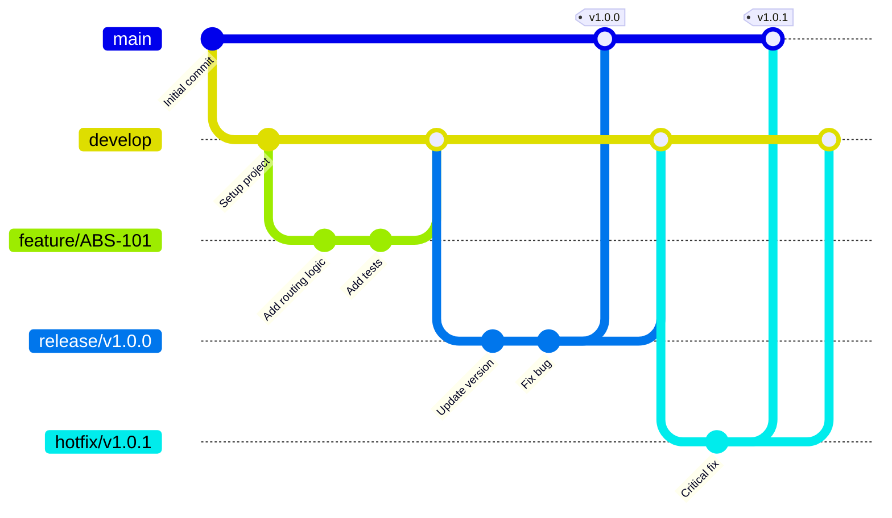

# Git Workflow

## 1. 문서 개요

이 문서는 ABS 프로젝트의 Git 워크플로우와 브랜치 관리 전략을 정의합니다.

- Git Flow 기반 브랜치 전략
- 커밋 메시지 작성 규칙
- Pull Request 템플릿 및 프로세스
- 코드 리뷰 가이드라인
- 머지 전략 및 릴리즈 프로세스

## 2. 브랜치 전략

### 2.1 Git Flow 기반 브랜치 구조



### 2.2 브랜치 유형 및 역할

| 브랜치 유형 | 생명주기 | 부모 브랜치 | 머지 대상 | 명명 규칙 | 목적 |
|----------|---------|-----------|---------|---------|------|
| `main` | 영구 | - | - | `main` | 프로덕션 배포 코드 |
| `develop` | 영구 | `main` | - | `develop` | 다음 릴리즈 개발 통합 |
| `feature/*` | 임시 | `develop` | `develop` | `feature/ABS-{JIRA-ID}` | 기능 개발 |
| `release/*` | 임시 | `develop` | `main`, `develop` | `release/v{major}.{minor}.{patch}` | 릴리즈 준비 |
| `hotfix/*` | 임시 | `main` | `main`, `develop` | `hotfix/v{major}.{minor}.{patch}` | 긴급 수정 |
| `bugfix/*` | 임시 | `develop` | `develop` | `bugfix/ABS-{JIRA-ID}` | 버그 수정 |

### 2.3 브랜치 생성 및 관리

```bash
# Feature 브랜치 생성
git checkout develop
git pull origin develop
git checkout -b feature/ABS-101

# 작업 완료 후 Push
git push -u origin feature/ABS-101

# Release 브랜치 생성
git checkout develop
git pull origin develop
git checkout -b release/v1.1.0

# 버전 업데이트
echo "v1.1.0" > VERSION
git add VERSION
git commit -m "chore: bump version to v1.1.0"

# Hotfix 브랜치 생성
git checkout main
git pull origin main
git checkout -b hotfix/v1.0.1

# 수정 후 태그 생성
git tag -a v1.0.1 -m "Release v1.0.1: Critical security fix"
git push origin v1.0.1
```

## 3. 커밋 메시지 규칙

### 3.1 Conventional Commits 기반 형식

```
<type>(<scope>): <subject>

<body>

<footer>
```

**구조 설명:**
- `type`: 커밋 유형 (필수)
- `scope`: 변경 범위 (선택)
- `subject`: 커밋 요약 (필수, 50자 이내)
- `body`: 상세 설명 (선택, 72자 줄바꿈)
- `footer`: 이슈 참조, Breaking Changes (선택)

### 3.2 커밋 유형 (Type)

| Type | 설명 | 예시 |
|------|------|------|
| `feat` | 새로운 기능 추가 | `feat(router): add dynamic routing rule` |
| `fix` | 버그 수정 | `fix(compare): handle null values in JSON comparison` |
| `docs` | 문서 수정 | `docs(api): update API specification` |
| `style` | 코드 포맷팅 (기능 변경 없음) | `style: format code with gofmt` |
| `refactor` | 코드 리팩토링 | `refactor(handler): simplify error handling` |
| `test` | 테스트 추가/수정 | `test(service): add unit tests for RouteService` |
| `chore` | 빌드/설정 변경 | `chore(deps): update dependencies` |
| `perf` | 성능 개선 | `perf(cache): optimize Redis connection pooling` |
| `ci` | CI/CD 관련 변경 | `ci: add GitHub Actions workflow` |
| `build` | 빌드 시스템 변경 | `build: update Go version to 1.21` |
| `revert` | 이전 커밋 되돌리기 | `revert: revert "feat: add feature X"` |

### 3.3 커밋 메시지 작성 예시

**Good Examples:**

```bash
# Feature 커밋
git commit -m "feat(router): add port-based routing strategy

Implement routing logic that forwards requests to Legacy or Modern APIs
based on the configured port mapping.

- Add PortRouter interface
- Implement DefaultPortRouter with rule matching
- Add unit tests for routing logic

Resolves: ABS-101"

# Bug Fix 커밋
git commit -m "fix(compare): handle nil pointer in JSON comparison

Fixed panic when comparing JSON objects with nil values.
Added defensive null checks and proper error handling.

Fixes: ABS-205"

# Breaking Change 커밋
git commit -m "refactor(config)!: change configuration structure

BREAKING CHANGE: Configuration file format has changed.
Migration guide: docs/migration/v1-to-v2.md

- Replace YAML with TOML format
- Restructure nested configuration
- Add validation for required fields"
```

**Bad Examples:**

```bash
# ❌ 너무 짧고 불명확
git commit -m "fix bug"

# ❌ 유형 누락
git commit -m "add new feature"

# ❌ 대문자 시작 (소문자로 시작해야 함)
git commit -m "Fix: Update configuration"

# ❌ 마침표 사용 (제목에 마침표 불필요)
git commit -m "feat: add routing logic."
```

### 3.4 Scope 가이드라인

**추천 Scope:**
- `router`: 라우팅 로직
- `compare`: JSON 비교 로직
- `proxy`: 프록시 처리
- `config`: 설정 관리
- `cache`: 캐시 처리
- `queue`: 메시지 큐
- `db`: 데이터베이스
- `api`: API 엔드포인트
- `monitoring`: 모니터링/로깅
- `security`: 보안 관련
- `test`: 테스트 관련
- `docs`: 문서

## 4. Pull Request (PR) 프로세스

### 4.1 PR 생성 전 체크리스트

```bash
# 1. 최신 develop 브랜치와 동기화
git checkout develop
git pull origin develop
git checkout feature/ABS-101
git rebase develop

# 2. 로컬 테스트 실행
go test ./...
go test -race ./...
go vet ./...
golangci-lint run

# 3. 커밋 정리 (필요시)
git rebase -i HEAD~3  # 최근 3개 커밋 정리

# 4. Push
git push origin feature/ABS-101 --force-with-lease
```

### 4.2 PR 템플릿

```markdown
## 📋 Summary
<!-- PR의 목적과 변경 사항을 간략히 설명 -->

## 🎯 Related Issues
<!-- 관련 JIRA 이슈 또는 GitHub Issue 링크 -->
- Resolves: ABS-XXX
- Related to: ABS-YYY

## 🔄 Type of Change
<!-- 해당하는 항목에 [x] 체크 -->
- [ ] 🐛 Bug fix (non-breaking change which fixes an issue)
- [ ] ✨ New feature (non-breaking change which adds functionality)
- [ ] 💥 Breaking change (fix or feature that would cause existing functionality to not work as expected)
- [ ] 📝 Documentation update
- [ ] 🔨 Refactoring (no functional changes)
- [ ] ⚡ Performance improvement
- [ ] ✅ Test update

## 📝 Description
<!-- 변경 사항에 대한 상세 설명 -->

### What was changed?
-

### Why was this change necessary?
-

### How does it work?
-

## 🧪 Testing
<!-- 테스트 방법 및 결과 -->

### Test Coverage
- [ ] Unit tests added/updated
- [ ] Integration tests added/updated
- [ ] E2E tests added/updated
- [ ] Manual testing completed

### Test Results
```bash
# Test command and output
go test -v -cover ./...
```

### Manual Testing Steps
1.
2.
3.

## 📸 Screenshots (if applicable)
<!-- UI 변경사항이 있는 경우 스크린샷 첨부 -->

## 🔍 Code Review Checklist
<!-- 리뷰어를 위한 체크리스트 -->
- [ ] Code follows the coding conventions (docs/10-development/01-coding-convention.md)
- [ ] Self-review of code completed
- [ ] Comments added for complex logic
- [ ] Documentation updated (if needed)
- [ ] No new warnings generated
- [ ] Tests added and passing
- [ ] Performance impact considered
- [ ] Security implications reviewed

## 🚀 Deployment Notes
<!-- 배포 시 주의사항 -->
- [ ] Database migration required
- [ ] Configuration changes required
- [ ] Environment variables updated
- [ ] Backward compatibility maintained
- [ ] Rollback plan documented

## 📚 Additional Context
<!-- 추가 정보 또는 참고 자료 -->
```

### 4.3 PR 크기 가이드라인

| PR 크기 | 변경 라인 수 | 리뷰 시간 | 권장사항 |
|---------|------------|----------|---------|
| XS | < 10 | 5분 | 문서 수정, 간단한 버그 수정 |
| S | 10-50 | 15분 | 작은 기능, 리팩토링 |
| M | 50-200 | 30분 | 보통 크기의 기능 |
| L | 200-500 | 1시간 | 큰 기능 (가능하면 분리) |
| XL | > 500 | 2시간+ | 반드시 분리 권장 |

**Large PR 분리 전략:**
```bash
# Feature를 여러 단계로 분리
feature/ABS-101-step1-data-model
feature/ABS-101-step2-service-layer
feature/ABS-101-step3-api-endpoint
feature/ABS-101-step4-integration
```

## 5. 코드 리뷰 가이드라인

### 5.1 리뷰어 체크리스트

**기능 및 로직:**
- [ ] 요구사항을 정확히 구현했는가?
- [ ] 비즈니스 로직이 올바른가?
- [ ] Edge case 처리가 적절한가?
- [ ] 에러 처리가 완전한가?

**코드 품질:**
- [ ] 코드가 읽기 쉽고 이해하기 쉬운가?
- [ ] 함수/변수 네이밍이 명확한가?
- [ ] 중복 코드가 없는가?
- [ ] 복잡도가 적절한가? (Cyclomatic complexity < 10)

**테스트:**
- [ ] 단위 테스트 커버리지가 충분한가? (80% 이상)
- [ ] 테스트가 의미있는 케이스를 다루는가?
- [ ] 통합 테스트가 필요한 경우 작성되었는가?

**성능:**
- [ ] 불필요한 데이터베이스 쿼리가 없는가?
- [ ] N+1 쿼리 문제가 없는가?
- [ ] 메모리 누수 가능성이 없는가?
- [ ] 무한 루프나 데드락 가능성이 없는가?

**보안:**
- [ ] SQL Injection 취약점이 없는가?
- [ ] 인증/인가가 적절히 구현되었는가?
- [ ] 민감한 정보가 로그에 노출되지 않는가?
- [ ] 입력 값 검증이 충분한가?

**유지보수성:**
- [ ] 주석이 필요한 복잡한 로직에 설명이 있는가?
- [ ] 매직 넘버 대신 상수를 사용했는가?
- [ ] 설정 값이 하드코딩되지 않았는가?

### 5.2 리뷰 코멘트 작성 가이드

**Good Review Comments:**

```markdown
# 1. 구체적이고 건설적인 피드백
❌ "This code is bad."
✅ "Consider extracting this logic into a separate function for better readability and testability."

# 2. 코드 예시 제공
✅ "You can simplify this using Go's range loop:
```go
for _, item := range items {
    // process item
}
```

# 3. 질문 형태로 제안
✅ "Have you considered using a context with timeout here to prevent hanging requests?"

# 4. 긍정적인 피드백도 포함
✅ "Great job handling the edge case for empty arrays!"

# 5. 심각도 표시
🔴 Critical: "This will cause a panic if the input is nil. Must be fixed."
🟡 Minor: "Consider renaming this variable to 'userID' for clarity."
💡 Suggestion: "You might want to consider using a sync.Pool here for better performance."
```

### 5.3 리뷰 승인 기준

**Approve (승인):**
- 모든 필수 체크리스트 항목 통과
- Critical 이슈 없음
- 테스트 통과
- 2명 이상의 Approver 승인 (main 브랜치 머지 시)

**Request Changes (수정 요청):**
- Critical 이슈 발견
- 테스트 실패
- 요구사항 미충족

**Comment (코멘트만):**
- Minor 이슈나 제안사항만 있는 경우
- 추가 논의가 필요한 경우

## 6. 머지 전략

### 6.1 머지 방식

**1. Squash and Merge (권장)**
```bash
# Feature → Develop 머지 시 권장
# 여러 커밋을 하나의 깔끔한 커밋으로 병합
# GitHub에서 Squash and merge 버튼 사용
```

**장점:**
- Develop 브랜치 히스토리가 깔끔함
- 각 기능이 하나의 커밋으로 표현됨
- Revert가 쉬움

**2. Merge Commit**
```bash
# Release → Main, Hotfix → Main/Develop 머지 시
git checkout main
git merge --no-ff release/v1.1.0
git tag -a v1.1.0 -m "Release v1.1.0"
git push origin main --tags
```

**장점:**
- 브랜치 히스토리 보존
- 릴리즈 이력 명확히 추적

**3. Rebase (지양)**
```bash
# 개인 Feature 브랜치에서만 사용
# 공유 브랜치에서는 절대 사용 금지
git checkout feature/ABS-101
git rebase develop
```

### 6.2 머지 충돌 해결

```bash
# 1. 최신 develop 가져오기
git checkout develop
git pull origin develop

# 2. Feature 브랜치에서 rebase
git checkout feature/ABS-101
git rebase develop

# 3. 충돌 발생 시
# 파일 열어서 수동으로 해결
# <<<<<<< HEAD
# 현재 브랜치의 변경사항
# =======
# develop 브랜치의 변경사항
# >>>>>>> develop

# 4. 충돌 해결 후
git add .
git rebase --continue

# 5. Force push (--force-with-lease 사용)
git push origin feature/ABS-101 --force-with-lease
```

## 7. 릴리즈 프로세스

### 7.1 릴리즈 준비

```bash
# 1. Release 브랜치 생성
git checkout develop
git pull origin develop
git checkout -b release/v1.2.0

# 2. 버전 업데이트
echo "v1.2.0" > VERSION
git add VERSION
git commit -m "chore: bump version to v1.2.0"

# 3. CHANGELOG 업데이트
cat >> CHANGELOG.md << EOF
## [v1.2.0] - 2025-12-02

### Added
- Feature A (ABS-101)
- Feature B (ABS-105)

### Fixed
- Bug fix C (ABS-201)

### Changed
- Performance improvement D (ABS-301)
EOF

git add CHANGELOG.md
git commit -m "docs: update CHANGELOG for v1.2.0"

# 4. Release 브랜치 Push
git push -u origin release/v1.2.0
```

### 7.2 릴리즈 배포

```bash
# 1. Main 브랜치로 머지
git checkout main
git pull origin main
git merge --no-ff release/v1.2.0
git tag -a v1.2.0 -m "Release v1.2.0"
git push origin main --tags

# 2. Develop 브랜치로 백머지
git checkout develop
git pull origin develop
git merge --no-ff release/v1.2.0
git push origin develop

# 3. Release 브랜치 삭제
git branch -d release/v1.2.0
git push origin --delete release/v1.2.0
```

### 7.3 Hotfix 프로세스

```bash
# 1. Hotfix 브랜치 생성 (Main에서)
git checkout main
git pull origin main
git checkout -b hotfix/v1.2.1

# 2. 버그 수정
# ... fix code ...
git add .
git commit -m "fix(security): patch critical vulnerability

Fixed SQL injection vulnerability in query builder.

CVE-2024-XXXXX
Severity: Critical"

# 3. 버전 업데이트
echo "v1.2.1" > VERSION
git add VERSION
git commit -m "chore: bump version to v1.2.1"

# 4. Main으로 머지
git checkout main
git merge --no-ff hotfix/v1.2.1
git tag -a v1.2.1 -m "Hotfix v1.2.1: Security patch"
git push origin main --tags

# 5. Develop으로 백머지
git checkout develop
git merge --no-ff hotfix/v1.2.1
git push origin develop

# 6. Hotfix 브랜치 삭제
git branch -d hotfix/v1.2.1
git push origin --delete hotfix/v1.2.1
```

## 8. 브랜치 보호 규칙

### 8.1 GitHub Branch Protection 설정

**Main 브랜치:**
```yaml
Branch Protection Rules:
  - Require pull request reviews before merging
    - Required approving reviews: 2
    - Dismiss stale pull request approvals when new commits are pushed
  - Require status checks to pass before merging
    - Require branches to be up to date before merging
    - Status checks: CI Build, Unit Tests, Lint, Security Scan
  - Require conversation resolution before merging
  - Require signed commits
  - Include administrators
  - Restrict who can push to matching branches
    - Only release managers
```

**Develop 브랜치:**
```yaml
Branch Protection Rules:
  - Require pull request reviews before merging
    - Required approving reviews: 1
  - Require status checks to pass before merging
    - Status checks: CI Build, Unit Tests, Lint
  - Require conversation resolution before merging
  - Do not allow force pushes
```

### 8.2 Git Hooks

**Pre-commit Hook** (`.git/hooks/pre-commit`):
```bash
#!/bin/bash

echo "Running pre-commit checks..."

# 1. Go formatting
if ! gofmt -l . | grep -v vendor | read; then
    echo "✅ Go formatting check passed"
else
    echo "❌ Go formatting check failed. Run: gofmt -w ."
    exit 1
fi

# 2. Go vet
if go vet ./...; then
    echo "✅ Go vet passed"
else
    echo "❌ Go vet failed"
    exit 1
fi

# 3. Unit tests
if go test -short ./...; then
    echo "✅ Unit tests passed"
else
    echo "❌ Unit tests failed"
    exit 1
fi

# 4. Golangci-lint
if golangci-lint run --fast; then
    echo "✅ Linting passed"
else
    echo "❌ Linting failed"
    exit 1
fi

echo "✅ All pre-commit checks passed!"
```

**Commit-msg Hook** (`.git/hooks/commit-msg`):
```bash
#!/bin/bash

commit_msg_file=$1
commit_msg=$(cat "$commit_msg_file")

# Conventional Commits 형식 검증
pattern="^(feat|fix|docs|style|refactor|test|chore|perf|ci|build|revert)(\(.+\))?: .{1,50}"

if ! echo "$commit_msg" | grep -Eq "$pattern"; then
    echo "❌ Invalid commit message format!"
    echo ""
    echo "Commit message must follow Conventional Commits:"
    echo "  <type>(<scope>): <subject>"
    echo ""
    echo "Examples:"
    echo "  feat(router): add dynamic routing"
    echo "  fix(compare): handle null values"
    echo ""
    exit 1
fi

echo "✅ Commit message format is valid"
```

## 9. 모범 사례 (Best Practices)

### 9.1 일반 원칙

1. **자주 커밋하기**
   - 논리적으로 완결된 단위로 커밋
   - 하루에 최소 2-3회 커밋 권장

2. **작은 PR 유지**
   - PR은 가능한 작게 (200-300 라인 이하)
   - 큰 기능은 여러 PR로 분리

3. **리뷰 신속하게**
   - PR 생성 후 24시간 내 1차 리뷰
   - 리뷰 요청 시 48시간 내 응답

4. **CI/CD 파이프라인 통과 필수**
   - 모든 테스트 통과 후 머지
   - Lint, 보안 스캔 통과 필수

5. **브랜치 정리**
   - 머지된 브랜치는 즉시 삭제
   - 오래된 브랜치 정기적으로 정리

### 9.2 피해야 할 안티패턴

❌ **하지 말아야 할 것들:**

```bash
# 1. 공유 브랜치에서 force push
git push -f origin develop  # 절대 금지!

# 2. Develop에서 직접 커밋
git commit -m "quick fix" # PR 없이 직접 커밋 금지

# 3. 의미없는 커밋 메시지
git commit -m "fix"
git commit -m "update"
git commit -m "WIP"  # 최종 커밋 메시지로 부적절

# 4. 대용량 파일 커밋
git add large-file.bin  # Git LFS 사용 필요

# 5. 민감한 정보 커밋
git add .env
git add secrets.yaml  # 절대 금지!
```

### 9.3 Git 설정 권장사항

```bash
# Global 설정
git config --global user.name "Your Name"
git config --global user.email "your.email@company.com"
git config --global core.autocrlf input  # Unix 스타일 line ending
git config --global pull.rebase false    # Merge 방식 사용
git config --global init.defaultBranch main

# Repository 설정
git config core.ignorecase false
git config core.filemode false

# Alias 설정
git config --global alias.co checkout
git config --global alias.br branch
git config --global alias.ci commit
git config --global alias.st status
git config --global alias.unstage 'reset HEAD --'
git config --global alias.last 'log -1 HEAD'
git config --global alias.visual 'log --oneline --graph --all --decorate'
```

## 10. 트러블슈팅

### 10.1 자주 발생하는 문제 해결

**문제 1: Diverged branches**
```bash
# 해결: Rebase 사용
git fetch origin
git rebase origin/develop

# 충돌 발생 시
git add <resolved-files>
git rebase --continue

# 포기하려면
git rebase --abort
```

**문제 2: 잘못된 브랜치에 커밋**
```bash
# 해결: Cherry-pick 사용
git checkout correct-branch
git cherry-pick <commit-hash>

# 잘못된 브랜치에서 제거
git checkout wrong-branch
git reset --hard HEAD~1
```

**문제 3: 민감한 정보를 커밋함**
```bash
# 해결: Git history 재작성 (BFG Repo-Cleaner 권장)
git filter-branch --force --index-filter \
  'git rm --cached --ignore-unmatch path/to/sensitive/file' \
  --prune-empty --tag-name-filter cat -- --all

# 또는 BFG 사용 (더 빠름)
bfg --delete-files sensitive-file.txt
git reflog expire --expire=now --all
git gc --prune=now --aggressive
```

**문제 4: 머지 충돌 해결 실패**
```bash
# 해결: 머지 취소하고 다시 시도
git merge --abort
git status  # 상태 확인
git merge <branch> --no-ff  # 다시 시도
```

## 11. 참고 자료

- **Git Flow**: https://nvie.com/posts/a-successful-git-branching-model/
- **Conventional Commits**: https://www.conventionalcommits.org/
- **Semantic Versioning**: https://semver.org/
- **GitHub Flow**: https://guides.github.com/introduction/flow/

## 12. 구현 위치

- Git Hooks: `.git/hooks/`
- GitHub Actions: `.github/workflows/`
- PR Template: `.github/PULL_REQUEST_TEMPLATE.md`
- Issue Template: `.github/ISSUE_TEMPLATE/`
- Branch Protection: GitHub Repository Settings

---

최종 수정일: 2025-11-30
작성자: ABS 개발팀
