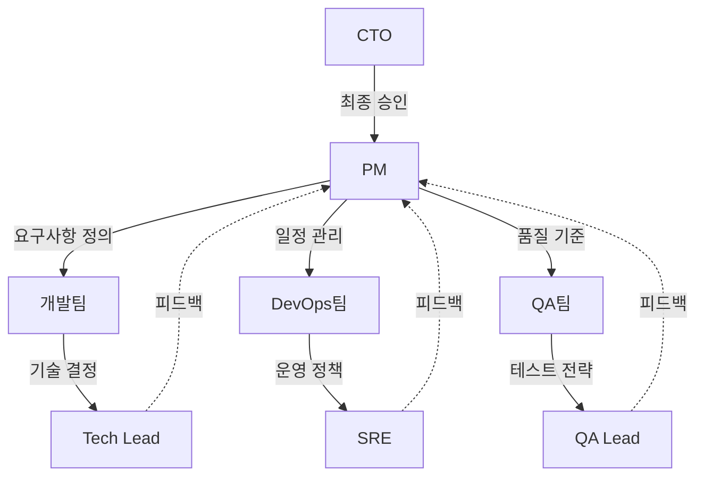
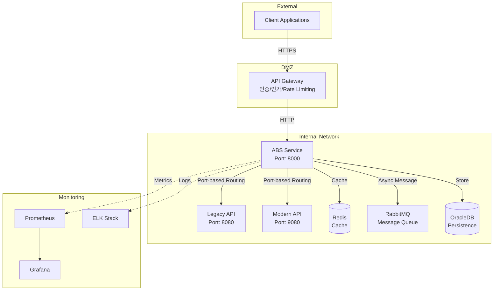
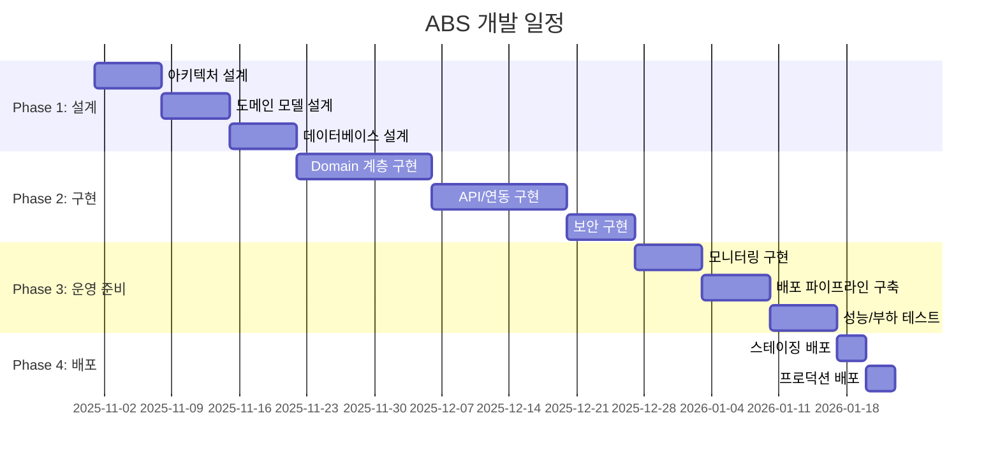

# ABS 요구사항 정의서 - 개요 및 배경

## 문서 정보

| 항목 | 내용 |
|------|------|
| **문서명** | ABS (API Bridge Service) 요구사항 정의서 - 개요 |
| **버전** | v1.0 |
| **작성일** | 2025-11-30 |
| **대상 독자** | 경영진, PM, 개발팀, QA팀, 운영팀 |
| **문서 목적** | ABS 서비스의 전체 개요 및 비즈니스 배경 제공 |

---

## 1. 서비스 개요

### 1.1 서비스 정의

**ABS (API Bridge Service)**는 Legacy API에서 Modern API로의 안전하고 점진적인 전환을 지원하는 중간 레이어 서비스입니다.

```
┌─────────────────────────────────────────────────────────────────┐
│                         Client Applications                     │
└─────────────────────────────┬───────────────────────────────────┘
                              │
                              ▼
                   ┌──────────────────────┐
                   │    API Gateway       │ ← 인증/인가, 라우팅
                   └──────────┬───────────┘
                              │
                              ▼
         ┌────────────────────────────────────────────┐
         │      ABS (API Bridge Service)              │
         │  • 포트 기반 라우팅                            │
         │  • JSON 응답 비교                            │
         │  • 일치율 계산                                │
         │  • 반자동 전환 실험                            │
         └────────┬───────────────────────┬───────────┘
                  │                       │
        ┌─────────▼────────┐    ┌────────▼──────────┐
        │   Legacy API     │    │   Modern API      │
        │   (Port: 8080)   │    │   (Port: 9080)    │
        └──────────────────┘    └───────────────────┘
```

### 1.2 서비스 배경

#### 문제 상황

현대의 기업 IT 시스템은 지속적인 기술 진화와 비즈니스 요구사항 변화에 따라 **API 시스템의 현대화(Modernization)**가 필수적입니다. 그러나 다음과 같은 과제가 존재합니다:

| 과제 | 설명 | 영향 |
|------|------|------|
| **무중단 전환 요구** | 서비스 중단 없이 API를 전환해야 함 | 비즈니스 연속성 보장 필요 |
| **위험 최소화** | Legacy와 Modern API 간 동작 불일치 가능성 | 데이터 정합성, 비즈니스 로직 오류 위험 |
| **점진적 전환** | 한 번에 모든 API를 전환하는 것은 위험도가 높음 | 단계적 전환 전략 필요 |
| **검증 필요성** | 전환 전 충분한 검증이 필요함 | 실시간 비교 및 모니터링 필요 |

#### 기존 접근 방식의 한계

1. **빅뱅 전환 (Big Bang Cutover)**
   - 한 번에 모든 트래픽을 Modern API로 전환
   - 실패 시 전체 서비스 장애
   - 롤백이 어려움

2. **Blue-Green 배포**
   - 두 환경을 별도로 운영하여 순간 전환
   - 여전히 전환 순간의 위험 존재
   - Modern API의 실제 동작 검증 부족

3. **수동 검증**
   - 개발/테스트 환경에서만 검증
   - 실제 프로덕션 트래픽과의 차이
   - 검증 커버리지 부족

#### ABS의 해결책

ABS는 **반자동 전환 실험 (Semi-Automated Experiment)** 을 통해 안전하고 데이터 기반의 점진적 전환을 가능하게 합니다:

1. **검증 모드 (Validation Mode)**: 모든 요청을 Legacy로 보내되, Modern API를 `Shadow Call` 하여 응답 비교
2. **Canary 모드 (Canary Mode)**: 일부 트래픽(1-10%)을 Modern API로 보내며 일치율 모니터링
3. **전환 모드 (Switched Mode)**: 충분한 검증 후 모든 트래픽을 Modern API로 전환

---

## 2. 비즈니스 가치

### 2.1 핵심 가치 제안

| 가치 | 설명 | 측정 지표 |
|------|------|----------|
| **무중단 전환** | 서비스 중단 없이 API 전환 가능 | Downtime = 0 |
| **위험 최소화** | 실시간 비교를 통한 조기 문제 발견 | 일치율 99% 이상 달성 시 전환 |
| **데이터 기반 의사결정** | 객관적인 일치율 데이터로 전환 시점 결정 | 표본 수 100-1,000건 기반 통계 |
| **빠른 롤백** | 문제 발생 시 즉시 Legacy로 롤백 | 롤백 시간 < 1분 |
| **투명성** | 모든 비교 결과 저장 및 추적 가능 | 감사 로그, 대시보드 제공 |

### 2.2 비즈니스 영향

#### 정량적 효과

- **전환 성공률**: 95% 이상 (기존 빅뱅 방식 대비 30% 향상)
- **장애 감소**: 전환 관련 장애 70% 감소
- **전환 소요 시간**: API당 평균 2-4주 (기존 8-12주 대비 50% 단축)
- **비용 절감**: 장애 대응 비용 60% 감소

#### 정성적 효과

- **개발자 신뢰도 향상**: 객관적 데이터 기반으로 자신감 있는 전환
- **경영진 가시성 확보**: 실시간 대시보드로 전환 현황 모니터링
- **고객 만족도 유지**: 무중단 전환으로 사용자 경험 유지

---

## 3. 프로젝트 범위

### 3.1 In-Scope (포함 범위)

#### 핵심 기능
- ✅ **포트 기반 라우팅**: Legacy/Modern API를 포트로 구분하여 라우팅
- ✅ **JSON 비교**: 두 API의 JSON 응답을 필드 단위로 비교
- ✅ **일치율 계산**: 슬라이딩 윈도우 기반 실시간 일치율 계산
- ✅ **반자동 전환 실험**: 검증 → Canary → 전환 단계별 진행
- ✅ **관리 API**: 라우트, 실험, 알림 설정 관리
- ✅ **모니터링**: Prometheus 메트릭, 구조화된 로깅, Grafana 대시보드

#### 지원 범위
- ✅ HTTP/HTTPS 프로토콜
- ✅ JSON Content-Type
- ✅ GET, POST, PUT, DELETE 메서드
- ✅ 1MB 이하 응답 크기
- ✅ 온프레미스 환경 배포

### 3.2 Out-of-Scope (제외 범위)

#### 기술적 제외
- ❌ GraphQL, gRPC 지원 (향후 확장 가능)
- ❌ WebSocket, Server-Sent Events
- ❌ 스트리밍 응답 (Chunked Transfer Encoding)
- ❌ 1MB 초과 응답
- ❌ 바이너리 Content-Type (이미지, 파일 등)

#### 기능적 제외
- ❌ API 개발 자체 (Legacy/Modern API는 외부 시스템)
- ❌ 데이터베이스 마이그레이션 (각 API 시스템 책임)
- ❌ 인증/인가 (API Gateway 책임)
- ❌ Rate Limiting (API Gateway 책임)

### 3.3 프로젝트 가정사항

| 가정 | 설명 |
|------|------|
| **API 동등성** | Legacy와 Modern API는 동일한 비즈니스 로직을 구현함 |
| **응답 구조 유사성** | JSON 응답의 전체 구조가 유사하며, 필드명 변경이 최소화됨 |
| **API Gateway 존재** | 인증/인가는 API Gateway에서 처리되며, ABS는 내부 네트워크에서만 접근 가능 |
| **네트워크 안정성** | Legacy/Modern API와 ABS는 동일한 내부 네트워크에 위치 |

---

## 4. 프로젝트 목표

### 4.1 주요 목표 (SMART Goals)

| 목표 | 구체적 지표 | 기한 |
|------|-----------|------|
| **성능** | 10,000 TPS 처리, P95 응답시간 Legacy + 50ms 이내 | Week 8 |
| **안정성** | 99.9% Uptime, MTTR < 15분 | Week 10 |
| **정확성** | JSON 비교 정확도 99.99% 이상 | Week 6 |
| **운영성** | 모니터링 대시보드 구축, 자동 알림 설정 | Week 9 |
| **확장성** | 50,000 동시 연결 지원, Horizontal Scaling | Week 8 |

### 4.2 성공 기준

#### 기능적 성공 기준
- ✅ 모든 주요 기능 (라우팅, 비교, 실험) 구현 완료
- ✅ 관리 API 15개 이상 제공
- ✅ 자동 롤백 기능 동작
- ✅ 일치율 계산 정확성 검증

#### 비기능적 성공 기준
- ✅ 10,000 TPS 부하 테스트 통과
- ✅ 24시간 연속 운영 안정성 검증
- ✅ 코드 커버리지 80% 이상
- ✅ 보안 검수 통과

#### 운영 성공 기준
- ✅ Grafana 대시보드 8개 패널 이상
- ✅ Prometheus 메트릭 50개 이상
- ✅ Alerting 규칙 25개 이상 설정
- ✅ 운영 매뉴얼 작성 완료

---

## 5. 주요 이해관계자

### 5.1 이해관계자 매트릭스

| 이해관계자 | 역할 | 관심사 | 참여도 |
|----------|------|--------|-------|
| **CTO** | 최종 승인자 | 기술 전략, ROI, 리스크 | 높음 |
| **PM (Product Manager)** | 제품 책임자 | 기능 요구사항, 일정, 품질 | 매우 높음 |
| **Backend 개발팀** | 구현 담당 | 기술 스펙, 개발 편의성 | 매우 높음 |
| **DevOps팀** | 배포/운영 담당 | 배포 전략, 모니터링, 안정성 | 높음 |
| **QA팀** | 품질 보증 | 테스트 시나리오, 버그 | 높음 |
| **보안팀** | 보안 검수 | 데이터 보안, 로그 보안 | 중간 |
| **DBA팀** | DB 관리 | 스키마 설계, 성능 최적화 | 중간 |
| **비즈니스팀** | 최종 사용자 지원 | 서비스 안정성, 기능 |  낮음 |

### 5.2 의사결정 구조



---

## 6. 시스템 아키텍처 개요

### 6.1 인프라 아키텍처



### 6.2 컴포넌트 설명

| 컴포넌트 | 역할 | 기술 스택 |
|----------|------|----------|
| **Client** | ABS 서비스를 사용하는 외부 애플리케이션 | - |
| **API Gateway** | 인증, 인가, Rate Limiting, TLS Termination | 외부 시스템 |
| **ABS** | 포트 기반 라우팅, JSON 비교, 일치율 계산, 실험 관리 | Go 1.21, Gin/Echo |
| **Legacy API** | 기존 API 시스템 (포트: 8080) | 외부 시스템 |
| **Modern API** | 신규 API 시스템 (포트: 9080) | 외부 시스템 |
| **Redis** | 캐싱 (일치율, 라우트 정보) | Redis 7.0+ |
| **RabbitMQ** | 비동기 메시징 (비교 결과 전송) | RabbitMQ 3.11+ |
| **OracleDB** | 영속성 (라우트, 비교 결과, 실험) | Oracle 19c+ |
| **Prometheus** | 메트릭 수집 및 저장 | Prometheus |
| **Grafana** | 메트릭 시각화 | Grafana |
| **ELK** | 로그 수집 및 분석 | Elasticsearch, Logstash, Kibana |

### 6.3 배포 환경

| 환경 | 목적 | 서버 스펙 | 인스턴스 수 |
|------|------|----------|-----------|
| **Development** | 개발 및 단위 테스트 | 2 Core, 4GB RAM | 1 |
| **Staging** | 통합 테스트 및 QA | 4 Core, 8GB RAM | 2 |
| **Production** | 실제 서비스 운영 | 8 Core, 16GB RAM | 4+ (Auto-scaling) |

---

## 7. 주요 위험 요소 및 대응 방안

### 7.1 위험 매트릭스

| 위험 요소 | 발생 가능성 | 영향도 | 심각도 | 대응 방안 |
|----------|----------|--------|-------|----------|
| **Legacy/Modern API 응답 차이** | 높음 | 높음 | 🔴 Critical | 충분한 검증 모드 운영 (최소 1주) |
| **성능 저하** | 중간 | 높음 | 🟡 High | 부하 테스트, 비동기 처리, 캐싱 |
| **Modern API 장애** | 중간 | 높음 | 🟡 High | Circuit Breaker, 자동 롤백 |
| **데이터베이스 병목** | 중간 | 중간 | 🟡 Medium | Connection Pool, 인덱스 최적화 |
| **메모리 누수** | 낮음 | 높음 | 🟡 Medium | 코드 리뷰, 메모리 프로파일링 |
| **보안 취약점** | 낮음 | 높음 | 🟡 Medium | 보안 스캔, 코드 리뷰, 로그 마스킹 |

### 7.2 대응 전략

#### 기술적 대응
- **Circuit Breaker**: Modern API 장애 시 자동으로 Legacy로 폴백
- **Timeout 설정**: 모든 외부 호출에 타임아웃 설정 (3초)
- **Graceful Degradation**: 비필수 기능(비교) 실패 시에도 라우팅은 정상 동작
- **Auto-Scaling**: CPU 70% 초과 시 자동 스케일 아웃

#### 프로세스 대응
- **단계적 배포**: Dev → Staging → Production 순차 배포
- **Canary 배포**: Production 배포 시 1대 먼저 배포 후 검증
- **Feature Flag**: 주요 기능은 Feature Flag로 제어 가능
- **Rollback Plan**: 모든 배포에 대한 롤백 계획 수립

---

## 8. 타임라인 및 마일스톤

### 8.1 전체 일정



### 8.2 주요 마일스톤

| # | 마일스톤 | 날짜 | 산출물 |
|---|---------|------|--------|
| M1 | 설계 문서 완료 | Week 3 | 아키텍처, 도메인, DB 설계 문서 |
| M2 | Domain 계층 구현 완료 | Week 5 | Entity, Service, Port 인터페이스 |
| M3 | API 구현 완료 | Week 7 | 관리 API 15개, 프록시 기능 |
| M4 | 외부 연동 완료 | Week 8 | HTTP Client, Redis, RabbitMQ |
| M5 | 단위/통합 테스트 완료 | Week 8 | 커버리지 80% 이상 |
| M6 | 모니터링 구현 완료 | Week 9 | Grafana 대시보드, 알림 |
| M7 | 배포 파이프라인 완료 | Week 10 | CI/CD, Health Check |
| M8 | 성능 테스트 통과 | Week 11 | 10,000 TPS, P95 < 50ms |
| M9 | 보안 검수 통과 | Week 11 | 마스킹, 로그 보안 검증 |
| M10 | 스테이징 배포 | Week 11 | 스테이징 환경 배포 완료 |
| M11 | 프로덕션 배포 | Week 12 | 프로덕션 환경 배포 완료 |
| M12 | 서비스 안정화 | Week 12 | 1주간 모니터링 및 안정화 |

---

## 9. 예산 및 리소스

### 9.1 인력 계획

| 역할 | 인원 | 투입 기간 | 주요 책임 |
|------|------|----------|----------|
| **Tech Lead** | 1명 | 12주 (100%) | 아키텍처 설계, 기술 의사결정, 코드 리뷰 |
| **Backend 개발자** | 3명 | 12주 (100%) | 기능 구현, 단위/통합 테스트 |
| **DevOps 엔지니어** | 1명 | 8주 (50%) | CI/CD, 모니터링, 배포 자동화 |
| **QA 엔지니어** | 1명 | 6주 (50%) | 테스트 시나리오, E2E 테스트 |
| **PM** | 1명 | 12주 (30%) | 요구사항 관리, 일정 관리, 이해관계자 조율 |

### 9.2 인프라 비용 (월간)

| 항목 | 수량 | 단가 | 월 비용 | 비고 |
|------|------|------|--------|------|
| **ABS 서버** (8C/16GB) | 4대 | $150 | $600 | Auto-scaling 최대 8대 |
| **Redis** (4GB) | 2대 | $50 | $100 | Master-Slave |
| **RabbitMQ** (4GB) | 2대 | $50 | $100 | Cluster |
| **OracleDB** | - | - | $0 | 기존 인프라 활용 |
| **모니터링 스택** | 3대 | $100 | $300 | Prometheus, Grafana, ELK |
| **네트워크/기타** | - | - | $100 | - |
| **총계** | - | - | **$1,200** | - |

---

## 10. 후속 조치 및 향후 계획

### 10.1 단기 목표 (3개월)

- ✅ ABS v1.0 프로덕션 배포
- ✅ 첫 번째 API 전환 성공
- ✅ 운영 매뉴얼 및 문서화 완료
- ✅ 팀 교육 및 지식 전파

### 10.2 중기 목표 (6개월)

- 🔄 10개 이상 API 전환 완료
- 🔄 GraphQL 지원 추가
- 🔄 AI 기반 이상 탐지 기능
- 🔄 멀티 리전 배포 지원

### 10.3 장기 목표 (12개월)

- 🔮 gRPC 프로토콜 지원
- 🔮 자동화된 전환 결정 (ML 기반)
- 🔮 클라우드 환경 지원 (AWS, GCP, Azure)
- 🔮 SaaS 버전 제공

---

## 11. 참조 문서

### 11.1 내부 문서
- [아키텍처 설계](../01-architecture/01-architecture-overview.md)
- [도메인 모델 설계](../02-domain/01-domain-model.md)
- [비즈니스 로직 설계](../04-business-logic/)
- [API 명세](../05-api/)
- [개발 체크리스트](../plan/01-development-checklist.md)

### 11.2 외부 참조
- [Hexagonal Architecture](https://alistair.cockburn.us/hexagonal-architecture/)
- [Clean Architecture](https://blog.cleancoder.com/uncle-bob/2012/08/13/the-clean-architecture.html)
- [Go Best Practices](https://golang.org/doc/effective_go)
- [Prometheus Best Practices](https://prometheus.io/docs/practices/naming/)

---

## 12. 문서 이력

| 버전 | 날짜 | 작성자 | 변경 내용 |
|------|------|--------|----------|
| v1.0 | 2025-11-30 | ABS 개발팀 | 초안 작성 |

---

**최종 수정일**: 2025-11-30
**작성자**: ABS 개발팀
**승인자**: CTO, PM
