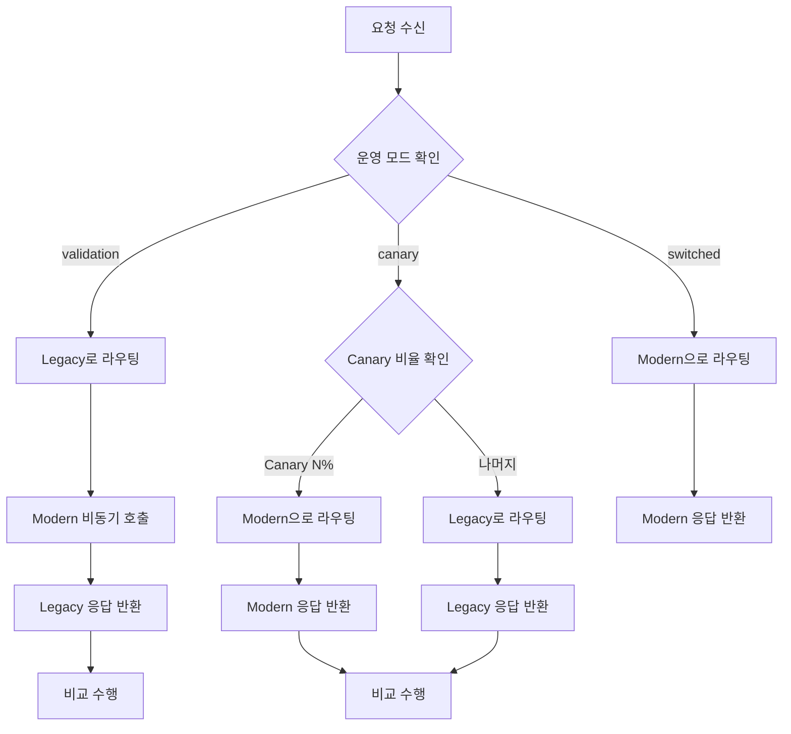
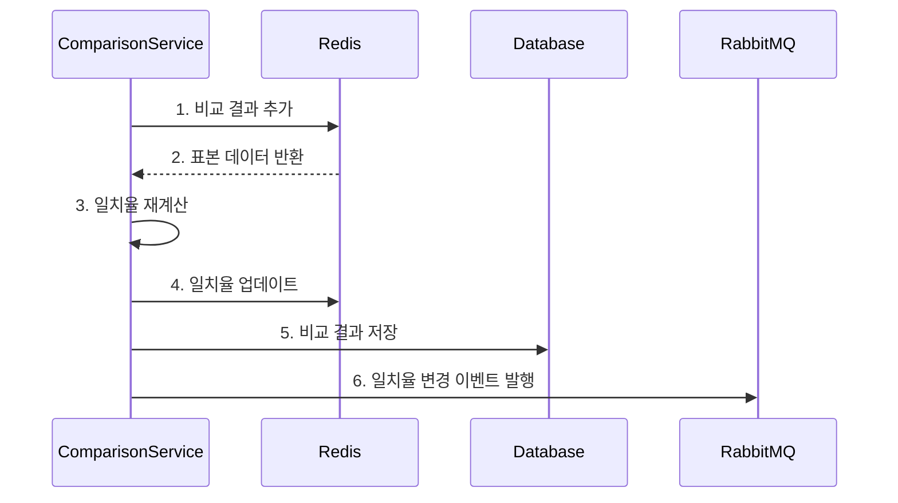
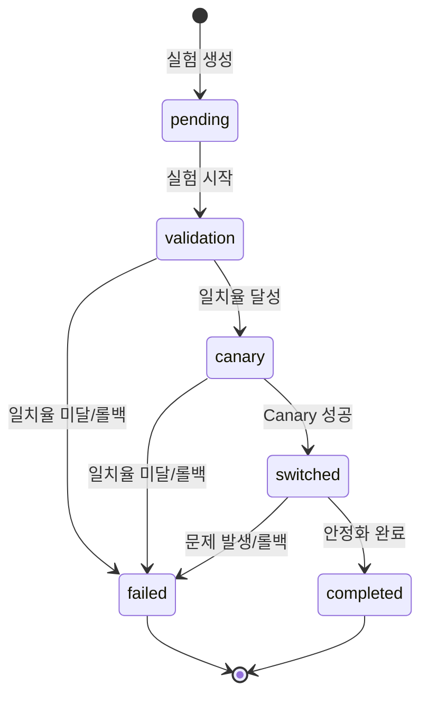
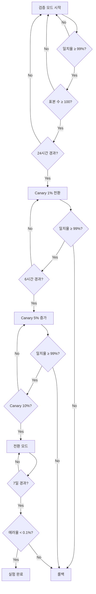
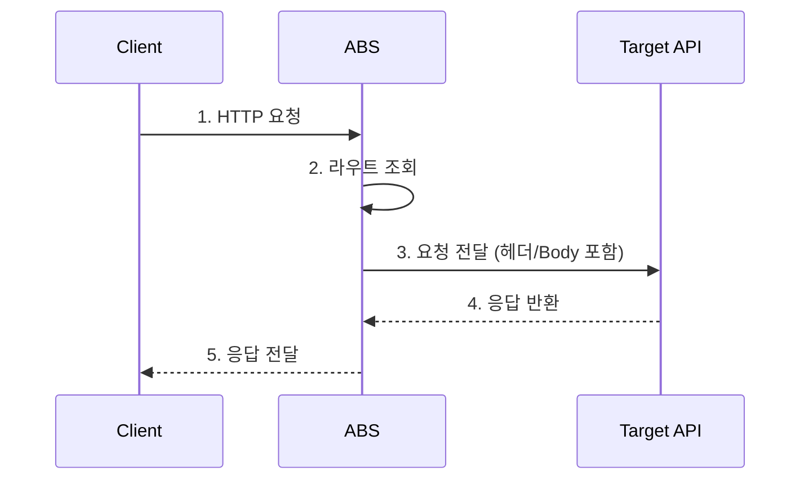

# ABS 요구사항 정의서 - 기능 요구사항

## 문서 정보

| 항목 | 내용 |
|------|------|
| **문서명** | ABS (API Bridge Service) 요구사항 정의서 - 기능 요구사항 |
| **버전** | v1.0 |
| **작성일** | 2025-11-30 |
| **대상 독자** | 개발팀, QA팀 |
| **문서 목적** | ABS의 모든 기능 요구사항을 상세히 정의 |

---

## 요구사항 개요

### 요구사항 식별 체계

| 카테고리 | 접두사 | 설명 |
|----------|--------|------|
| **기능 요구사항** | FR-XXX | Functional Requirement |
| **하위 요구사항** | FR-XXX-YY | 세부 기능 요구사항 |

### 우선순위 정의

| 우선순위 | 설명 | 표시 |
|----------|------|------|
| **Must Have** | 필수 기능, 없으면 서비스 불가 | 🔴 |
| **Should Have** | 중요 기능, 있어야 하지만 우회 가능 | 🟡 |
| **Nice to Have** | 부가 기능, 향후 추가 가능 | 🟢 |

---

## FR-001: 포트 기반 라우팅

### FR-001-01: 라우트 설정 관리 🔴

**설명**: 각 API 경로에 대해 Legacy와 Modern API의 호스트 및 포트를 설정할 수 있어야 함

**요구사항**:
- 라우트 생성 시 다음 정보를 필수로 입력받아야 함:
  - API 경로 (예: `/api/v1/users`)
  - HTTP 메서드 (GET, POST, PUT, DELETE)
  - Legacy API 호스트 및 포트
  - Modern API 호스트 및 포트
- 동일한 경로+메서드 조합은 중복 생성 불가
- 라우트는 생성, 조회, 수정, 삭제 가능해야 함

**예시**:
```json
{
  "path": "/api/v1/users",
  "method": "GET",
  "legacy_host": "api-server",
  "legacy_port": 8080,
  "modern_host": "api-server",
  "modern_port": 9080
}
```

**검증 기준**:
- ✅ 라우트 생성 API 호출 성공
- ✅ 중복 라우트 생성 시 에러 반환
- ✅ 라우트 수정/삭제 가능

---

### FR-001-02: 포트 기반 URL 변환 🔴

**설명**: 클라이언트 요청의 URL을 Legacy/Modern API 포트로 변환하여 호출

**요구사항**:
- 원본 요청의 호스트를 무시하고, 설정된 호스트와 포트로 변환
- 경로(Path), 쿼리 파라미터(Query String)는 그대로 유지
- HTTP 메서드, 헤더, Body는 그대로 전달
- User-Agent, X-Request-ID 등 추적 헤더 추가

**URL 변환 예시**:
```
원본 요청:     http://api-gateway.com/api/v1/users?page=1
Legacy 호출:   http://api-server:8080/api/v1/users?page=1
Modern 호출:   http://api-server:9080/api/v1/users?page=1
```

**검증 기준**:
- ✅ 포트 변환 로직 단위 테스트 통과
- ✅ 쿼리 파라미터 유지 확인
- ✅ HTTP 헤더 전달 확인

---

### FR-001-03: 운영 모드별 라우팅 전략 🔴

**설명**: 3가지 운영 모드(검증/Canary/전환)에 따라 다른 라우팅 전략 적용

**요구사항**:
- **검증 모드 (validation)**:
  - 모든 요청을 Legacy API로 동기 호출
  - Modern API는 비동기로 호출 (응답 대기 안 함)
  - Legacy 응답을 클라이언트에 반환
  - 백그라운드에서 응답 비교 수행
- **Canary 모드 (canary)**:
  - 설정된 비율(1-10%)에 따라 트래픽 분배
  - Canary 비율의 요청은 Modern API로 라우팅
  - 나머지 요청은 Legacy API로 라우팅
  - 양쪽 모두 응답 비교 수행
- **전환 모드 (switched)**:
  - 모든 요청을 Modern API로 라우팅
  - Legacy API 호출 안 함
  - 응답 비교 수행 안 함

**의사결정 흐름**:


**검증 기준**:
- ✅ 각 모드별 라우팅 로직 단위 테스트 통과
- ✅ 모드 전환 시 즉시 반영 확인
- ✅ Canary 비율이 정확히 적용되는지 검증

---

### FR-001-04: Canary 트래픽 분배 알고리즘 🔴

**설명**: Canary 모드에서 정확한 비율로 트래픽을 분배

**요구사항**:
- Canary 비율은 1-10% 범위 내에서 설정 가능
- 랜덤 알고리즘 기반으로 트래픽 분배
- 통계적으로 설정된 비율에 수렴해야 함

**알고리즘 의사코드**:
```go
func isCanaryRequest(canaryPercentage int) bool {
    randomValue := rand.Intn(100) + 1  // 1-100
    return randomValue <= canaryPercentage
}
```

**검증 기준**:
- ✅ 10,000건 요청 시 Canary 비율 오차 ±0.5% 이내
- ✅ Canary 비율 0% 시 Modern 호출 안 함
- ✅ Canary 비율 100% 시 Modern만 호출

---

### FR-001-05: 요청 전달 및 타임아웃 🔴

**설명**: Legacy/Modern API 호출 시 타임아웃 및 에러 처리

**요구사항**:
- 모든 외부 API 호출은 타임아웃 설정 필수
  - 기본 타임아웃: 3초
  - 설정 가능 범위: 1-10초
- 타임아웃 발생 시:
  - 검증 모드: Legacy 응답만 반환
  - Canary 모드: 해당 요청은 실패로 기록
  - 전환 모드: 에러 응답 반환
- Connection Pool 사용하여 성능 최적화
  - 최대 연결 수: 500
  - Idle 연결 수: 100
  - Idle 연결 타임아웃: 90초

**검증 기준**:
- ✅ 타임아웃 시 지정된 시간 내에 종료
- ✅ Connection Pool 재사용 확인
- ✅ 타임아웃 에러 로그 기록 확인

---

## FR-002: JSON 비교 로직

### FR-002-01: JSON 파싱 및 검증 🔴

**설명**: Legacy와 Modern API 응답을 JSON으로 파싱하고 유효성 검증

**요구사항**:
- Content-Type이 `application/json`인 응답만 비교 수행
- JSON 파싱 실패 시:
  - 비교 결과를 "파싱 실패"로 기록
  - 불일치로 간주
  - 상세 에러 정보 저장
- 1MB 초과 응답은 비교 생략

**검증 기준**:
- ✅ 유효한 JSON 파싱 성공
- ✅ 잘못된 JSON 파싱 실패 시 에러 로깅
- ✅ 1MB 초과 응답 비교 생략 확인

---

### FR-002-02: 비교 제외 필드 처리 🔴

**설명**: 특정 필드를 비교에서 제외할 수 있는 기능

**요구사항**:
- 라우트 생성 시 비교 제외 필드 목록 설정 가능
- 제외 필드는 JSONPath 형식으로 지정
  - 예: `timestamp`, `request_id`, `metadata.created_at`
- 중첩 객체 및 배열 내 필드도 제외 가능
- 제외 필드는 양쪽(Legacy, Modern) 모두에서 제거 후 비교

**제외 필드 예시**:
```json
{
  "exclude_fields": [
    "timestamp",
    "request_id",
    "metadata.created_at",
    "items[].id"
  ]
}
```

**검증 기준**:
- ✅ 제외 필드가 비교에서 제외되는지 확인
- ✅ 중첩 객체 내 필드 제외 확인
- ✅ 배열 내 필드 제외 확인

---

### FR-002-03: 재귀적 JSON 비교 🔴

**설명**: 중첩된 객체와 배열을 재귀적으로 비교

**요구사항**:
- JSON 객체의 모든 필드를 재귀적으로 비교
- **객체 비교**:
  - 필드명 일치 확인
  - 필드 타입 일치 확인
  - 필드 값 일치 확인
  - 필드 순서는 무시
- **배열 비교**:
  - 배열 길이 일치 확인
  - 배열 요소 순서 일치 확인
  - 각 요소를 재귀적으로 비교
- **기본 타입 비교**:
  - 숫자: 값 일치 (타입 엄격)
  - 문자열: 정확히 일치
  - 불리언: 값 일치
  - null: null 여부 확인

**타입 엄격성**:
- `1` (숫자) ≠ `"1"` (문자열)
- `null` ≠ `""` (빈 문자열)
- `0` ≠ `false`

**비교 의사코드**:
```go
func compareJSON(legacy, modern interface{}) ComparisonResult {
    switch legacy.(type) {
    case map[string]interface{}:
        return compareObject(legacy, modern)
    case []interface{}:
        return compareArray(legacy, modern)
    default:
        return comparePrimitive(legacy, modern)
    }
}
```

**검증 기준**:
- ✅ 중첩 객체 비교 정확성 확인
- ✅ 배열 순서 민감성 확인
- ✅ 타입 엄격성 확인

---

### FR-002-04: 불일치 상세 정보 생성 🔴

**설명**: 비교 불일치 시 상세한 차이점 정보 생성

**요구사항**:
- 불일치 발생 시 다음 정보 기록:
  - 불일치 필드 경로 (JSONPath)
  - 불일치 유형 (필드 누락, 값 불일치, 타입 불일치)
  - Legacy 값
  - Modern 값
- 최대 100개 불일치까지 기록
- 불일치 정보는 JSON 형식으로 저장

**불일치 정보 예시**:
```json
{
  "is_matched": false,
  "mismatch_count": 2,
  "mismatches": [
    {
      "field": "user.email",
      "type": "value_mismatch",
      "legacy_value": "user@example.com",
      "modern_value": "user@company.com"
    },
    {
      "field": "user.age",
      "type": "type_mismatch",
      "legacy_value": "25",
      "modern_value": 25
    }
  ]
}
```

**불일치 유형**:
- `field_missing_in_modern`: Modern에 필드 없음
- `field_missing_in_legacy`: Legacy에 필드 없음
- `value_mismatch`: 값 불일치
- `type_mismatch`: 타입 불일치
- `array_length_mismatch`: 배열 길이 불일치

**검증 기준**:
- ✅ 모든 불일치 유형 검출 확인
- ✅ 불일치 정보 형식 검증
- ✅ 100개 초과 시 제한 확인

---

### FR-002-05: 비교 성능 최적화 🟡

**설명**: 대용량 JSON 비교 시 성능 최적화

**요구사항**:
- 비교는 비동기로 수행하여 응답 시간에 영향 최소화
- 1MB 초과 응답은 비교 생략
- 비교 결과는 캐시하여 재사용
- Goroutine Pool을 사용하여 동시 비교 수 제한

**성능 목표**:
- 10KB JSON 비교: 10ms 이내
- 100KB JSON 비교: 50ms 이내
- 1MB JSON 비교: 200ms 이내

**검증 기준**:
- ✅ 성능 벤치마크 테스트 통과
- ✅ 비동기 처리 확인
- ✅ 메모리 사용량 모니터링

---

## FR-003: 일치율 계산 및 관리

### FR-003-01: 일치율 계산 공식 🔴

**설명**: 라우트별 일치율을 정확히 계산

**요구사항**:
- 일치율은 다음 공식으로 계산:
  ```
  일치율 = (일치 건수 / 전체 비교 건수) * 100
  ```
- 소수점 둘째 자리까지 표시 (예: 98.75%)
- 비교 실패(파싱 오류 등)는 불일치로 간주

**계산 예시**:
```
전체 비교 건수: 1,000건
일치 건수: 987건
불일치 건수: 13건

일치율 = (987 / 1,000) * 100 = 98.70%
```

**검증 기준**:
- ✅ 계산 공식 정확성 검증
- ✅ 소수점 처리 확인
- ✅ 0건일 때 처리 확인

---

### FR-003-02: 표본 수 관리 (슬라이딩 윈도우) 🔴

**설명**: 최근 N건의 비교 결과만 일치율 계산에 사용

**요구사항**:
- 표본 수는 라우트 생성 시 설정 가능
  - 기본값: 100건
  - 설정 범위: 10-1,000건
- 슬라이딩 윈도우 방식 사용:
  - 최근 N건만 유지
  - 새 비교 결과 추가 시 가장 오래된 것 제거
- Redis를 사용하여 표본 데이터 저장
  - Key: `matchrate:{route_id}`
  - Structure: List (FIFO)
  - TTL: 7일

**슬라이딩 윈도우 동작**:
```
표본 수: 5
초기: []
1건 추가: [1]
2건 추가: [1, 1]
3건 추가: [1, 1, 0]
...
6건 추가: [1, 0, 1, 1, 1]  // 가장 오래된 1건 제거
```

**검증 기준**:
- ✅ 표본 수 제한 동작 확인
- ✅ FIFO 순서 확인
- ✅ Redis 저장/조회 확인

---

### FR-003-03: 실시간 일치율 갱신 🔴

**설명**: 비교 결과 발생 시 일치율을 실시간으로 갱신

**요구사항**:
- 비교 완료 시 즉시 일치율 재계산
- 일치율은 Redis에 캐시하여 빠른 조회
- 일치율 변경 시 이벤트 발생 (RabbitMQ)
- 일치율 히스토리는 데이터베이스에 기록

**갱신 프로세스**:


**검증 기준**:
- ✅ 실시간 갱신 확인
- ✅ Redis 캐시 히트율 90% 이상
- ✅ 이벤트 발행 확인

---

### FR-003-04: 일치율 조회 API 🔴

**설명**: 라우트별 일치율을 조회할 수 있는 API 제공

**요구사항**:
- 특정 라우트의 현재 일치율 조회 가능
- 모든 라우트의 일치율 목록 조회 가능
- 조회 응답에 포함할 정보:
  - 현재 일치율
  - 전체 비교 건수
  - 일치 건수
  - 불일치 건수
  - 마지막 비교 시각

**응답 예시**:
```json
{
  "route_id": "route-123",
  "match_rate": 98.50,
  "total_comparisons": 1000,
  "matched_count": 985,
  "mismatched_count": 15,
  "last_compared_at": "2025-11-30T10:30:00Z"
}
```

**검증 기준**:
- ✅ API 호출 성공
- ✅ 응답 데이터 정확성 확인
- ✅ 응답 시간 100ms 이내

---

## FR-004: 반자동 전환 실험 관리

### FR-004-01: 실험 생성 및 설정 🔴

**설명**: 특정 라우트에 대한 전환 실험을 생성

**요구사항**:
- 실험 생성 시 다음 정보 입력:
  - 대상 라우트 ID
  - 목표 일치율 (기본값: 99%)
  - Canary 시작 비율 (기본값: 1%)
  - Canary 최대 비율 (기본값: 10%)
  - 단계별 최소 표본 수 (기본값: 100)
- 하나의 라우트는 동시에 하나의 실험만 진행 가능
- 실험 생성 시 자동으로 "대기" 상태로 시작

**실험 설정 예시**:
```json
{
  "route_id": "route-123",
  "target_match_rate": 99.0,
  "canary_start_percentage": 1,
  "canary_max_percentage": 10,
  "min_sample_size": 100
}
```

**검증 기준**:
- ✅ 실험 생성 API 호출 성공
- ✅ 중복 실험 생성 차단 확인
- ✅ 기본값 적용 확인

---

### FR-004-02: 실험 상태 머신 🔴

**설명**: 실험은 정의된 상태 전환 규칙에 따라 진행

**요구사항**:
- 실험은 다음 5가지 상태를 가짐:
  - **대기 (pending)**: 실험 생성 직후
  - **검증 (validation)**: Legacy 응답 사용, Modern 비교 중
  - **Canary (canary)**: 일부 트래픽을 Modern으로 전환
  - **전환 (switched)**: 모든 트래픽을 Modern으로 전환
  - **완료 (completed)**: 실험 종료
  - **실패 (failed)**: 실험 실패 (롤백 완료)
- 상태 전환 규칙:
  ```
  pending → validation → canary → switched → completed
                ↓           ↓          ↓
              failed    failed    failed
  ```

**상태 머신 다이어그램**:


**검증 기준**:
- ✅ 각 상태 전환 동작 확인
- ✅ 잘못된 상태 전환 차단 확인
- ✅ 상태 이력 기록 확인

---

### FR-004-03: 자동 단계 진행 조건 🔴

**설명**: 각 단계는 조건 충족 시 자동으로 다음 단계로 진행

**요구사항**:
- **검증 → Canary 전환 조건**:
  - 일치율 ≥ 목표 일치율
  - 표본 수 ≥ 최소 표본 수
  - 검증 모드 최소 운영 시간: 24시간
- **Canary → 전환 전환 조건**:
  - Canary 모드에서 일치율 ≥ 목표 일치율
  - Canary 비율을 단계적으로 증가 (1% → 5% → 10%)
  - 각 Canary 비율에서 최소 6시간 운영
  - 모든 Canary 단계에서 일치율 유지
- **전환 → 완료 조건**:
  - 전환 모드 최소 운영 시간: 7일
  - 에러율 < 0.1%
  - 성능 저하 없음

**자동 진행 프로세스**:


**검증 기준**:
- ✅ 각 조건 검증 로직 정확성 확인
- ✅ 자동 진행 타이밍 확인
- ✅ 조건 미충족 시 대기 확인

---

### FR-004-04: 자동 롤백 기능 🔴

**설명**: 문제 발생 시 자동으로 이전 안정 상태로 롤백

**요구사항**:
- 롤백 트리거 조건:
  - 일치율이 목표 일치율 - 5% 이하로 하락
  - Modern API 에러율 > 5%
  - 응답 시간이 Legacy 대비 2배 초과
  - 수동 롤백 요청
- 롤백 동작:
  - 즉시 이전 운영 모드로 전환
  - 실험 상태를 "failed"로 변경
  - 알림 발송 (Slack, Email)
  - 롤백 이벤트 로그 기록

**롤백 예시**:
```
Canary 5% 운영 중 → 일치율 93%로 하락 → 자동 롤백 → 검증 모드로 전환
```

**검증 기준**:
- ✅ 각 롤백 조건 테스트
- ✅ 롤백 속도 < 5초
- ✅ 알림 발송 확인

---

### FR-004-05: 실험 중지 및 삭제 🔴

**설명**: 실험을 수동으로 중지하거나 삭제

**요구사항**:
- **실험 중지**:
  - 진행 중인 실험을 즉시 중지
  - 운영 모드를 검증 모드로 변경
  - 실험 상태를 "failed"로 변경
  - 재시작 가능
- **실험 삭제**:
  - 완료/실패 상태의 실험만 삭제 가능
  - 진행 중인 실험은 삭제 불가 (먼저 중지 필요)
  - 실험 히스토리는 유지 (Soft Delete)

**검증 기준**:
- ✅ 중지 API 호출 성공
- ✅ 진행 중 실험 삭제 차단 확인
- ✅ Soft Delete 확인

---

## FR-005: 관리 API

### FR-005-01: 라우트 관리 API 🔴

**설명**: 라우트를 생성, 조회, 수정, 삭제하는 API

**요구사항**:
- **POST /abs/api/v1/routes**: 라우트 생성
- **GET /abs/api/v1/routes**: 라우트 목록 조회 (페이지네이션)
- **GET /abs/api/v1/routes/{id}**: 라우트 상세 조회
- **PUT /abs/api/v1/routes/{id}**: 라우트 수정
- **DELETE /abs/api/v1/routes/{id}**: 라우트 삭제

**공통 요구사항**:
- 모든 API는 JSON 형식으로 요청/응답
- 에러 발생 시 표준 에러 응답 반환
- 요청 검증 (필수 필드, 타입, 범위)

**검증 기준**:
- ✅ 모든 CRUD 작업 성공
- ✅ 검증 실패 시 400 에러 반환
- ✅ 존재하지 않는 ID 조회 시 404 반환

---

### FR-005-02: 실험 관리 API 🔴

**설명**: 실험을 생성, 조회, 시작, 중지, 삭제하는 API

**요구사항**:
- **POST /abs/api/v1/experiments**: 실험 생성
- **GET /abs/api/v1/experiments**: 실험 목록 조회
- **GET /abs/api/v1/experiments/{id}**: 실험 상세 조회
- **POST /abs/api/v1/experiments/{id}/start**: 실험 시작
- **POST /abs/api/v1/experiments/{id}/stop**: 실험 중지
- **DELETE /abs/api/v1/experiments/{id}**: 실험 삭제

**검증 기준**:
- ✅ 모든 실험 관리 작업 성공
- ✅ 실험 상태 전환 확인
- ✅ 중복 실험 차단 확인

---

### FR-005-03: 비교 결과 조회 API 🔴

**설명**: 비교 결과를 조회하는 API

**요구사항**:
- **GET /abs/api/v1/comparisons**: 비교 결과 목록 조회
  - 필터링: route_id, is_matched, date_range
  - 정렬: created_at (기본: 최신순)
  - 페이지네이션: page, page_size (기본: 20)
- **GET /abs/api/v1/comparisons/{id}**: 비교 결과 상세 조회
  - 불일치 상세 정보 포함

**응답 예시**:
```json
{
  "items": [
    {
      "id": "comp-123",
      "route_id": "route-456",
      "is_matched": false,
      "mismatch_count": 2,
      "request_hash": "abc123",
      "created_at": "2025-11-30T10:30:00Z"
    }
  ],
  "pagination": {
    "page": 1,
    "page_size": 20,
    "total_count": 1532,
    "total_pages": 77
  }
}
```

**검증 기준**:
- ✅ 필터링 동작 확인
- ✅ 페이지네이션 정확성 확인
- ✅ 응답 속도 < 200ms

---

### FR-005-04: 일치율 조회 API 🔴

**설명**: 라우트별 일치율 통계 조회

**요구사항**:
- **GET /abs/api/v1/metrics/match-rate**: 전체 라우트 일치율 조회
- **GET /abs/api/v1/metrics/match-rate/{route_id}**: 특정 라우트 일치율 조회
  - 시계열 데이터 제공 (시간대별 일치율)
  - 기간 필터: 1시간, 6시간, 24시간, 7일

**검증 기준**:
- ✅ 일치율 계산 정확성 확인
- ✅ 시계열 데이터 정확성 확인
- ✅ Redis 캐시 활용 확인

---

### FR-005-05: 알림 설정 API 🟡

**설명**: 알림 조건 및 채널 설정

**요구사항**:
- **POST /abs/api/v1/alerts**: 알림 규칙 생성
  - 조건: 일치율 하락, 에러율 상승, 실험 상태 변경
  - 채널: Slack, Email
  - 임계값 설정
- **GET /abs/api/v1/alerts**: 알림 규칙 조회
- **PUT /abs/api/v1/alerts/{id}**: 알림 규칙 수정
- **DELETE /abs/api/v1/alerts/{id}**: 알림 규칙 삭제

**알림 규칙 예시**:
```json
{
  "name": "일치율 급락 알림",
  "condition": "match_rate_drop",
  "threshold": 95.0,
  "channels": ["slack", "email"],
  "enabled": true
}
```

**검증 기준**:
- ✅ 알림 규칙 CRUD 성공
- ✅ 조건 충족 시 알림 발송 확인
- ✅ 채널별 전송 확인

---

## FR-006: 프록시 기능

### FR-006-01: 요청 프록시 처리 🔴

**설명**: 클라이언트 요청을 Target API로 전달하고 응답 반환

**요구사항**:
- Context-Path가 `/abs/*`가 아닌 모든 요청은 프록시 대상
- 라우트 설정이 없는 경로는 에러 반환 (404)
- 요청 헤더, Body, 쿼리 파라미터를 그대로 전달
- 응답 헤더, Body를 그대로 반환
- 추적을 위한 X-Request-ID 헤더 추가

**프록시 흐름**:


**검증 기준**:
- ✅ 프록시 요청/응답 정확성 확인
- ✅ 헤더 전달 확인
- ✅ X-Request-ID 추가 확인

---

### FR-006-02: 비동기 비교 수행 🔴

**설명**: 프록시 응답을 반환한 후 백그라운드에서 비교 수행

**요구사항**:
- 응답 반환 후 비교를 비동기로 수행
- 비교 결과는 RabbitMQ를 통해 전달
- Goroutine Pool 사용하여 동시 비교 수 제한 (최대 1,000)
- 비교 실패는 로깅하되, 재시도 안 함

**비동기 처리**:
```go
// 응답 반환
w.WriteHeader(statusCode)
w.Write(responseBody)

// 비동기 비교
go func() {
    result := compareResponses(legacyResp, modernResp)
    publishToQueue(result)
}()
```

**검증 기준**:
- ✅ 비교가 응답 시간에 영향 안 줌
- ✅ Goroutine Pool 동작 확인
- ✅ 비교 실패 로깅 확인

---

### FR-006-03: HTTP 상태 코드 처리 🔴

**설명**: Target API의 HTTP 상태 코드를 그대로 클라이언트에 반환

**요구사항**:
- 2xx, 3xx, 4xx, 5xx 모든 상태 코드를 그대로 전달
- Target API 에러 시에도 비교는 수행
  - 단, 양쪽 모두 같은 상태 코드를 반환하면 일치로 판정
- ABS 내부 에러와 Target API 에러를 구분

**상태 코드별 처리**:
| 상태 코드 | 처리 방식 | 비교 수행 |
|----------|----------|----------|
| 2xx | 그대로 반환 | ✓ |
| 3xx | 그대로 반환 | ✓ |
| 4xx | 그대로 반환 | ✓ |
| 5xx | 그대로 반환 | ✓ |
| Timeout | 503 반환 | ✗ |
| Network Error | 502 반환 | ✗ |

**검증 기준**:
- ✅ 모든 상태 코드 전달 확인
- ✅ 에러 상황에서도 비교 수행 확인
- ✅ 내부 에러 구분 확인

---

### FR-006-04: 요청 해싱 🟡

**설명**: 동일한 요청을 식별하기 위한 해시 생성

**요구사항**:
- 다음 정보를 기반으로 요청 해시 생성:
  - HTTP 메서드
  - 경로
  - 쿼리 파라미터 (정렬 후)
  - Request Body (POST/PUT인 경우)
- SHA-256 알고리즘 사용
- 해시는 비교 결과 저장 시 사용

**해싱 예시**:
```
요청: GET /api/v1/users?page=2&size=10
해시: sha256("GET:/api/v1/users:page=2&size=10")
    = "a3b5c7d9e1f..."
```

**검증 기준**:
- ✅ 동일 요청에 대해 같은 해시 생성
- ✅ 파라미터 순서 변경 시에도 같은 해시 생성
- ✅ 해시 충돌 테스트

---

## 기능 요구사항 요약표

| 요구사항 ID | 기능명 | 우선순위 | 상태 |
|------------|--------|----------|------|
| FR-001 | 포트 기반 라우팅 | 🔴 Must Have | 설계 완료 |
| FR-002 | JSON 비교 로직 | 🔴 Must Have | 설계 완료 |
| FR-003 | 일치율 계산 및 관리 | 🔴 Must Have | 설계 완료 |
| FR-004 | 반자동 전환 실험 관리 | 🔴 Must Have | 설계 완료 |
| FR-005 | 관리 API | 🔴 Must Have | 설계 완료 |
| FR-006 | 프록시 기능 | 🔴 Must Have | 설계 완료 |

---

## 참조 문서

- [비즈니스 로직 설계 - JSON 비교 알고리즘](../04-business-logic/01-comparison-logic.md)
- [비즈니스 로직 설계 - 일치율 계산](../04-business-logic/02-match-rate-calculation.md)
- [비즈니스 로직 설계 - 라우팅 전략](../04-business-logic/03-routing-strategy.md)
- [비즈니스 로직 설계 - 실험 관리](../04-business-logic/04-experiment-management.md)
- [API 설계 - 엔드포인트 명세](../05-api/02-endpoint-specification.md)

---

**최종 수정일**: 2025-11-30
**작성자**: ABS 개발팀
**승인자**: Tech Lead, PM
