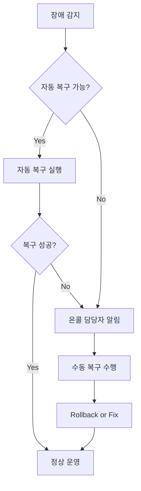
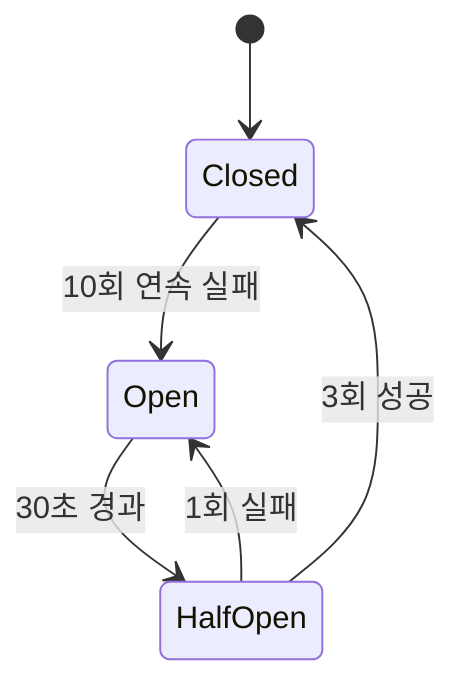
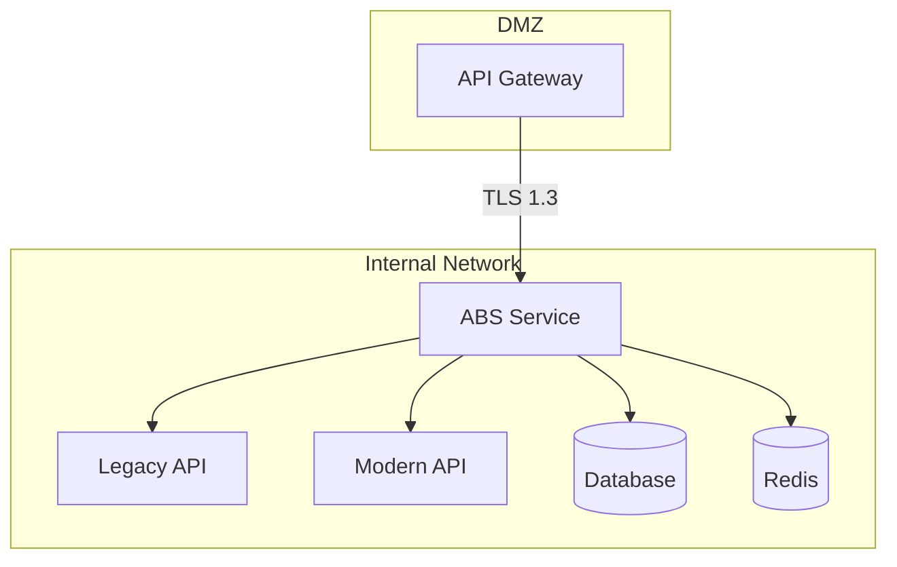
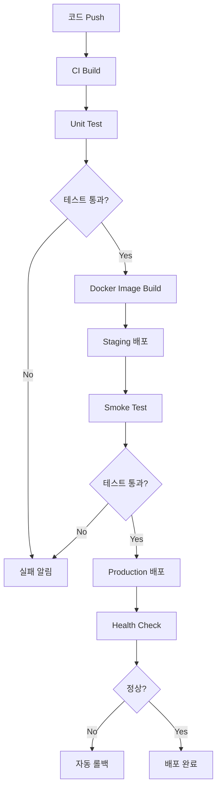

# ABS 요구사항 정의서 - 비기능 요구사항

## 문서 정보

| 항목 | 내용 |
|------|------|
| **문서명** | ABS (API Bridge Service) 요구사항 정의서 - 비기능 요구사항 |
| **버전** | v1.0 |
| **작성일** | 2025-11-30 |
| **대상 독자** | 개발팀, DevOps팀, QA팀 |
| **문서 목적** | ABS의 성능, 보안, 운영성 등 비기능 요구사항 정의 |

---

## 요구사항 개요

### 비기능 요구사항 카테고리

| 카테고리 | 접두사 | 설명 |
|----------|--------|------|
| **성능** | NFR-001 | Performance |
| **가용성** | NFR-002 | Availability |
| **확장성** | NFR-003 | Scalability |
| **보안** | NFR-004 | Security |
| **운영성** | NFR-005 | Operability |
| **유지보수성** | NFR-006 | Maintainability |

---

## NFR-001: 성능 요구사항

### NFR-001-01: 처리량 (Throughput) 🔴

**설명**: ABS는 높은 처리량을 유지해야 함

**요구사항**:
- **최소 목표**: 10,000 TPS (Transactions Per Second)
- **권장 목표**: 15,000 TPS
- **부하 테스트 조건**:
  - 동시 사용자: 50,000명
  - 평균 요청 크기: 10KB
  - 지속 시간: 30분
- **측정 방법**: Apache JMeter 또는 Locust 사용

**검증 기준**:
- ✅ 10,000 TPS에서 응답 시간 목표 달성
- ✅ 15,000 TPS에서 에러율 < 1%
- ✅ CPU 사용률 < 80%

---

### NFR-001-02: 응답 시간 (Response Time) 🔴

**설명**: Legacy API 대비 추가 지연 시간을 최소화

**요구사항**:
- **P50 (중앙값)**: Legacy API 응답 시간 + 20ms 이내
- **P95 (95번째 백분위수)**: Legacy API 응답 시간 + 50ms 이내
- **P99 (99번째 백분위수)**: Legacy API 응답 시간 + 100ms 이내
- **타임아웃**: 3초 (설정 가능)

**응답 시간 분해**:
| 구간 | 목표 시간 | 설명 |
|------|----------|------|
| 라우팅 결정 | 5ms | 라우트 조회 및 모드 확인 |
| HTTP 요청 전달 | Legacy 시간 | Target API 호출 |
| 응답 수신 및 반환 | 10ms | 응답 처리 및 클라이언트 반환 |
| 비동기 비교 | - | 응답 시간에 영향 없음 |

**검증 기준**:
- ✅ 부하 테스트에서 P95 < +50ms
- ✅ 응답 시간 모니터링 대시보드 구축
- ✅ 느린 요청 (> 1초) 알림 설정

---

### NFR-001-03: 동시 연결 (Concurrent Connections) 🔴

**설명**: 많은 수의 동시 연결을 처리

**요구사항**:
- **최소 목표**: 50,000 동시 연결
- **권장 목표**: 100,000 동시 연결
- Connection Pool 설정:
  - Legacy/Modern API 각각 500개 최대 연결
  - Idle 연결: 100개
  - Idle Timeout: 90초
- Keep-Alive 사용하여 연결 재사용

**검증 기준**:
- ✅ 50,000 동시 연결 테스트 통과
- ✅ Connection Pool 효율성 90% 이상
- ✅ Connection Timeout 에러 < 0.1%

---

### NFR-001-04: 메모리 사용률 🔴

**설명**: 메모리 사용을 최적화하여 OOM 방지

**요구사항**:
- **Heap 메모리 사용률**: 평균 60%, 최대 80%
- **GC 빈도**: 분당 10회 이하
- **GC Pause Time**: 평균 10ms 이하
- 메모리 누수 방지:
  - Goroutine 누수 방지
  - Connection 누수 방지
  - 캐시 크기 제한

**메모리 프로파일링**:
```bash
# Go pprof를 사용한 메모리 프로파일링
curl http://localhost:8000/debug/pprof/heap > heap.prof
go tool pprof heap.prof
```

**검증 기준**:
- ✅ 24시간 부하 테스트에서 메모리 누수 없음
- ✅ 메모리 사용률 80% 미만 유지
- ✅ GC Pause Time 목표 달성

---

### NFR-001-05: 데이터베이스 성능 🟡

**설명**: 데이터베이스 쿼리 성능 최적화

**요구사항**:
- **SELECT 쿼리**: P95 < 50ms
- **INSERT 쿼리**: P95 < 100ms
- **UPDATE 쿼리**: P95 < 100ms
- Connection Pool:
  - 최대 연결 수: 100
  - Idle 연결 수: 20
  - Connection Lifetime: 30분
- 인덱스 활용:
  - 모든 WHERE 절 컬럼에 인덱스
  - 복합 인덱스 적극 활용

**검증 기준**:
- ✅ Slow Query 로그 모니터링 (> 100ms)
- ✅ 인덱스 효율성 검증 (EXPLAIN PLAN)
- ✅ Connection Pool 사용률 90% 이상

---

## NFR-002: 가용성 요구사항

### NFR-002-01: Uptime (가동 시간) 🔴

**설명**: 서비스는 높은 가용성을 유지해야 함

**요구사항**:
- **목표 Uptime**: 99.9% (Three Nines)
  - 월간 허용 다운타임: 43분
  - 연간 허용 다운타임: 8시간 45분
- 계획된 유지보수는 다운타임에서 제외
- 무중단 배포 지원 (Rolling Update)

**가용성 계산**:
```
Uptime (%) = (Total Time - Downtime) / Total Time * 100
예시: (30일 - 43분) / 30일 * 100 = 99.9%
```

**검증 기준**:
- ✅ 월간 Uptime 레포트 생성
- ✅ 다운타임 원인 분석 및 개선
- ✅ SLA 목표 달성

---

### NFR-002-02: MTTR (Mean Time To Recovery) 🔴

**설명**: 장애 발생 시 빠른 복구

**요구사항**:
- **목표 MTTR**: 15분 이내
- 자동 복구 메커니즘:
  - Health Check 실패 시 자동 재시작
  - Circuit Breaker를 통한 자동 폴백
  - Auto-Scaling을 통한 부하 분산
- 수동 복구 절차:
  - 온콜 담당자에게 즉시 알림 (5분 이내)
  - Rollback 절차 문서화

**복구 프로세스**:


**검증 기준**:
- ✅ 장애 시뮬레이션 테스트 통과
- ✅ MTTR 측정 및 개선
- ✅ 복구 절차 문서 업데이트

---

### NFR-002-03: Graceful Shutdown 🔴

**설명**: 서비스 종료 시 진행 중인 요청 처리 완료

**요구사항**:
- Shutdown 시그널 수신 시:
  - 새 요청 수락 중지
  - 진행 중인 요청 처리 완료 대기
  - 최대 대기 시간: 30초
  - 타임아웃 후 강제 종료
- Health Check 엔드포인트:
  - Shutdown 모드에서는 503 반환
  - Load Balancer가 트래픽 중지

**Graceful Shutdown 구현**:
```go
func (s *Server) Shutdown(ctx context.Context) error {
    // 1. Health Check를 503으로 변경
    s.setHealthStatus(Unhealthy)

    // 2. 5초 대기 (Load Balancer가 트래픽 중지)
    time.Sleep(5 * time.Second)

    // 3. 진행 중인 요청 완료 대기 (최대 30초)
    ctx, cancel := context.WithTimeout(ctx, 30*time.Second)
    defer cancel()

    return s.httpServer.Shutdown(ctx)
}
```

**검증 기준**:
- ✅ Shutdown 시 진행 중 요청 손실 0건
- ✅ Shutdown 완료 시간 < 30초
- ✅ Load Balancer 연동 확인

---

### NFR-002-04: Circuit Breaker 🔴

**설명**: 외부 API 장애 시 자동 폴백

**요구사항**:
- Circuit Breaker 적용 대상:
  - Modern API 호출
  - Redis 연결
  - RabbitMQ 연결
- Circuit Breaker 설정:
  - **실패 임계값**: 연속 10회 실패
  - **Open 상태 지속 시간**: 30초
  - **Half-Open 상태 테스트 요청 수**: 3회
- 상태별 동작:
  - **Closed**: 정상 동작
  - **Open**: 즉시 폴백 (호출 안 함)
  - **Half-Open**: 제한적 요청 전송

**Circuit Breaker 상태 머신**:


**검증 기준**:
- ✅ Modern API 장애 시 자동 Legacy로 폴백
- ✅ Circuit Breaker 상태 전환 확인
- ✅ 복구 후 자동으로 Closed 전환

---

## NFR-003: 확장성 요구사항

### NFR-003-01: Horizontal Scaling (수평 확장) 🔴

**설명**: 트래픽 증가 시 서버 추가로 대응

**요구사항**:
- **Stateless 아키텍처**: 서버 간 상태 공유 안 함
- **Auto-Scaling 정책**:
  - Scale-Out 트리거: CPU > 70% (3분 지속)
  - Scale-In 트리거: CPU < 30% (10분 지속)
  - 최소 인스턴스: 2대
  - 최대 인스턴스: 10대
- Load Balancer:
  - 알고리즘: Round Robin
  - Health Check: 10초마다 확인
  - Sticky Session: 불필요 (Stateless)

**Auto-Scaling 설정 예시** (AWS AutoScaling):
```yaml
AutoScalingGroup:
  MinSize: 2
  MaxSize: 10
  DesiredCapacity: 4
  HealthCheckGracePeriod: 300
  ScalingPolicies:
    - PolicyName: ScaleOut
      AdjustmentType: ChangeInCapacity
      ScalingAdjustment: 2
      Cooldown: 300
      MetricAggregationType: Average
      TargetTrackingConfiguration:
        PredefinedMetricType: ASGAverageCPUUtilization
        TargetValue: 70.0
```

**검증 기준**:
- ✅ 부하 증가 시 자동 Scale-Out 확인
- ✅ 부하 감소 시 자동 Scale-In 확인
- ✅ 인스턴스 추가/제거 시 서비스 무중단

---

### NFR-003-02: 캐시 전략 🔴

**설명**: Redis 캐시를 활용한 성능 최적화

**요구사항**:
- 캐시 대상:
  - 라우트 설정 (TTL: 5분)
  - 일치율 데이터 (TTL: 1분)
  - 실험 상태 (TTL: 1분)
- 캐시 갱신 전략:
  - **Write-Through**: 데이터 변경 시 즉시 캐시 업데이트
  - **Cache Invalidation**: 관련 데이터 변경 시 캐시 무효화
- 캐시 히트율 목표: 90% 이상

**캐시 키 전략**:
```
routes:{route_id}           # 라우트 정보
matchrate:{route_id}        # 일치율
experiment:{experiment_id}  # 실험 정보
```

**검증 기준**:
- ✅ 캐시 히트율 90% 이상
- ✅ 캐시 갱신 로직 정확성 확인
- ✅ Redis 장애 시 DB로 폴백 확인

---

### NFR-003-03: Connection Pooling 🔴

**설명**: 외부 연결의 효율적 관리

**요구사항**:
- **HTTP Client Pool**:
  - 최대 연결 수: 500
  - Idle 연결 수: 100
  - Idle Timeout: 90초
  - Keep-Alive 활성화
- **Database Connection Pool**:
  - 최대 연결 수: 100
  - Idle 연결 수: 20
  - Connection Lifetime: 30분
  - Connection Timeout: 5초
- **Redis Connection Pool**:
  - 최대 연결 수: 50
  - Idle 연결 수: 10
  - Idle Timeout: 5분

**검증 기준**:
- ✅ Connection Pool 사용률 모니터링
- ✅ Connection 재사용율 90% 이상
- ✅ Pool 고갈 방지 확인

---

## NFR-004: 보안 요구사항

### NFR-004-01: 네트워크 보안 🔴

**설명**: 네트워크 레벨에서 접근 제어

**요구사항**:
- **내부 네트워크만 접근 허용**:
  - ABS는 내부 네트워크에만 노출
  - 외부 접근은 API Gateway를 통해서만 가능
- **방화벽 규칙**:
  - Inbound: API Gateway IP만 허용
  - Outbound: Legacy/Modern API, DB, Redis, RabbitMQ만 허용
- **TLS 암호화**:
  - API Gateway ↔ ABS: TLS 1.3
  - ABS ↔ Backend 서비스: 선택사항 (내부 네트워크)

**네트워크 다이어그램**:


**검증 기준**:
- ✅ 외부에서 직접 접근 차단 확인
- ✅ TLS 버전 및 암호 스위트 검증
- ✅ 방화벽 규칙 검증

---

### NFR-004-02: 데이터 보안 🔴

**설명**: 민감한 데이터 보호

**요구사항**:
- **개인정보 마스킹**:
  - 이메일: `user@example.com` → `u***@example.com`
  - 전화번호: `010-1234-5678` → `010-****-5678`
  - 신용카드: `1234-5678-9012-3456` → `1234-****-****-3456`
  - 주민등록번호: `123456-1234567` → `******-*******`
- **로그 마스킹**:
  - 모든 로그 출력 전 마스킹 적용
  - Request/Response Body 내 민감 정보 마스킹
- **데이터 암호화**:
  - DB 저장: 민감 필드 AES-256 암호화 (선택사항)
  - 전송: TLS 암호화

**마스킹 규칙 예시**:
```go
var maskingPatterns = []MaskingPattern{
    {Name: "Email", Regex: `([a-zA-Z0-9._%+-]+)@`, Replace: "$1***@"},
    {Name: "Phone", Regex: `(\d{3})-(\d{4})-(\d{4})`, Replace: "$1-****-$3"},
    {Name: "Card", Regex: `(\d{4})-(\d{4})-(\d{4})-(\d{4})`, Replace: "$1-****-****-$4"},
}
```

**검증 기준**:
- ✅ 모든 로그에서 민감 정보 마스킹 확인
- ✅ 마스킹 성능 영향 < 5ms
- ✅ 보안팀 검수 통과

---

### NFR-004-03: 로그 보안 🔴

**설명**: 로그 데이터 보안 및 접근 제어

**요구사항**:
- **로그 파일 권한**:
  - 소유자: abs-service
  - 권한: 640 (rw-r-----)
  - 그룹: abs-admin
- **로그 로테이션**:
  - 일일 로테이션
  - 최대 30일 보관
  - 압축 저장 (gzip)
- **로그 전송**:
  - ELK Stack으로 중앙 집중화
  - 전송 시 TLS 암호화
- **감사 로그**:
  - 관리 API 호출 기록
  - 실험 상태 변경 기록
  - 설정 변경 기록

**로그 보관 정책**:
| 로그 유형 | 보관 기간 | 저장 위치 |
|----------|----------|----------|
| Application Log | 30일 | ELK + Local |
| Audit Log | 1년 | Database + S3 |
| Access Log | 90일 | ELK |
| Error Log | 90일 | ELK + Local |

**검증 기준**:
- ✅ 로그 파일 권한 확인
- ✅ 로그 로테이션 동작 확인
- ✅ 민감 정보 로그 미포함 확인

---

### NFR-004-04: API 인증/인가 🟡

**설명**: 관리 API 접근 제어

**요구사항**:
- **인증 방식**:
  - API Gateway에서 JWT 검증 (Primary)
  - API Key 방식 지원 (Fallback)
- **인가 (Authorization)**:
  - Role-Based Access Control (RBAC)
  - 역할: Admin, Operator, Viewer
  - 권한 매핑:
    - Admin: 모든 API 접근
    - Operator: 실험 시작/중지, 라우트 조회
    - Viewer: 조회만 가능
- **API Key 관리**:
  - 생성/삭제/갱신 API 제공
  - TTL: 90일
  - Rotation 정책

**권한 매트릭스**:
| API 카테고리 | Admin | Operator | Viewer |
|-------------|-------|----------|--------|
| 라우트 생성/수정/삭제 | ✓ | ✗ | ✗ |
| 라우트 조회 | ✓ | ✓ | ✓ |
| 실험 생성/삭제 | ✓ | ✗ | ✗ |
| 실험 시작/중지 | ✓ | ✓ | ✗ |
| 실험 조회 | ✓ | ✓ | ✓ |
| 비교 결과 조회 | ✓ | ✓ | ✓ |
| 알림 설정 | ✓ | ✓ | ✗ |

**검증 기준**:
- ✅ 권한 없는 접근 차단 (403)
- ✅ JWT 검증 정확성 확인
- ✅ RBAC 정책 적용 확인

---

## NFR-005: 운영성 요구사항

### NFR-005-01: 모니터링 🔴

**설명**: 서비스 상태를 실시간으로 모니터링

**요구사항**:
- **Prometheus 메트릭**:
  - HTTP 메트릭 (요청 수, 응답 시간, 에러율)
  - 비교 메트릭 (일치율, 불일치 수)
  - 시스템 메트릭 (CPU, Memory, Goroutine 수)
  - 총 50개 이상 메트릭
- **Grafana 대시보드**:
  - 메인 대시보드 (전체 현황)
  - 라우트별 대시보드
  - 실험별 대시보드
  - 성능 대시보드
  - 총 8개 이상 패널
- **메트릭 수집 주기**:
  - Scrape Interval: 15초
  - 보관 기간: 30일

**핵심 메트릭 목록**:
```
abs_http_requests_total                    # HTTP 요청 총 수
abs_http_request_duration_seconds          # HTTP 요청 소요 시간
abs_comparison_total                       # 비교 총 수
abs_comparison_matched_total               # 일치 수
abs_match_rate_percentage                  # 일치율
abs_experiment_status                      # 실험 상태
```

**검증 기준**:
- ✅ 모든 메트릭이 Prometheus에 수집됨
- ✅ Grafana 대시보드 정상 동작
- ✅ 메트릭 수집 지연 < 30초

---

### NFR-005-02: 로깅 🔴

**설명**: 구조화된 로깅으로 추적성 확보

**요구사항**:
- **로그 레벨**:
  - ERROR: 즉시 대응 필요한 에러
  - WARN: 잠재적 문제
  - INFO: 주요 이벤트 (실험 상태 변경 등)
  - DEBUG: 개발 디버깅용
- **로그 형식**:
  - JSON 구조화 로그
  - 필수 필드: timestamp, level, message, request_id, trace_id
- **로그 출력**:
  - STDOUT/STDERR (컨테이너 환경)
  - 파일 (온프레미스 환경)
- **Context Propagation**:
  - X-Request-ID 헤더 전파
  - 모든 로그에 Request ID 포함

**구조화된 로그 예시**:
```json
{
  "timestamp": "2025-11-30T10:30:00Z",
  "level": "INFO",
  "message": "Experiment started",
  "request_id": "req-123",
  "experiment_id": "exp-456",
  "route_id": "route-789",
  "user_id": "user-001"
}
```

**검증 기준**:
- ✅ 모든 로그가 JSON 형식
- ✅ Request ID 전파 확인
- ✅ ELK에서 로그 검색 가능

---

### NFR-005-03: Alerting 🔴

**설명**: 문제 발생 시 즉시 알림

**요구사항**:
- **알림 채널**:
  - Slack (주 채널)
  - Email (백업 채널)
  - PagerDuty (Critical 알림)
- **알림 정책**:
  - **Critical**: 즉시 알림 (5분 내)
  - **High**: 15분 후 알림
  - **Medium**: 30분 후 알림
  - **Low**: 일일 리포트
- **알림 규칙** (25개 이상):
  - 일치율 급락 (< 95%)
  - 에러율 증가 (> 5%)
  - 응답 시간 증가 (> Legacy + 100ms)
  - Circuit Breaker Open
  - Memory 사용률 > 85%
  - CPU 사용률 > 85%
  - 실험 롤백 발생

**알림 에스컬레이션**:
```
Critical 알림 발생
  ↓
5분 후 자동 확인
  ↓
미해결 시 Manager에게 에스컬레이션
  ↓
30분 후 재확인
  ↓
미해결 시 PagerDuty 호출
```

**검증 기준**:
- ✅ 모든 알림 규칙 테스트
- ✅ 알림 전달 속도 < 5분
- ✅ 에스컬레이션 동작 확인

---

### NFR-005-04: Health Check 🔴

**설명**: 서비스 health 상태 제공

**요구사항**:
- **Liveness Probe** (`/abs/health/liveness`):
  - 서비스가 살아있는지 확인
  - 실패 시 컨테이너 재시작
  - 체크 주기: 10초
- **Readiness Probe** (`/abs/health/readiness`):
  - 트래픽 수신 준비 여부 확인
  - 체크 항목:
    - Database 연결
    - Redis 연결
    - RabbitMQ 연결
  - 실패 시 트래픽 중단
  - 체크 주기: 10초
- **Startup Probe** (`/abs/health/startup`):
  - 초기 시작 완료 확인
  - 타임아웃: 60초

**Health Check 응답 예시**:
```json
{
  "status": "healthy",
  "timestamp": "2025-11-30T10:30:00Z",
  "checks": {
    "database": "ok",
    "redis": "ok",
    "rabbitmq": "ok"
  }
}
```

**검증 기준**:
- ✅ 각 Probe 정상 동작 확인
- ✅ 의존성 실패 시 Unhealthy 반환
- ✅ Load Balancer 연동 확인

---

## NFR-006: 유지보수성 요구사항

### NFR-006-01: 코드 품질 🔴

**설명**: 높은 코드 품질 유지

**요구사항**:
- **테스트 커버리지**:
  - 전체: 80% 이상
  - Domain 계층: 90% 이상
  - Adapter 계층: 70% 이상
- **정적 분석**:
  - golangci-lint 통과
  - go vet 통과
  - gofmt 적용
- **코드 리뷰**:
  - 모든 PR은 2명 이상 승인 필요
  - 코드 리뷰 체크리스트 준수
- **문서화**:
  - 모든 public 함수에 Godoc 주석
  - 복잡한 로직에 inline 주석
  - README 및 개발 가이드 유지

**검증 기준**:
- ✅ CI에서 커버리지 체크 통과
- ✅ Linter 에러 0개
- ✅ 모든 PR 리뷰 완료 후 머지

---

### NFR-006-02: 설정 관리 🔴

**설명**: 환경별 설정 관리

**요구사항**:
- **설정 파일**:
  - YAML 형식
  - 환경별 파일 (dev, stg, prod)
  - 기본값 제공
- **환경 변수**:
  - 민감 정보는 환경 변수로 주입
  - .env 파일 지원 (dev 환경)
- **Hot Reload**:
  - 일부 설정은 재시작 없이 변경 가능
  - 라우트 설정, 알림 설정 등
- **설정 검증**:
  - 시작 시 설정 검증
  - 잘못된 설정은 에러 반환

**설정 파일 예시**:
```yaml
server:
  port: 8000
  read_timeout: 5s
  write_timeout: 10s

database:
  host: ${DB_HOST:localhost}
  port: ${DB_PORT:1521}
  max_connections: 100

redis:
  host: ${REDIS_HOST:localhost}
  port: ${REDIS_PORT:6379}
```

**검증 기준**:
- ✅ 환경별 설정 정상 로드
- ✅ 환경 변수 치환 확인
- ✅ Hot Reload 동작 확인

---

### NFR-006-03: 배포 및 롤백 🔴

**설명**: 안전한 배포 및 빠른 롤백

**요구사항**:
- **배포 전략**:
  - Rolling Update (Primary)
  - Blue-Green (선택사항)
  - Canary 배포 (선택사항)
- **배포 절차**:
  - CI/CD 파이프라인 자동화
  - Smoke Test 실행
  - Health Check 확인
  - 단계별 배포 (25% → 50% → 100%)
- **롤백**:
  - 1분 내 롤백 가능
  - 이전 버전 이미지 보관 (최근 3개)
  - 롤백 트리거:
    - Health Check 실패
    - 에러율 > 5%
    - 수동 롤백 명령

**배포 프로세스**:


**검증 기준**:
- ✅ CI/CD 파이프라인 동작 확인
- ✅ 롤백 시간 < 1분
- ✅ 배포 중 다운타임 0초

---

## 비기능 요구사항 요약표

| 요구사항 ID | 카테고리 | 핵심 지표 | 우선순위 |
|------------|---------|----------|---------|
| NFR-001 | 성능 | 10,000 TPS, P95 < +50ms | 🔴 |
| NFR-002 | 가용성 | 99.9% Uptime, MTTR < 15min | 🔴 |
| NFR-003 | 확장성 | Auto-Scaling, Cache Hit 90% | 🔴 |
| NFR-004 | 보안 | 데이터 마스킹, RBAC | 🔴 |
| NFR-005 | 운영성 | 50+ Metrics, 25+ Alerts | 🔴 |
| NFR-006 | 유지보수성 | 80% Coverage, Hot Reload | 🔴 |

---

## 참조 문서

- [보안 설계](../07-security/)
- [모니터링 설계](../08-monitoring/)
- [배포 설계](../09-deployment/)
- [개발 가이드](../10-development/)

---

**최종 수정일**: 2025-11-30
**작성자**: ABS 개발팀
**승인자**: Tech Lead, DevOps Lead
