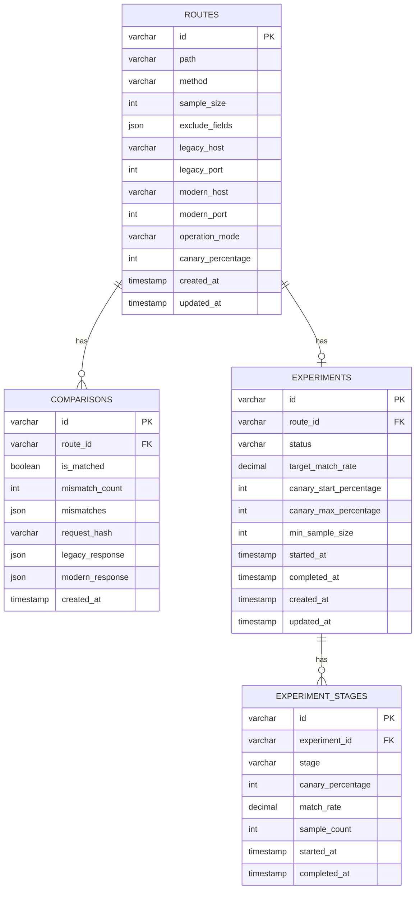
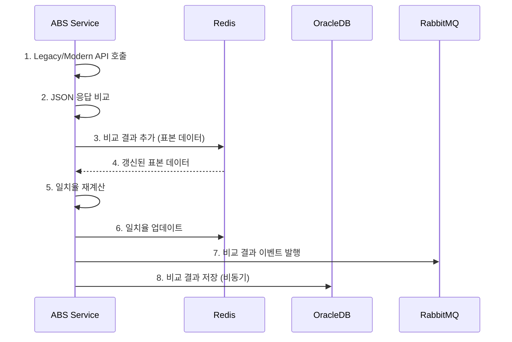
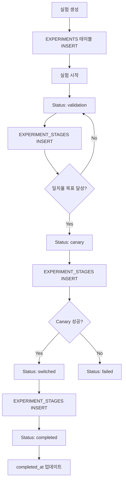

# ABS 요구사항 정의서 - 데이터 요구사항

## 문서 정보

| 항목 | 내용 |
|------|------|
| **문서명** | ABS (API Bridge Service) 요구사항 정의서 - 데이터 요구사항 |
| **버전** | v1.0 |
| **작성일** | 2025-11-30 |
| **대상 독자** | 개발팀, DBA팀 |
| **문서 목적** | ABS의 데이터 모델 및 데이터 관리 요구사항 정의 |

---

## 1. 데이터 모델 개요

### 1.1 Entity Relationship Diagram



---

## 2. 주요 엔티티

### 2.1 ROUTES (라우트)

**설명**: API 경로별 라우팅 설정 및 운영 모드 정보

**필드**:
| 필드명 | 타입 | NULL | 기본값 | 설명 |
|--------|------|------|--------|------|
| `id` | VARCHAR(50) | NOT NULL | UUID | Primary Key |
| `path` | VARCHAR(255) | NOT NULL | - | API 경로 (예: `/api/v1/users`) |
| `method` | VARCHAR(10) | NOT NULL | - | HTTP 메서드 (GET, POST, PUT, DELETE) |
| `sample_size` | NUMBER(10) | NOT NULL | 100 | 표본 크기 (10-1,000) |
| `exclude_fields` | CLOB | NULL | NULL | 비교 제외 필드 (JSON 배열) |
| `legacy_host` | VARCHAR(255) | NOT NULL | - | Legacy API 호스트 |
| `legacy_port` | NUMBER(5) | NOT NULL | - | Legacy API 포트 |
| `modern_host` | VARCHAR(255) | NOT NULL | - | Modern API 호스트 |
| `modern_port` | NUMBER(5) | NOT NULL | - | Modern API 포트 |
| `operation_mode` | VARCHAR(20) | NOT NULL | 'validation' | 운영 모드 (validation, canary, switched) |
| `canary_percentage` | NUMBER(3) | NOT NULL | 0 | Canary 트래픽 비율 (0-100) |
| `created_at` | TIMESTAMP | NOT NULL | SYSTIMESTAMP | 생성 일시 |
| `updated_at` | TIMESTAMP | NOT NULL | SYSTIMESTAMP | 수정 일시 |

**제약조건**:
- PRIMARY KEY: `id`
- UNIQUE KEY: `(path, method)`
- CHECK: `operation_mode IN ('validation', 'canary', 'switched')`
- CHECK: `canary_percentage BETWEEN 0 AND 100`
- CHECK: `sample_size BETWEEN 10 AND 1000`

**인덱스**:
- `idx_routes_path_method` ON `(path, method)`
- `idx_routes_operation_mode` ON `(operation_mode)`

**예상 데이터 크기**:
- 초기: 100 rows
- 1년 후: 500 rows
- 평균 row 크기: 1KB

---

### 2.2 COMPARISONS (비교 결과)

**설명**: Legacy와 Modern API 응답 비교 결과

**필드**:
| 필드명 | 타입 | NULL | 기본값 | 설명 |
|--------|------|------|--------|------|
| `id` | VARCHAR(50) | NOT NULL | UUID | Primary Key |
| `route_id` | VARCHAR(50) | NOT NULL | - | 라우트 ID (Foreign Key) |
| `is_matched` | NUMBER(1) | NOT NULL | - | 일치 여부 (1: 일치, 0: 불일치) |
| `mismatch_count` | NUMBER(10) | NOT NULL | 0 | 불일치 필드 개수 |
| `mismatches` | CLOB | NULL | NULL | 불일치 상세 정보 (JSON 배열) |
| `request_hash` | VARCHAR(64) | NOT NULL | - | 요청 해시 (SHA-256) |
| `legacy_response` | CLOB | NULL | NULL | Legacy API 응답 (JSON) |
| `modern_response` | CLOB | NULL | NULL | Modern API 응답 (JSON) |
| `created_at` | TIMESTAMP | NOT NULL | SYSTIMESTAMP | 비교 일시 |

**제약조건**:
- PRIMARY KEY: `id`
- FOREIGN KEY: `route_id` REFERENCES `ROUTES(id)`
- CHECK: `is_matched IN (0, 1)`

**인덱스**:
- `idx_comp_route_id` ON `(route_id)`
- `idx_comp_is_matched` ON `(is_matched)`
- `idx_comp_created_at` ON `(created_at DESC)`
- `idx_comp_route_created` ON `(route_id, created_at DESC)`

**파티셔닝**:
- 파티션 방식: Range Partitioning on `created_at`
- 파티션 단위: 월별 (Monthly)
- 파티션 보관: 3개월 (자동 삭제)

**예상 데이터 크기**:
- 일일: 1,000,000 rows (10,000 TPS * 100초)
- 월간: 30,000,000 rows
- 평균 row 크기: 5KB
- 월간 저장 용량: 150GB

---

### 2.3 EXPERIMENTS (실험)

**설명**: 반자동 전환 실험 정보

**필드**:
| 필드명 | 타입 | NULL | 기본값 | 설명 |
|--------|------|------|--------|------|
| `id` | VARCHAR(50) | NOT NULL | UUID | Primary Key |
| `route_id` | VARCHAR(50) | NOT NULL | - | 라우트 ID (Foreign Key) |
| `status` | VARCHAR(20) | NOT NULL | 'pending' | 실험 상태 |
| `target_match_rate` | NUMBER(5,2) | NOT NULL | 99.00 | 목표 일치율 (%) |
| `canary_start_percentage` | NUMBER(3) | NOT NULL | 1 | Canary 시작 비율 |
| `canary_max_percentage` | NUMBER(3) | NOT NULL | 10 | Canary 최대 비율 |
| `min_sample_size` | NUMBER(10) | NOT NULL | 100 | 최소 표본 수 |
| `started_at` | TIMESTAMP | NULL | NULL | 시작 일시 |
| `completed_at` | TIMESTAMP | NULL | NULL | 완료 일시 |
| `created_at` | TIMESTAMP | NOT NULL | SYSTIMESTAMP | 생성 일시 |
| `updated_at` | TIMESTAMP | NOT NULL | SYSTIMESTAMP | 수정 일시 |

**제약조건**:
- PRIMARY KEY: `id`
- FOREIGN KEY: `route_id` REFERENCES `ROUTES(id)`
- UNIQUE KEY: `(route_id)` WHERE `status NOT IN ('completed', 'failed')`
- CHECK: `status IN ('pending', 'validation', 'canary', 'switched', 'completed', 'failed')`
- CHECK: `target_match_rate BETWEEN 90.00 AND 100.00`

**인덱스**:
- `idx_exp_route_id` ON `(route_id)`
- `idx_exp_status` ON `(status)`

**예상 데이터 크기**:
- 초기: 10 rows
- 1년 후: 500 rows
- 평균 row 크기: 500B

---

### 2.4 EXPERIMENT_STAGES (실험 단계 이력)

**설명**: 실험 진행 단계별 이력

**필드**:
| 필드명 | 타입 | NULL | 기본값 | 설명 |
|--------|------|------|--------|------|
| `id` | VARCHAR(50) | NOT NULL | UUID | Primary Key |
| `experiment_id` | VARCHAR(50) | NOT NULL | - | 실험 ID (Foreign Key) |
| `stage` | VARCHAR(20) | NOT NULL | - | 단계 (validation, canary_1, canary_5, canary_10, switched) |
| `canary_percentage` | NUMBER(3) | NULL | NULL | Canary 비율 |
| `match_rate` | NUMBER(5,2) | NOT NULL | - | 일치율 (%) |
| `sample_count` | NUMBER(10) | NOT NULL | - | 표본 수 |
| `started_at` | TIMESTAMP | NOT NULL | SYSTIMESTAMP | 단계 시작 일시 |
| `completed_at` | TIMESTAMP | NULL | NULL | 단계 완료 일시 |

**제약조건**:
- PRIMARY KEY: `id`
- FOREIGN KEY: `experiment_id` REFERENCES `EXPERIMENTS(id)` ON DELETE CASCADE
- CHECK: `stage IN ('validation', 'canary_1', 'canary_5', 'canary_10', 'switched')`

**인덱스**:
- `idx_stages_exp_id` ON `(experiment_id)`
- `idx_stages_started_at` ON `(started_at DESC)`

**예상 데이터 크기**:
- 실험당 평균: 5 stages
- 1년 후: 2,500 rows
- 평균 row 크기: 300B

---

## 3. 데이터 흐름

### 3.1 비교 결과 저장 흐름



### 3.2 실험 상태 전환 흐름



---

## 4. 데이터 보관 정책

### 4.1 보관 기간

| 테이블 | 보관 기간 | 삭제 방식 | 보관 위치 |
|--------|----------|----------|----------|
| `ROUTES` | 영구 | Soft Delete | Hot Storage |
| `EXPERIMENTS` | 영구 | Soft Delete | Hot Storage |
| `EXPERIMENT_STAGES` | 1년 | Hard Delete | Hot → Cold (6개월 후) |
| `COMPARISONS` | 90일 | Hard Delete + Partitioning | Hot (30일) → Warm (60일) → Delete |

### 4.2 데이터 라이프사이클

**COMPARISONS 테이블**:


**삭제 쿼리 (일일 배치)**:
```sql
-- 90일 이전 파티션 삭제
ALTER TABLE comparisons
DROP PARTITION comparisons_202411;

-- 또는 DELETE 쿼리
DELETE FROM comparisons
WHERE created_at < SYSDATE - 90;
```

### 4.3 아카이브 정책

**장기 보관이 필요한 데이터**:
- 실험 완료 결과 (1년)
- 주요 불일치 사례 (6개월)
- 감사 로그 (1년)

**아카이브 저장소**:
- S3 또는 Object Storage
- Parquet 형식으로 압축
- 월 단위 파일로 분할

---

## 5. 데이터 보안

### 5.1 민감 정보 암호화

**암호화 대상**:
| 필드 | 암호화 방식 | 키 관리 |
|------|------------|---------|
| `legacy_response` (민감 정보 포함 시) | AES-256 | KMS |
| `modern_response` (민감 정보 포함 시) | AES-256 | KMS |

**마스킹 대상**:
- 이메일
- 전화번호
- 신용카드 번호
- 주민등록번호

### 5.2 접근 제어

**Role-Based Access**:
| 역할 | SELECT | INSERT | UPDATE | DELETE |
|------|--------|--------|--------|--------|
| `abs_admin` | ✓ | ✓ | ✓ | ✓ |
| `abs_operator` | ✓ | ✗ | ✓ | ✗ |
| `abs_viewer` | ✓ | ✗ | ✗ | ✗ |

**권한 부여**:
```sql
-- Admin
GRANT ALL PRIVILEGES ON routes TO abs_admin;
GRANT ALL PRIVILEGES ON comparisons TO abs_admin;
GRANT ALL PRIVILEGES ON experiments TO abs_admin;

-- Operator
GRANT SELECT, UPDATE ON routes TO abs_operator;
GRANT SELECT ON comparisons TO abs_operator;
GRANT SELECT, UPDATE ON experiments TO abs_operator;

-- Viewer
GRANT SELECT ON routes TO abs_viewer;
GRANT SELECT ON comparisons TO abs_viewer;
GRANT SELECT ON experiments TO abs_viewer;
```

---

## 6. 성능 최적화

### 6.1 인덱스 전략

**COMPARISONS 테이블**:
```sql
-- 복합 인덱스 (가장 많이 사용되는 쿼리)
CREATE INDEX idx_comp_route_created
ON comparisons (route_id, created_at DESC, is_matched);

-- Covering Index
CREATE INDEX idx_comp_matched_created
ON comparisons (is_matched, created_at DESC)
INCLUDE (route_id, mismatch_count);
```

**쿼리 최적화 예시**:
```sql
-- 최근 불일치 결과 조회
SELECT id, route_id, mismatch_count, created_at
FROM comparisons
WHERE is_matched = 0
AND created_at >= SYSDATE - 1
ORDER BY created_at DESC
FETCH FIRST 100 ROWS ONLY;

-- EXPLAIN PLAN 결과:
-- INDEX RANGE SCAN on idx_comp_matched_created
```

### 6.2 파티셔닝

**COMPARISONS 테이블 파티셔닝**:
```sql
CREATE TABLE comparisons (
    id VARCHAR2(50) NOT NULL,
    -- ... other columns
    created_at TIMESTAMP NOT NULL
)
PARTITION BY RANGE (created_at)
INTERVAL (NUMTOYMINTERVAL(1, 'MONTH'))
(
    PARTITION comparisons_202501 VALUES LESS THAN (TO_DATE('2025-02-01', 'YYYY-MM-DD')),
    PARTITION comparisons_202502 VALUES LESS THAN (TO_DATE('2025-03-01', 'YYYY-MM-DD'))
);
```

**파티션 유지보수**:
```sql
-- 오래된 파티션 삭제 (일일 배치)
BEGIN
    FOR rec IN (
        SELECT partition_name
        FROM user_tab_partitions
        WHERE table_name = 'COMPARISONS'
        AND partition_name < 'COMPARISONS_' || TO_CHAR(ADD_MONTHS(SYSDATE, -3), 'YYYYMM')
    ) LOOP
        EXECUTE IMMEDIATE 'ALTER TABLE comparisons DROP PARTITION ' || rec.partition_name;
    END LOOP;
END;
```

### 6.3 통계 정보 관리

```sql
-- 일일 통계 수집
BEGIN
    DBMS_STATS.GATHER_TABLE_STATS(
        ownname => 'ABS_SCHEMA',
        tabname => 'COMPARISONS',
        estimate_percent => 10,
        method_opt => 'FOR ALL COLUMNS SIZE AUTO',
        degree => 4
    );
END;
```

---

## 7. GDPR 준수

### 7.1 개인정보 처리 방침

**개인정보 포함 가능 필드**:
- `legacy_response` (요청/응답 Body)
- `modern_response` (요청/응답 Body)

**처리 방침**:
1. 저장 전 마스킹 적용
2. 암호화 저장 (선택사항)
3. 보관 기간 준수 (90일)
4. 삭제 요청 처리 (Right to be Forgotten)

### 7.2 데이터 삭제 요청 처리

**삭제 API**:
```http
DELETE /abs/api/v1/comparisons/by-user/{user_id}
```

**삭제 쿼리**:
```sql
-- 특정 사용자의 비교 결과 삭제
DELETE FROM comparisons
WHERE legacy_response LIKE '%"user_id":"' || :user_id || '"%'
OR modern_response LIKE '%"user_id":"' || :user_id || '"%';
```

---

## 8. 백업 및 복구

### 8.1 백업 정책

| 백업 유형 | 주기 | 보관 기간 | 복구 목표 |
|----------|------|----------|----------|
| Full Backup | 일일 (00:00) | 30일 | 24시간 |
| Incremental Backup | 매 6시간 | 7일 | 6시간 |
| Transaction Log | 실시간 | 7일 | 1시간 |

### 8.2 복구 절차

**Point-in-Time Recovery (PITR)**:
```sql
-- 특정 시점으로 복구
RECOVER DATABASE UNTIL TIME '2025-11-30 10:00:00';
```

**테이블 단위 복구**:
```sql
-- Flashback을 이용한 테이블 복구
FLASHBACK TABLE comparisons TO TIMESTAMP
TO_TIMESTAMP('2025-11-30 10:00:00', 'YYYY-MM-DD HH24:MI:SS');
```

---

## 참조 문서

- [데이터베이스 설계](../03-database/01-schema-design.md)
- [ERD 다이어그램](../03-database/02-entity-relationship.md)
- [인덱스 전략](../03-database/03-index-strategy.md)
- [도메인 모델](../02-domain/01-domain-model.md)

---

**최종 수정일**: 2025-11-30
**작성자**: ABS 개발팀, DBA팀
**승인자**: Tech Lead, DBA Lead
