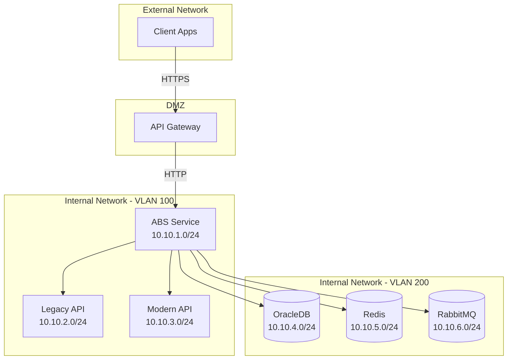

# ABS 요구사항 정의서 - 제약사항 및 가정

## 문서 정보

| 항목 | 내용 |
|------|------|
| **문서명** | ABS (API Bridge Service) 요구사항 정의서 - 제약사항 및 가정 |
| **버전** | v1.0 |
| **작성일** | 2025-11-30 |
| **대상 독자** | 전체 (경영진, PM, 개발팀, 운영팀) |
| **문서 목적** | 프로젝트 제약사항, 가정, 제한사항, 향후 계획 명시 |

---

## 1. 기술 스택 제약

### 1.1 프로그래밍 언어

| 기술 | 버전 | 제약사항 | 이유 |
|------|------|----------|------|
| **Go** | 1.21+ | 필수 | 높은 성능, 동시성 지원, 단순한 배포 |
| **OracleDB** | 19c+ | 필수 | 기존 인프라 활용 (교체 불가) |
| **Redis** | 7.0+ | 필수 | 캐싱 및 빠른 데이터 접근 |
| **RabbitMQ** | 3.11+ | 필수 | 비동기 메시징 |

**Go 선택 이유**:
- ✅ 높은 성능 (C/C++ 수준)
- ✅ 간단한 동시성 모델 (Goroutine, Channel)
- ✅ 단일 바이너리 배포
- ✅ 강력한 표준 라이브러리
- ✅ 풍부한 생태계 (HTTP, JSON 처리)

**대안 고려 및 제외 이유**:
| 기술 | 제외 이유 |
|------|----------|
| Java | 메모리 사용량이 크고, GC Pause Time이 길어질 수 있음 |
| Node.js | 싱글 스레드 제약, CPU Intensive 작업 시 성능 저하 |
| Python | 성능 이슈 (GIL), 10,000 TPS 목표 달성 어려움 |
| Rust | 학습 곡선이 가파르고, 개발 속도가 느림 |

### 1.2 프레임워크

| 프레임워크 | 용도 | 선택사항 |
|-----------|------|----------|
| **Gin** 또는 **Echo** | HTTP 웹 프레임워크 | 둘 중 선택 |
| **GORM** 또는 **sqlx** | ORM/Database | 둘 중 선택 (sqlx 권장) |
| **Zap** 또는 **Logrus** | 로깅 | 둘 중 선택 (Zap 권장) |
| **Viper** | 설정 관리 | 권장 |
| **Testify** | 테스트 프레임워크 | 필수 |

---

## 2. 환경 제약

### 2.1 배포 환경

| 제약사항 | 설명 | 영향 |
|----------|------|------|
| **온프레미스 환경** | 클라우드 환경 사용 불가 | Auto-Scaling 제약, 인프라 관리 필요 |
| **내부 네트워크만 접근** | 외부에서 직접 접근 불가 | API Gateway 필수 |
| **Docker 선택사항** | Docker 사용 여부는 선택 | 전통적인 바이너리 배포도 지원 |
| **Linux 서버** | CentOS 7 또는 RHEL 8 | Go 바이너리는 OS 독립적 |

### 2.2 하드웨어 제약

**서버 스펙 (최소)**:
| 구분 | 최소 사양 | 권장 사양 |
|------|----------|----------|
| CPU | 4 Core | 8 Core |
| RAM | 8GB | 16GB |
| Disk | 100GB SSD | 500GB SSD |
| Network | 1Gbps | 10Gbps |

**외부 의존 서비스**:
| 서비스 | 최소 스펙 | 용도 |
|--------|----------|------|
| OracleDB | 8 Core, 32GB RAM | 데이터 저장 |
| Redis | 4GB RAM | 캐싱 |
| RabbitMQ | 2 Core, 4GB RAM | 메시징 |

---

## 3. 네트워크 제약

### 3.1 네트워크 구성

### 3.2 방화벽 규칙

**Inbound (ABS로 들어오는 트래픽)**:
| Source | Destination | Port | Protocol | 설명 |
|--------|------------|------|----------|------|
| API Gateway | ABS | 8000 | HTTP | API 요청 |
| Monitoring | ABS | 9090 | HTTP | Prometheus Metrics |
| Ops Team | ABS | 22 | SSH | 서버 관리 (VPN 필요) |

**Outbound (ABS에서 나가는 트래픽)**:
| Source | Destination | Port | Protocol | 설명 |
|--------|------------|------|----------|------|
| ABS | Legacy API | 8080 | HTTP | API 호출 |
| ABS | Modern API | 9080 | HTTP | API 호출 |
| ABS | OracleDB | 1521 | TCP | 데이터베이스 |
| ABS | Redis | 6379 | TCP | 캐시 |
| ABS | RabbitMQ | 5672 | AMQP | 메시징 |

### 3.3 네트워크 지연 (Latency)

**예상 지연 시간**:
| 구간 | 평균 지연 | 최대 지연 |
|------|----------|----------|
| Client → API Gateway | 50ms | 200ms |
| API Gateway → ABS | 1ms | 5ms |
| ABS → Legacy API | 2ms | 10ms |
| ABS → Modern API | 2ms | 10ms |
| ABS → OracleDB | 1ms | 5ms |
| ABS → Redis | 0.5ms | 2ms |

---

## 4. 가정사항

### 4.1 API 관련 가정

| 가정사항 | 영향 | 검증 방법 |
|----------|------|----------|
| Legacy와 Modern API는 **동일한 비즈니스 로직**을 구현 | 비교 결과의 신뢰성 | 초기 검증 모드에서 확인 |
| Legacy와 Modern API의 **JSON 응답 구조가 유사** | 비교 알고리즘 설계 | 사전 API 명세 분석 |
| Legacy와 Modern API는 **동일한 네트워크**에 위치 | 네트워크 지연 최소화 | 네트워크 토폴로지 확인 |
| API 응답 크기는 **평균 10KB 이하** | 메모리 및 성능 최적화 | 실제 트래픽 분석 |

### 4.2 인증/인가 가정

| 가정사항 | 영향 | 검증 방법 |
|----------|------|----------|
| **API Gateway**가 모든 인증/인가 처리 | ABS는 인증 로직 불필요 | API Gateway 연동 테스트 |
| ABS는 **내부 네트워크**에서만 접근 | 네트워크 레벨 보안 | 방화벽 규칙 검증 |
| 관리 API는 **JWT 토큰** 기반 인증 | 표준 인증 방식 사용 | JWT 라이브러리 선택 |

### 4.3 운영 가정

| 가정사항 | 영향 | 검증 방법 |
|----------|------|----------|
| **OracleDB**는 충분한 용량 제공 | 데이터 저장 제약 없음 | 용량 계획 수립 |
| **Redis**는 고가용성 구성 (Master-Slave) | 캐시 장애 시에도 서비스 가능 | Redis Sentinel 구성 |
| **RabbitMQ**는 클러스터 구성 | 메시징 안정성 보장 | RabbitMQ 클러스터 구성 |
| 운영팀은 **24/7 온콜** 체계 운영 | 장애 대응 가능 | 온콜 프로세스 수립 |

---

## 5. 알려진 제한사항

### 5.1 기능적 제한사항

| 제한사항 | 설명 | 우회 방법 |
|----------|------|----------|
| **WebSocket 미지원** | 실시간 양방향 통신 불가 | 별도 WebSocket 서비스 구축 |
| **스트리밍 응답 미지원** | Chunked Transfer Encoding 불가 | 응답 크기 제한 (1MB) |
| **gRPC 미지원** | gRPC 프로토콜 미지원 | v2에서 추가 예정 |
| **GraphQL 미지원** | GraphQL 쿼리 미지원 | v2에서 추가 예정 |
| **응답 크기 제한** | 1MB 초과 응답은 비교 생략 | 대용량 응답은 별도 처리 |

### 5.2 성능 제한사항

| 제한사항 | 값 | 이유 |
|----------|-----|------|
| **최대 처리량** | 15,000 TPS | 하드웨어 및 네트워크 제약 |
| **최대 동시 연결** | 100,000 | OS 및 네트워크 제약 |
| **최대 응답 크기** | 1MB | 메모리 및 비교 성능 |
| **최대 비교 표본 수** | 1,000건 | 메모리 및 계산 시간 |

### 5.3 운영 제한사항

| 제한사항 | 설명 | 영향 |
|----------|------|------|
| **수동 스케일링** | Auto-Scaling 미지원 (온프레미스) | 트래픽 급증 시 수동 대응 필요 |
| **단일 리전** | 멀티 리전 배포 미지원 | 재해 복구 제약 |
| **배포 시간** | Rolling Update로 10분 소요 | 긴급 패치 시 시간 소요 |

---

## 6. 향후 확장 계획

### 6.1 단기 확장 (3-6개월)

| 기능 | 우선순위 | 예상 공수 | 설명 |
|------|----------|----------|------|
| **GraphQL 지원** | High | 2주 | GraphQL 쿼리 프록시 및 비교 |
| **gRPC 지원** | High | 3주 | gRPC 프로토콜 지원 |
| **AI 기반 이상 탐지** | Medium | 4주 | ML 모델을 통한 이상 패턴 탐지 |
| **멀티 테넌시** | Medium | 2주 | 여러 팀의 동시 사용 지원 |

### 6.2 중기 확장 (6-12개월)

| 기능 | 우선순위 | 예상 공수 | 설명 |
|------|----------|----------|------|
| **자동 전환 결정** | High | 6주 | ML 기반 자동 전환 판단 |
| **멀티 리전 배포** | Medium | 8주 | 재해 복구 및 지역별 배포 |
| **클라우드 지원** | Medium | 4주 | AWS, GCP, Azure 지원 |
| **대시보드 UI** | Low | 6주 | React 기반 관리 대시보드 |

### 6.3 장기 확장 (12개월 이후)

| 기능 | 우선순위 | 예상 공수 | 설명 |
|------|----------|----------|------|
| **SaaS 버전** | High | 12주 | 멀티 테넌트 SaaS 제공 |
| **API Marketplace** | Low | 8주 | API 전환 패턴 공유 |
| **3rd Party 통합** | Medium | 4주 | Datadog, New Relic 통합 |

---

## 7. 의존성 및 전제 조건

### 7.1 사전 준비 사항

**인프라**:
- ✅ OracleDB 19c 이상 설치 및 구성
- ✅ Redis 7.0 이상 Master-Slave 구성
- ✅ RabbitMQ 3.11 이상 클러스터 구성
- ✅ Linux 서버 (CentOS 7 / RHEL 8) 준비

**네트워크**:
- ✅ API Gateway 구축 완료
- ✅ 내부 네트워크 VLAN 구성
- ✅ 방화벽 규칙 설정
- ✅ DNS 설정 (abs.internal)

**외부 시스템**:
- ✅ Legacy API 운영 중
- ✅ Modern API 개발 완료 및 테스트 환경 구축
- ✅ Prometheus 및 Grafana 설치

### 7.2 외부 의존성

| 의존성 | 버전 | 필수 여부 | 용도 |
|--------|------|----------|------|
| API Gateway | Any | 필수 | 인증/인가, Rate Limiting |
| Legacy API | Any | 필수 | 기존 API 시스템 |
| Modern API | Any | 필수 | 신규 API 시스템 |
| Prometheus | 2.40+ | 필수 | 메트릭 수집 |
| Grafana | 9.0+ | 필수 | 메트릭 시각화 |
| ELK Stack | 8.0+ | 권장 | 로그 수집 및 분석 |

---

## 8. 위험 요소 및 완화 전략

### 8.1 기술적 위험

| 위험 | 가능성 | 영향도 | 완화 전략 |
|------|--------|--------|----------|
| **성능 목표 미달** | 중간 | 높음 | 부하 테스트 조기 시작, 성능 최적화 우선순위 |
| **Legacy/Modern API 불일치** | 높음 | 높음 | 충분한 검증 기간 (최소 1주) |
| **OracleDB 병목** | 중간 | 중간 | Connection Pool 최적화, 인덱스 전략 |
| **메모리 누수** | 낮음 | 높음 | 정기 프로파일링, 부하 테스트 |

### 8.2 운영 위험

| 위험 | 가능성 | 영향도 | 완화 전략 |
|------|--------|--------|----------|
| **배포 실패** | 낮음 | 높음 | Rolling Update, Rollback 계획 |
| **Modern API 장애** | 중간 | 높음 | Circuit Breaker, 자동 롤백 |
| **네트워크 장애** | 낮음 | 높음 | Retry 메커니즘, Timeout 설정 |
| **데이터 손실** | 매우 낮음 | 높음 | 일일 백업, PITR |

---

## 9. 규정 준수

### 9.1 데이터 보호 규정

| 규정 | 준수 여부 | 요구사항 |
|------|----------|----------|
| **GDPR** | ✅ 준수 | 개인정보 마스킹, 삭제 요청 처리, 90일 보관 |
| **KVKK** (터키) | ✅ 준수 | GDPR와 동일 |
| **CCPA** (캘리포니아) | ✅ 준수 | 데이터 접근 권한, 삭제 권한 |

### 9.2 보안 표준

| 표준 | 준수 여부 | 요구사항 |
|------|----------|----------|
| **OWASP Top 10** | ✅ 준수 | 보안 취약점 방어 |
| **PCI DSS** | ⚠️ 부분 준수 | 신용카드 정보 마스킹 (저장 안 함) |
| **ISO 27001** | ⚠️ 준비 중 | 정보 보안 관리 체계 |

---

## 10. 라이선스 및 법적 고려사항

### 10.1 오픈소스 라이선스

**사용 라이브러리**:
| 라이브러리 | 라이선스 | 상업적 사용 | 주의사항 |
|-----------|---------|------------|----------|
| Go | BSD-3-Clause | ✅ | 없음 |
| Gin | MIT | ✅ | 없음 |
| Echo | MIT | ✅ | 없음 |
| GORM | MIT | ✅ | 없음 |
| Zap | MIT | ✅ | 없음 |
| Testify | MIT | ✅ | 없음 |
| Redis | BSD-3-Clause | ✅ | 없음 |
| RabbitMQ | MPL 2.0 | ✅ | 소스 공개 불필요 |

### 10.2 상용 라이선스

| 제품 | 라이선스 유형 | 비용 | 필수 여부 |
|------|-------------|------|----------|
| OracleDB | Commercial | 포함 | 필수 (기존 라이선스) |
| Grafana Enterprise | Commercial | 선택사항 | 선택 (OSS 버전 사용 가능) |

---

## 참조 문서

- [아키텍처 개요](../01-architecture/01-architecture-overview.md)
- [프로젝트 구조](../01-architecture/02-project-structure.md)
- [외부 연동](../06-integration/)
- [배포 전략](../09-deployment/01-deployment-strategy.md)

---

**최종 수정일**: 2025-11-30
**작성자**: ABS 개발팀
**승인자**: CTO, PM, Tech Lead
